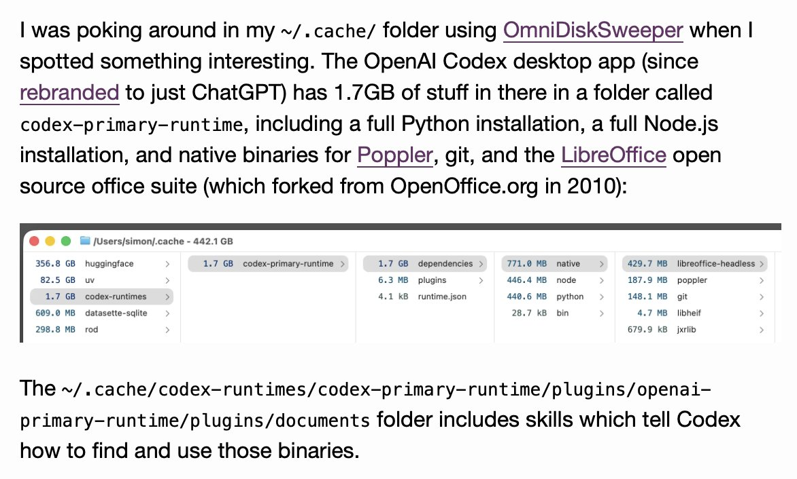

# 🐦 @simonw

## 📅 September 01, 2026

> 1 post(s) archived.

---

### 🕐 19:05 UTC · @simonw

> Just noticed the ChatGPT desktop app (previously named Codex) bundles a full copy of the LibreOffice open source office suite, tucked away in a hidden folder in the ~/.cache directory

🔗 [View original post](https://x.com/simonw/status/2094864223683903800)

---
