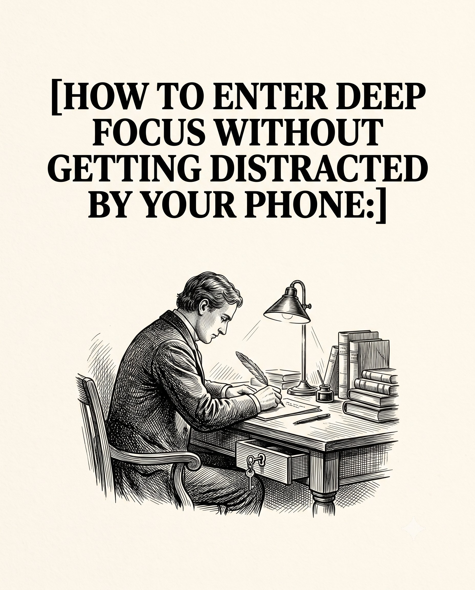

# 🐦 @theendeavorpath

## 📅 September 01, 2026

> 5 post(s) archived.

---

### 🕐 16:54 UTC · @theendeavorpath

> According to Feng Shui, your bedroom shows how well you allow yourself to rest. 1. Clothes on the chair =

🔗 [View original post](https://x.com/EnergyUp_/status/2094831238414803090)

---

### 🕐 16:35 UTC · @theendeavorpath

> 10. Decide When You Can Check It Trying to never look at your phone can make you think about it even more. Set a specific time for checking messages instead. Once you know when you will look again, you can stop wondering what you might be missing and get back to work.

🔗 [View original post](https://x.com/theendeavorpath/status/2094826476407603476)

---

### 🕐 16:35 UTC · @theendeavorpath

> 9. Keep Your Phone On Silent Even when you do not touch your phone, knowing that a message could arrive can keep part of your mind waiting for it. Put it on silent and switch off vibrations before you begin so your attention stays with the work in front of you.

🔗 [View original post](https://x.com/theendeavorpath/status/2094826472779530393)

---

### 🕐 16:35 UTC · @theendeavorpath

> HOW TO ENTER DEEP FOCUS WITHOUT GETTING DISTRACTED BY YOUR PHONE:

🔗 [View original post](https://x.com/theendeavorpath/status/2094826438897947034)

---

### 🕐 14:28 UTC · @theendeavorpath

> How to start your life (again) this September: Start doing these today.. 🧵

🔗 [View original post](https://x.com/superior_hombre/status/2094794583091908806)

---
