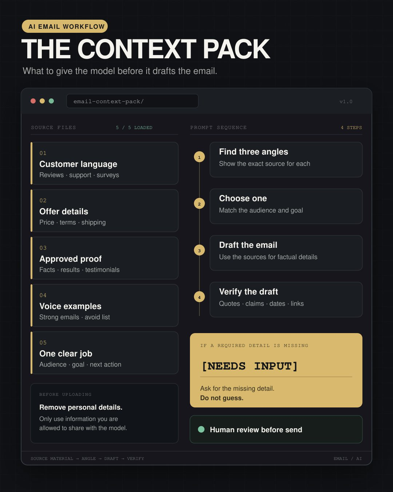
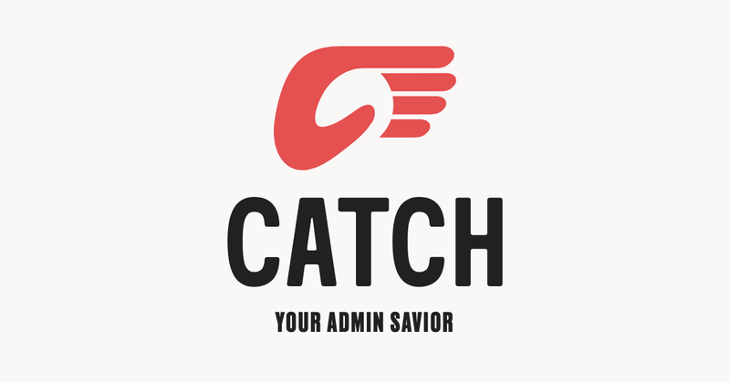

# 🐦 @AiEvolutio58513

## 📅 September 02, 2026

> 6 post(s) archived.

---

### 🕐 18:44 UTC · @AiEvolutio58513

> Before you ask AI to write an email, give it something worth writing from. Even a detailed prompt can produce generic copy when the model is missing customer language, offer details, proof, and examples of your voice. Here’s what I’d gather first: 1. What customers actually say Pull from reviews, support tickets, surveys, and call notes. Look for the exact words people use to describe the problem, their hesitation, and the result. Remove personal details and anything you are not allowed to upload. 2. What the offer actually is Include the product, price, terms, deadline, shipping details, exclusions, and anything else the email has to get right. 3. What you can prove Add testimonials approved for use, verified product facts, results, and claims you can support. 4. What the brand sounds like Give it a few representative emails, plus a short list of words and writing habits to avoid. 5. What this email needs to do Explain who it is for, what they already know, what they need to understand next, and what you want them to do. Then use this prompt: “Use the material above as the source for all factual details. If anything is missing, write [NEEDS INPUT] and tell me what you need. Do not guess or add unsupported information. Find three possible angles. For each one, show the exact customer phrase, proof point, or offer detail that supports it. Recommend the strongest angle for this audience and goal, then draft the email. Finish with a checklist of every quote, claim, offer detail, date, and link I should verify.” AI can still make mistakes, so I check those items against the original sources before anything goes live. When the writing feels generic, I go back to the source material before I add another instruction.

🔗 [View original post](https://x.com/ecomchasedimond/status/2095221364643008757)

---

### 🕐 16:04 UTC · @AiEvolutio58513

> Interested in AI? Follow @AiEvolutio58513 and never fall behind. I track ChatGPT, Claude, and every tool quietly changing how we work and create, then hand you the tested signals.

🔗 [View original post](https://x.com/AiEvolutio58513/status/2095181143205359991)

---

### 🕐 16:04 UTC · @AiEvolutio58513

> TLDR 1) Everyone becomes a 7/10 at everything 2) Teams shrink back to three to five people 3) Steering AI is the creative work 4) The hurdles are what kill businesses 5) Build me a business replaces the Turing test 6) Bring a product, AI does the rest 7) Everything feels stagnant because the wonders are invisible 8) The best people go build physical things next

🔗 [View original post](https://x.com/AiEvolutio58513/status/2095181131423633647)

---

### 🕐 15:35 UTC · @AiEvolutio58513

> My long standing AI belief is that AI is only as useful as the business context behind it. Cool to see the Polar team ship that as the product. Check it out: Today we&apos;re introducing Polar Operator. The AI operator built for commerce, working with your team in Slack. It starts with the data and definitions your team already trusts - so it doesn&apos;t hallucinate. We helped commerce teams trust their numbers. Operator puts that to work.

🔗 [View original post](https://x.com/ecomchasedimond/status/2095173671510032543)

---

### 🕐 15:20 UTC · @AiEvolutio58513

> Been testing tons of AI email tools lately. Unfortunately, most of them only draft a reply and then hand it back to you to fix. Catch figures out which emails actually need you. Then it asks you what you want in one sentence, and turns that into the response you would have written if you had twenty minutes. Start delegating admin tasks: https://www.catchagent.ai/ Big NEWS: Today we&apos;re launching Catch AI, an admin-assistant for busy executives. We started Catch with a simple idea: AI should actually do the administrative work executives hate doing themselves. Not suggest. Not summarize. Do. &gt;&gt;

🔗 [View original post](https://x.com/ecomchasedimond/status/2095170072646189358)

---

### 🕐 15:13 UTC · @AiEvolutio58513

> Everyone argues all day long about whether agents replace the workforce or not. Yet, the best thing an agent can actually do is take the small stuff off an execs to-do list that was never supposed to be there in the first place. This creates less drama and is WAY more useful. Test it now: https://www.catchagent.ai/ Big NEWS: Today we&apos;re launching Catch AI, an admin-assistant for busy executives. We started Catch with a simple idea: AI should actually do the administrative work executives hate doing themselves. Not suggest. Not summarize. Do. &gt;&gt;

🔗 [View original post](https://x.com/AiEvolutio58513/status/2095168341572993493)

---
