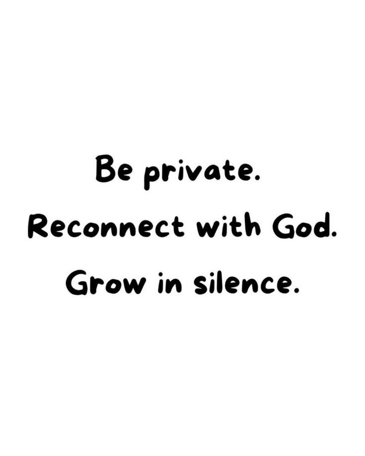
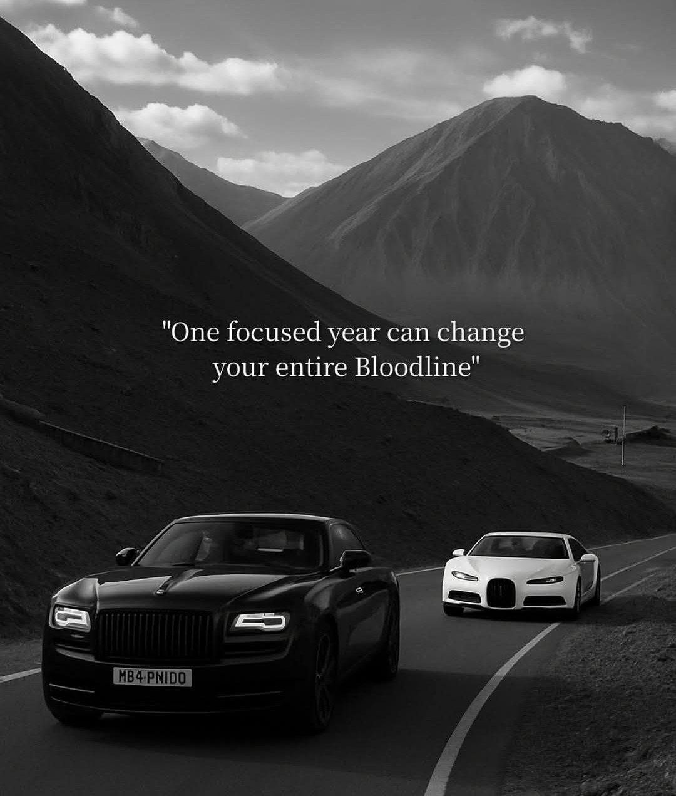
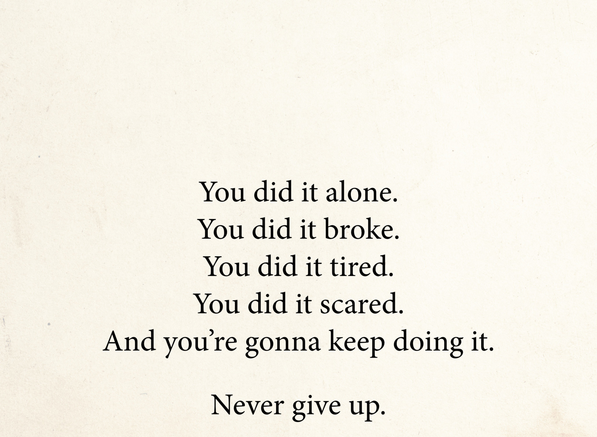
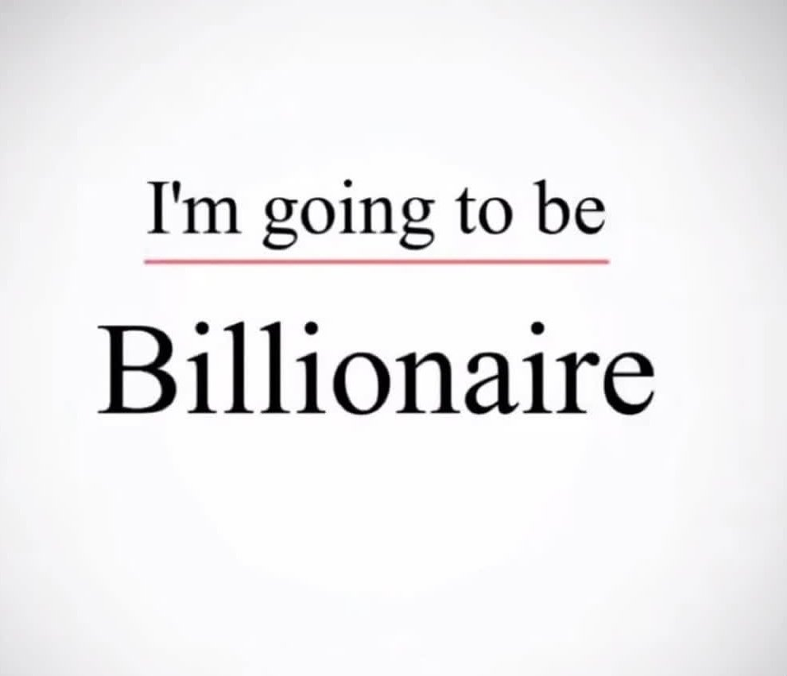
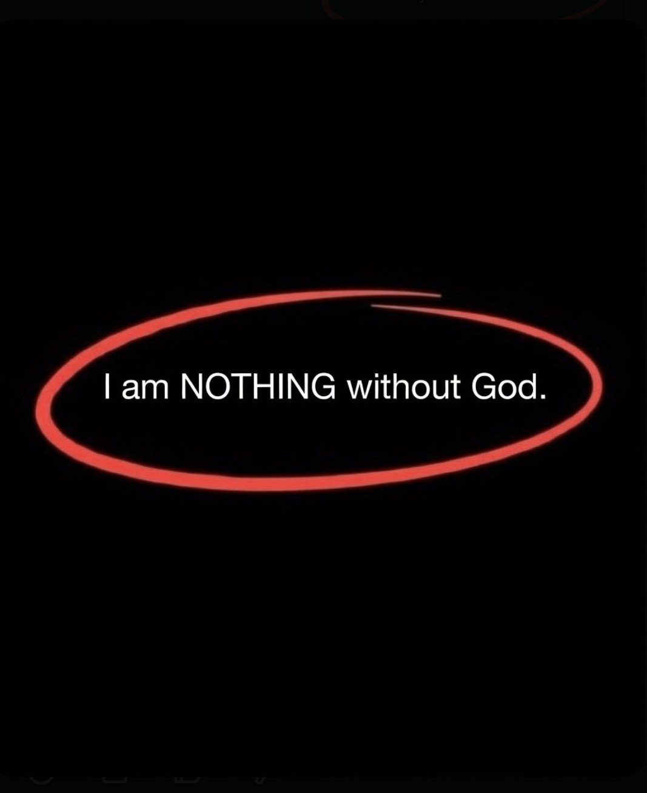
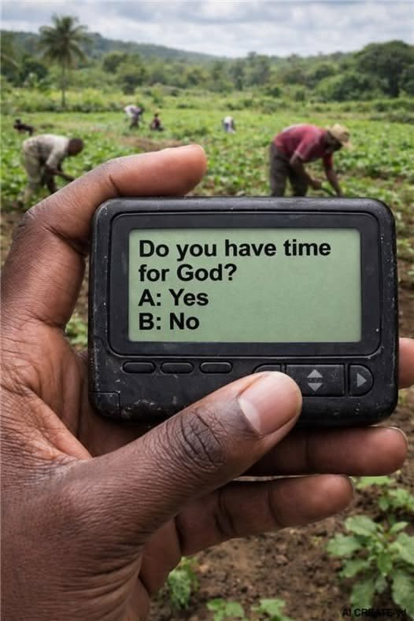
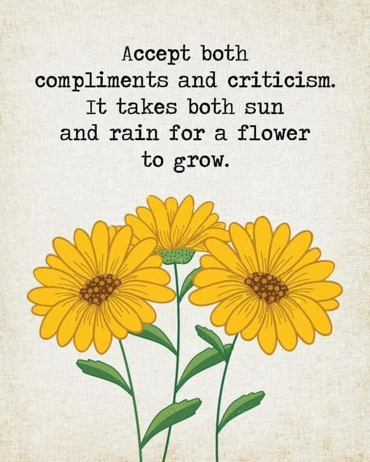
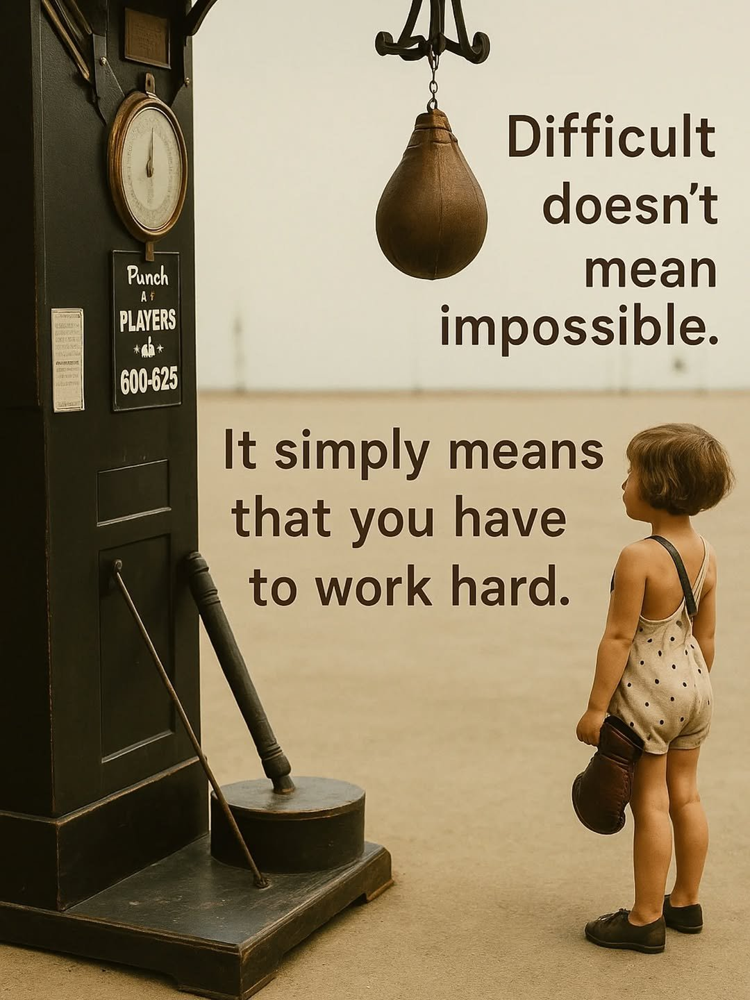

# 🐦 @Alphafiles1

## 📅 September 02, 2026

> 29 post(s) archived.

---

### 🕐 12:24 UTC · @Alphafiles1

🔗 [View original post](https://x.com/realmantalk3/status/2095125643973321178)

---

### 🕐 12:23 UTC · @Alphafiles1

🔗 [View original post](https://x.com/TheRich_Gospel/status/2095125562469577093)

---

### 🕐 12:23 UTC · @Alphafiles1

> Man to Man.

🔗 [View original post](https://x.com/Alphafiles1/status/2095125428570575321)

---

### 🕐 12:00 UTC · @Alphafiles1

> The older I get, the more I realize that education is one of the few things no one can take away from you. Take that course. Earn that certificate, diploma, or degree. Read widely, research deeply, ask questions, and learn beyond the classroom. You may not use everything immediately, but one day, the knowledge you almost ignored could become the reason you recognize an opportunity, solve a problem, or completely change your life.

🔗 [View original post](https://x.com/LifeInQuiet/status/2095119641462845725)

---

### 🕐 11:47 UTC · @Alphafiles1

🔗 [View original post](https://x.com/Alphafiles1/status/2095116498851295476)

---

### 🕐 11:07 UTC · @Alphafiles1

> You are the only problem you will ever have and you are the only solution.

🔗 [View original post](https://x.com/LifeInQuiet/status/2095106348547527141)

---

### 🕐 10:40 UTC · @Alphafiles1

🔗 [View original post](https://x.com/realmantalk3/status/2095099417917329550)

---

### 🕐 10:39 UTC · @Alphafiles1

> Real Talk.

🔗 [View original post](https://x.com/TheRich_Gospel/status/2095099322530513220)

---

### 🕐 10:38 UTC · @Alphafiles1

> I claim it!!

🔗 [View original post](https://x.com/Alphafiles1/status/2095099146889810330)

---

### 🕐 09:53 UTC · @Alphafiles1

> Adventure begins where the road disappears.

🔗 [View original post](https://x.com/LifeInQuiet/status/2095087703419138064)

---

### 🕐 09:38 UTC · @Alphafiles1

> Nothing.

🔗 [View original post](https://x.com/TheRich_Gospel/status/2095084028256780391)

---

### 🕐 09:38 UTC · @Alphafiles1

🔗 [View original post](https://x.com/realmantalk3/status/2095083942969774166)

---

### 🕐 09:38 UTC · @Alphafiles1

🔗 [View original post](https://x.com/Alphafiles1/status/2095083873881272810)

---

### 🕐 08:40 UTC · @Alphafiles1

🔗 [View original post](https://x.com/LifeInQuiet/status/2095069337241456742)

---

### 🕐 08:33 UTC · @Alphafiles1

🔗 [View original post](https://x.com/TheRich_Gospel/status/2095067491890311245)

---

### 🕐 08:32 UTC · @Alphafiles1

🔗 [View original post](https://x.com/realmantalk3/status/2095067400232112582)

---

### 🕐 08:32 UTC · @Alphafiles1

🔗 [View original post](https://x.com/Alphafiles1/status/2095067292358901974)

---

### 🕐 07:44 UTC · @Alphafiles1

🔗 [View original post](https://x.com/Alphafiles1/status/2095055159998992391)

---

### 🕐 07:31 UTC · @Alphafiles1

> Ameen🙏

🔗 [View original post](https://x.com/realmantalk3/status/2095051933497127063)

---

### 🕐 07:30 UTC · @Alphafiles1

> God&apos;s plan.

🔗 [View original post](https://x.com/TheRich_Gospel/status/2095051783135465592)

---

### 🕐 06:53 UTC · @Alphafiles1

🔗 [View original post](https://x.com/TheRich_Gospel/status/2095042385851936935)

---

### 🕐 06:52 UTC · @Alphafiles1

> I carry on.

🔗 [View original post](https://x.com/Alphafiles1/status/2095042075683127587)

---

### 🕐 06:50 UTC · @Alphafiles1

🔗 [View original post](https://x.com/realmantalk3/status/2095041694739652838)

---

### 🕐 06:10 UTC · @Alphafiles1

🔗 [View original post](https://x.com/TheRich_Gospel/status/2095031651025801291)

---

### 🕐 06:10 UTC · @Alphafiles1

🔗 [View original post](https://x.com/realmantalk3/status/2095031579458289987)

---

### 🕐 06:10 UTC · @Alphafiles1

🔗 [View original post](https://x.com/Alphafiles1/status/2095031499133239441)

---

### 🕐 05:19 UTC · @Alphafiles1

> Trust no one, Stick to your lane.

🔗 [View original post](https://x.com/Alphafiles1/status/2095018712612933804)

---

### 🕐 05:13 UTC · @Alphafiles1

> The best gift God gave him was the ability to notice what people never said the change in their tone, the hidden disrespect, and the sudden shift of energy in a room. For years, he reacted to everything. He defended himself, demanded explanations, and tried to make people admit what he had already felt. But experience taught him a quieter form of wisdom: Not everything you notice deserves a reaction. Sometimes, the best response is to observe, understand, and calmly move out of the way. People are busy fighting their own battles and building their own lives. Most of them are not thinking about him as much as he imagined. So he stopped taking everything personally. He trusted what God allowed him to sense, protected his peace, and let people reveal themselves without interruption. His gift was never meant to help him fight everyone. It was meant to show him where he no longer belonged.

🔗 [View original post](https://x.com/LifeInQuiet/status/2095017350625972460)

---

### 🕐 04:34 UTC · @Alphafiles1

🔗 [View original post](https://x.com/Alphafiles1/status/2095007433353576608)

---
