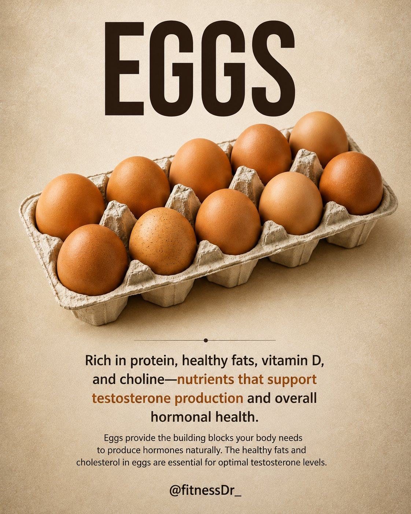
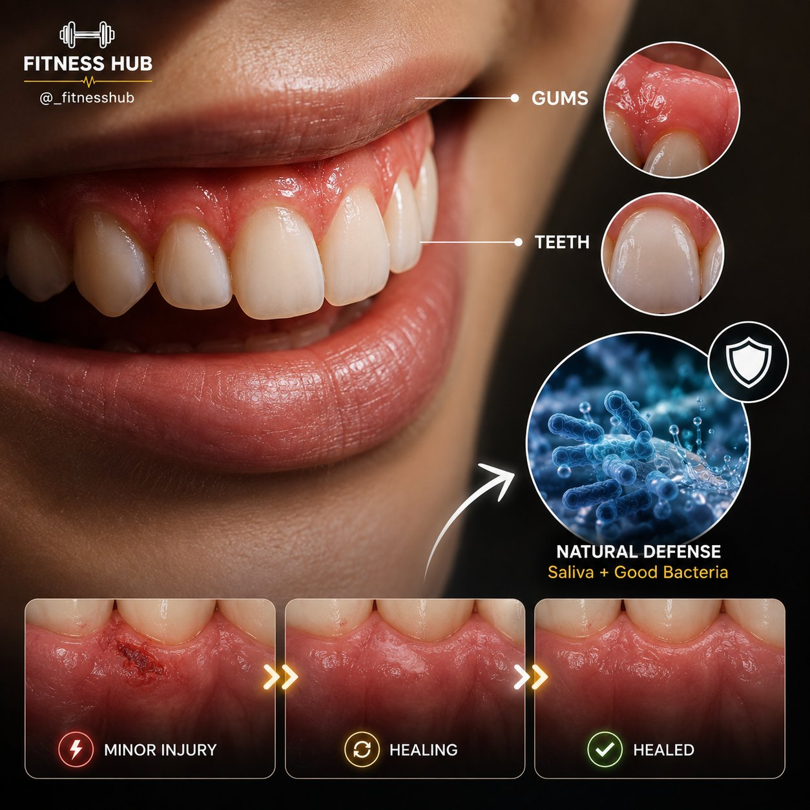
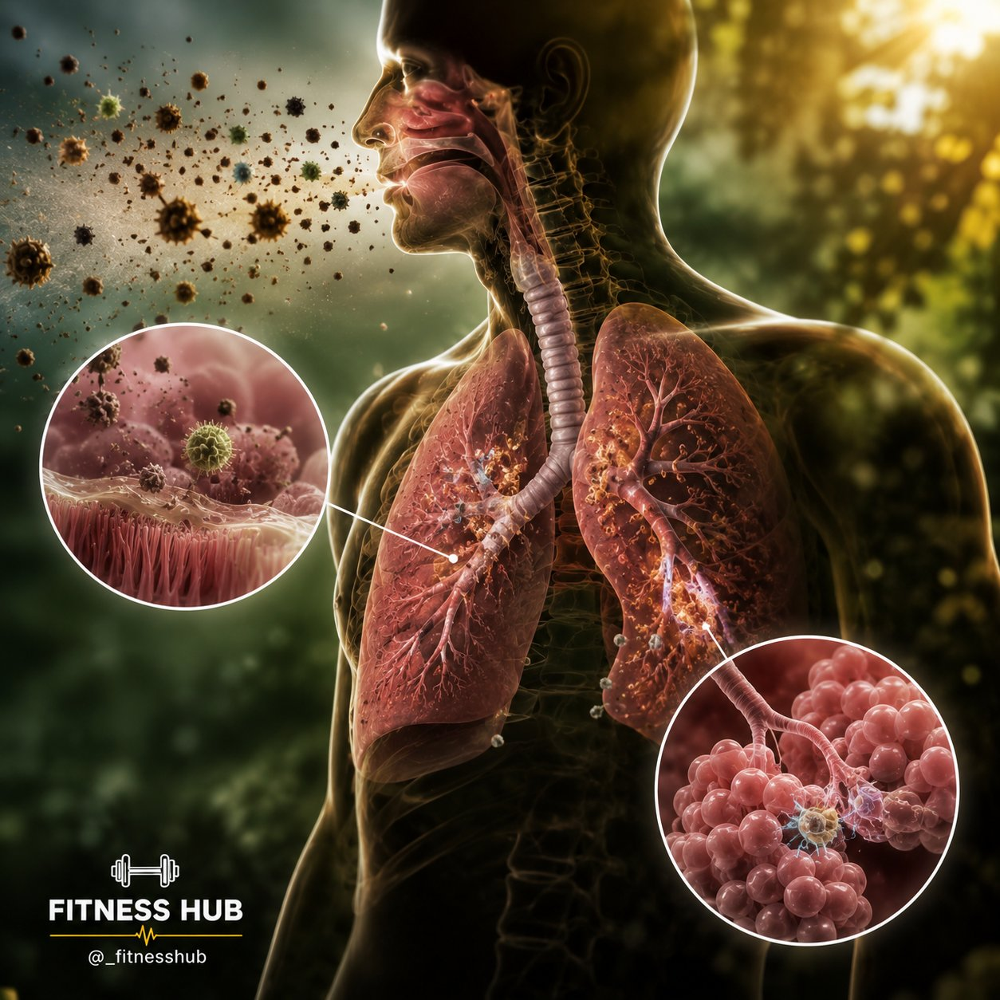
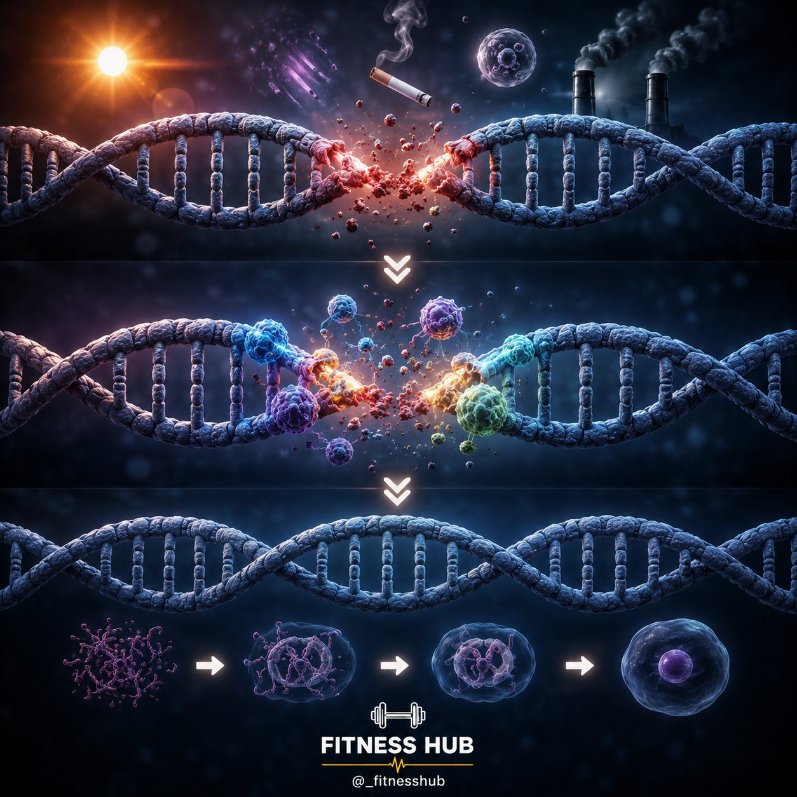
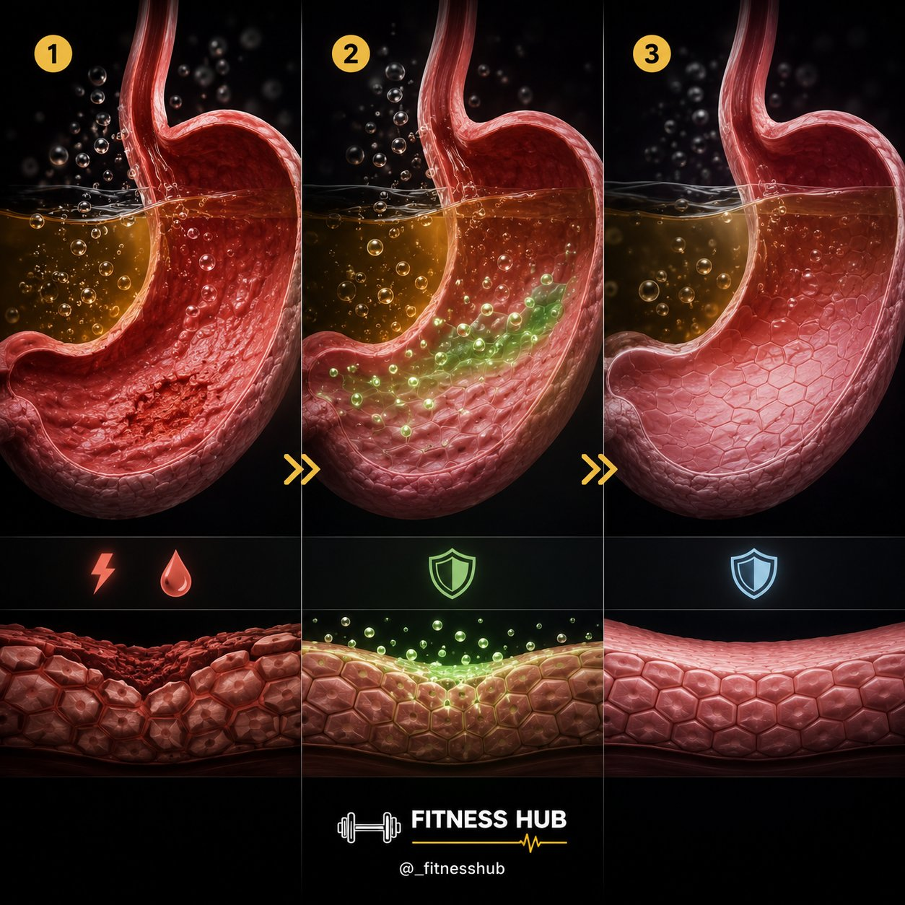
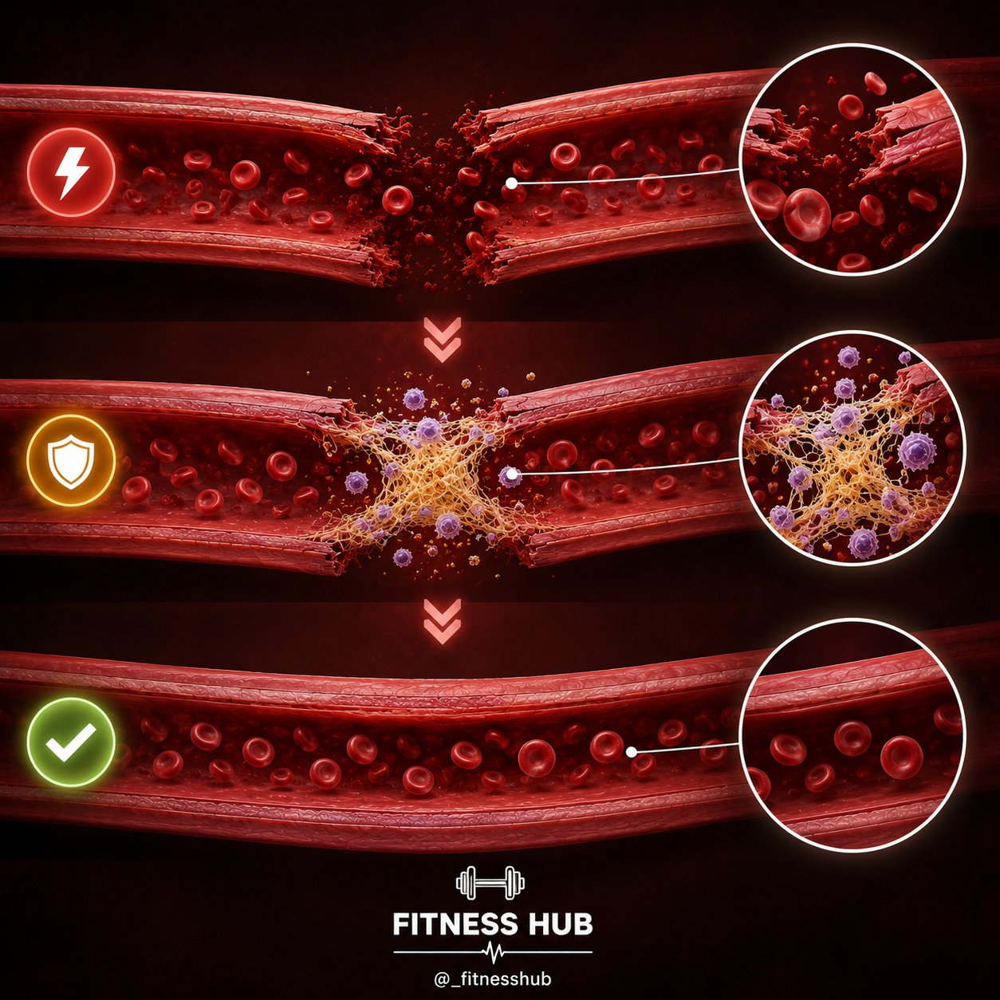
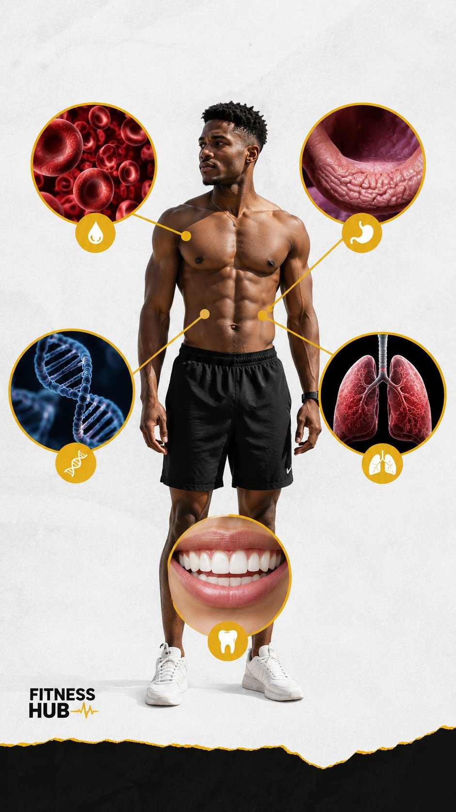

# 🐦 @Unlockyourlife_

## 📅 September 02, 2026

> 37 post(s) archived.

---

### 🕐 15:32 UTC · @Unlockyourlife_

> 7 Foods That Support Healthy Testosterone. 1. Eggs

🔗 [View original post](https://x.com/FitnessDr_/status/2095172997711581357)

---

### 🕐 14:42 UTC · @Unlockyourlife_

> Scientific Charging hack 😱 Media

🔗 [View original post](https://x.com/sciencepathx/status/2095160485834346985)

---

### 🕐 14:36 UTC · @Unlockyourlife_

> Building a secret underground bunker with an underwater view! 🌊 Media

🔗 [View original post](https://x.com/Smart_Tipsx/status/2095158820670501286)

---

### 🕐 14:31 UTC · @Unlockyourlife_

> Intelligent quick washing Trick 😜 Media

🔗 [View original post](https://x.com/samx_reels/status/2095157578195996904)

---

### 🕐 14:26 UTC · @Unlockyourlife_

> Isn&apos;t shower made from PVC pipe and screws? Media

🔗 [View original post](https://x.com/_Brainboxx/status/2095156516047212709)

---

### 🕐 14:08 UTC · @Unlockyourlife_

> The human body is basically running its own maintenance system. 🧠 You don&apos;t have to consciously tell your cells when something needs fixing. Damage happens → your body detects it → repair mechanisms get to work.

🔗 [View original post](https://x.com/_fitnesshub/status/2095151834843189489)

---

### 🕐 14:08 UTC · @Unlockyourlife_

> 5. Your Mouth &amp; Gums 🦷 Your mouth deals with food, bacteria, friction and tiny injuries every single day. Saliva helps protect your teeth and tissues, while your immune system and natural tissue-repair processes help maintain the health of your gums and other tissues in your mouth. That&apos;s a lot of work happening in a place you probably never think about.

🔗 [View original post](https://x.com/_fitnesshub/status/2095151829742977310)

---

### 🕐 14:08 UTC · @Unlockyourlife_

> 4. Your Lungs 🫁 Your lungs are exposed to the outside world every time you breathe. Dust, particles and other irritants can enter your airways, but your respiratory system has built-in defenses to remove unwanted material. The cells lining your airways can also repair and replace themselves after certain types of damage. Your lungs aren&apos;t just sitting there — they&apos;re constantly maintaining themselves.

🔗 [View original post](https://x.com/_fitnesshub/status/2095151819907313739)

---

### 🕐 14:08 UTC · @Unlockyourlife_

> 3. Your DNA 🧬 Every day, your cells experience small amounts of DNA damage from normal cellular processes and environmental factors. Fortunately, your cells have several DNA repair systems that identify certain types of damage and fix them. Without these repair mechanisms, damaged DNA would accumulate much more quickly.

🔗 [View original post](https://x.com/_fitnesshub/status/2095151811879440397)

---

### 🕐 14:08 UTC · @Unlockyourlife_

> 2. Your Stomach Lining 🥣 Your stomach produces strong acid that helps break down food. So why doesn&apos;t the acid simply destroy your stomach? Because the stomach has a protective mucus barrier, and its lining is constantly renewed and repaired to replace damaged cells and maintain that protection. Your stomach is basically protecting itself while doing its job.

🔗 [View original post](https://x.com/_fitnesshub/status/2095151804312858743)

---

### 🕐 14:08 UTC · @Unlockyourlife_

> 1. Your Blood Vessels 🩸 Small blood vessels can become damaged through everyday activity and minor injuries. Your body responds by activating cells and proteins that help repair the damaged vessel and restore its structure. It’s one reason small injuries can heal without you having to do anything complicated.

🔗 [View original post](https://x.com/_fitnesshub/status/2095151796528243038)

---

### 🕐 14:08 UTC · @Unlockyourlife_

> 🩹 5 Things Your Body Can Repair on Its Own Your body is constantly dealing with tiny injuries, damaged cells, and everyday wear and tear. The crazy part? A lot of the repair work happens automatically, without you even noticing. Here are 5 things your body can naturally repair:

🔗 [View original post](https://x.com/_fitnesshub/status/2095151786923331924)

---

### 🕐 11:35 UTC · @Unlockyourlife_

> How Ancient Farmers Moved Water From Low Ground to High Ground 🤯 Media

🔗 [View original post](https://x.com/sciencepathx/status/2095113400279822685)

---

### 🕐 11:33 UTC · @Unlockyourlife_

> LOL 🤣😭 Media

🔗 [View original post](https://x.com/Smart_Tipsx/status/2095112798367805689)

---

### 🕐 11:30 UTC · @Unlockyourlife_

> Media

🔗 [View original post](https://x.com/samx_reels/status/2095112140818391134)

---

### 🕐 11:29 UTC · @Unlockyourlife_

> if you&apos;re currently 25-32, please read this carefully.

🔗 [View original post](https://x.com/Mastering_life_/status/2095111979019145645)

---

### 🕐 11:24 UTC · @Unlockyourlife_

> Homemade Backyard Brick Oven! Media

🔗 [View original post](https://x.com/_Brainboxx/status/2095110647491002810)

---

### 🕐 11:00 UTC · @Unlockyourlife_

> How to make your meals more filling.

🔗 [View original post](https://x.com/_fitnesshub/status/2095104536637575318)

---

### 🕐 10:08 UTC · @Unlockyourlife_

> Natural testosterone boosters.

🔗 [View original post](https://x.com/_alphafit/status/2095091446026002879)

---

### 🕐 10:07 UTC · @Unlockyourlife_

> Foods that rause and lower blood pressure.

🔗 [View original post](https://x.com/BioLifex/status/2095091285224796661)

---

### 🕐 10:07 UTC · @Unlockyourlife_

> Six spaghetti recipes. One impossible decision. 🍝 Which one are you making first?

🔗 [View original post](https://x.com/Elitedelicacy/status/2095091145382433122)

---

### 🕐 08:11 UTC · @Unlockyourlife_

> Amazing Fact about science! Media

🔗 [View original post](https://x.com/sciencepathx/status/2095062050598781075)

---

### 🕐 08:08 UTC · @Unlockyourlife_

> Your body is constantly working behind the scenes — even when you’re sleeping, resting, or doing absolutely nothing. From your brain staying active at night to your bones constantly rebuilding themselves, there’s a lot happening that you never feel or notice. Sometimes, the weirdest things your body does are completely normal.

🔗 [View original post](https://x.com/_fitnesshub/status/2095061305325400464)

---

### 🕐 08:08 UTC · @Unlockyourlife_

> 5. Your bones are constantly being broken down and rebuilt 🦴 Your skeleton isn’t just sitting there unchanged. Throughout your life, specialized cells constantly remove old bone tissue while other cells build new bone tissue. This process helps repair tiny areas of damage and keeps your bones strong.

🔗 [View original post](https://x.com/_fitnesshub/status/2095061300711714969)

---

### 🕐 08:08 UTC · @Unlockyourlife_

> 4. One workout can benefit you immediately You don’t necessarily have to exercise for months before your body gets something out of it. A single session of moderate-to-vigorous physical activity can provide immediate benefits, including improved sleep quality, reduced anxiety and lower blood pressure. Your workout isn’t only paying off “someday.”

🔗 [View original post](https://x.com/_fitnesshub/status/2095061295393357941)

---

### 🕐 08:08 UTC · @Unlockyourlife_

> 3. Your left lung is smaller than your right 🫁 Your lungs aren’t identical twins. The right lung has three lobes, while the left has two and is slightly smaller because your heart occupies space on the left side of your chest. Your lungs literally aren’t the same size.

🔗 [View original post](https://x.com/_fitnesshub/status/2095061289886257564)

---

### 🕐 08:08 UTC · @Unlockyourlife_

> 2. Your skin is your largest organ Most people would probably guess the liver or brain. But your skin is actually the body’s largest organ. It helps protect you from the outside environment, regulate temperature and prevent excessive water loss. That “surface” you’re looking at is doing a LOT more than you think.

🔗 [View original post](https://x.com/_fitnesshub/status/2095061277848563954)

---

### 🕐 08:08 UTC · @Unlockyourlife_

> 1. Your brain stays active while you sleep 💤 Sleeping looks like your brain has completely shut down. It hasn’t. Your brain remains highly active during sleep, and certain stages help with learning, memory and processing information. Sleep isn’t your brain turning off. It’s your brain switching jobs.

🔗 [View original post](https://x.com/_fitnesshub/status/2095061272538615886)

---

### 🕐 08:08 UTC · @Unlockyourlife_

> 🧠 Health facts that sound fake but are actually true Some health facts sound like something someone made up on the internet. But your body is genuinely doing some wild stuff every single day. Here are 5 that are actually true:

🔗 [View original post](https://x.com/_fitnesshub/status/2095061267266310507)

---

### 🕐 07:54 UTC · @Unlockyourlife_

> Giving an old tire a whole new life - underwater! ➡️🐠 Media

🔗 [View original post](https://x.com/Smart_Tipsx/status/2095057888335073774)

---

### 🕐 07:49 UTC · @Unlockyourlife_

> For improved vision?....... Try This 👇

🔗 [View original post](https://x.com/FitnessDr_/status/2095056563383775294)

---

### 🕐 07:48 UTC · @Unlockyourlife_

> Quick Plastic Repair Trick 🙂 👍 Media

🔗 [View original post](https://x.com/samx_reels/status/2095056315911463068)

---

### 🕐 07:41 UTC · @Unlockyourlife_

> Here is what you will do when your both wheels are stuck in a Ditch! Media

🔗 [View original post](https://x.com/_Brainboxx/status/2095054413488374226)

---

### 🕐 06:47 UTC · @Unlockyourlife_

> Gourmet Soft Pretzels.

🔗 [View original post](https://x.com/Elitedelicacy/status/2095040981783519371)

---

### 🕐 06:47 UTC · @Unlockyourlife_

> Avoiding Ego Lifting

🔗 [View original post](https://x.com/_alphafit/status/2095040870244405470)

---

### 🕐 06:46 UTC · @Unlockyourlife_

> Active Recovery vs. Passive Rest

🔗 [View original post](https://x.com/BioLifex/status/2095040734692802609)

---

### 🕐 05:18 UTC · @Unlockyourlife_

> Tips for life Media

🔗 [View original post](https://x.com/_learnskills/status/2095018451655954861)

---
