# 🐦 @Unlockyourlife_

## 📅 September 02, 2026

> 24 post(s) archived.

---

### 🕐 11:35 UTC · @Unlockyourlife_

> How Ancient Farmers Moved Water From Low Ground to High Ground 🤯 Media

🔗 [View original post](https://x.com/sciencepathx/status/2095113400279822685)

---

### 🕐 11:33 UTC · @Unlockyourlife_

> LOL 🤣😭 Media

🔗 [View original post](https://x.com/Smart_Tipsx/status/2095112798367805689)

---

### 🕐 11:30 UTC · @Unlockyourlife_

> Media

🔗 [View original post](https://x.com/samx_reels/status/2095112140818391134)

---

### 🕐 11:24 UTC · @Unlockyourlife_

> Homemade Backyard Brick Oven! Media

🔗 [View original post](https://x.com/_Brainboxx/status/2095110647491002810)

---

### 🕐 11:00 UTC · @Unlockyourlife_

> How to make your meals more filling.

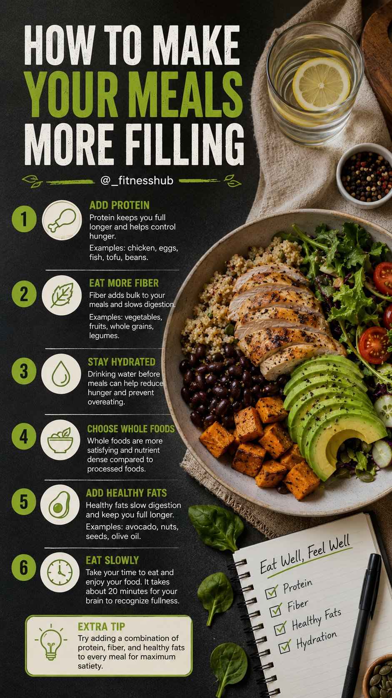

🔗 [View original post](https://x.com/_fitnesshub/status/2095104536637575318)

---

### 🕐 10:08 UTC · @Unlockyourlife_

> Natural testosterone boosters.

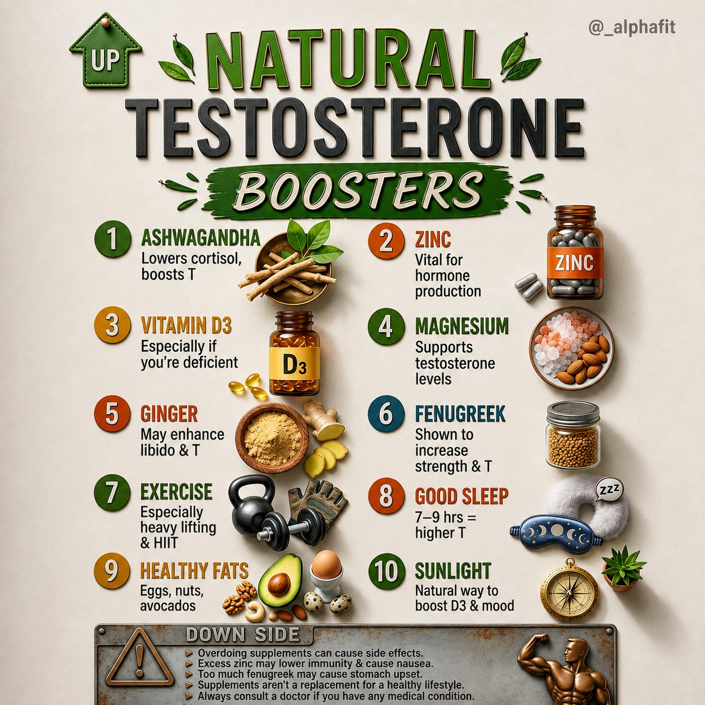

🔗 [View original post](https://x.com/_alphafit/status/2095091446026002879)

---

### 🕐 10:07 UTC · @Unlockyourlife_

> Foods that rause and lower blood pressure.

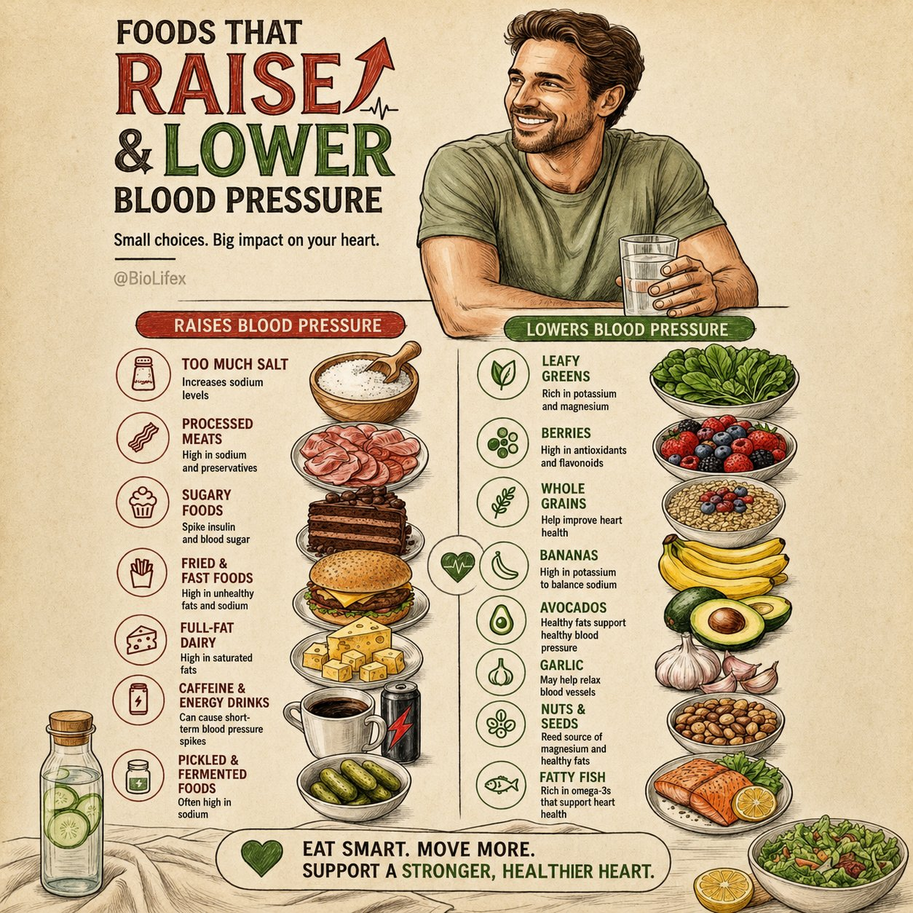

🔗 [View original post](https://x.com/BioLifex/status/2095091285224796661)

---

### 🕐 10:07 UTC · @Unlockyourlife_

> Six spaghetti recipes. One impossible decision. 🍝 Which one are you making first?

🔗 [View original post](https://x.com/Elitedelicacy/status/2095091145382433122)

---

### 🕐 08:11 UTC · @Unlockyourlife_

> Amazing Fact about science! Media

🔗 [View original post](https://x.com/sciencepathx/status/2095062050598781075)

---

### 🕐 08:08 UTC · @Unlockyourlife_

> Your body is constantly working behind the scenes — even when you’re sleeping, resting, or doing absolutely nothing. From your brain staying active at night to your bones constantly rebuilding themselves, there’s a lot happening that you never feel or notice. Sometimes, the weirdest things your body does are completely normal.

🔗 [View original post](https://x.com/_fitnesshub/status/2095061305325400464)

---

### 🕐 08:08 UTC · @Unlockyourlife_

> 5. Your bones are constantly being broken down and rebuilt 🦴 Your skeleton isn’t just sitting there unchanged. Throughout your life, specialized cells constantly remove old bone tissue while other cells build new bone tissue. This process helps repair tiny areas of damage and keeps your bones strong.

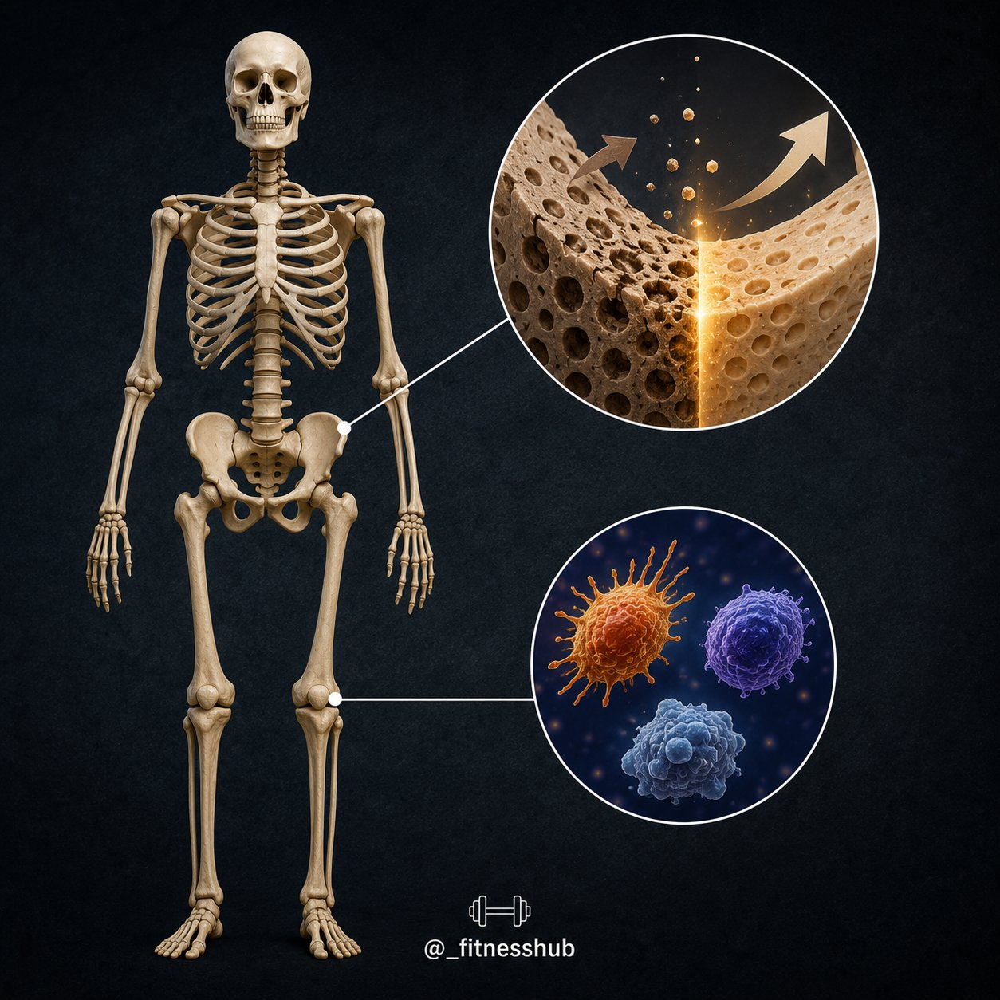

🔗 [View original post](https://x.com/_fitnesshub/status/2095061300711714969)

---

### 🕐 08:08 UTC · @Unlockyourlife_

> 4. One workout can benefit you immediately You don’t necessarily have to exercise for months before your body gets something out of it. A single session of moderate-to-vigorous physical activity can provide immediate benefits, including improved sleep quality, reduced anxiety and lower blood pressure. Your workout isn’t only paying off “someday.”

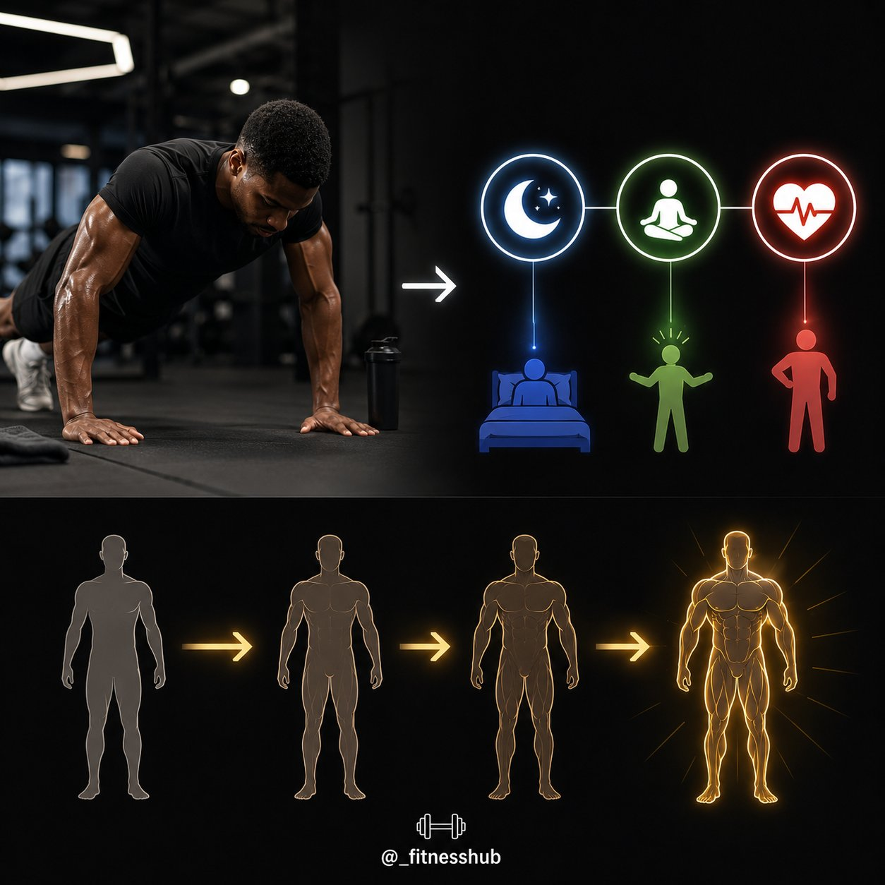

🔗 [View original post](https://x.com/_fitnesshub/status/2095061295393357941)

---

### 🕐 08:08 UTC · @Unlockyourlife_

> 3. Your left lung is smaller than your right 🫁 Your lungs aren’t identical twins. The right lung has three lobes, while the left has two and is slightly smaller because your heart occupies space on the left side of your chest. Your lungs literally aren’t the same size.

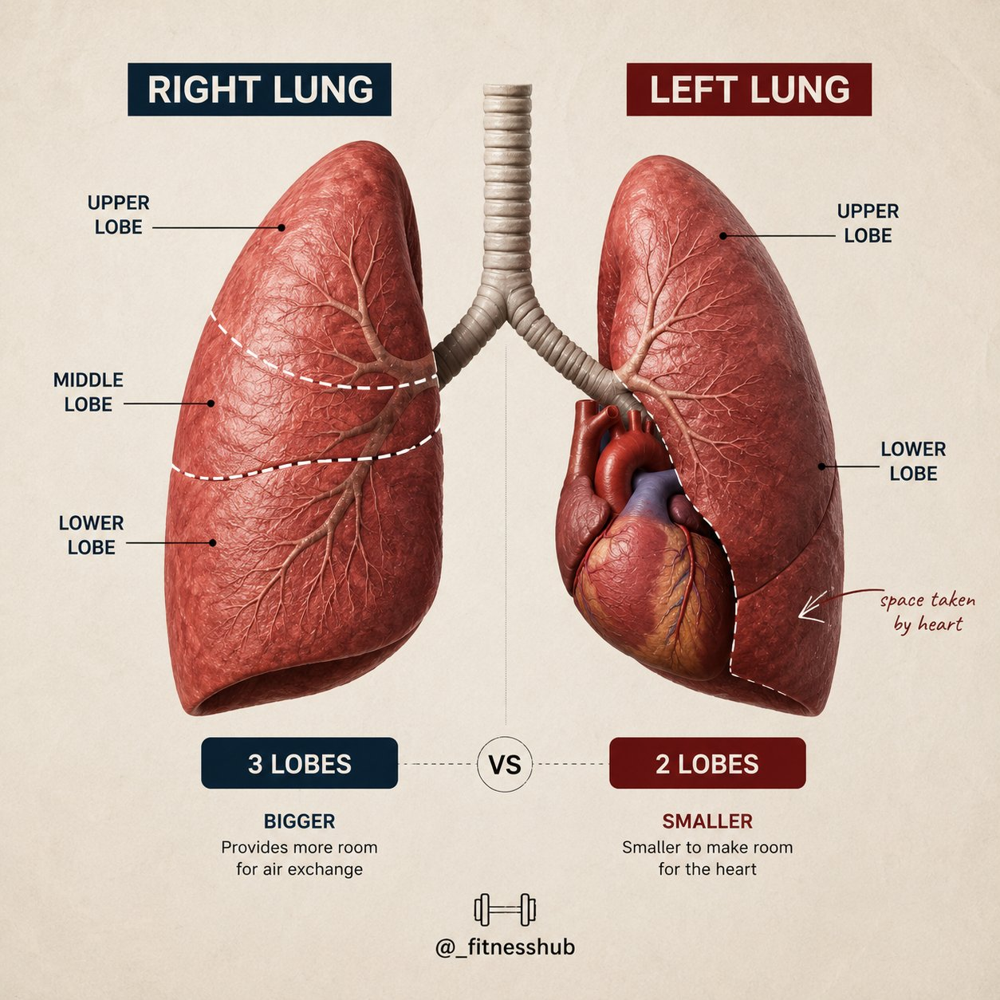

🔗 [View original post](https://x.com/_fitnesshub/status/2095061289886257564)

---

### 🕐 08:08 UTC · @Unlockyourlife_

> 2. Your skin is your largest organ Most people would probably guess the liver or brain. But your skin is actually the body’s largest organ. It helps protect you from the outside environment, regulate temperature and prevent excessive water loss. That “surface” you’re looking at is doing a LOT more than you think.

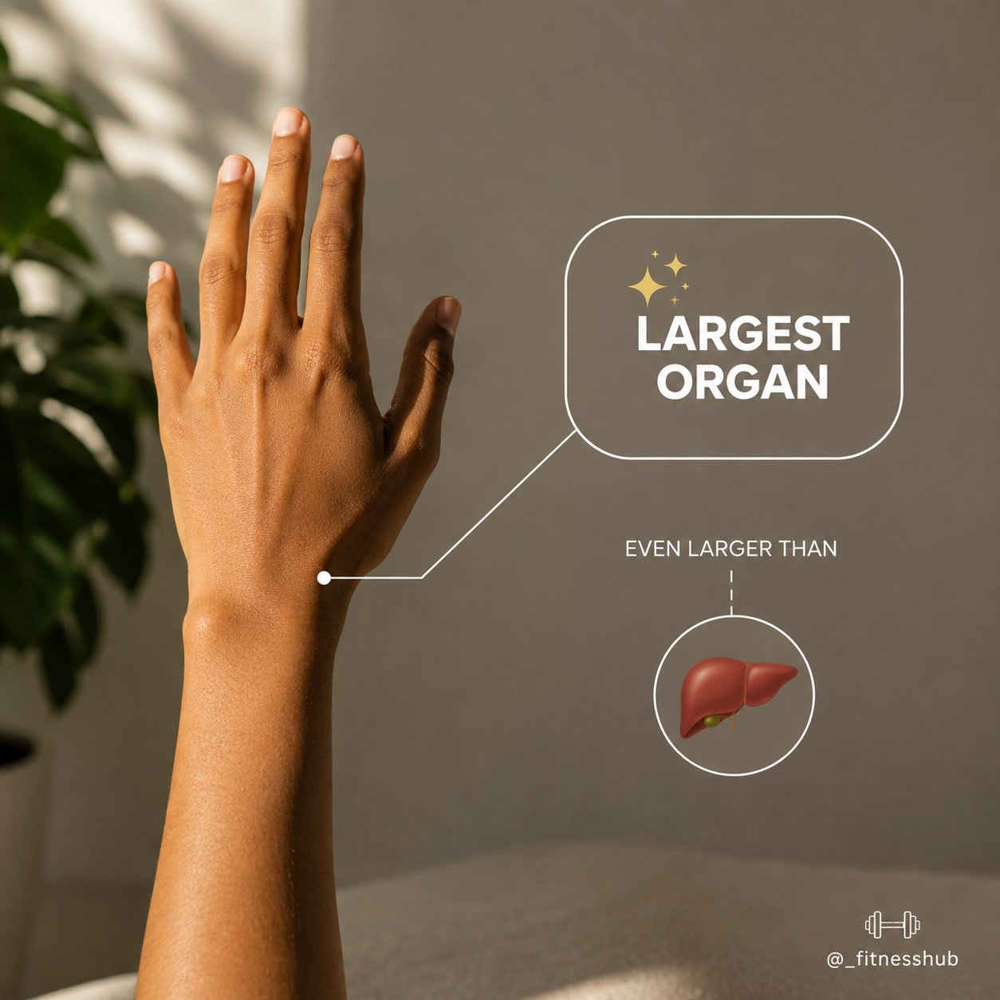

🔗 [View original post](https://x.com/_fitnesshub/status/2095061277848563954)

---

### 🕐 08:08 UTC · @Unlockyourlife_

> 1. Your brain stays active while you sleep 💤 Sleeping looks like your brain has completely shut down. It hasn’t. Your brain remains highly active during sleep, and certain stages help with learning, memory and processing information. Sleep isn’t your brain turning off. It’s your brain switching jobs.

🔗 [View original post](https://x.com/_fitnesshub/status/2095061272538615886)

---

### 🕐 08:08 UTC · @Unlockyourlife_

> 🧠 Health facts that sound fake but are actually true Some health facts sound like something someone made up on the internet. But your body is genuinely doing some wild stuff every single day. Here are 5 that are actually true:

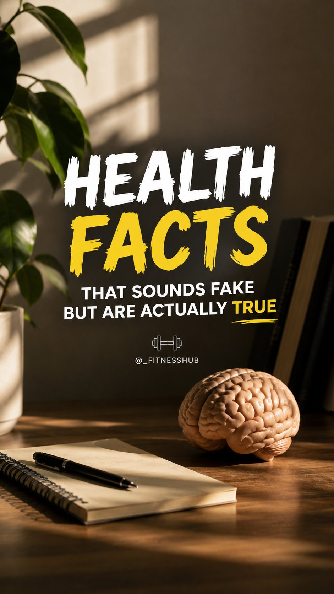

🔗 [View original post](https://x.com/_fitnesshub/status/2095061267266310507)

---

### 🕐 07:54 UTC · @Unlockyourlife_

> Giving an old tire a whole new life - underwater! ➡️🐠 Media

🔗 [View original post](https://x.com/Smart_Tipsx/status/2095057888335073774)

---

### 🕐 07:49 UTC · @Unlockyourlife_

> For improved vision?....... Try This 👇

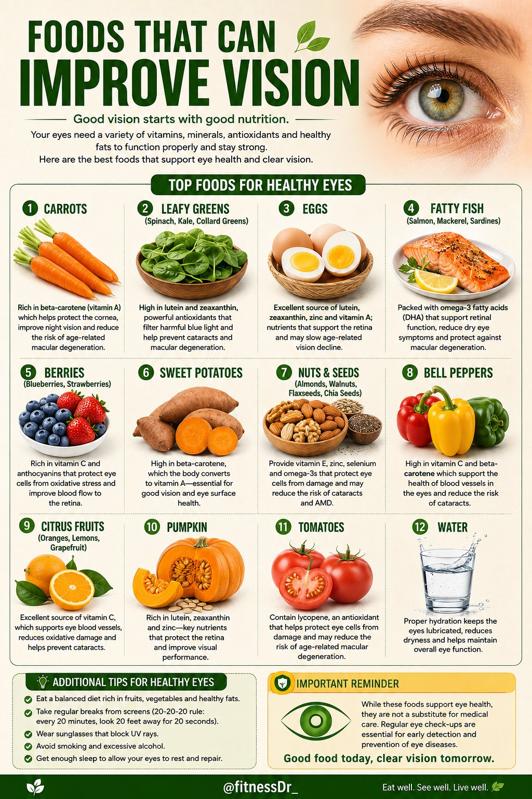

🔗 [View original post](https://x.com/FitnessDr_/status/2095056563383775294)

---

### 🕐 07:48 UTC · @Unlockyourlife_

> Quick Plastic Repair Trick 🙂 👍 Media

🔗 [View original post](https://x.com/samx_reels/status/2095056315911463068)

---

### 🕐 07:41 UTC · @Unlockyourlife_

> Here is what you will do when your both wheels are stuck in a Ditch! Media

🔗 [View original post](https://x.com/_Brainboxx/status/2095054413488374226)

---

### 🕐 06:47 UTC · @Unlockyourlife_

> Gourmet Soft Pretzels.

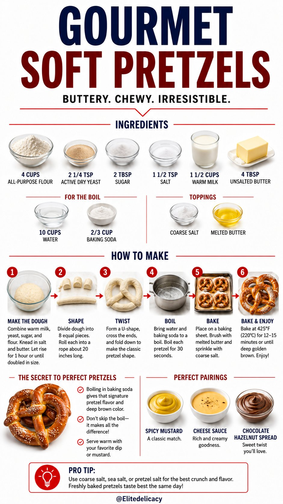

🔗 [View original post](https://x.com/Elitedelicacy/status/2095040981783519371)

---

### 🕐 06:47 UTC · @Unlockyourlife_

> Avoiding Ego Lifting

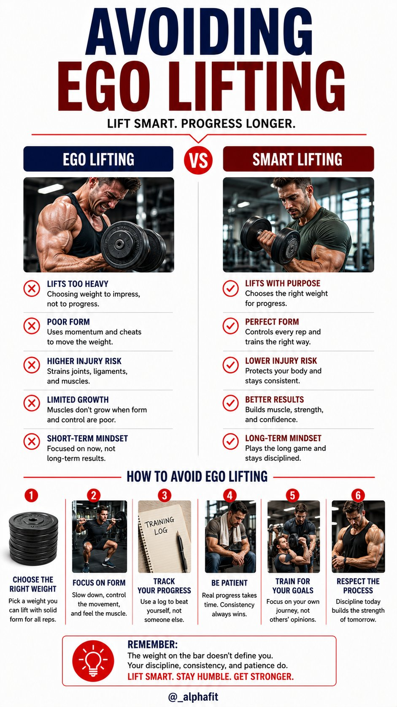

🔗 [View original post](https://x.com/_alphafit/status/2095040870244405470)

---

### 🕐 06:46 UTC · @Unlockyourlife_

> Active Recovery vs. Passive Rest

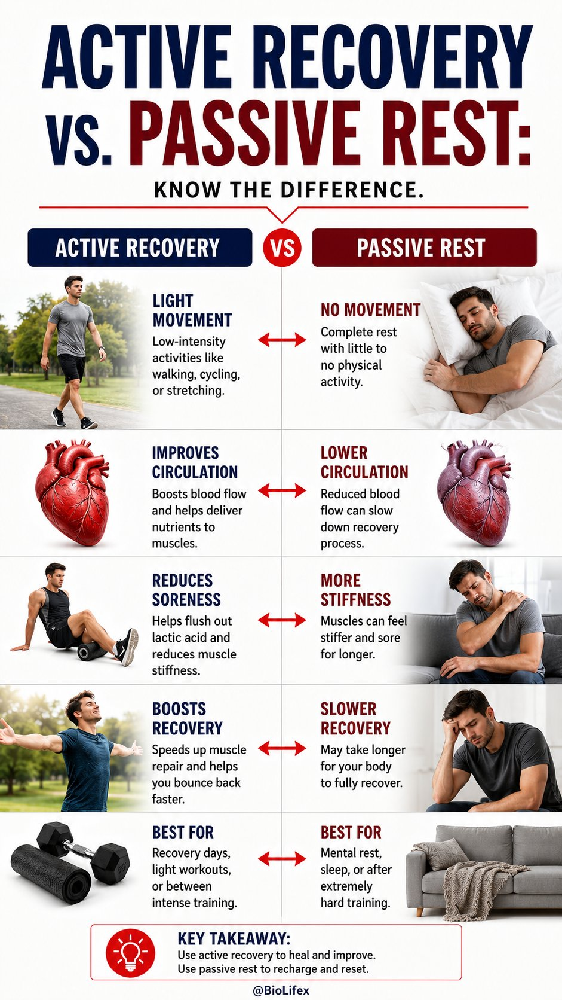

🔗 [View original post](https://x.com/BioLifex/status/2095040734692802609)

---

### 🕐 05:18 UTC · @Unlockyourlife_

> Tips for life Media

🔗 [View original post](https://x.com/_learnskills/status/2095018451655954861)

---
