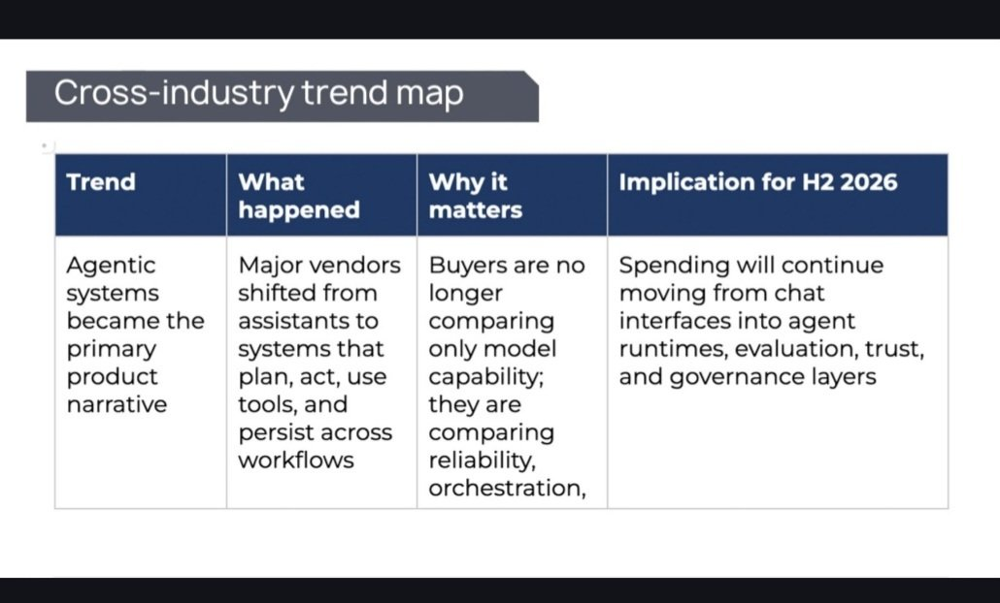
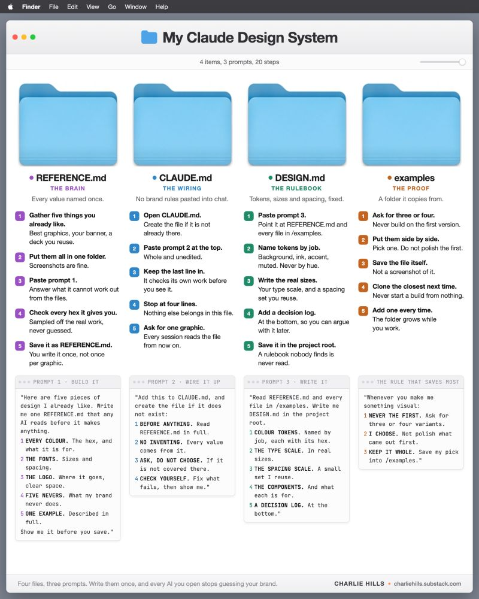
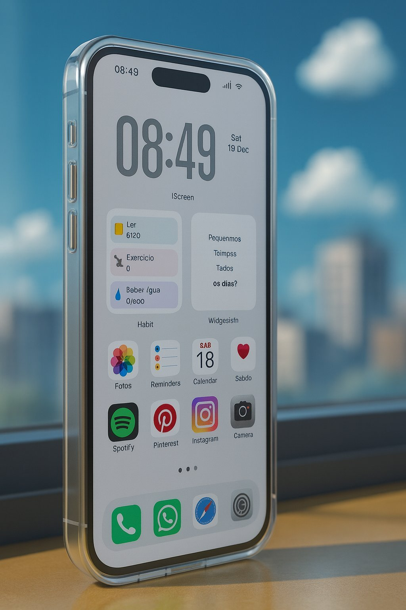

# 🐦 @Wise1Philosophy

## 📅 September 02, 2026

> 30 post(s) archived.

---

### 🕐 10:27 UTC · @Wise1Philosophy

> the best breakdown of what an enterprise AI factory is: We run an AI Factory at @LimestoneHQ. Here&apos;s what actually happens between a ticket and a merged pull request. Most teams already tried the loop. Point an agent at a repo, handed it a ticket, and got back code that compiled, misunderstood the architecture, and arrived with forty …

🔗 [View original post](https://x.com/alex_prompter/status/2095096200693186859)

---

### 🕐 09:30 UTC · @Wise1Philosophy

🔗 [View original post](https://x.com/Ant_Philosophy/status/2095081893616038215)

---

### 🕐 09:10 UTC · @Wise1Philosophy

> My old workflow would&apos;ve restarted and ruined my afternoon 😭 This is not Deep Research. Most tools hand you a report and disappear. This one showed every step, then let me change the task halfway through and kept working. Full run below. 👇

🔗 [View original post](https://x.com/Wise1Philosophy/status/2095077005423251824)

---

### 🕐 09:06 UTC · @Wise1Philosophy

> The AI tools you&apos;re using today won&apos;t look the same by December. Companies stopped paying for chatbots that answer questions. They now pay for agents that finish the work, plan, act, and keep going without you. The question is no longer which AI is smartest. It&apos;s which one you can trust to run alone. This shift is mapped in the H1 2026 Industry Report: https://bit.ly/StateofAI2026

🔗 [View original post](https://x.com/TheAIColonyRD/status/2095075794108272775)

---

### 🕐 08:44 UTC · @Wise1Philosophy

> A guy bought an Apple TV 4K for $179. He uses it to open Netflix, press play, and fall asleep on the couch. Same routine every night. Same 3 apps. Same uncalibrated picture. Same remote he hates. Same &quot;I can&apos;t hear the dialogue&quot; complaint every movie. His friend, a home theater installer who&apos;s calibrated over 2,000 living rooms and has spent 11 years turning average TVs into cinematic experiences, came over for a movie night, looked at the screen for 10 seconds, and picked up the remote. &quot;You bought a $179 home theater computer and you&apos;re using it as a $30 Roku. You&apos;ve never calibrated the picture using the iPhone tool Apple built specifically for your TV. You&apos;ve never turned on Spatial Audio, which turns your AirPods into a surround-sound system. You&apos;ve never connected it to your smart home which it&apos;s already controlling as a hub, silently, 24/7, without you knowing. You&apos;ve never used your iPhone as a keyboard instead of pecking letters one at a time with the remote. And you&apos;ve been watching every movie with dialogue you can&apos;t hear and explosions that shake the walls because you&apos;ve never toggled one audio setting that fixes it in 3 seconds.&quot; He changed 9 things in 15 minutes. The picture looked like a different television. The dialogue became clear without touching the volume. The AirPods became a private surround-sound cinema. The remote stopped being the enemy. And the Apple TV started doing things he didn&apos;t know a streaming box could do. &quot;Apple TV isn&apos;t a streaming stick. It&apos;s a home theater processor, a smart home hub, a gaming console, a FaceTime screen, and a private cinema system. Apple packed all of it into a $179 box and marketed it as &apos;the best way to watch Apple TV+.&apos; Most people heard &apos;streaming box&apos; and never opened Settings.&quot; Here are the 9 things he changed 🧵

🔗 [View original post](https://x.com/jackcoder0/status/2095070397746344082)

---

### 🕐 08:40 UTC · @Wise1Philosophy

> R.I.P. GOOGLE FLIGHTS IN 2026. R.I.P. BOOKING COM IN 2026. R.I.P. SKYSCANNER IN 2026. $1,190 flight. I paid $159. Use these 10 prompts before booking your next trip: 👇🏼 (Save this 🔖 you’ll need it later)

🔗 [View original post](https://x.com/heyalexmoore/status/2095069272498422052)

---

### 🕐 08:38 UTC · @Wise1Philosophy

> I&apos;ve (finally) stopped describing my brand to Claude. All it took was 4 files and 3 prompts: REFERENCE.md. Find five designs you already like. CLAUDE.md. Add four lines so AI finds the reference first. DESIGN.md. This is how to build, not just what&apos;s allowed. examples/. The designs I liked, saved to the system. All 3 prompts are free ↓ https://charliehills.substack.com/p/ai-design-system Repost ♻️ to help someone in your network. https://x.com/i/article/2094003933782163456

🔗 [View original post](https://x.com/charliejhills/status/2095068891794043190)

---

### 🕐 08:34 UTC · @Wise1Philosophy

> 🚨 THIS IS WILD! AI 3D generation is moving from single objects to full scenes now. Hyper3D WorldGen takes one photo and turns it into a structured 3D world complete with spatial relationships, physical properties, and independent editable assets instead of one locked environment. Watch this 👇 Media

🔗 [View original post](https://x.com/heyDhavall/status/2095067758719574468)

---

### 🕐 08:30 UTC · @Wise1Philosophy

🔗 [View original post](https://x.com/Mindsthatbuild/status/2095066777797493231)

---

### 🕐 08:19 UTC · @Wise1Philosophy

> For those looking for Masters (or Undergraduate/ PhD) scholarships, many are now open for you! Here is a thread of fully funded opportunities. Don&apos;t just like, share and bookmark, check which applies to you and make efforts to apply!

🔗 [View original post](https://x.com/Shawnife/status/2095064051860594861)

---

### 🕐 08:14 UTC · @Wise1Philosophy

> AI is getting out of hand! Media

🔗 [View original post](https://x.com/AIHighlight/status/2095062808769503251)

---

### 🕐 08:00 UTC · @Wise1Philosophy

🔗 [View original post](https://x.com/Wise1Philosophy/status/2095059385609273553)

---

### 🕐 08:00 UTC · @Wise1Philosophy

> Your blood sugar is wearing you down faster than smoking or fast food. It wrecks sleep, stalls fat loss, tanks nitric oxide, and causes fatty liver and diabetes. Here&apos;s the simple fix: 1. Skip the 10,000 step obsession. Media

🔗 [View original post](https://x.com/RasmusNorbergg/status/2095059187655127345)

---

### 🕐 07:48 UTC · @Wise1Philosophy

> A Stanford neuroscientist confessed: &quot;Your belly holds cortisol waste. Kill it with this One habit before bed tonight.. And your whole life will change.&quot; Here&apos;s the 9 minute fix:

🔗 [View original post](https://x.com/HeyKimChong/status/2095056130569576477)

---

### 🕐 07:38 UTC · @Wise1Philosophy

> I wasted 20 years learning this the hard way. 13 brutal truths I wish I knew earlier: 1. If you died today, your job would replace you within a week and no one would know you&apos;re gone.

🔗 [View original post](https://x.com/ClaraBrooksjz/status/2095053613609750677)

---

### 🕐 07:30 UTC · @Wise1Philosophy

🔗 [View original post](https://x.com/Daily__wisdom_/status/2095051674561778160)

---

### 🕐 07:24 UTC · @Wise1Philosophy

> Insulin resistance is the real reason your cortisol stays high. If I wanted to lower high cortisol without medication, these are the 8 things I would do daily: 1. Stop running (at night!)

🔗 [View original post](https://x.com/TinaaDeJong/status/2095050090557968538)

---

### 🕐 07:12 UTC · @Wise1Philosophy

> Past 40, your heart, your memory, and how long you get with your kids all decided by one hormone: Cortisol. Here are 7 signs cortisol is out of control: 1. Waking at 1am, 3am, 5am.

🔗 [View original post](https://x.com/JasperKasparov/status/2095047070713516293)

---

### 🕐 07:01 UTC · @Wise1Philosophy

> Fatty liver now affects 1 in 3 adults. It wrecks your metabolism, becomes diabetes, and raises your risk of heart disease. Here&apos;s what nutrition research says: 1. Eat sweet potatoes often.

🔗 [View original post](https://x.com/CoachLucHerrera/status/2095044302678442095)

---

### 🕐 07:00 UTC · @Wise1Philosophy

🔗 [View original post](https://x.com/apex_mentality_/status/2095044285125062842)

---

### 🕐 06:48 UTC · @Wise1Philosophy

> Heart disease doesn&apos;t begin with age. It begins with inflammation, insulin resistance, and low nitric oxide. Here are 7 research-backed ways to keep your heart young: 1. Add Nitric oxide, your artery&apos;s youth molecule.

🔗 [View original post](https://x.com/Marc0sRomano/status/2095041031410786797)

---

### 🕐 06:36 UTC · @Wise1Philosophy

> 1 in 3 men have zero libido by 35. And it&apos;s not just a bedroom problem. It&apos;s your heart, hormones, and brain signaling that something is wrong. Instead of feeling ashamed, here are 8 ways to restore it naturally: 1. Stop training 7 days a week Media

🔗 [View original post](https://x.com/mind_and_beauty/status/2095038025554329672)

---

### 🕐 06:30 UTC · @Wise1Philosophy

🔗 [View original post](https://x.com/yeti_mind/status/2095036536609718735)

---

### 🕐 06:20 UTC · @Wise1Philosophy

> Your resting heart rate tells you the whole story. 95+ bpm - Your heart is strained just to keep you going. 90 bpm - Sedentary, unhealthy, stressed out. 80 bpm -

🔗 [View original post](https://x.com/MagnusLindbrg/status/2095033987563655385)

---

### 🕐 06:10 UTC · @Wise1Philosophy

> A Heart doctor confessed: “There are 3 types of people who avoid heart attacks.” 1. Don&apos;t get up to pee at 3 AM Media

🔗 [View original post](https://x.com/RafaelNasriX/status/2095031488509255962)

---

### 🕐 06:02 UTC · @Wise1Philosophy

> 9 SIGNS YOUR CORTISOL IS THROUGH THE ROOF (&amp; YOU DON&apos;T KNOW IT): 1. Twitching eyelids Media

🔗 [View original post](https://x.com/CoachJulianNiko/status/2095029469031632977)

---

### 🕐 06:00 UTC · @Wise1Philosophy

🔗 [View original post](https://x.com/Life__Mastery/status/2095029183441256456)

---

### 🕐 05:59 UTC · @Wise1Philosophy

> Most people still use their phone to do more work. AI is for doing less and getting more done. Here are 25 apps you need.

🔗 [View original post](https://x.com/kumud_deepali/status/2095028927551205502)

---

### 🕐 03:45 UTC · @Wise1Philosophy

> You can earn $9,000 per month if you have ChatGPT, a laptop, and 60 mins a day. Usually, I&apos;d charge $97 for this proven guide, but today it&apos;s yours 100% FREE. Like + reply &apos;Money&apos; &amp; I&apos;ll send you my complete guide for FREE. Must follow me @JayBisen473370 to get DM. FREE for 48 hrs only.

🔗 [View original post](https://x.com/JayBisen473370/status/2094995059578114536)

---

### 🕐 00:44 UTC · @Wise1Philosophy

> I share a lot more cool workflows on my instagram Don’t forget to give a follow: https://instagram.com/alex_prompter

🔗 [View original post](https://x.com/alex_prompter/status/2094949466134413618)

---
