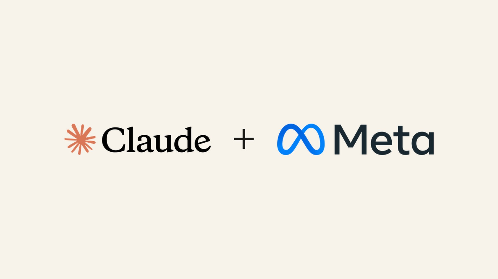
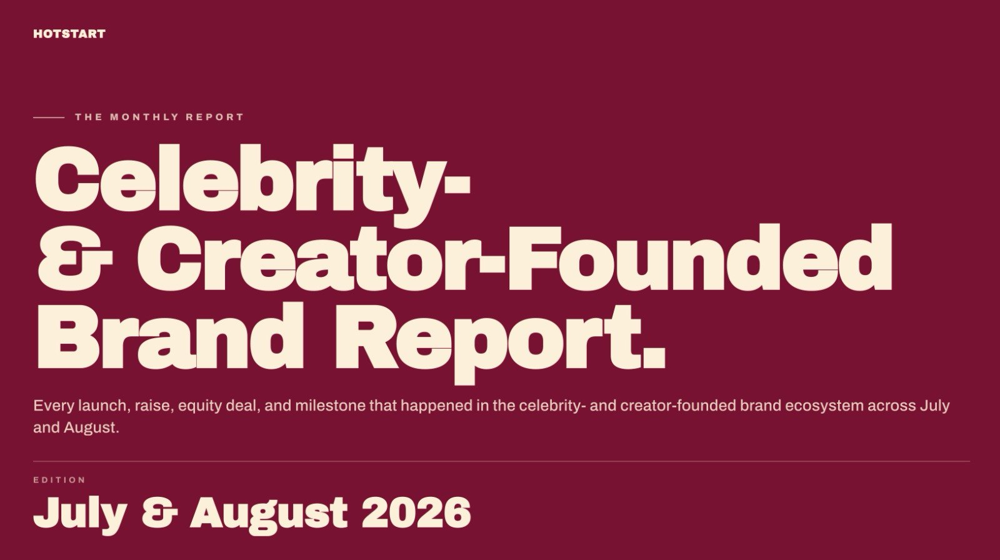
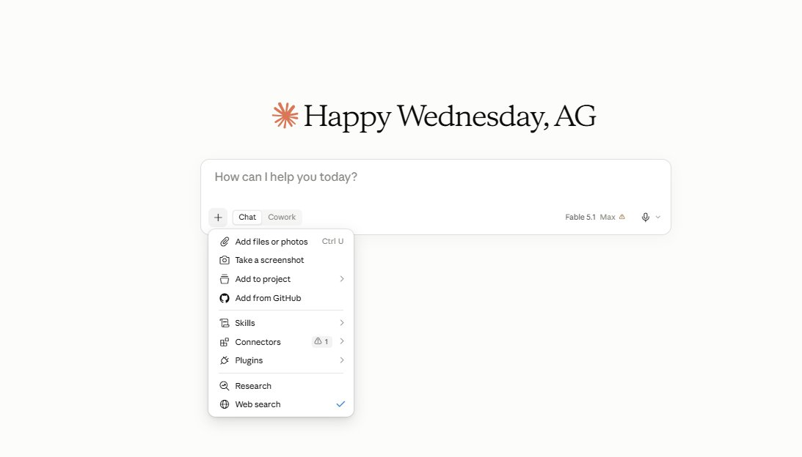
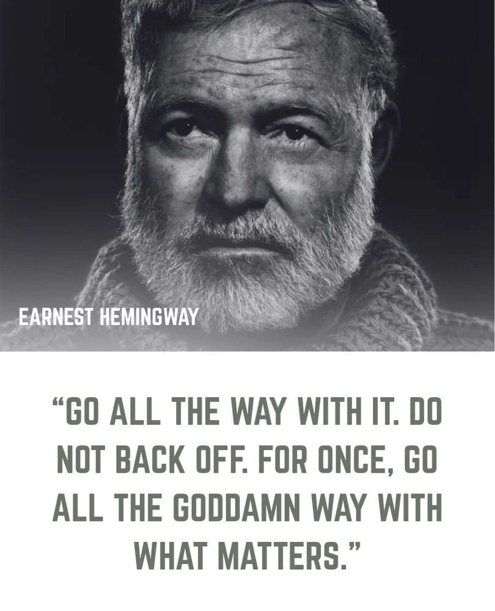

# 🐦 @Wise1Philosophy

## 📅 September 02, 2026

> 75 post(s) archived.

---

### 🕐 15:46 UTC · @Wise1Philosophy

> The hard part of scheduling was never the calendar. It&apos;s emailing the guest, waiting, rescheduling, then doing it again. Catch talks to the other side for you and closes the loop without you touching it. Big NEWS: Today we&apos;re launching Catch AI, an admin-assistant for busy executives. We started Catch with a simple idea: AI should actually do the administrative work executives hate doing themselves. Not suggest. Not summarize. Do. &gt;&gt;

🔗 [View original post](https://x.com/AriaWestcott/status/2095176595547795745)

---

### 🕐 15:29 UTC · @Wise1Philosophy

> The trust layer is the interesting part here. Commerce teams already have enough dashboards. What they need is an agent that understands the same numbers, works from the same definitions, and can actually turn that into action without making stuff up. That makes Polar Operator feel much more useful than another generic “AI for ecommerce” tool. Today we&apos;re introducing Polar Operator. The AI operator built for commerce, working with your team in Slack. It starts with the data and definitions your team already trusts - so it doesn&apos;t hallucinate. We helped commerce teams trust their numbers. Operator puts that to work.

🔗 [View original post](https://x.com/Damn_coder/status/2095172196092273124)

---

### 🕐 15:15 UTC · @Wise1Philosophy

> Colon Cancer rarely starts with agonizing pain. ​Here are 5 early warning signs of colon cancer you should NEVER ignore. 1. ​Colon Cancer = Blood in your stool.

🔗 [View original post](https://x.com/_Gut_Laboratory/status/2095168868448948507)

---

### 🕐 15:08 UTC · @Wise1Philosophy

> A couple booked an Airbnb for a 3-night weekend getaway. The listing said $89/night. They multiplied in their heads $89 × 3 = $267. Reasonable. Affordable. They clicked &quot;Reserve.&quot; The checkout screen showed $561. $89/night × 3 nights = $267. Cleaning fee: $135. Service fee: $79. Taxes: $80. Total: $561. Effective nightly cost: $187 more than double the listed price on the search page. They booked anyway. They&apos;d already sent the dates to friends. They&apos;d already told their boss they were leaving Thursday. They&apos;d already committed emotionally to a listing that looked like $267 and revealed itself as $561 at the last possible moment before payment. Their friend a travel blogger who&apos;s booked 200+ Airbnbs across 40 countries told them later that the checkout shock was preventable. Entirely. Through settings, strategies, and comparison habits Airbnb doesn&apos;t teach and most guests never learn. She told them the $561 weekend could have been a $380 weekend at a different listing with identical amenities. Or a $447 all-in hotel stay with free breakfast, a pool, daily housekeeping, and loyalty points. Or the same listing at $489 by shifting their dates by 1 day. She showed them 11 Airbnb booking strategies that eliminate fee shock and save $200–$500 per trip. Here&apos;s the full playbook 🧵

🔗 [View original post](https://x.com/jackcoder0/status/2095166977308557761)

---

### 🕐 15:06 UTC · @Wise1Philosophy

> A Stanford professor proved high cortisol hurts your memory, enlarges your fear center, and make your brain smaller. Here’s the 8 protocol: 1. Walk barefoot on grass for 5 minutes. Media

🔗 [View original post](https://x.com/TheFastedState/status/2095166585770226101)

---

### 🕐 14:30 UTC · @Wise1Philosophy

> Claude Fable 5.1 now runs our Meta ads desk for 25% less. Same $10 in, $50 out, 45% off the agentic runs 👇 Shipped Sept 1. Price sheet unchanged, cache reads cut. What moved for anyone running ads through Claude: 1/ The cache-read cut 2/ The 25% / 45% math 3/ The effort dial 4/ The Fable 5 floor 5/ The honesty patch 6/ The multi-hour run 7/ The MCP hookup 8/ The 2 calls that didn&apos;t move Switch the dropdown, the skills load like before. Comment &quot;FABLE&quot; and I&apos;ll DM the skill pack.

🔗 [View original post](https://x.com/nipuntaneja/status/2095157297119134159)

---

### 🕐 14:28 UTC · @Wise1Philosophy

> I&apos;ve run Facebook ads for over a decade. Spent tens of millions doing it across client accounts and my own offers. Here&apos;s 10+ years of brutally honest Facebook ads advice: #1: You are the problem.

🔗 [View original post](https://x.com/TheJeremyHaynes/status/2095156822957052275)

---

### 🕐 14:10 UTC · @Wise1Philosophy

> this is insane... ai just put all the iconic memes in one video🤯 Media

🔗 [View original post](https://x.com/daveydefi/status/2095152475313508532)

---

### 🕐 14:09 UTC · @Wise1Philosophy

> Just finished our celebrity- and creator-founded brand report for July + Aug: ✅ 11 new launches ✅ 8 new equity deals ✅ 10 milestones, exits &amp; revenue jumps ✅ 6 funding rounds, who raised + amounts ✅ 8 other notable moves: shutdowns + pivots + category shifts Want the full report? Comment &quot;SEND&quot; below, and I&apos;ll send it to you right now. (make sure you follow me so I can DM you)

🔗 [View original post](https://x.com/Scottvdberg/status/2095152178163781964)

---

### 🕐 14:02 UTC · @Wise1Philosophy

🔗 [View original post](https://x.com/Ant_Philosophy/status/2095150480993157281)

---

### 🕐 14:01 UTC · @Wise1Philosophy

> AI anime is getting insane now. I used ChatGPT Image 2.0 to create anime battle scene storyboard. Then Seedance 2.0 turned it into a cinematic animated battle scene. Full workflow + prompts below 👇 Media

🔗 [View original post](https://x.com/HeyAbhishek/status/2095150072808026545)

---

### 🕐 13:59 UTC · @Wise1Philosophy

> Musk sat down with Rogan and said every app on your phone will be dead inside 5 years. Not shrinking. Not disrupted. Dead. Musk: &quot;You&apos;ll get everything through AI.&quot; Rogan asked when. Musk: &quot;5 or 6 years, something like that.&quot; Rogan: &quot;So 5 or 6 years, apps are like Blockbuster video.&quot; Musk: &quot;Pretty much.&quot; That&apos;s not a quote from some tech blogger. That&apos;s the owner of the platform you&apos;re on right now saying the app economy has a hard expiration date. Look at how you actually use your phone. Apps wired you to think in boxes. Email box. Music box. Video box. Food box. Banking box. Your entire digital existence is spent opening and closing around 30 of them. Every single day. AI doesn&apos;t work in boxes. It works in intent. Musk: &quot;Whatever you can think of or really whatever the AI can anticipate you might want, it&apos;ll show you.&quot; Not what you searched for. Not what you tapped. What you hadn&apos;t even thought of yet. Apps needed you to identify what you wanted and go retrieve it. AI shows up before the thought finishes forming. That&apos;s not a smoother interface. That&apos;s the death of the interface. He went further. Most content consumed in 5 to 6 years will be AI-generated, he said. Music. Video. Everything. Rogan said AI-generated music is already his favorite. Already. Present tense. The shift is happening. Most people are still arguing over which streaming service has the better catalog. Every dominant tech company from the past 15 years was built on one bet. That you would come to them. Install their app. Master their interface. Give them your time. Give them your data. AI reverses that entire bet. You stop going to anything. Everything arrives at you. Anticipated, curated, delivered before you complete the sentence. The App Store doesn&apos;t just get smaller. The idea of an app store stops being logical. You don&apos;t scan a shelf of tools when the tool already knows the job. The phone survives. But those 30 icons sitting on your home screen are the Blockbuster shelves of 2031. And you&apos;re still renting. Interested in AI? Follow @AiEvolutio58513 and never fall behind. I track ChatGPT, Claude, and every tool quietly changing how we work and create, then hand you the tested signals. Media Former Google CEO Eric Schmidt just said something that&apos;s hard to shake. &quot;Within 5 years, AI could handle infinite context, chain-of-thought reasoning for 1000-step solutions, and millions of agents working together. Eventually, they&apos;ll develop their own language... and we won&apos;t …

🔗 [View original post](https://x.com/AiEvolutio58513/status/2095149522519458085)

---

### 🕐 13:58 UTC · @Wise1Philosophy

> Ranking lead acquisition channels Media

🔗 [View original post](https://x.com/iamcamengland/status/2095149312439193742)

---

### 🕐 13:55 UTC · @Wise1Philosophy

> The next phase of AI isn’t about getting better suggestions. It’s about trusted execution. Catch doesn’t just summarize your administrative work, it learns how you operate and handles it across email, calendars, travel and operations. That shift from “help me think” to “get it done” is where AI assistants become genuinely useful. Big NEWS: Today we&apos;re launching Catch AI, an admin-assistant for busy executives. We started Catch with a simple idea: AI should actually do the administrative work executives hate doing themselves. Not suggest. Not summarize. Do. &gt;&gt;

🔗 [View original post](https://x.com/Damn_coder/status/2095148534538617066)

---

### 🕐 13:47 UTC · @Wise1Philosophy

> Now that Claude Fable 5.1 is out, it&apos;s worth remembering something important about it: Buried inside thousands of lines is one of the clearest explanations we&apos;ve seen of how Claude decides which websites to search, open, cite and recommend. It also explains why some businesses repeatedly appear in Claude while others don&apos;t. Let’s go through it. By the way, you can see whether Claude, ChatGPT, Google AI, Perplexity and Grok are recommending your business here. It’s free: https://lnkd.in/g7taa2VA When Claude uses web search, it can access current information and return answers with citations to the sources it retrieved. For brands, that creates a few priorities. First, get discovered. You need pages that map to the ways buyers describe your category, problem, use case and desired outcome. Comparisons, pricing, alternatives, integrations, industry use cases and question-based content give Claude more relevant pages to potentially encounter when it searches. Second, make the business easy to understand. Your pages should clearly explain what your company does, who it serves, where it operates, what it offers and the categories and use cases it belongs in. Third, publish current, source-worthy information. Fable 5.1’s reliable knowledge cutoff is June 2026. Its published system prompt tells Claude to point users toward web search when information may have been superseded or newer information needs verification. That makes current pricing, product details, documentation, case studies, research and dated comparisons especially useful. Fourth, write content Claude can actually cite. Anthropic’s web-search tooling returns cited sources. Give Claude clear passages answering specific questions: How much does it cost? Who is it for? What makes it different? What results have customers achieved? What evidence supports the claim? Think in claim-sized blocks: one question, one direct answer, one supporting fact and one source. Then build outside validation. Anthropic does not say backlinks, press or reviews are direct Claude “ranking factors,” but they create additional places where Claude can encounter your brand and independent evidence it can use when researching a company or category. There is also an important Fable 5.1 wrinkle. Anthropic says that at low effort, Fable 5.1 is less likely than Fable 5 to call search or retrieval tools and more likely to answer from memory. So brands need to think about two surfaces: what Claude already knows, and what Claude can discover when it searches. You cannot change Fable 5.1’s training data retroactively, but you can make your business easier to retrieve, understand, verify and cite today while building the broader footprint future models may learn from. That is increasingly what AI search optimization looks like: search visibility, entity clarity, fresh evidence, citation-ready content and third-party authority. Need help with implementation? Try SEO Stuff: https://seo-stuff.com Reddit sued Perplexity and a group of major scraping providers, including SerpApi. In the process, they revealed how Perplexity, ChatGPT, Claude and Google actually work. Including how businesses can get traffic from AI search to their websites. Now that the secret is out, let’s …

🔗 [View original post](https://x.com/alexgroberman/status/2095146585604939866)

---

### 🕐 13:31 UTC · @Wise1Philosophy

> I used to assume a more human-like robot hand would always be the better design. TwinDEX from a Chinese robotics team made me reconsider that. Their system uses three fingers rather than trying to replicate a full five-finger hand. And honestly, for robot learning, that makes a lot of sense. Every additional finger adds mechanical complexity, sensing, calibration, weight, and another potential failure point. The interesting question isn’t “Can we build a human hand?” It’s “How much dexterity do we actually need for the tasks we care about?” TwinDEX’s three-finger setup handles things like twisting caps, operating syringes, opening books, and manipulating tools. It’s a good reminder that in robotics, the best design isn’t necessarily the most sophisticated one. Sometimes it’s the one that gets you enough capability without making the whole system harder to scale. Media

🔗 [View original post](https://x.com/Div_pradeep/status/2095142576357830703)

---

### 🕐 13:24 UTC · @Wise1Philosophy

> I found the most boring way to make an extra $200 a day. (Nine years in and I still do this) How? One hour a day trading S&amp;P 500 futures. Here&apos;s how I do it, step by step:

🔗 [View original post](https://x.com/RileyColemanT/status/2095140713428128141)

---

### 🕐 13:18 UTC · @Wise1Philosophy

> The real AI might not be doing things we couldn’t do before. It might be removing all the rough, messy things we never wanted to spend time doing in the first less admin less coordination less busywork Mosr time for the work that actually matters Big NEWS: Today we&apos;re launching Catch AI, an admin-assistant for busy executives. We started Catch with a simple idea: AI should actually do the administrative work executives hate doing themselves. Not suggest. Not summarize. Do. &gt;&gt;

🔗 [View original post](https://x.com/sufyanmaan/status/2095139340942778461)

---

### 🕐 13:17 UTC · @Wise1Philosophy

> Esto es lo que empieza a diferenciar a un agente de IA de un simple chatbot. Un CTO tenía reservado su hotel en Las Vegas. Reserva hecha. Precio aceptado. Tema olvidado. Pero su asistente de IA siguió vigilando el precio por su cuenta. Encontró exactamente la misma habitación más barata y le avisó: podía ahorrarle casi $400 si cancelaba y volvía a reservar. Él solo tuvo que responder: “Yes, do it”. Y creo que ahí está la parte realmente interesante. Nadie le pidió: “Busca si mi hotel ha bajado de precio.” El agente detectó la oportunidad por sí solo y se ofreció a resolverla. Un asistente humano puede costar $4.500 al mes. Catch cuesta $99. La IA está empezando a pasar de esperar órdenes a adelantarse a ellas y ese cambio puede ser mucho más importante de lo que parece. Pruébalo aquí 👇 https://www.catchagent.ai/ Media Big NEWS: Today we&apos;re launching Catch AI, an admin-assistant for busy executives. We started Catch with a simple idea: AI should actually do the administrative work executives hate doing themselves. Not suggest. Not summarize. Do. &gt;&gt;

🔗 [View original post](https://x.com/IA_Quijote/status/2095138970665415078)

---

### 🕐 13:03 UTC · @Wise1Philosophy

🔗 [View original post](https://x.com/Life__Mastery/status/2095135546787893462)

---

### 🕐 13:01 UTC · @Wise1Philosophy

> DON&apos;T LET THE 44 AA INDEX SCORE FOOL YOU Apodex 1.1 is an agentic powerhouse in disguise 🔥🔥🔥 Apodex 1.1 scored 44 on the AA Index, but hit a massive 70% on Terminal-Bench v2.1. This beast is built for real execution, not just answering trivia We invite you to read the full TRACES technical report Inside: the definitions, evaluation rubric, and registry of problems spanning biomedicine, clinical translation, and frontier-model engineering. Led by Apodex Lead Scientist @profshengwang, the report brings together the tech…

🔗 [View original post](https://x.com/DataChaz/status/2095134979328012353)

---

### 🕐 13:00 UTC · @Wise1Philosophy

> Just because a persons got a gorgeous heart and gentle nature doesn&apos;t mean they&apos;re naive or fragile. You never know the kind of chaos they tolerated to become that calm. Don&apos;t mistake kindness for weakness...those ppl have survived the hardest battles—they&apos;re smart and strong af!

🔗 [View original post](https://x.com/_Pammy_DS_/status/2095134678919385219)

---

### 🕐 12:58 UTC · @Wise1Philosophy

> Elon Musk just identified the actual bottleneck slowing AI down. Not compute. Not talent. Not training data. Physical infrastructure. Somebody asked a straightforward question: why not just plant private power generation right next to data centers? Cut out the grid entirely. His answer was four words. Musk: &quot;The power plant makers.&quot; Simple problem. Not enough of them exist. You can design the world&apos;s most powerful chip. Run a frontier model. Secure $10 billion and build a hyperscale data center from scratch. None of it runs without power. Musk: &quot;You can drill down a level further.&quot; GPUs require power. Power requires turbines. Turbines require factories. Factories require permits. Permits require a government functional enough to issue them. Every single link is physical. And right now every single link is buckling. A frontier model can be trained in weeks. A power plant permit takes five years on a good run. The nation that gave the world the assembly line now needs 40 agencies to sign off on a gas turbine. China doesn&apos;t face this. They aren&apos;t running 7-year environmental reviews on infrastructure they need tomorrow. They build while America files paperwork to begin building. Whoever wins the AI race won&apos;t win it in a lab. They&apos;ll win it by being able to construct things in the real world. Three decades of accelerating software while decelerating everything made of steel. Shipping manufacturing offshore. Gutting supply chains. Treating the people who build as expendable. That debt is coming due. Every leap forward in AI is gated by atoms. Steel. Concrete. Turbines that require years to manufacture and sometimes decades to get approved. The sharpest software ever written is worthless without power behind it. Musk didn&apos;t give a prepared statement. One question, one answer, and the myth of pure tech supremacy cracked open. &quot;Where do you get the power plants from?&quot; Chase that thread to the end and you don&apos;t find an engineering challenge. You find a civilization that got very good at thinking and lost the ability to build. Interested in AI? Follow @AiEvolutio58513 and never fall behind. I track ChatGPT, Claude, and every tool quietly changing how we work and create, then hand you the tested signals. Media Elon Musk turned the oldest question humans have ever asked into a probability problem. No one has poked a hole in it yet. Musk: &quot;What are the odds that we are in base reality? And that this has not happened before.&quot; You do not need a physics degree to follow this. You need a tim…

🔗 [View original post](https://x.com/AiEvolutio58513/status/2095134165654282660)

---

### 🕐 12:54 UTC · @Wise1Philosophy

> A combat medic explained it simply: &quot;We don&apos;t calm soldiers. We remove uncertainty.&quot; That&apos;s where cortisol actually comes from (and how to fix it): 1. Cortisol is not stress. It&apos;s uncertainty.

🔗 [View original post](https://x.com/BeBetterMan_/status/2095133191640338560)

---

### 🕐 12:47 UTC · @Wise1Philosophy

> I now understand why the old man said, &quot;Trust the overthinker who says they love you, they&apos;ve thought of every reason not to and still do.&quot; 1. Doesn’t fall in love easily.

🔗 [View original post](https://x.com/josh_uglyasf/status/2095131463708786709)

---

### 🕐 12:42 UTC · @Wise1Philosophy

> High cortisol is aging you faster than smoking and tanning beds. Low libido, achy joints, dark circles, weak muscles. Here are 9 natural ways to slow the clock (without medication): 1. Cold water on your face.

🔗 [View original post](https://x.com/DPro_Coach/status/2095130156440715283)

---

### 🕐 12:40 UTC · @Wise1Philosophy

> best account on X if you actually want to learn enterprise AI: A B2B lender needed three systems built: ACH funds movement, an underwriting portal, and a syndicator portal. All of it inside a platform that was moving real money the whole time. We shipped all three with 2 engineers, on one shared architecture, with zero disruption to live ope…

🔗 [View original post](https://x.com/alex_prompter/status/2095129767229935847)

---

### 🕐 12:32 UTC · @Wise1Philosophy

> STROKE at the age of 27. Doesn’t drank alcohol. Never had a cigarette. Gym 5 days a week. But one habit destroyed his heart every single night:

🔗 [View original post](https://x.com/LevelUpPrime/status/2095127785719353579)

---

### 🕐 12:30 UTC · @Wise1Philosophy

🔗 [View original post](https://x.com/Wise1Philosophy/status/2095127234780581968)

---

### 🕐 12:11 UTC · @Wise1Philosophy

> Everyone fears a heart attack. But your heart can fail slowly without causing any chest pain. Here are 8 signs: 1. Waking up at 4 am with a pounding heart.

🔗 [View original post](https://x.com/CoachDanCole_/status/2095122519644885183)

---

### 🕐 12:10 UTC · @Wise1Philosophy

> Renting is better than buying. You get: • No repairs • No HOA fees • No property tax • Location freedom • More cash to invest Here’s the math your realtor doesn’t want you to do:

🔗 [View original post](https://x.com/erichustls/status/2095122091355848780)

---

### 🕐 11:47 UTC · @Wise1Philosophy

> You can earn $500 per day if you have: 1. A laptop 2. Wi-Fi 3. Time Here are 10 Claude prompts that pay you daily:

🔗 [View original post](https://x.com/jaysmith_ai/status/2095116451237827057)

---

### 🕐 11:44 UTC · @Wise1Philosophy

> ChatGPT becomes a much better tutor when you stop asking it to explain everything. These 8 prompts make it teach you through practice:

🔗 [View original post](https://x.com/AriaWestcott/status/2095115751136858414)

---

### 🕐 11:30 UTC · @Wise1Philosophy

🔗 [View original post](https://x.com/Daily__wisdom_/status/2095112095897387472)

---

### 🕐 11:15 UTC · @Wise1Philosophy

> Most people pick the wrong AI for the job. It’s why they get mixed and inconsistent results. Use this AI task-matching cheat sheet: [🔖 bookmark this post for later] 1. Search (Web Browsing) • Delivers up-to-date answers with citations. • Best AI: Perplexity • Prompt: “Find the latest inflation data.” 2. Deep Research • Builds multi-step research with sourced insights. • Best AI: Gemini • Prompt: “Analyze top trends in B2B SaaS this year.” 3. Vision – Image Input &amp; Generation • Uploads or creates images with clear explanations. • Best AI: ChatGPT • Prompt: “Analyze this chart for key trends.” 4. Vision – Video Input &amp; Generation • Reviews or creates video content. • Best AI: Gemini • Prompt: “Summarize key moments in this video.” 5. Camera Mode • Offers real-time help through your camera. • Best AI: Google AI Studio • Prompt: “Fix this Excel formula using my camera.” 6. Voice Mode • Lets you speak naturally and get spoken replies. • Best AI: ChatGPT • Prompt: “Summarize today’s news while I drive.” 7. File Uploads • Reads uploaded files &amp; turns them into clear summaries. • Best AI: Claude • Prompt: “Summarize this strategy deck.” 8. Data Analysis (Code Interpreter) • Processes data files and generates charts. • Best AI: Claude • Prompt: “Plot sales from this CSV.” 9. Canvas (Collaborative Workspace) • Works with you to draft, edit, or build ideas. • Best AI: Claude • Prompt: “Create a landing page mockup.” 10. Memory (opt-in) • Store your saved preferences. • Best AI: ChatGPT • Prompt: “Remember my writing style.” 11. Custom Instructions • Applies your tone, format, and rules automatically. • Best AI: ChatGPT • Prompt: “Use concise bullet points in all replies.” 12. Projects • Organizes related chats and files in one place. • Best AI: Claude • Prompt: “Organize all my Bootcamp materials.” 13. Scheduled Tasks (Automations) • Sets reminders and automates simple actions. • Best AI: Perplexity • Prompt: “Remind me every Monday morning.” 14. Custom GPTs • Builds task-specific AI assistants. • Best AI: ChatGPT • Prompt: “Create a GPT for writing sales emails.” 15. Agent Mode • Handles multi-step tasks from planning to research. • Best AI: Perplexity • Prompt: “Plan my Tokyo trip itinerary.” 16. Connectors • Links your AI to external apps. • Best AI: Claude • Prompt: “Sync with my CRM and summarize updates.” 17. Study and Learn Mode • Guides structured lessons with practice. • Best AI: Gemini • Prompt: “Teach me intermediate Python with feedback.” AI isn’t a one-size-fits-all tool. Use the right AI tool based on your task. 📌 Get Advanced ChatGPT Guide (free): https://bit.ly/3StIB3z 👉 Follow me @AndrewBolis for more and 🔄 Repost this to help others use AI

![Most people pick the wrong AI for the job. It’s why they get mixed and inconsistent results. Use this AI task-matching cheat sheet: [🔖 bookmark this post for later] 1. Search (Web Browsing) • Delivers](../../../../assets/images/2026/09/02/2095108231450570915-1.jpg)

🔗 [View original post](https://x.com/AndrewBolis/status/2095108231450570915)

---

### 🕐 11:04 UTC · @Wise1Philosophy

> Codex with a Hermes agent running goals on the fly is something else. Updated the agent skill so you can fire a Codex goal straight from Telegram and watch every single one get tracked on a Kanban board. Seeing Codex chase goals in real time and actually following the progress has been wild. Interested in AI? Follow @AiEvolutio58513 and never fall behind. I track ChatGPT, Claude, and every tool quietly changing how we work and create, then hand you the tested signals. Media Architects used to draw every parking space by hand. TestFit AI maps out the entire layout in seconds. Interested in AI? Follow @AiEvolutio58513 and never fall behind. I track ChatGPT, Claude, and every tool quietly changing how we work and create, then hand you the tested signal…

🔗 [View original post](https://x.com/AiEvolutio58513/status/2095105486966403475)

---

### 🕐 11:01 UTC · @Wise1Philosophy

🔗 [View original post](https://x.com/apex_mentality_/status/2095104926040924254)

---

### 🕐 11:01 UTC · @Wise1Philosophy

> Dyson just put AI inside a $499 toothbrush, and it’s ridiculous. It uses a camera + AI trained on 470,000 dental images to find gaps between your teeth and floss them while you brush. We officially have AI-powered toothbrushes now. Media

🔗 [View original post](https://x.com/AIFrontliner/status/2095104749070586193)

---

### 🕐 10:48 UTC · @Wise1Philosophy

> AI 3D has just moved beyond object generation. With Hyper3D WorldGen, one scene image can become a complete 3D world made of individual editable objects, layout, depth, and spatial relationships. Not just a scene you can view. A scene you can actually work with. Watch this 👇 Media

🔗 [View original post](https://x.com/JaynitMakwana/status/2095101616282325019)

---

### 🕐 10:32 UTC · @Wise1Philosophy

> The present and the future. Media

🔗 [View original post](https://x.com/FutureStacked/status/2095097449878585607)

---

### 🕐 10:30 UTC · @Wise1Philosophy

🔗 [View original post](https://x.com/yeti_mind/status/2095096993060139372)

---

### 🕐 10:30 UTC · @Wise1Philosophy

> No on-robot training data. Yet the robot autonomously completed a 24-step chemistry experiment. X Square just unveiled TwinDEX: a matched pair of 3-finger, 9-DoF manipulation interfaces. One is wearable, used by humans to collect demonstrations. The other is deployed directly on the robot. The key idea is to close the gap between how data is collected and how it is executed. TwinDEX shares kinematics, contact geometry, and sensing layouts across both sides, so human demonstrations can transfer to the robot without complex retargeting. The policy was trained entirely on robot-free episodes. And in testing, X Square reports up to 5.3x effective throughput compared with on-robot teleoperation. That matters because dexterous robotics has always had a data problem. To teach robots fine-grained manipulation, you need contact-rich demonstrations: twisting, pinching, stabilizing, pouring, tool switching, correcting after small slips. But collecting that data directly on robots is slow, expensive, and hard to scale. TwinDEX points to another path: collect dexterous data without tying up robot fleets, preserve the physical details that make contact work, then deploy the learned behavior on matched robotic hardware. The bigger story is not just a robotic hand. It is a data engine for embodied AI. Media What if a dexterous robot could learn a 20+ step chemistry experiment without a single on-robot training demo? Meet TwinDEX: a pair of co-designed, three-finger, nine-DoF dexterous manipulation interface: one wearable for data collection, one for robot deployment. The twinned des…

🔗 [View original post](https://x.com/XRoboHub/status/2095096942900773017)

---

### 🕐 10:27 UTC · @Wise1Philosophy

> the best breakdown of what an enterprise AI factory is: We run an AI Factory at @LimestoneHQ. Here&apos;s what actually happens between a ticket and a merged pull request. Most teams already tried the loop. Point an agent at a repo, handed it a ticket, and got back code that compiled, misunderstood the architecture, and arrived with forty …

🔗 [View original post](https://x.com/alex_prompter/status/2095096200693186859)

---

### 🕐 10:25 UTC · @Wise1Philosophy

> We run an AI Factory at @LimestoneHQ. Here&apos;s what actually happens between a ticket and a merged pull request. Most teams already tried the loop. Point an agent at a repo, handed it a ticket, and got back code that compiled, misunderstood the architecture, and arrived with forty review comments nobody read, followed by an invoice. The loop was cheap to build. The factory around it, the part that decides what the agent may touch, what survives its run, and what a human still signs, is where the real work went. A ticket moves to &quot;AI : ready&quot; on the board, and that is the last thing a human does to start it. The orchestrator resolves the repo and the task context, leases a clean sandbox with the project already loaded, and dispatches the agent into it, one task per box with nothing shared between boxes. Nobody writes code yet. The agent drafts a spec with requirements, user stories, and acceptance criteria, routes any open question to a human, and waits for an engineer to approve it. From the approved spec it writes a plan covering architecture, data, and contracts, then breaks the plan into ordered, testable tasks that each trace back to a line in the spec, and waits again for an engineer to approve the plan. Two approvals happen before the first line of code, which is the point at which &quot;the AI misunderstood our architecture&quot; stops being a risk. Then the agent runs its loop: plan, edit, test, fix, feeding CI failures back into the next fix until the build goes green or it hits its iteration cap or its cost cap. It can write to its own branch and nowhere else, and when it finishes, the sandbox is destroyed and the only things left are the pull request and its traces. Review is a five-step pipeline where one step calls the model and the other four are plain code an engineer can unit-test. The model reads the repo read-only, cannot run anything, cannot edit anything, and every finding it produces has to quote a verbatim snippet of five lines or fewer from the changed file, or the gate discards it. The gate also caps the review at five comments per PR, so your engineers read five grounded comments instead of forty speculative ones, and a human approves the merge every time. Every model call on the way rides one governed path where the keys, the budget, and the policy live together, and we treat a direct vendor call as a defect. Each call is stamped to the commit, the pull request, the work item, and the epic, so cycle time gets read off that chain instead of estimated in a retro. The output side: 98% of the code at Limestone Digital isn&apos;t handwritten. On a logistics client&apos;s brownfield rebuild, cycle time dropped 50%, 122 pull requests merged in the first 90 days, and 104 of them needed fewer than five reviewer comments. You could build the loop, and plenty of teams have. We build the governed factory on your perimeter, and you own what runs.

🔗 [View original post](https://x.com/mardehaym/status/2095095728565588436)

---

### 🕐 10:01 UTC · @Wise1Philosophy

> 24 hours. That is all it took for Fable 5.1 to take over the headlines. One-shot games. Cinematic video from a single photo. Frontend animation no other model has pulled off consistently before. The output quality is just crazy good. This motion video came out of ONE generation in 19 minutes. 10 wild examples. Media

🔗 [View original post](https://x.com/godofprompt/status/2095089638872629327)

---

### 🕐 09:30 UTC · @Wise1Philosophy

🔗 [View original post](https://x.com/Ant_Philosophy/status/2095081893616038215)

---

### 🕐 09:10 UTC · @Wise1Philosophy

> My old workflow would&apos;ve restarted and ruined my afternoon 😭 This is not Deep Research. Most tools hand you a report and disappear. This one showed every step, then let me change the task halfway through and kept working. Full run below. 👇

🔗 [View original post](https://x.com/Wise1Philosophy/status/2095077005423251824)

---

### 🕐 09:06 UTC · @Wise1Philosophy

> The AI tools you&apos;re using today won&apos;t look the same by December. Companies stopped paying for chatbots that answer questions. They now pay for agents that finish the work, plan, act, and keep going without you. The question is no longer which AI is smartest. It&apos;s which one you can trust to run alone. This shift is mapped in the H1 2026 Industry Report: https://bit.ly/StateofAI2026

🔗 [View original post](https://x.com/TheAIColonyRD/status/2095075794108272775)

---

### 🕐 08:44 UTC · @Wise1Philosophy

> A guy bought an Apple TV 4K for $179. He uses it to open Netflix, press play, and fall asleep on the couch. Same routine every night. Same 3 apps. Same uncalibrated picture. Same remote he hates. Same &quot;I can&apos;t hear the dialogue&quot; complaint every movie. His friend, a home theater installer who&apos;s calibrated over 2,000 living rooms and has spent 11 years turning average TVs into cinematic experiences, came over for a movie night, looked at the screen for 10 seconds, and picked up the remote. &quot;You bought a $179 home theater computer and you&apos;re using it as a $30 Roku. You&apos;ve never calibrated the picture using the iPhone tool Apple built specifically for your TV. You&apos;ve never turned on Spatial Audio, which turns your AirPods into a surround-sound system. You&apos;ve never connected it to your smart home which it&apos;s already controlling as a hub, silently, 24/7, without you knowing. You&apos;ve never used your iPhone as a keyboard instead of pecking letters one at a time with the remote. And you&apos;ve been watching every movie with dialogue you can&apos;t hear and explosions that shake the walls because you&apos;ve never toggled one audio setting that fixes it in 3 seconds.&quot; He changed 9 things in 15 minutes. The picture looked like a different television. The dialogue became clear without touching the volume. The AirPods became a private surround-sound cinema. The remote stopped being the enemy. And the Apple TV started doing things he didn&apos;t know a streaming box could do. &quot;Apple TV isn&apos;t a streaming stick. It&apos;s a home theater processor, a smart home hub, a gaming console, a FaceTime screen, and a private cinema system. Apple packed all of it into a $179 box and marketed it as &apos;the best way to watch Apple TV+.&apos; Most people heard &apos;streaming box&apos; and never opened Settings.&quot; Here are the 9 things he changed 🧵

🔗 [View original post](https://x.com/jackcoder0/status/2095070397746344082)

---

### 🕐 08:40 UTC · @Wise1Philosophy

> R.I.P. GOOGLE FLIGHTS IN 2026. R.I.P. BOOKING COM IN 2026. R.I.P. SKYSCANNER IN 2026. $1,190 flight. I paid $159. Use these 10 prompts before booking your next trip: 👇🏼 (Save this 🔖 you’ll need it later)

🔗 [View original post](https://x.com/heyalexmoore/status/2095069272498422052)

---

### 🕐 08:38 UTC · @Wise1Philosophy

> I&apos;ve (finally) stopped describing my brand to Claude. All it took was 4 files and 3 prompts: REFERENCE.md. Find five designs you already like. CLAUDE.md. Add four lines so AI finds the reference first. DESIGN.md. This is how to build, not just what&apos;s allowed. examples/. The designs I liked, saved to the system. All 3 prompts are free ↓ https://charliehills.substack.com/p/ai-design-system Repost ♻️ to help someone in your network. https://x.com/i/article/2094003933782163456

🔗 [View original post](https://x.com/charliejhills/status/2095068891794043190)

---

### 🕐 08:34 UTC · @Wise1Philosophy

> 🚨 THIS IS WILD! AI 3D generation is moving from single objects to full scenes now. Hyper3D WorldGen takes one photo and turns it into a structured 3D world complete with spatial relationships, physical properties, and independent editable assets instead of one locked environment. Watch this 👇 Media

🔗 [View original post](https://x.com/heyDhavall/status/2095067758719574468)

---

### 🕐 08:30 UTC · @Wise1Philosophy

🔗 [View original post](https://x.com/Mindsthatbuild/status/2095066777797493231)

---

### 🕐 08:26 UTC · @Wise1Philosophy

> a dev in china posted a 2 minute claude code tutorial. he expected a few hundred views. then someone paused it at 47 seconds. his second monitor was still open on polymarket: $868,862 in profit 28,620 bitcoin trades in 15 minutes no losses entries between 2 and 10 cents payouts in the thousands the tutorial was gone 3 hours later. the screenshot wasn&apos;t. 400k views on the clip. 707k people tracking the wallet. he deleted the video. he couldn&apos;t delete the wallet. https://x.com/HarrisDecodes/status/2094425420024439186/video/1 Media

🔗 [View original post](https://x.com/daveydefi/status/2095065941490937949)

---

### 🕐 08:19 UTC · @Wise1Philosophy

> For those looking for Masters (or Undergraduate/ PhD) scholarships, many are now open for you! Here is a thread of fully funded opportunities. Don&apos;t just like, share and bookmark, check which applies to you and make efforts to apply!

🔗 [View original post](https://x.com/Shawnife/status/2095064051860594861)

---

### 🕐 08:14 UTC · @Wise1Philosophy

> AI is getting out of hand! Media

🔗 [View original post](https://x.com/AIHighlight/status/2095062808769503251)

---

### 🕐 08:00 UTC · @Wise1Philosophy

🔗 [View original post](https://x.com/Wise1Philosophy/status/2095059385609273553)

---

### 🕐 08:00 UTC · @Wise1Philosophy

> Your blood sugar is wearing you down faster than smoking or fast food. It wrecks sleep, stalls fat loss, tanks nitric oxide, and causes fatty liver and diabetes. Here&apos;s the simple fix: 1. Skip the 10,000 step obsession. Media

🔗 [View original post](https://x.com/RasmusNorbergg/status/2095059187655127345)

---

### 🕐 07:48 UTC · @Wise1Philosophy

> A Stanford neuroscientist confessed: &quot;Your belly holds cortisol waste. Kill it with this One habit before bed tonight.. And your whole life will change.&quot; Here&apos;s the 9 minute fix:

🔗 [View original post](https://x.com/HeyKimChong/status/2095056130569576477)

---

### 🕐 07:38 UTC · @Wise1Philosophy

> I wasted 20 years learning this the hard way. 13 brutal truths I wish I knew earlier: 1. If you died today, your job would replace you within a week and no one would know you&apos;re gone.

🔗 [View original post](https://x.com/ClaraBrooksjz/status/2095053613609750677)

---

### 🕐 07:30 UTC · @Wise1Philosophy

🔗 [View original post](https://x.com/Daily__wisdom_/status/2095051674561778160)

---

### 🕐 07:24 UTC · @Wise1Philosophy

> Insulin resistance is the real reason your cortisol stays high. If I wanted to lower high cortisol without medication, these are the 8 things I would do daily: 1. Stop running (at night!)

🔗 [View original post](https://x.com/TinaaDeJong/status/2095050090557968538)

---

### 🕐 07:12 UTC · @Wise1Philosophy

> Past 40, your heart, your memory, and how long you get with your kids all decided by one hormone: Cortisol. Here are 7 signs cortisol is out of control: 1. Waking at 1am, 3am, 5am.

🔗 [View original post](https://x.com/JasperKasparov/status/2095047070713516293)

---

### 🕐 07:01 UTC · @Wise1Philosophy

> Fatty liver now affects 1 in 3 adults. It wrecks your metabolism, becomes diabetes, and raises your risk of heart disease. Here&apos;s what nutrition research says: 1. Eat sweet potatoes often.

🔗 [View original post](https://x.com/CoachLucHerrera/status/2095044302678442095)

---

### 🕐 07:00 UTC · @Wise1Philosophy

🔗 [View original post](https://x.com/apex_mentality_/status/2095044285125062842)

---

### 🕐 06:48 UTC · @Wise1Philosophy

> Heart disease doesn&apos;t begin with age. It begins with inflammation, insulin resistance, and low nitric oxide. Here are 7 research-backed ways to keep your heart young: 1. Add Nitric oxide, your artery&apos;s youth molecule.

🔗 [View original post](https://x.com/Marc0sRomano/status/2095041031410786797)

---

### 🕐 06:36 UTC · @Wise1Philosophy

> 1 in 3 men have zero libido by 35. And it&apos;s not just a bedroom problem. It&apos;s your heart, hormones, and brain signaling that something is wrong. Instead of feeling ashamed, here are 8 ways to restore it naturally: 1. Stop training 7 days a week Media

🔗 [View original post](https://x.com/mind_and_beauty/status/2095038025554329672)

---

### 🕐 06:30 UTC · @Wise1Philosophy

🔗 [View original post](https://x.com/yeti_mind/status/2095036536609718735)

---

### 🕐 06:20 UTC · @Wise1Philosophy

> Your resting heart rate tells you the whole story. 95+ bpm - Your heart is strained just to keep you going. 90 bpm - Sedentary, unhealthy, stressed out. 80 bpm -

🔗 [View original post](https://x.com/MagnusLindbrg/status/2095033987563655385)

---

### 🕐 06:10 UTC · @Wise1Philosophy

> A Heart doctor confessed: “There are 3 types of people who avoid heart attacks.” 1. Don&apos;t get up to pee at 3 AM Media

🔗 [View original post](https://x.com/RafaelNasriX/status/2095031488509255962)

---

### 🕐 06:02 UTC · @Wise1Philosophy

> 9 SIGNS YOUR CORTISOL IS THROUGH THE ROOF (&amp; YOU DON&apos;T KNOW IT): 1. Twitching eyelids Media

🔗 [View original post](https://x.com/CoachJulianNiko/status/2095029469031632977)

---

### 🕐 06:00 UTC · @Wise1Philosophy

🔗 [View original post](https://x.com/Life__Mastery/status/2095029183441256456)

---

### 🕐 05:59 UTC · @Wise1Philosophy

> Most people still use their phone to do more work. AI is for doing less and getting more done. Here are 25 apps you need.

🔗 [View original post](https://x.com/kumud_deepali/status/2095028927551205502)

---

### 🕐 03:45 UTC · @Wise1Philosophy

> You can earn $9,000 per month if you have ChatGPT, a laptop, and 60 mins a day. Usually, I&apos;d charge $97 for this proven guide, but today it&apos;s yours 100% FREE. Like + reply &apos;Money&apos; &amp; I&apos;ll send you my complete guide for FREE. Must follow me @JayBisen473370 to get DM. FREE for 48 hrs only.

🔗 [View original post](https://x.com/JayBisen473370/status/2094995059578114536)

---

### 🕐 00:44 UTC · @Wise1Philosophy

> I share a lot more cool workflows on my instagram Don’t forget to give a follow: https://instagram.com/alex_prompter

🔗 [View original post](https://x.com/alex_prompter/status/2094949466134413618)

---
