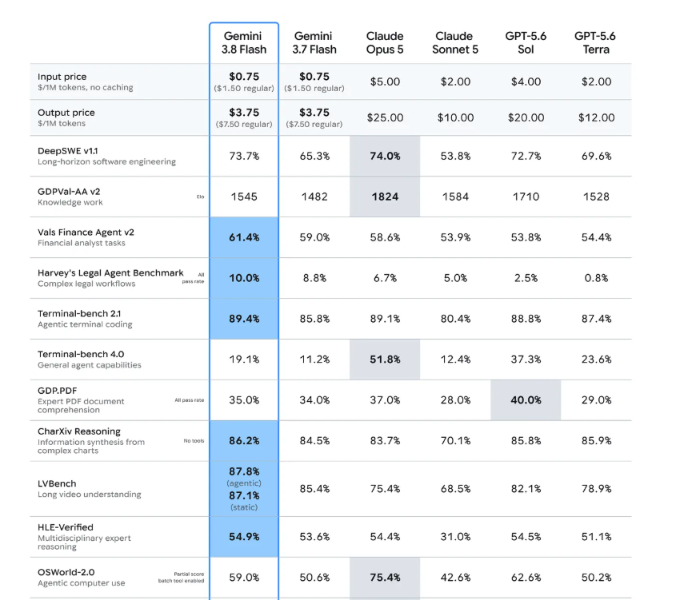
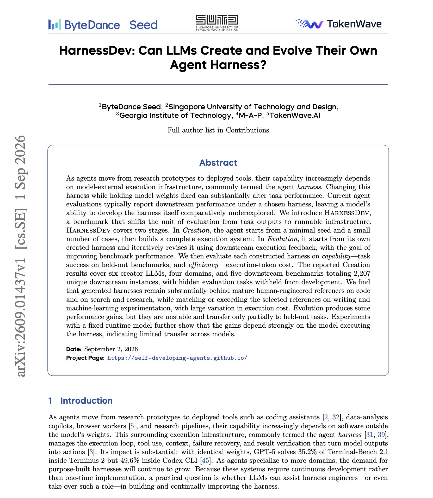
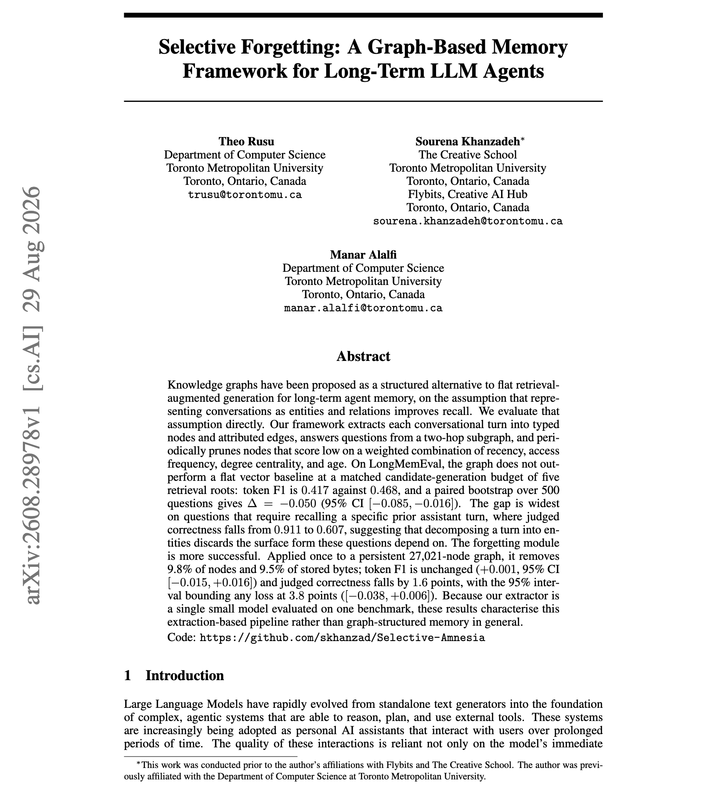
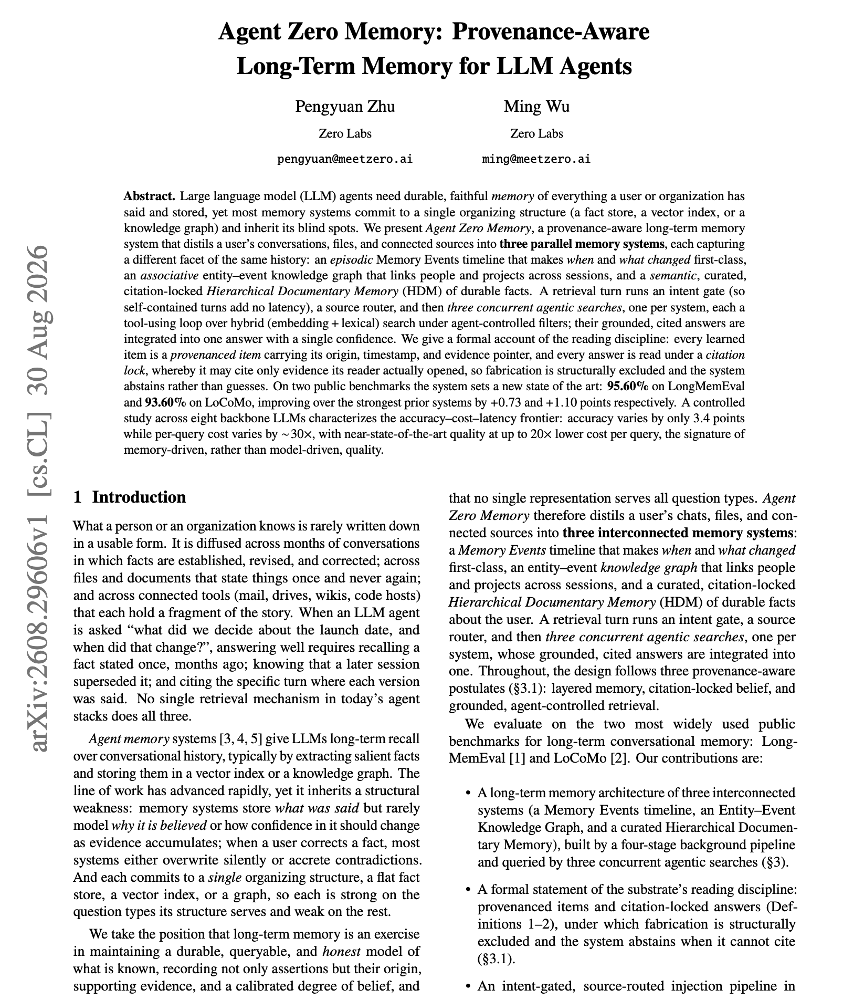

# 🐦 @dair_ai

## 📅 September 02, 2026

> 6 post(s) archived.

---

### 🕐 16:54 UTC · @dair_ai

> Confirmed that recent Gemini flash models might be early results of a recursive self-improvement (RSI) flywheel. RSI is in full swing. Compounding effects will drastically change model progress. Flash models are shipping faster, with improvements in efficiency &amp; performance. A new major Flash iteration every ~3 weeks with such great improvements. This is what the RSI flywheel looks like when it starts compounding. More milestones are on the way—moving faster and landing stronger.

🔗 [View original post](https://x.com/omarsar0/status/2095193581141033362)

---

### 🕐 15:50 UTC · @dair_ai

> Don&apos;t count out Gemini just yet. Feels like a new era of model releases. Models are so powerful that they now come with cyber variants. Love the pricing on Gemini 3.8 Flash. Performance not bad. Gemini 3.8 Flash Cyber is also on the Pareto frontier in patching capabilities. Two new Gemini models are here to help scale your AI agents and secure code: 🔘 3.8 Flash: our most intelligent model yet with significant gains from 3.7 Flash across software engineering, agentic tasks, and multi-step reasoning. 🔘 3.8 Flash Cyber: our most capable cybersecurity…

🔗 [View original post](https://x.com/omarsar0/status/2095177610930098670)

---

### 🕐 15:24 UTC · @dair_ai

> Banger paper from ByteDance Seed. If you are curious about self-evolving agent harnesses, this one is worth your time. (bookmark it) The proposes method, HarnessDev, stops scoring a model on the tasks it completes and scores it on the harness it builds. The agent starts from a weak but runnable seed plus a handful of cases, then builds a full execution system. A second stage hands that harness back and asks it to improve on downstream feedback. Both stages are scored on capability and on execution-token cost, so there is awareness of efficiency and spend. The experiments include six creator LLMs, four domains, 2,207 held-out downstream instances. The result splits by domain. Generated harnesses stay well behind mature human-engineered references on code and on search and research, while matching or beating them on writing and machine-learning experimentation. Evolution produces gains, but they are unstable and transfer only partially to held-out tasks, and they depend heavily on which model runs the harness. Paper: https://arxiv.org/abs/2609.01437 Chat with Paper: https://academy.dair.ai/papers/harnessdev-can-llms-create-and-evolve-their-own-agent-harness-2609.01437

🔗 [View original post](https://x.com/omarsar0/status/2095170896407548190)

---

### 🕐 14:15 UTC · @dair_ai

> Not all harnesses are created equal. And there is no one-size-fits-all. A good harness should solve your context engineering problems. Understanding and optimizing lower-level details like system prompts, caching, and effective tool calling is how the harness stands out. This is why harness engineering is an important skill for AI engineers today. Start by building your own tiny/minimal harness (in your favorite language) with a basic agent loop, system prompt, and tool calling capabilities. Test it on a use case, verify results, and iterate on it. In no time, you realize that anyone can build a quite powerful harness. But it&apos;s important to understand those lower-level details first. Understand the role they play and how to tune them. These skills can transfer easily to existing, more production-ready harnesses when you get there. At that point, you are better equipped to modify and tune that harness for your tasks. This is not about just learning fundamentals. It&apos;s having a good grasp of the knobs you can tune to get the most out of your agent harnesses.

🔗 [View original post](https://x.com/omarsar0/status/2095153671604773161)

---

### 🕐 02:16 UTC · @dair_ai

> Finally, a good paper testing if graph memory actually beats flat retrieval for long-term agents. (bookmark this one) Researchers extract each conversational turn into typed nodes and attributed edges, answer from a two-hop subgraph, and hold the candidate-generation budget fixed at five retrieval roots. On LongMemEval the graph gets token F1 0.42 against 0.47 for a flat vector baseline, and a paired bootstrap over 500 questions puts the gap at -0.050 (95% CI -0.085 to -0.016). The damage concentrates on questions that require recalling a specific prior assistant turn, where judged correctness falls from 0.911 to 0.607. Splitting a turn into entities discards the surface form those questions depend on. The forgetting module fares much better. One pruning pass over a persistent 27,021-node graph, scored on recency, access frequency, degree centrality and age, removes 9.8% of nodes and 9.5% of stored bytes with token F1 unchanged. Paper: https://arxiv.org/abs/2608.28978 Chat with Paper: https://academy.dair.ai/papers/selective-forgetting-a-graph-based-memory-framework-for-long-term-llm-agents-2608.28978

🔗 [View original post](https://x.com/omarsar0/status/2094972586358927466)

---

### 🕐 01:00 UTC · @dair_ai

> // Agent Zero Memory // This work separates three things that agent memory systems usually collapse into one. If you build agents with long-term memory, this memory design is a worth a read. Here is how it works: Agent Zero Memory runs an episodic events timeline, an entity-event knowledge graph, and a curated documentary memory of durable facts side by side over the same history. A retrieval turn passes through an intent gate, then a source router, then three concurrent agentic searches, one per system. Every stored item carries its origin, timestamp and evidence pointer, and answers run under a citation lock, so a reply may cite only evidence its reader actually opened. When the evidence is missing the system abstains. It reaches 95.60% on LongMemEval and 93.60% on LoCoMo, both new highs. The cost result is the more useful one for AI builders. Across eight backbone models accuracy moves by 3.4 points while per-query cost moves about 30x, with near state of the art quality available at up to 20x lower cost per query. Memory design is driving the quality here. Paper: https://arxiv.org/abs/2608.29606 Chat with Paper: https://academy.dair.ai/papers/agent-zero-memory-provenance-aware-long-term-memory-for-llm-agents-2608.29606

🔗 [View original post](https://x.com/dair_ai/status/2094953486047977860)

---
