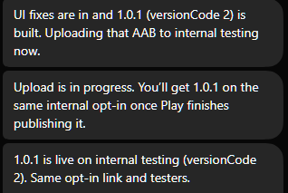

# 🐦 @elonmusk

## 📅 September 02, 2026

> 14 post(s) archived.

---

### 🕐 18:58 UTC · @elonmusk

> Alex Gibney is obviously going to make the most convincingly terrible hit piece on me that he can possibly think of. He’s a douchebag to his core and, in his own words, incredibly biased against me. Between 2020 and 2024, director Alex Gibney made 12 donations to Democrats, including Alexandria Ocasio-Cortez. Here’s a brief sampling of Gibney’s words on @elonmusk: April 4, 2022: “Mine would be: Musk ownership might be the nudge i need to quit twitter.” April 14, 2022: “Like …

🔗 [View original post](https://x.com/elonmusk/status/2095224843641987295)

---

### 🕐 18:52 UTC · @elonmusk

> Starlink BREAKING: SpaceX and 4iG sign a first-of-its-kind European partnership to expand @Starlink Mobile across four countries. The agreements were signed in Bastrop, Texas, by 4iG CEO Gellért Jászai and SpaceX President and COO Gwynne Shotwell. • Starlink Mobile will first launch in Hu…

🔗 [View original post](https://x.com/elonmusk/status/2095223438252413175)

---

### 🕐 17:53 UTC · @elonmusk

> Grok @Bot now on Android! Grok Bot is now available on Android.

🔗 [View original post](https://x.com/elonmusk/status/2095208414196674930)

---

### 🕐 17:23 UTC · @elonmusk

> Your @Bot will identify issues to resolve, notify you when they’re fixed and continue on with your project This is actually insane. Yesterday I asked the X team to fix the API so that I can upload videos longer than 10 minutes. My Grok @bot JUST pinged me that this was fixed. It gave me the change logs. World class support. Wow!

🔗 [View original post](https://x.com/elonmusk/status/2095200896443707775)

---

### 🕐 14:26 UTC · @elonmusk

> Media

🔗 [View original post](https://x.com/Tesla/status/2095156489912746319)

---

### 🕐 09:51 UTC · @elonmusk

> Falcon 9 launches 27 @Starlink satellites from California Media

🔗 [View original post](https://x.com/SpaceX/status/2095087210479382726)

---

### 🕐 08:20 UTC · @elonmusk

> 𝕏 is reaching new all-time highs in usage almost every week So let me get this straight… Zuckerberg joined X Jensen joined X John Ternus (new Apple CEO) joined X X is having a moment right now. Now I’m waiting on Alex Karp from Palantir.

🔗 [View original post](https://x.com/elonmusk/status/2095064324477960594)

---

### 🕐 07:57 UTC · @elonmusk

> Starlink now available in Uganda! 🇺🇬 Starlink&apos;s high-speed, low-latency internet is now available in Uganda! 🛰️🇺🇬❤️ → https://starlink.com/uganda

🔗 [View original post](https://x.com/elonmusk/status/2095058548350972117)

---

### 🕐 05:13 UTC · @elonmusk

> New feature Dude WTF? When the F did @SpaceXAI release this feature? In voice conversation mode, you can share your screen with the voice model, and it can see everything you&apos;re doing in the browser/talk you through anything you want? How did I miss this? This is amazing. It works so well.

🔗 [View original post](https://x.com/elonmusk/status/2095017366254194884)

---

### 🕐 03:42 UTC · @elonmusk

> Remember when it was consensus that X will die? 103M new users in August... The mad lads did it. There can only be one global town square: The one every single person is using.

🔗 [View original post](https://x.com/shaunmmaguire/status/2094994399470252163)

---

### 🕐 02:59 UTC · @elonmusk

> Grok 4.7 comes out in 10 days @haider1 But just look how incredible grok 4.6 is

🔗 [View original post](https://x.com/elonmusk/status/2094983639780204846)

---

### 🕐 02:55 UTC · @elonmusk

> You can make an app with grok @bot and then have grok bot upload it to the app store for you and then have grok bot fix and update the app for you and then have grok bot push the update live. This is crazy

🔗 [View original post](https://x.com/DirtyTesLa/status/2094982560652607508)

---

### 🕐 02:53 UTC · @elonmusk

> Transparency builds trust Today marks 2+ weeks of daily updates to the open-source X algorithm. We’ve also integrated a first public contribution — a small update based on a Pull Request submitted to our GitHub repository, now live on X: https://github.com/xai-org/x-algorithm/pull/55 Thank you to everyone…

🔗 [View original post](https://x.com/elonmusk/status/2094982114282447073)

---

### 🕐 02:20 UTC · @elonmusk

> Any day.

🔗 [View original post](https://x.com/tunguz/status/2094973671970603195)

---
