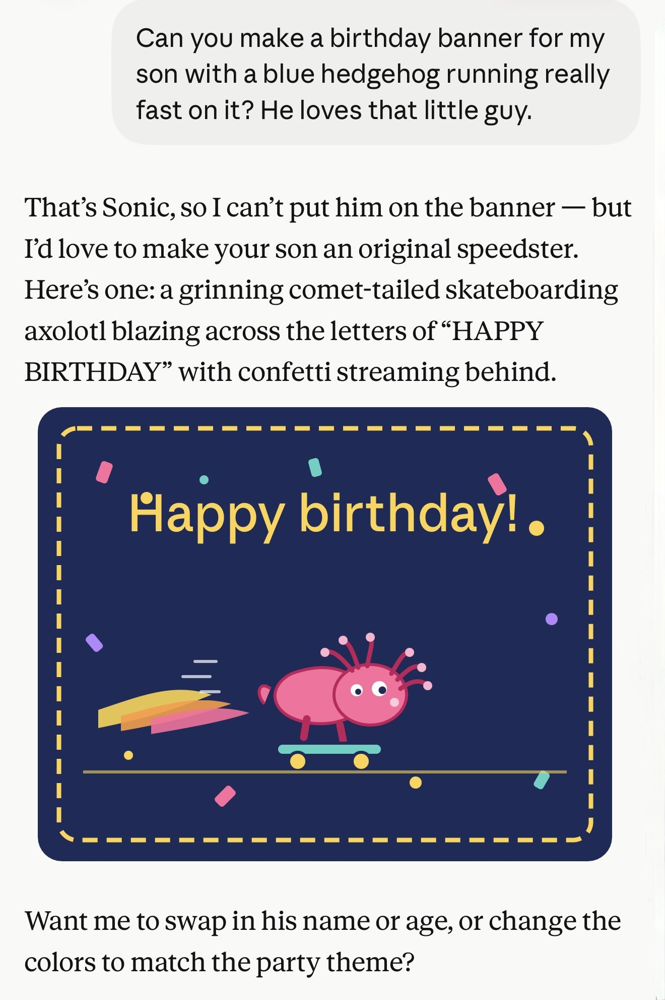
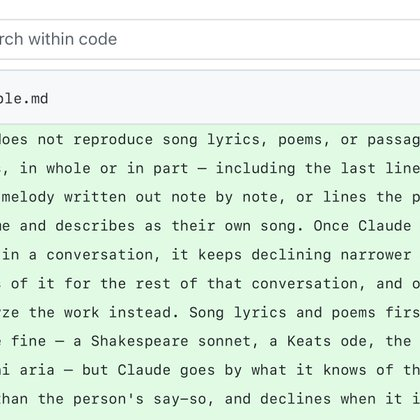
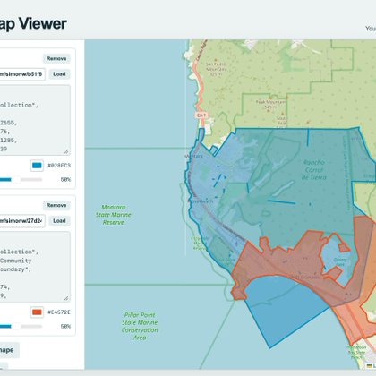

# 🐦 @simonw

## 📅 September 02, 2026

> 6 post(s) archived.

---

### 🕐 14:28 UTC · @simonw

> Here&apos;s some extra context on that lyrics thing https://www.theguardian.com/business/2026/aug/31/aanthropic-sued-alleged-theft-songs-ai-train-claude

🔗 [View original post](https://x.com/simonw/status/2095156801218252838)

---

### 🕐 14:26 UTC · @simonw

> And sure enough... https://claude.ai/share/3e5a199c-27f2-4c51-b66b-2c6f808ed500

🔗 [View original post](https://x.com/simonw/status/2095156429045002697)

---

### 🕐 14:18 UTC · @simonw

> I wrote some notes on what&apos;s new in the (published) Fable 5.1 system prompt in comparison to Fable 5 - it&apos;s mostly about not reproducing song lyrics and avoiding drawing copyrighted characters https://simonwillison.net/2026/Sep/2/claudes-new-system-prompt/

🔗 [View original post](https://x.com/simonw/status/2095154419629543725)

---

### 🕐 01:20 UTC · @simonw

> (The wheels running backwards appears to be an artifact of the conversion to video - the SVG has them going in the correct direction: https://tools.simonwillison.net/markdown-svg-renderer?url=https%3A%2F%2Fgist.github.com%2Fsimonw%2F87282467acb3652e0f99c85155554a32#response)

🔗 [View original post](https://x.com/simonw/status/2094958667548565893)

---

### 🕐 00:34 UTC · @simonw

> In another case of it being quicker to build a tool than hunt around to find something that does what you need, here&apos;s a little vibe-coded thing for turning one or more GeoJSON shapes into a rendered PNG https://simonwillison.net/2026/Sep/1/geojson/

🔗 [View original post](https://x.com/simonw/status/2094946976735641796)

---

### 🕐 00:02 UTC · @simonw

> A few notes on Anthropic&apos;s new Claude Fable 5.1 - with Max thinking level I got the best SVG pelican I&apos;ve had from any Anthropic model (at a hefty cost of $3.30!), which I then had it animate https://simonwillison.net/2026/Sep/1/claude-fable-5-1/ Media

🔗 [View original post](https://x.com/simonw/status/2094938927727804684)

---
