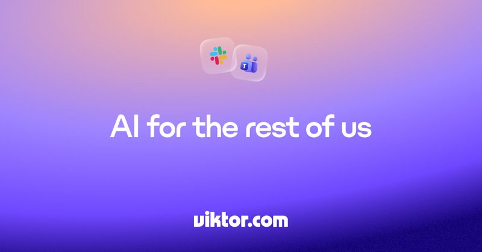

# 🐦 @AiEvolutio58513

## 📅 September 03, 2026

> 4 post(s) archived.

---

### 🕐 16:20 UTC · @AiEvolutio58513

> Try Viktor for free. $100 in credits, no card. https://ref.viktor.com/aievolution-x

🔗 [View original post](https://x.com/AiEvolutio58513/status/2095547409120276958)

---

### 🕐 16:03 UTC · @AiEvolutio58513

> Interested in AI? Follow @AiEvolutio58513 and never fall behind. I track ChatGPT, Claude, and every tool quietly changing how we work and create, then hand you the tested signals.

🔗 [View original post](https://x.com/AiEvolutio58513/status/2095543267639377975)

---

### 🕐 16:03 UTC · @AiEvolutio58513

> TLDR, Andreessen&apos;s 6 principles: 1) Do not introspect, just move forward 2) Compete with yourself, not for external impact 3) Believe the world is more malleable than you think 4) Start with a founder, train them on management 5) Attack the assumptions nobody questions 6) Play a different playbook, not a better one The world recalibrates around people who push. Most never push.

🔗 [View original post](https://x.com/AiEvolutio58513/status/2095543255874306502)

---

### 🕐 14:02 UTC · @AiEvolutio58513

> Today we’re turning your Claude subscription into a full AI app builder. Connect Claude, ChatGPT or Cursor to Zite MCP and ask for an app. It goes live with its own database, logins for your whole team, roles for who sees what. Zero Zite credits. Media

🔗 [View original post](https://x.com/domwhyte42/status/2095512675996639300)

---
