# 🐦 @Unlockyourlife_

## 📅 September 03, 2026

> 46 post(s) archived.

---

### 🕐 17:02 UTC · @Unlockyourlife_

> Cardio builds endurance. Weights build strength. Both build a better you. 💪🔥

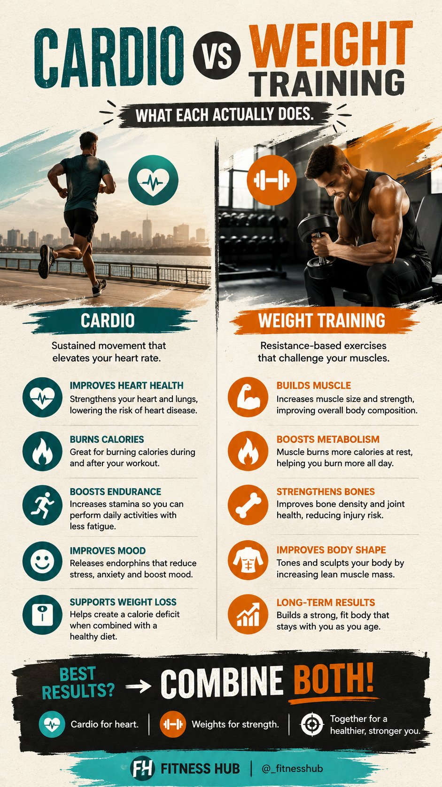

🔗 [View original post](https://x.com/_fitnesshub/status/2095558108592382052)

---

### 🕐 16:06 UTC · @Unlockyourlife_

> Speed isn&apos;t genetic. It&apos;s trainable. 5 drills to build explosive power. 1. Box Jumps

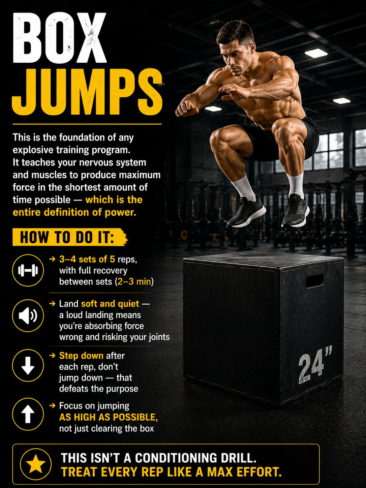

🔗 [View original post](https://x.com/_alphafit/status/2095544031317017071)

---

### 🕐 16:06 UTC · @Unlockyourlife_

> Building an off-Grid Eco Yurt in 60 seconds! Media

🔗 [View original post](https://x.com/Smart_Tipsx/status/2095544023389732868)

---

### 🕐 15:55 UTC · @Unlockyourlife_

> Sugar high? Here&apos;s the 5-step reset your body actually uses. 1. Move Your Body

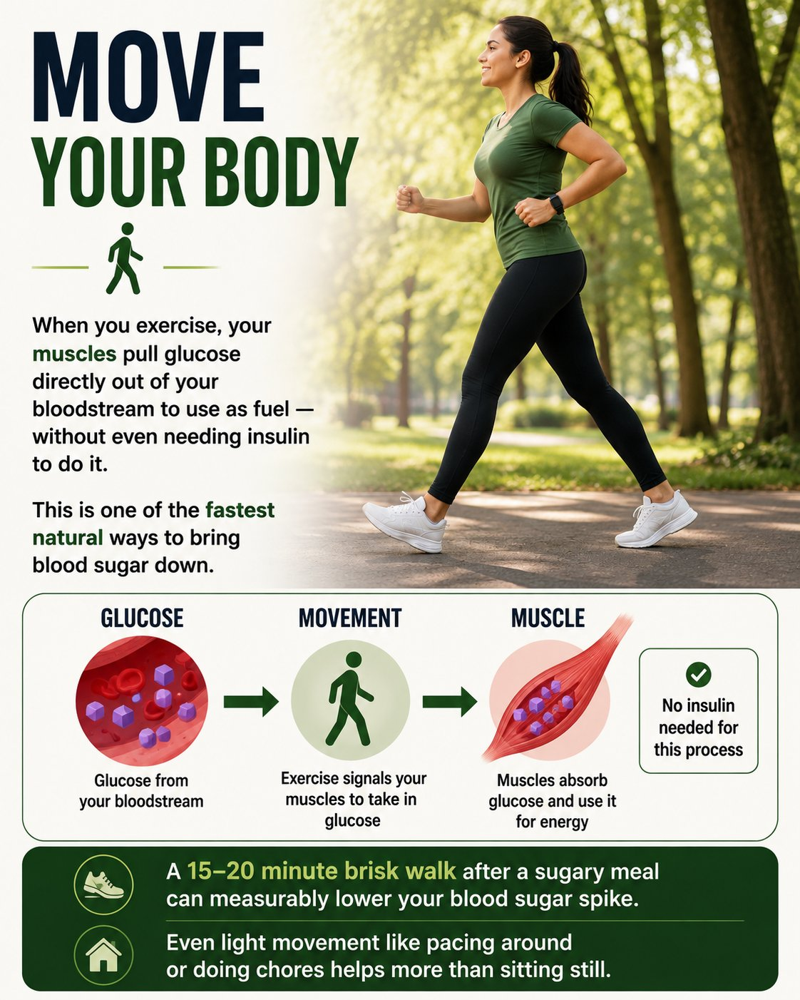

🔗 [View original post](https://x.com/BioLifex/status/2095541076299862190)

---

### 🕐 14:32 UTC · @Unlockyourlife_

> Genius Science Tricks That Look Exactly Like Magic! 🪄🧪 Media

🔗 [View original post](https://x.com/sciencepathx/status/2095520371491373223)

---

### 🕐 14:14 UTC · @Unlockyourlife_

> Your body was built to move. You don&apos;t need to avoid sitting completely—but if you&apos;ve been sitting for 10 hours a day, giving your body more opportunities to stand, walk, stretch, and move can make a real difference. Don&apos;t just exercise for one hour and sit for the other 10. Find ways to move throughout the whole day. 🚶‍♂️

🔗 [View original post](https://x.com/_fitnesshub/status/2095515716426301492)

---

### 🕐 14:14 UTC · @Unlockyourlife_

> 5. LONG PERIODS OF SITTING ARE LINKED TO HEALTH RISKS Regularly spending a lot of time sedentary is associated with higher risks of problems such as cardiovascular disease, type 2 diabetes, and premature death. And here&apos;s the important part: You don&apos;t have to become a gym addict to change this. Stand up. Walk around. Take the stairs. Stretch between tasks.

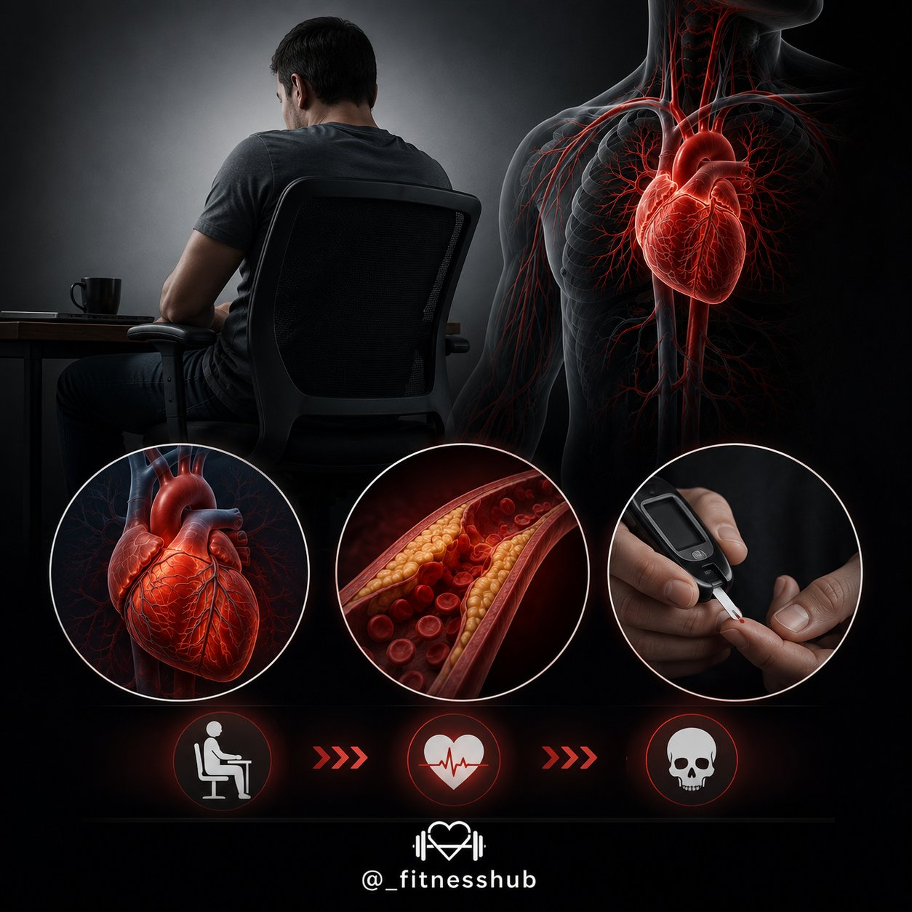

🔗 [View original post](https://x.com/_fitnesshub/status/2095515710197731786)

---

### 🕐 14:14 UTC · @Unlockyourlife_

> 4. YOUR BODY BURNS LESS ENERGY Sitting uses much less energy than standing, walking, or doing physical activities. If you&apos;re sitting for most of the day, your total daily movement can become surprisingly low—even if you exercise for a short period.

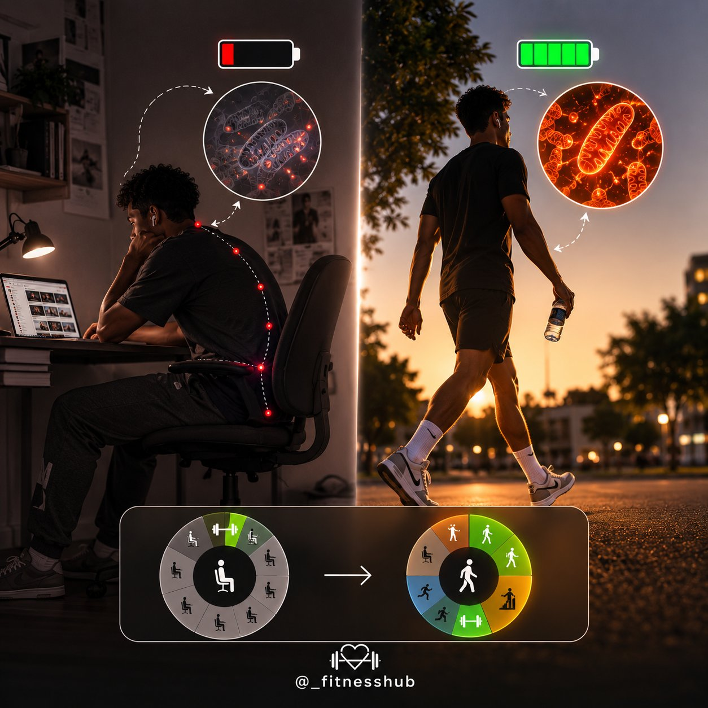

🔗 [View original post](https://x.com/_fitnesshub/status/2095515700479533096)

---

### 🕐 14:14 UTC · @Unlockyourlife_

> 3. YOUR HIPS AND BACK CAN START FEELING STIFF Staying in the same position for hours can leave your hips, lower back, neck, and shoulders feeling tight or uncomfortable. Especially if your posture and workstation aren&apos;t great.

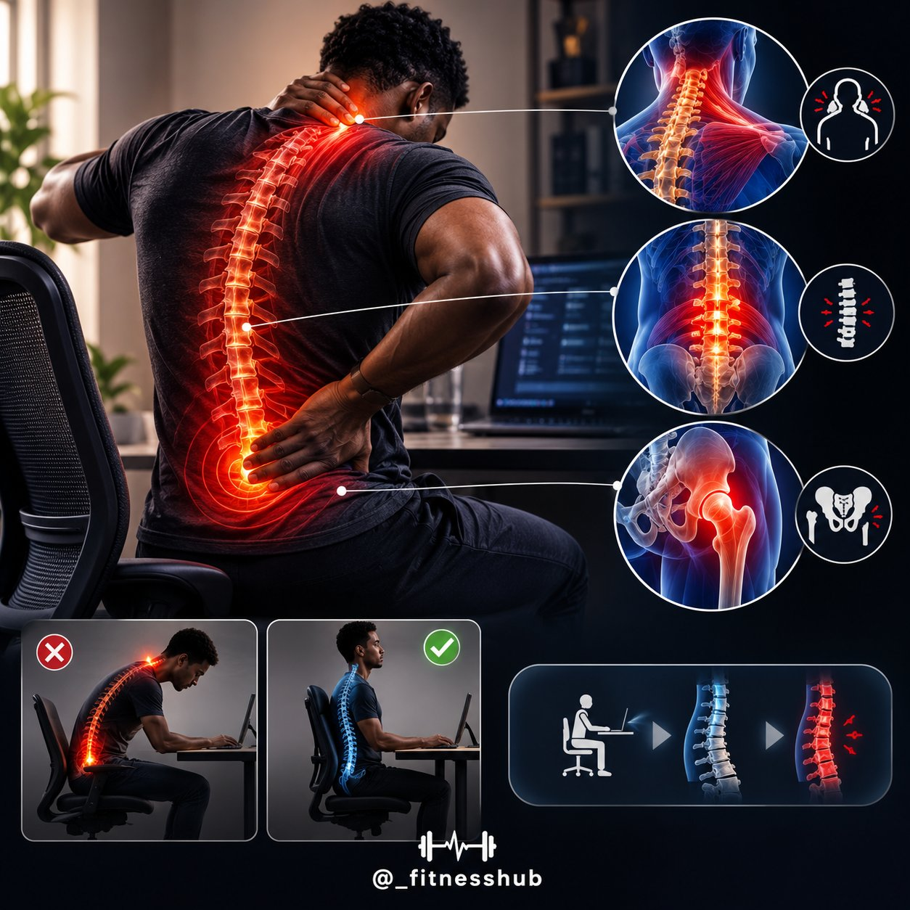

🔗 [View original post](https://x.com/_fitnesshub/status/2095515693714121034)

---

### 🕐 14:14 UTC · @Unlockyourlife_

> 2. YOUR BLOOD CIRCULATION SLOWS DOWN 🩸 Your leg muscles normally help push blood back toward your heart as you move around. When you stay seated for hours, that muscle activity drops, which can contribute to blood pooling and swollen or heavy-feeling legs.

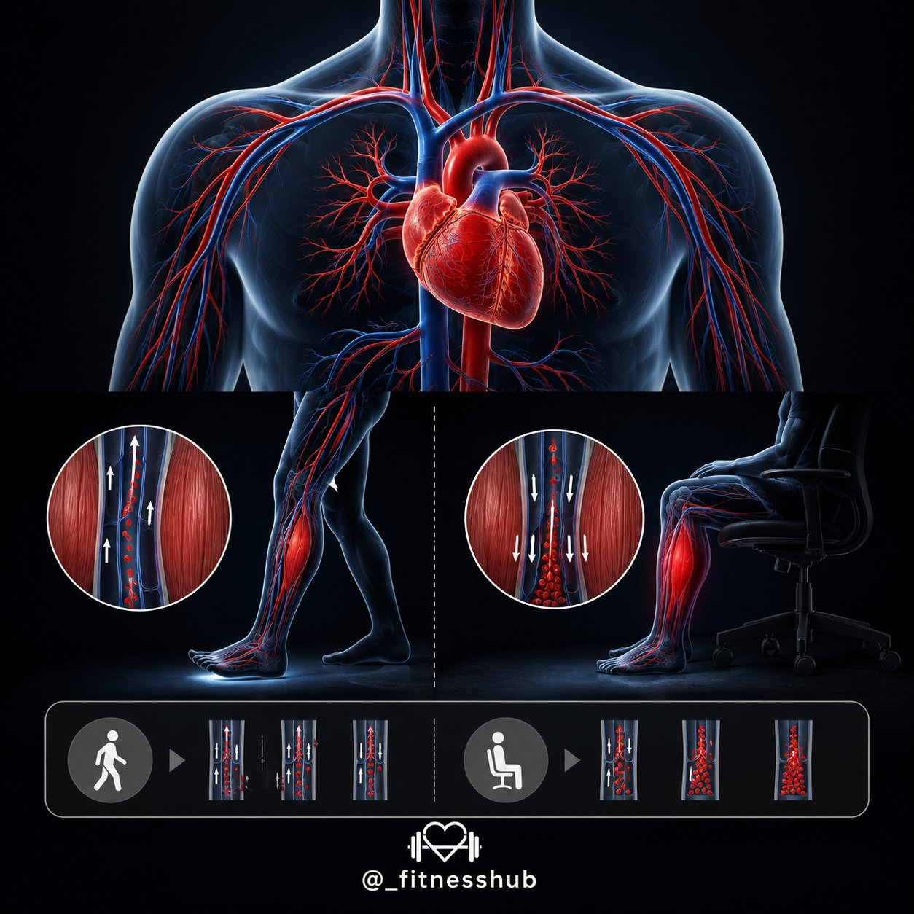

🔗 [View original post](https://x.com/_fitnesshub/status/2095515686067970132)

---

### 🕐 14:14 UTC · @Unlockyourlife_

> 1. YOUR MUSCLES BECOME LESS ACTIVE When you&apos;re sitting, your large leg and hip muscles aren&apos;t doing much work. Spending long periods inactive means you&apos;re using less energy and giving those muscles less reason to stay strong.

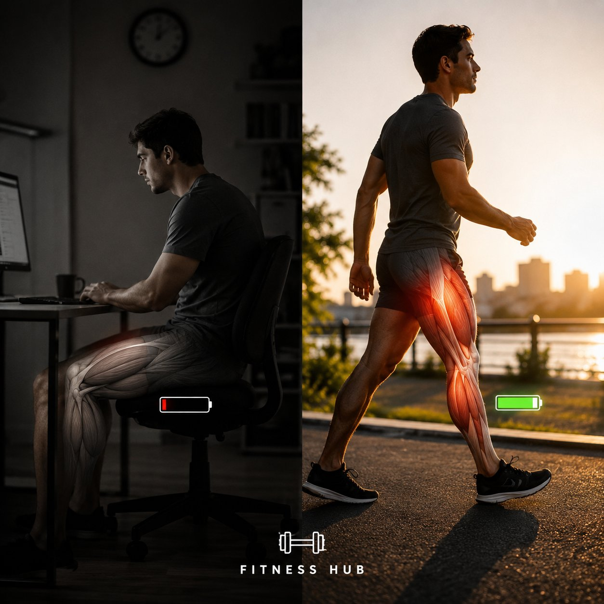

🔗 [View original post](https://x.com/_fitnesshub/status/2095515679537467460)

---

### 🕐 14:14 UTC · @Unlockyourlife_

> WHAT HAPPENS IF YOU SIT FOR 10 HOURS EVERY DAY? 🪑 You sit at work. Then you sit in traffic. Then you sit to eat, scroll, watch TV, or use your phone. Before you know it, you&apos;ve spent most of the day sitting. But what does that actually do to your body?

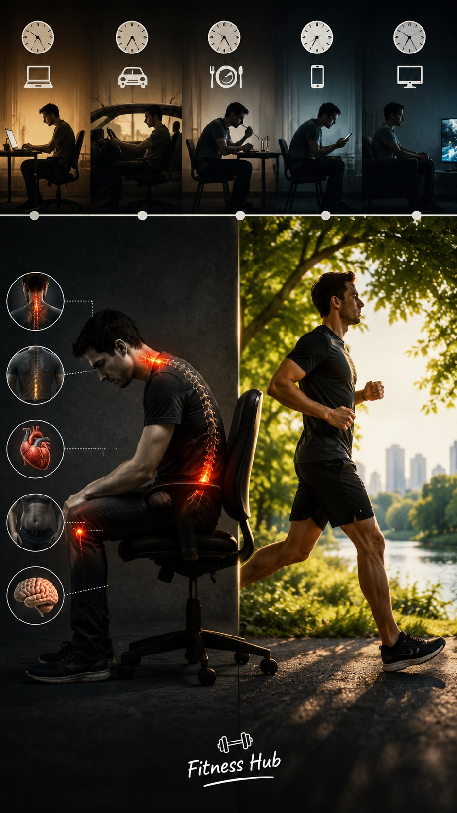

🔗 [View original post](https://x.com/_fitnesshub/status/2095515672524607890)

---

### 🕐 14:03 UTC · @Unlockyourlife_

> No gym? No problem. Here&apos;s a full-body fat-burning circuit you can do ANYWHERE, home, hotel room, park, office floor. Zero equipment. 15 minutes. Let&apos;s go 1. 5-Moves, Hit Circuit.

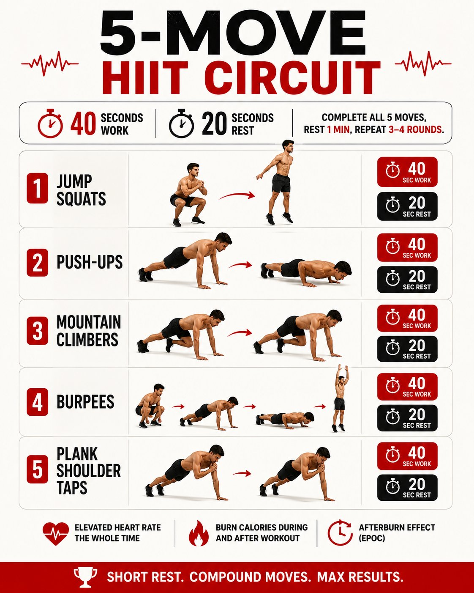

🔗 [View original post](https://x.com/_alphafit/status/2095513096370495886)

---

### 🕐 14:00 UTC · @Unlockyourlife_

> Anti-theft tips every driver should know! Media

🔗 [View original post](https://x.com/Smart_Tipsx/status/2095512247187452325)

---

### 🕐 13:57 UTC · @Unlockyourlife_

> Drywall Repair Wood Backing, Paper Tape! Media

🔗 [View original post](https://x.com/samx_reels/status/2095511395882205556)

---

### 🕐 13:51 UTC · @Unlockyourlife_

> Free Electricity Trick Exposed! Media

🔗 [View original post](https://x.com/_Brainboxx/status/2095510015444422669)

---

### 🕐 13:03 UTC · @Unlockyourlife_

> 6. Putting It Together — Your Energy Audit.

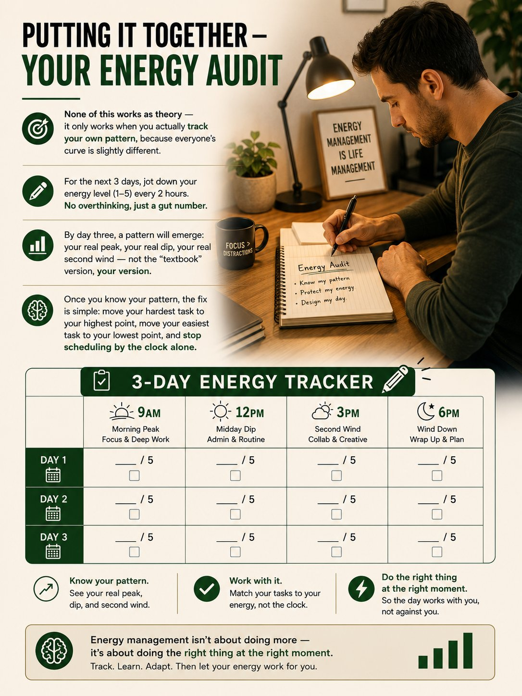

🔗 [View original post](https://x.com/BioLifex/status/2095497989322047729)

---

### 🕐 13:03 UTC · @Unlockyourlife_

> 5. The Weekly Layer — Energy Isn&apos;t Just Daily, It&apos;s Weekly Too.

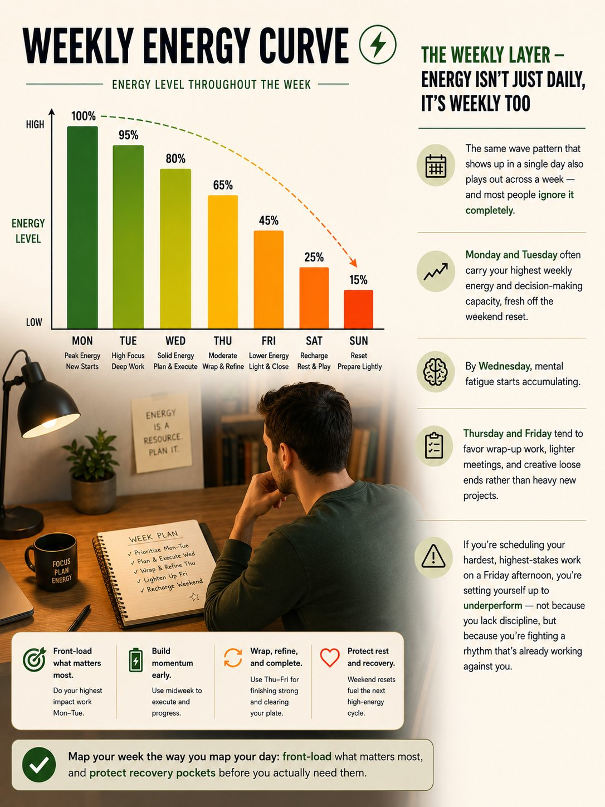

🔗 [View original post](https://x.com/BioLifex/status/2095497984184127846)

---

### 🕐 13:03 UTC · @Unlockyourlife_

> 4. Evening — Deliberate Recovery

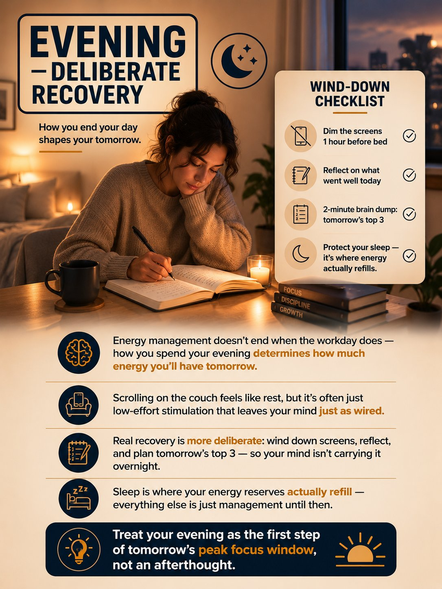

🔗 [View original post](https://x.com/BioLifex/status/2095497978546995394)

---

### 🕐 13:03 UTC · @Unlockyourlife_

> 3. Afternoon (3–6pm) — The Second Wind.

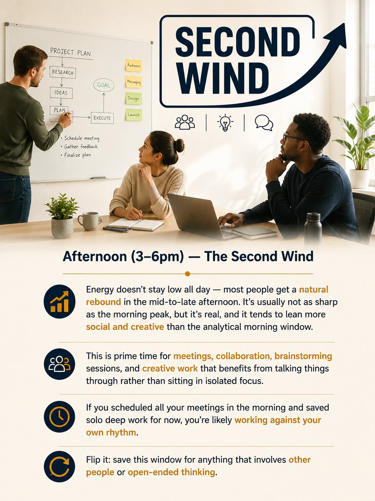

🔗 [View original post](https://x.com/BioLifex/status/2095497973824205302)

---

### 🕐 13:03 UTC · @Unlockyourlife_

> 2. Midday (11am–2pm) — The Energy Dip

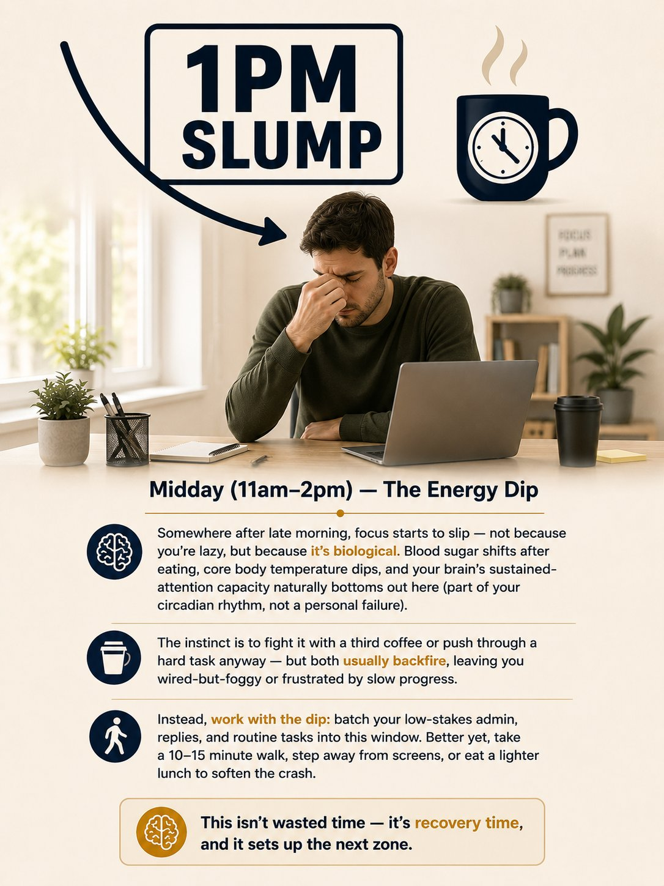

🔗 [View original post](https://x.com/BioLifex/status/2095497969717907838)

---

### 🕐 13:03 UTC · @Unlockyourlife_

> Most people manage their time. Almost no one manages their energy. Your energy isn&apos;t constant, it moves in a wave all day. Here are 6 ways to work with it (not against it) 1. Morning (6–10am) — Peak Focus Zone.

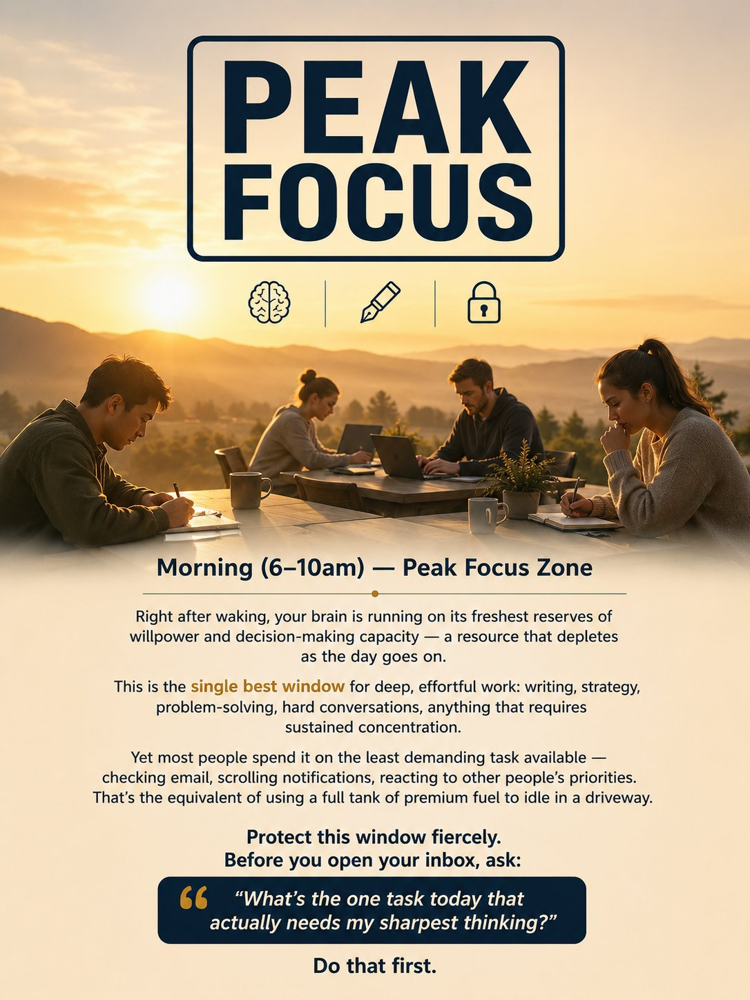

🔗 [View original post](https://x.com/BioLifex/status/2095497965263528264)

---

### 🕐 12:14 UTC · @Unlockyourlife_

> Most skin tags are harmless and don&apos;t need treatment unless they become bothersome. If you notice a growth changing, bleeding, becoming painful, or you&apos;re unsure whether it&apos;s a skin tag, have it checked by a healthcare professional. Don&apos;t panic-and don&apos;t remove it yourself.

🔗 [View original post](https://x.com/FitnessDr_/status/2095485674996600853)

---

### 🕐 12:04 UTC · @Unlockyourlife_

> 5. Back skin tags

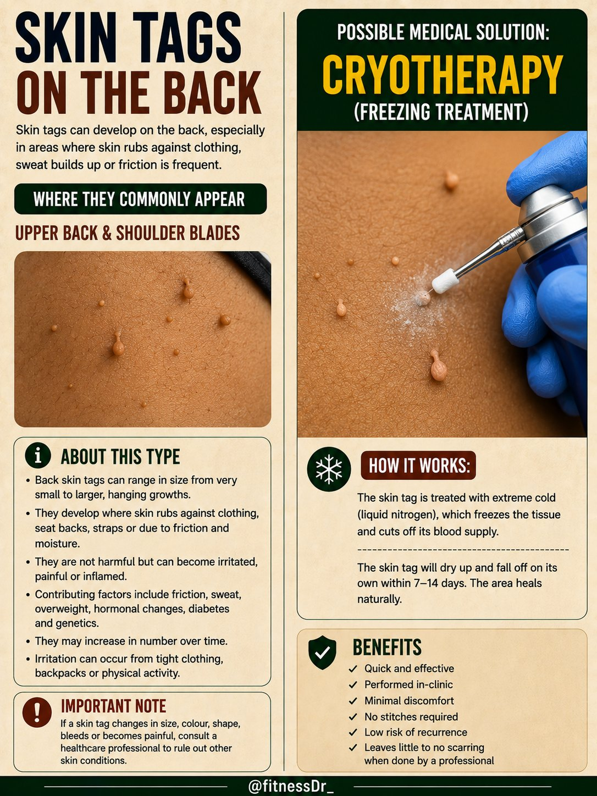

🔗 [View original post](https://x.com/FitnessDr_/status/2095483077032120471)

---

### 🕐 12:04 UTC · @Unlockyourlife_

> 4. Groin skin tags

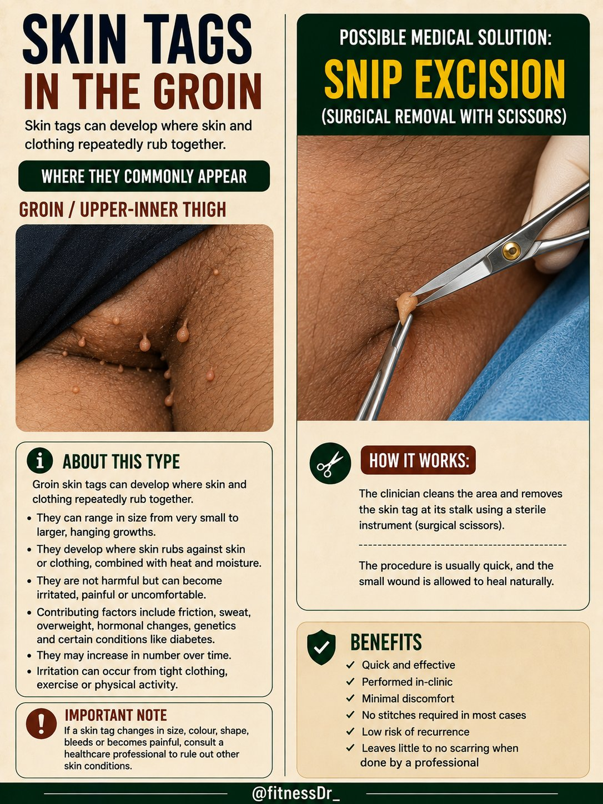

🔗 [View original post](https://x.com/FitnessDr_/status/2095483067615858761)

---

### 🕐 12:04 UTC · @Unlockyourlife_

> 3. Under the breast skin tags

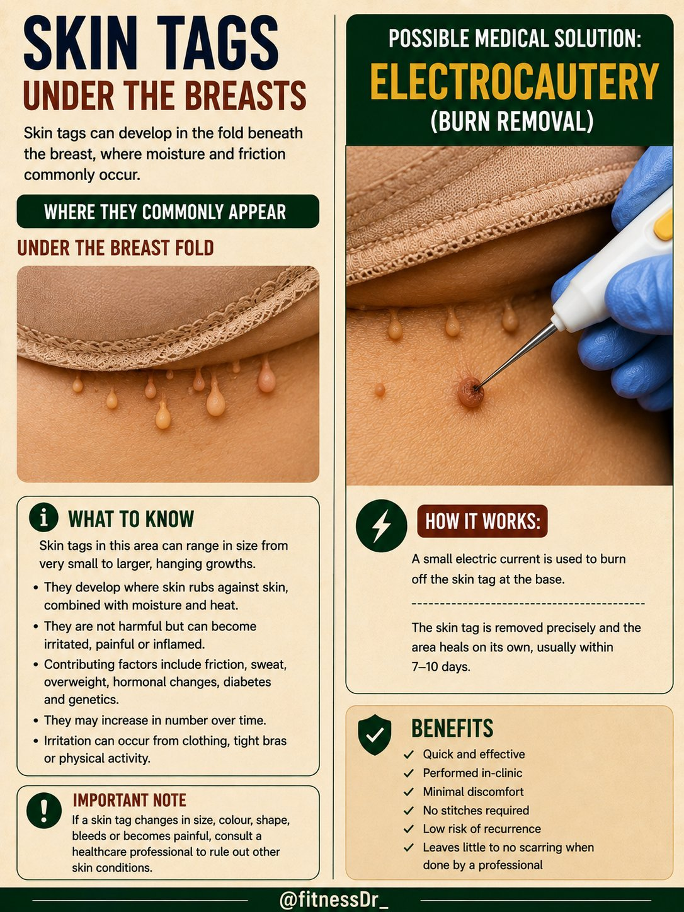

🔗 [View original post](https://x.com/FitnessDr_/status/2095483059244011790)

---

### 🕐 12:04 UTC · @Unlockyourlife_

> 2. Eyelid skin tags

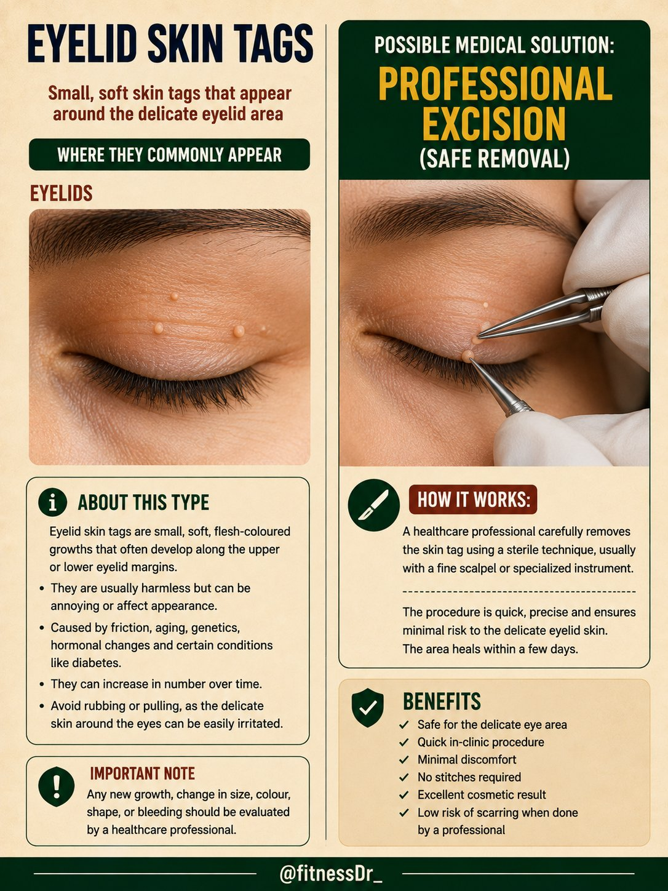

🔗 [View original post](https://x.com/FitnessDr_/status/2095483050238881934)

---

### 🕐 12:04 UTC · @Unlockyourlife_

> 5 Skin tags and their possible medical solutions. 1. Neck/underarm skin tags

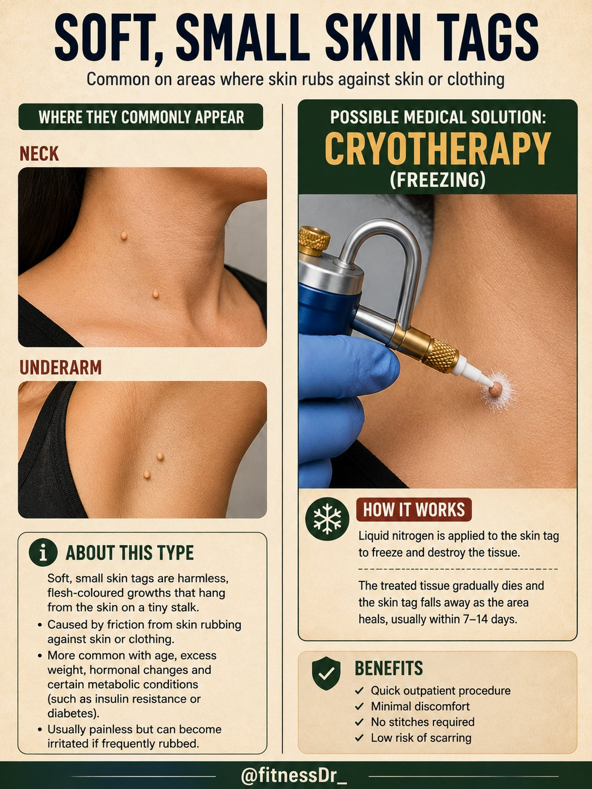

🔗 [View original post](https://x.com/FitnessDr_/status/2095483041829261444)

---

### 🕐 11:15 UTC · @Unlockyourlife_

> Building a Tree-Mounted Garden Light From Scratch! Media

🔗 [View original post](https://x.com/Smart_Tipsx/status/2095470640845259037)

---

### 🕐 11:08 UTC · @Unlockyourlife_

> Food combinations

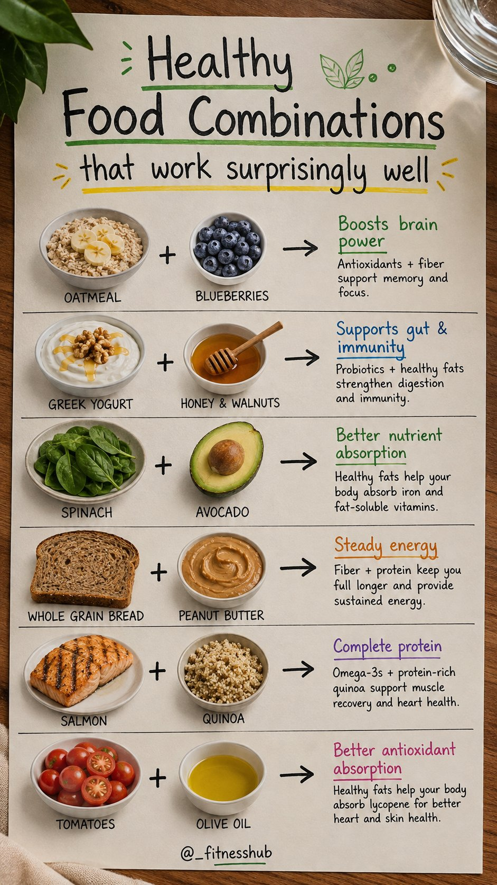

🔗 [View original post](https://x.com/_fitnesshub/status/2095469013945962540)

---

### 🕐 10:03 UTC · @Unlockyourlife_

> Scariest Sounds from Space 😳🫣 Media

🔗 [View original post](https://x.com/sciencepathx/status/2095452558349226307)

---

### 🕐 09:51 UTC · @Unlockyourlife_

> Genius Secret Storages you don&apos;t know! Media

🔗 [View original post](https://x.com/samx_reels/status/2095449544091648490)

---

### 🕐 09:37 UTC · @Unlockyourlife_

> DIY Phone Holder for Charging! Media

🔗 [View original post](https://x.com/_Brainboxx/status/2095446086231970072)

---

### 🕐 08:47 UTC · @Unlockyourlife_

> 6 Habits that will make your PC last longer

🔗 [View original post](https://x.com/_learnskills/status/2095433489206083980)

---

### 🕐 08:42 UTC · @Unlockyourlife_

> Before you tell yourself, &quot;I need to earn more,&quot; check where your money is going. • Food you don&apos;t need • Subscriptions you forgot about • Impulse purchases • Spending to impress people Sometimes you don&apos;t need more money yet. You need fewer leaks.

🔗 [View original post](https://x.com/Masculinjournal/status/2095432142264115522)

---

### 🕐 08:08 UTC · @Unlockyourlife_

> 8 ways to coat froed chicken.

🔗 [View original post](https://x.com/Elitedelicacy/status/2095423724270825547)

---

### 🕐 08:06 UTC · @Unlockyourlife_

> SUPPLEMENTS ARE OPTIONAL. They can be useful in certain situations, especially when convenience or a specific nutritional need is involved, but they aren’t magic muscle builders. The foundation is still simple: TRAIN HARD. EAT WELL. GET ENOUGH PROTEIN. RECOVER. STAY CONSISTENT.

🔗 [View original post](https://x.com/_fitnesshub/status/2095423067606409491)

---

### 🕐 08:06 UTC · @Unlockyourlife_

> 5. BE CONSISTENT 🔥 This is probably the most underrated part. You don’t need a perfect workout routine or an expensive supplement stack. You need to train consistently, eat well, recover properly and keep progressing over time. Muscle takes time to build.

🔗 [View original post](https://x.com/_fitnesshub/status/2095423063173083560)

---

### 🕐 08:06 UTC · @Unlockyourlife_

> 4. GET ENOUGH SLEEP 😴 Muscle growth doesn’t happen only while you’re working out. Training creates the stimulus, but your body needs recovery time to repair and adapt. Getting enough quality sleep supports muscle recovery, physical performance and the processes involved in tissue repair.

🔗 [View original post](https://x.com/_fitnesshub/status/2095423058077012076)

---

### 🕐 08:06 UTC · @Unlockyourlife_

> 3. EAT ENOUGH FOOD 🍚 Building muscle requires more than protein. Your body also needs enough overall energy and nutrients to support training and recovery. Foods like rice, potatoes, oats, yam, plantain, fruits, vegetables, beans and healthy fats can provide the fuel your body needs. If you consistently under-eat, making significant muscle gains can become much harder.

🔗 [View original post](https://x.com/_fitnesshub/status/2095423052448231686)

---

### 🕐 08:06 UTC · @Unlockyourlife_

> 2. PROGRESSIVELY CHALLENGE YOUR MUSCLES 🏋️ Your muscles need a reason to adapt. Over time, gradually increase the weight, repetitions, sets or difficulty of your exercises while maintaining good form. You don’t need the fanciest equipment either. Push-ups, squats, pull-ups, dips and other resistance exercises can build muscle when you progressively make them more challenging.

🔗 [View original post](https://x.com/_fitnesshub/status/2095423047452754158)

---

### 🕐 08:05 UTC · @Unlockyourlife_

> 1. EAT ENOUGH PROTEIN 🍗🥚 Your muscles need protein to repair and grow after training. You can get plenty from regular foods like eggs, chicken, fish, beef, milk, beans, Greek yogurt and other protein-rich foods. The key isn’t having a fancy supplement — it’s consistently getting enough protein from your overall diet.

🔗 [View original post](https://x.com/_fitnesshub/status/2095423042331529233)

---

### 🕐 08:05 UTC · @Unlockyourlife_

> YOU DON’T NEED SUPPLEMENTS TO BUILD MUSCLE 💪 You’ve probably seen fitness influencers recommend protein powders, creatine, mass gainers and other supplements for muscle growth. But the truth is, supplements aren’t required to build muscle. Here are 5 natural ways to build muscle:

🔗 [View original post](https://x.com/_fitnesshub/status/2095423037260587259)

---

### 🕐 07:35 UTC · @Unlockyourlife_

> Aging without training vs Aging with training

🔗 [View original post](https://x.com/_alphafit/status/2095415494446571978)

---

### 🕐 07:34 UTC · @Unlockyourlife_

> Know the difference

🔗 [View original post](https://x.com/BioLifex/status/2095415195862536426)

---

### 🕐 07:18 UTC · @Unlockyourlife_

> How To Connect 3 PVC Pipe Smooth and easy! Media

🔗 [View original post](https://x.com/Smart_Tipsx/status/2095411175374610781)

---
