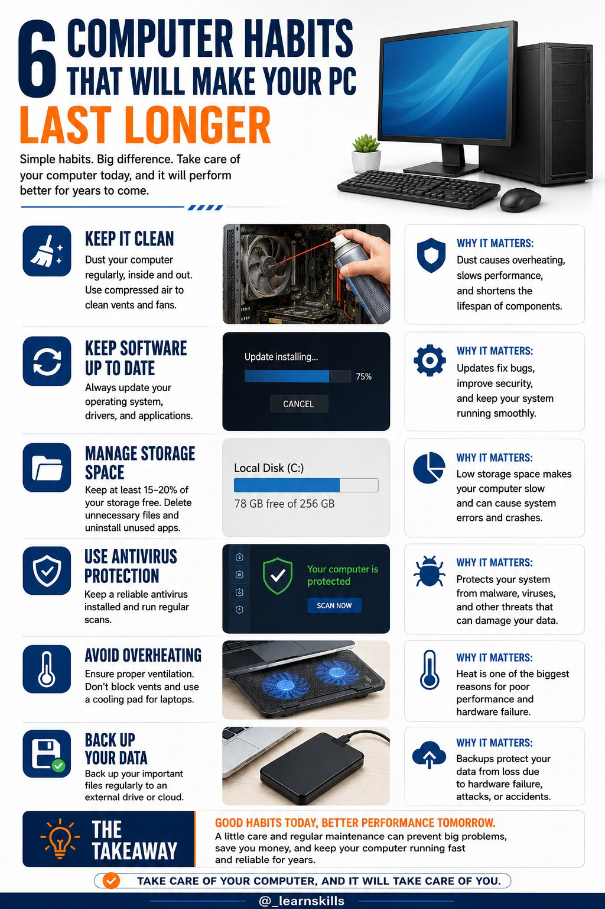
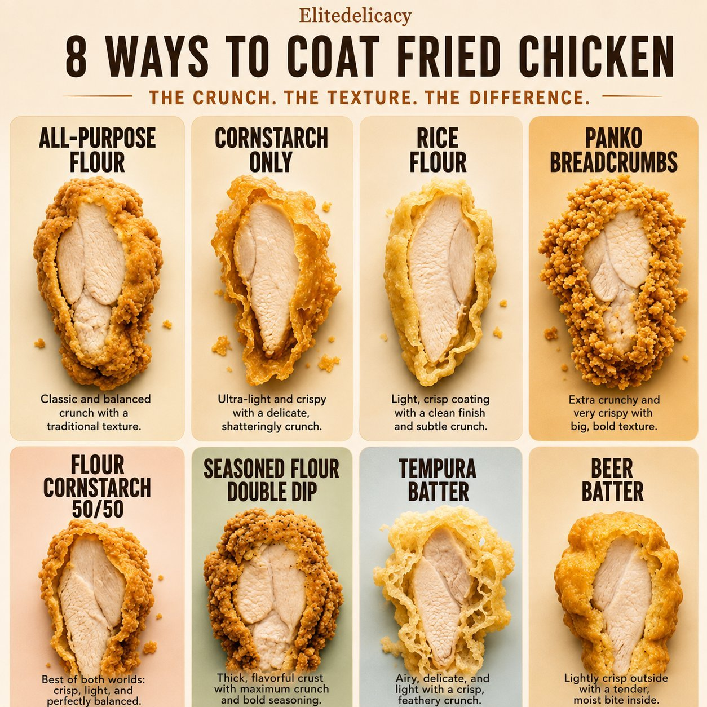
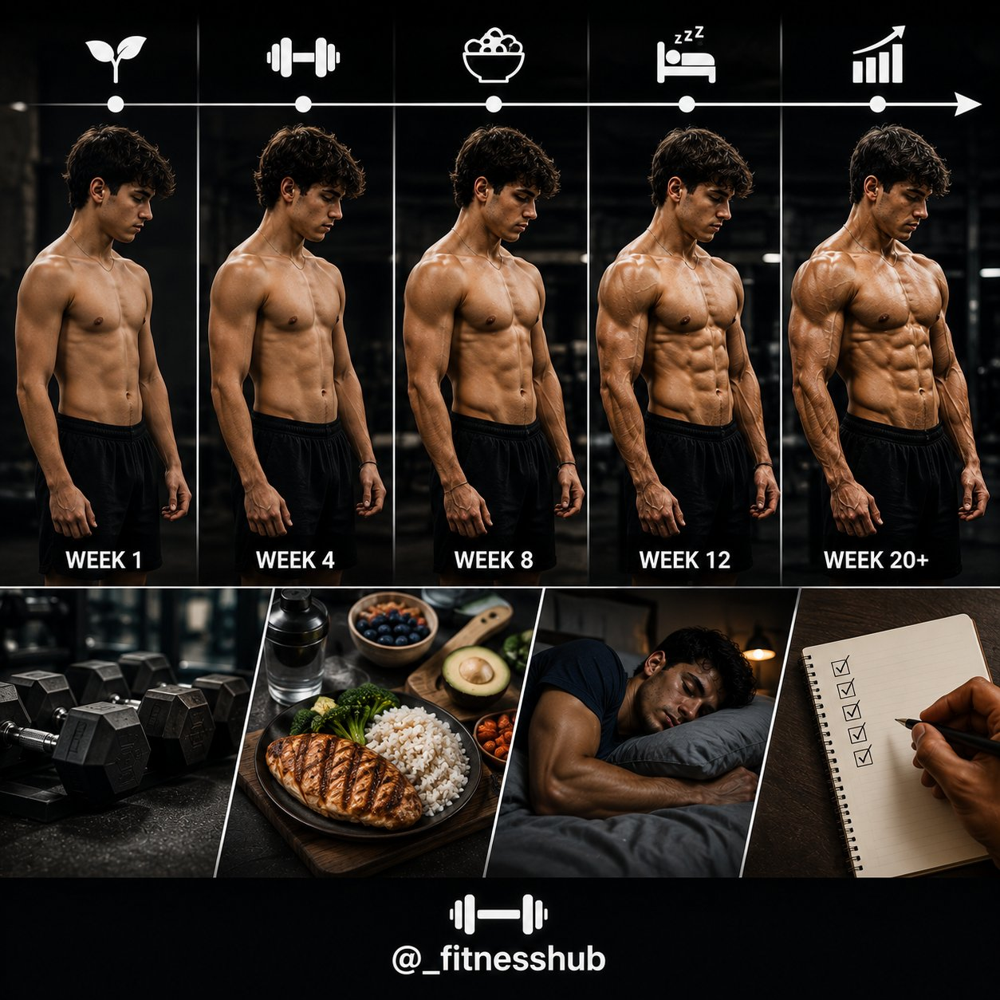
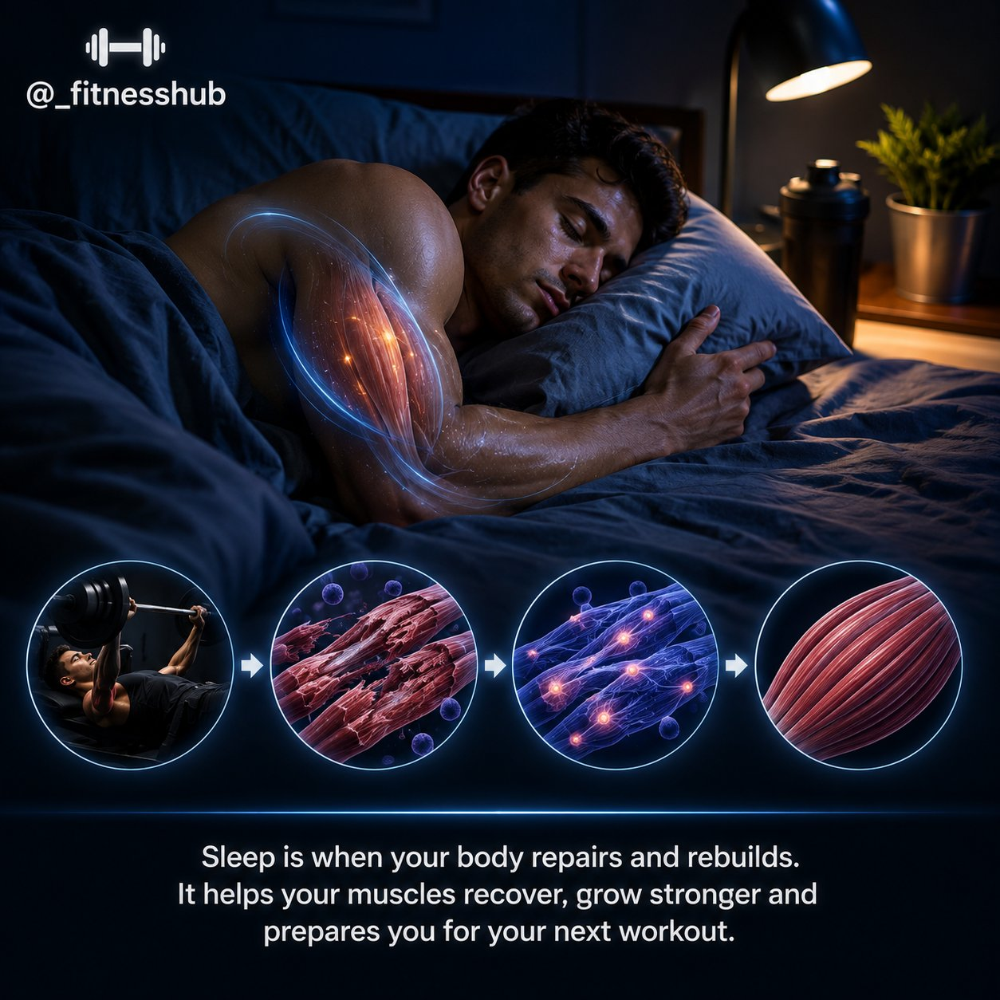
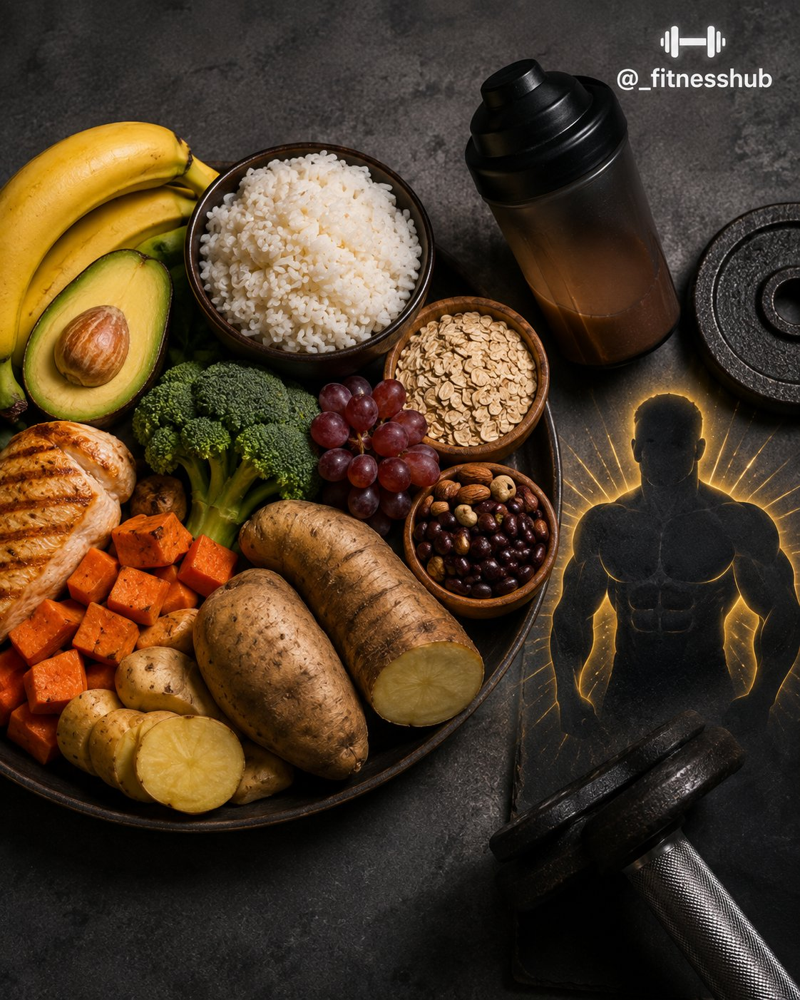
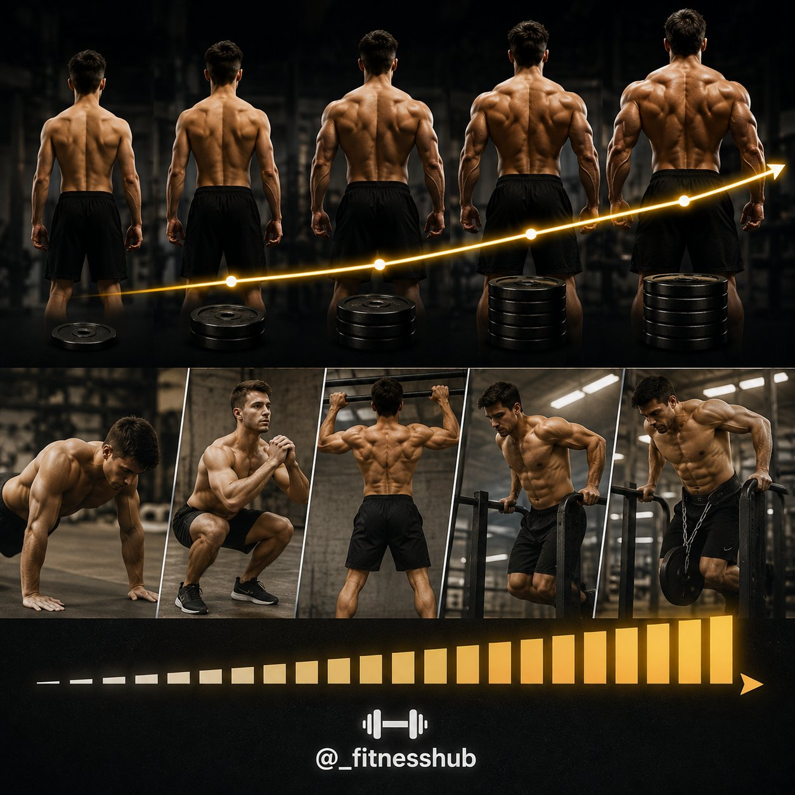
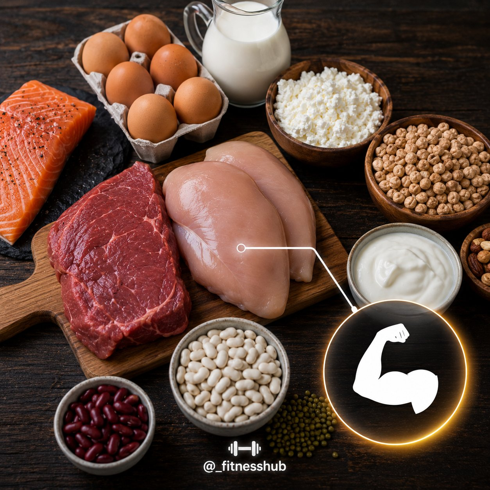
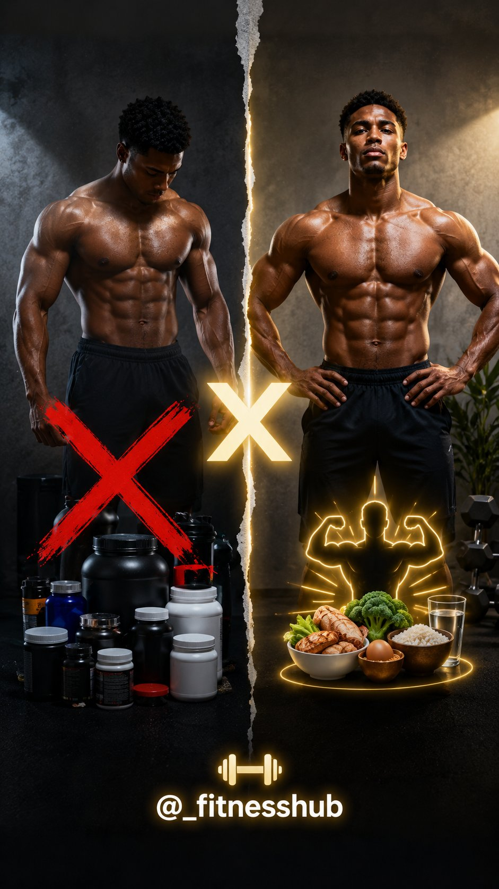
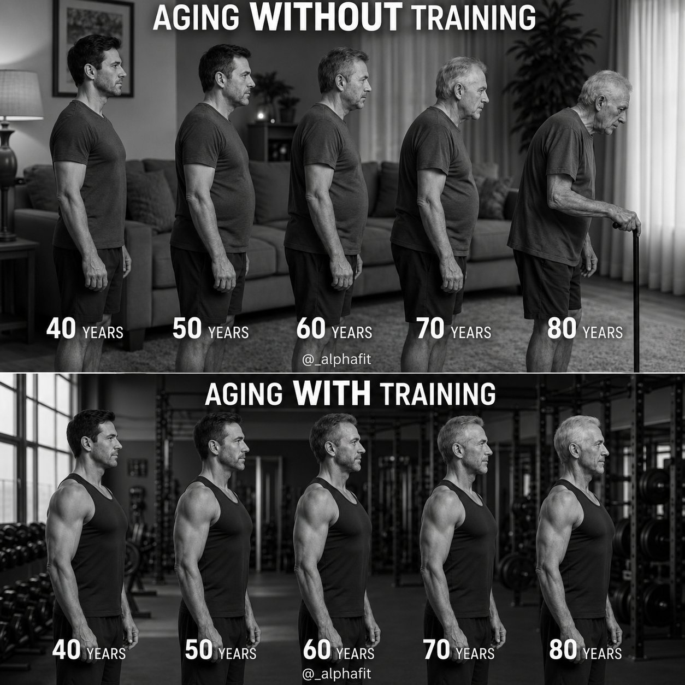
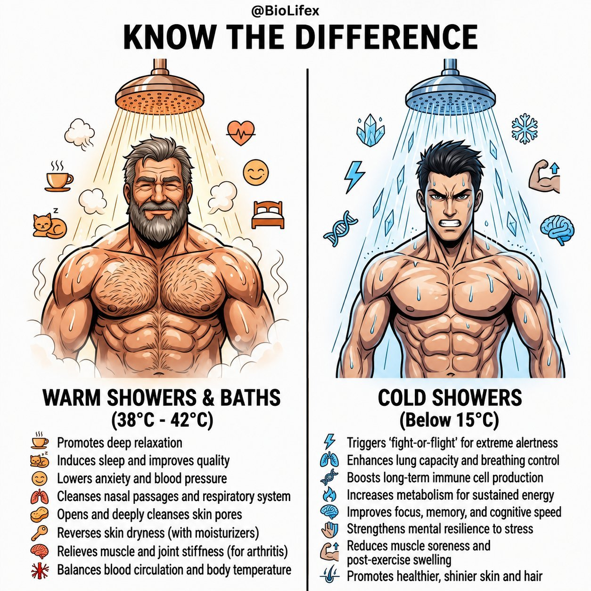

# 🐦 @Unlockyourlife_

## 📅 September 03, 2026

> 13 post(s) archived.

---

### 🕐 08:47 UTC · @Unlockyourlife_

> 6 Habits that will make your PC last longer

🔗 [View original post](https://x.com/_learnskills/status/2095433489206083980)

---

### 🕐 08:42 UTC · @Unlockyourlife_

> Before you tell yourself, &quot;I need to earn more,&quot; check where your money is going. • Food you don&apos;t need • Subscriptions you forgot about • Impulse purchases • Spending to impress people Sometimes you don&apos;t need more money yet. You need fewer leaks.

🔗 [View original post](https://x.com/Masculinjournal/status/2095432142264115522)

---

### 🕐 08:08 UTC · @Unlockyourlife_

> 8 ways to coat froed chicken.

🔗 [View original post](https://x.com/Elitedelicacy/status/2095423724270825547)

---

### 🕐 08:06 UTC · @Unlockyourlife_

> SUPPLEMENTS ARE OPTIONAL. They can be useful in certain situations, especially when convenience or a specific nutritional need is involved, but they aren’t magic muscle builders. The foundation is still simple: TRAIN HARD. EAT WELL. GET ENOUGH PROTEIN. RECOVER. STAY CONSISTENT.

🔗 [View original post](https://x.com/_fitnesshub/status/2095423067606409491)

---

### 🕐 08:06 UTC · @Unlockyourlife_

> 5. BE CONSISTENT 🔥 This is probably the most underrated part. You don’t need a perfect workout routine or an expensive supplement stack. You need to train consistently, eat well, recover properly and keep progressing over time. Muscle takes time to build.

🔗 [View original post](https://x.com/_fitnesshub/status/2095423063173083560)

---

### 🕐 08:06 UTC · @Unlockyourlife_

> 4. GET ENOUGH SLEEP 😴 Muscle growth doesn’t happen only while you’re working out. Training creates the stimulus, but your body needs recovery time to repair and adapt. Getting enough quality sleep supports muscle recovery, physical performance and the processes involved in tissue repair.

🔗 [View original post](https://x.com/_fitnesshub/status/2095423058077012076)

---

### 🕐 08:06 UTC · @Unlockyourlife_

> 3. EAT ENOUGH FOOD 🍚 Building muscle requires more than protein. Your body also needs enough overall energy and nutrients to support training and recovery. Foods like rice, potatoes, oats, yam, plantain, fruits, vegetables, beans and healthy fats can provide the fuel your body needs. If you consistently under-eat, making significant muscle gains can become much harder.

🔗 [View original post](https://x.com/_fitnesshub/status/2095423052448231686)

---

### 🕐 08:06 UTC · @Unlockyourlife_

> 2. PROGRESSIVELY CHALLENGE YOUR MUSCLES 🏋️ Your muscles need a reason to adapt. Over time, gradually increase the weight, repetitions, sets or difficulty of your exercises while maintaining good form. You don’t need the fanciest equipment either. Push-ups, squats, pull-ups, dips and other resistance exercises can build muscle when you progressively make them more challenging.

🔗 [View original post](https://x.com/_fitnesshub/status/2095423047452754158)

---

### 🕐 08:05 UTC · @Unlockyourlife_

> 1. EAT ENOUGH PROTEIN 🍗🥚 Your muscles need protein to repair and grow after training. You can get plenty from regular foods like eggs, chicken, fish, beef, milk, beans, Greek yogurt and other protein-rich foods. The key isn’t having a fancy supplement — it’s consistently getting enough protein from your overall diet.

🔗 [View original post](https://x.com/_fitnesshub/status/2095423042331529233)

---

### 🕐 08:05 UTC · @Unlockyourlife_

> YOU DON’T NEED SUPPLEMENTS TO BUILD MUSCLE 💪 You’ve probably seen fitness influencers recommend protein powders, creatine, mass gainers and other supplements for muscle growth. But the truth is, supplements aren’t required to build muscle. Here are 5 natural ways to build muscle:

🔗 [View original post](https://x.com/_fitnesshub/status/2095423037260587259)

---

### 🕐 07:35 UTC · @Unlockyourlife_

> Aging without training vs Aging with training

🔗 [View original post](https://x.com/_alphafit/status/2095415494446571978)

---

### 🕐 07:34 UTC · @Unlockyourlife_

> Know the difference

🔗 [View original post](https://x.com/BioLifex/status/2095415195862536426)

---

### 🕐 07:18 UTC · @Unlockyourlife_

> How To Connect 3 PVC Pipe Smooth and easy! Media

🔗 [View original post](https://x.com/Smart_Tipsx/status/2095411175374610781)

---
