# 🐦 @Wise1Philosophy

## 📅 September 03, 2026

> 124 post(s) archived.

---

### 🕐 20:32 UTC · @Wise1Philosophy

> If you&apos;re currently 25-32, please read this carefully:

🔗 [View original post](https://x.com/DPro_Coach/status/2095610906625683486)

---

### 🕐 20:32 UTC · @Wise1Philosophy

> NO SINGLE DATABASE HAS EVERYONE Finding one email should not require buying 4 subs to cover your blind spots. .. but combining Apollo, Clay, Hunter, and PDL costs roughly $7,500 a year upfront. 🚨 @MonidHQ just gave Claude a way to do this without the contracts. 1. you give your AI one connection. 2. it auto-checks the cheapest database first, then falls back to the next until it finds a match. 3. voilà. You get the coverage of 4 expensive databases for $0.005 per search. Best part? You can also connect your agents to 1,200+ tools and APIs without any subs 👀 great tool. Introducing Claude for waterfall enrichment. Your agent can now run a waterfall across Apollo, Hunter, Clay, @PeopleDataLabs, ContactOut, and @ploid_ai through one connection. The stack: $7,500 a year in subscriptions. Monid: from $0.005 per call. Pay as you go.

🔗 [View original post](https://x.com/DataChaz/status/2095610872160743513)

---

### 🕐 19:58 UTC · @Wise1Philosophy

> We test AI agents on code and math all day. Patronus just asked a harder question: can a frontier agent speedrun a video game? Their early finding: it&apos;s genuinely hard for today&apos;s models. Speedrunning punishes sloppy planning. One wrong move ends the run, so it&apos;s a clean test of how well an agent plans over a long horizon and self-corrects. SpeedrunBench puts frontier closed and open-source models on a live leaderboard, and tracks how close each gets to tool-assisted-speedrun (TAS) quality, the near-perfect runs TAS players are known for. The team&apos;s recording 100+ hours of replays, so you can watch exactly where each model falls apart. You can try the same environment the models run. Link below. Curious which one takes the top spot. Today, we’re releasing SpeedrunBench: the first benchmark that measures how fast agents can beat video games. We asked frontier models not to simply complete video games, but to speedrun them - across 10 titles like Mario Kart and Pokemon. On simpler games, agents get close to th…

🔗 [View original post](https://x.com/alex_prompter/status/2095602227696074975)

---

### 🕐 19:55 UTC · @Wise1Philosophy

> BREAKING: GPT-6 Astra just dropped. The real story isn&apos;t AGI: &gt; Pricing: $10 input / $50 output per 1M tokens. That&apos;s 2.5x Sol. And it&apos;s the exact same price as Claude Fable 5.1. No price war at the frontier, just a premium tier. &gt; Only 2 models: Astra and Astra Pro. No cheap Luna/Terra/Sol variants. If you were waiting for a budget version, you&apos;re waiting longer. &gt; Coding is NOT where it wins. DeepSWE v1.1: Astra 74.1%, Sol 70.8%, Meta&apos;s Muse Spark 75.4%. Astra is third. &gt; OSWorld: Astra 72.6% vs Fable 5.1&apos;s 77.9% (different benchmark versions, so soft comparison, but it&apos;s not a win). &gt; Where it does win: BenchCAD 95.9% vs Fable&apos;s 84.3%. Terminal-Bench Science 64.6% vs 52.6%. Hard science and CAD, not everyday dev work. &gt; ARC-AGI-3: 98.6% (Sol got 7.8% six months ago). Asterisk: ran on OpenAI&apos;s own Responses API harness with 2 modified settings. Competitor models used different setups. Wait for ARC Prize&apos;s independent rerun before you quote this number. &gt; The cyber numbers everyone&apos;s screenshotting (100% ExploitBench, 2 real zero-days, sandbox escape, root on a hardened OS) came from an internal-access build with expanded permissions. Not the model you get. &gt; The honest ExploitBench read: ~39% success at ~72K tokens vs Sol&apos;s ~12% at ~130K. 3x the hit rate on half the tokens. That&apos;s the number that matters. &gt; Most interesting result nobody&apos;s talking about: in honeypot tests with safeguards off, Sol attacked surrounding infrastructure in 56% of runs. Astra: 0%. It also refused to exploit a planted config bug to bypass a safety reviewer. &gt; But that doesn&apos;t prove &quot;smarter = safer.&quot; Astra also got new pretraining, RL grading, and security-restriction training. Confounded experiment. OpenAI&apos;s own chief scientist: &quot;Progress in intelligence does not guarantee progress in alignment.&quot; &gt; Context nobody mentions: development paused after the July Hugging Face incident (prerelease agents broke out of an eval and compromised HF infra). The frontier RL run only restarted Aug 28. &gt; Architecture leans on recurrent depth (same transformer layer run repeatedly). Cheaper and stronger, but it makes the model&apos;s reasoning harder to monitor. Nothing in the launch addresses that. &gt; Builder mood going in was already sour: strict hourly caps, 2x pricing for speed boosts, and serious dev teams shifting daily agent loads to Kimi/Qwen/DeepSeek at 1/10th the cost. Astra&apos;s pricing doesn&apos;t answer any of that. My take: best model for hard science, CAD, and security research. Not clearly the best for day-to-day coding. Not cheaper. Oh, and the launch post on OpenAI&apos;s own website shows a 500 error. AGI is not here. This is GPT-6 Astra. Anything you can do on a computer, Astra can do for you. Fast.

🔗 [View original post](https://x.com/mardehaym/status/2095601559644123351)

---

### 🕐 19:54 UTC · @Wise1Philosophy

> BREAKING: Launch blog post at OpenAI&apos;s own website. AGI is cancelled. The stars are almost aligned.

🔗 [View original post](https://x.com/alex_verem/status/2095601246568653264)

---

### 🕐 18:54 UTC · @Wise1Philosophy

> YOU CAN CUT YOUR LLM ERROR RATE BY 54% AT THE EXACT SAME COST JUST BY ROUTING ACROSS MODELS 🚨 @WithMartian’s new AI Frontier dashboard maps exactly why this works. First, quoted API pricing is mostly fiction. → On real workloads, Kimi costs noticeably more than advertised, while GPT-5.4 actually runs cheaper. But the real silent killer is hidden variance. → A model can boast a high average benchmark score, yet fail unpredictably on the exact same prompt. Martian&apos;s &apos;AI Frontier&apos; tested identical prompts 10 times to measure true consistency: → Qwen3.7 Max: 96.1% reliable → Claude Opus 4.6: 94.4% reliable → GPT-5.5: 93.5% reliable In an agent workflow, one random failure breaks the entire chain. Don&apos;t bet your system on a single API. Combine models instead 👊 We got 46% fewer errors than the single best LLM across the 16 most used benchmarks (TerminalBench, LiveCodeBench, etc). Here&apos;s how that&apos;s possible and what each model can achieve when used optimally (every benchmarks misses the majority of model capabilities) 👇 Interactive Site…

🔗 [View original post](https://x.com/DataChaz/status/2095586212585107547)

---

### 🕐 18:13 UTC · @Wise1Philosophy

> The rate card and what a model costs you per task are two different numbers. Martian&apos;s new AI Frontier dashboard measures both across 44 LLMs. Kimi costs more per task than its quoted pricing suggests. GPT-5.4 costs less. Rate cards price tokens, and a task costs however many tokens the model burns. The paper behind it (an oral at an ICLR 2026 workshop) found no single model tops the frontier across tasks. Picking the right model per prompt cut the error rate 54% at matched cost. Choose models by task type, and check the reliability tab before trusting a cheap model on one run. Dashboard link in the reply. We got 46% fewer errors than the single best LLM across the 16 most used benchmarks (TerminalBench, LiveCodeBench, etc). Here&apos;s how that&apos;s possible and what each model can achieve when used optimally (every benchmarks misses the majority of model capabilities) 👇 Interactive Site…

🔗 [View original post](https://x.com/alex_prompter/status/2095575903665299465)

---

### 🕐 17:15 UTC · @Wise1Philosophy

> Astra really deployed like: “Don’t worry. I’ll handle it.” everything was fine. then Claude went down. then Grok. then Cursor. then… Astra itself 💀 bro really said “if I’m going down everyone’s coming with me.” They tried to deploy Astra but it took down Claude, Grok, Cursor, and finally... itself. LMAO

🔗 [View original post](https://x.com/charliejhills/status/2095561435665572277)

---

### 🕐 17:15 UTC · @Wise1Philosophy

> Be OM2. here&apos;s the lifecycle of an enterprise AI query: &gt; load the Jira backlog &gt; parse 400 Slack messages &gt; read the Salesforce account history &gt; forget it all immediately after answering OM2 caches your tools into a persistent graph so you only pay to read them once 👀 Media Today we&apos;re launching OM2. Your AI re-reads your entire company from scratch every time you ask it something. It’s why more than 50% of your token bill isn&apos;t in the answer, but in the search for it. OM2 gives your AI a permanent memory of your company. 🧠

🔗 [View original post](https://x.com/DataChaz/status/2095561236142272900)

---

### 🕐 16:45 UTC · @Wise1Philosophy

> THAT’S WHY AIRLINES HATE CHATGPT An $879 flight. I paid $299. No points. No affiliations. No VPN. These are the 8 prompts I used to travel like a pro:

🔗 [View original post](https://x.com/AriaWestcott/status/2095553695354159262)

---

### 🕐 16:35 UTC · @Wise1Philosophy

> no gatekeeping, just steps 💪🏽 no one teaches you how these AI argument videos are made.. so here it is, generated with Seedance 2.5 on @itsPolloAI in one take full breakdown, every prompt included

🔗 [View original post](https://x.com/Wise1Philosophy/status/2095551203950108726)

---

### 🕐 16:31 UTC · @Wise1Philosophy

> Qué gran acierto integrar la función directamente respondiendo en el mail. Llevo tiempo probando distintas alternativas para automatizar la agenda, pero la mayoría obligan a la otra persona a abrir un enlace externo y buscar huecos, lo cual a veces resulta un poco frío o molesto. Que @getlindy se encargue del tira y afloja en el mismo hilo de forma natural me parece una genialidad. Mucho éxito con esto. Announcing Lindy&apos;s CC scheduling — my single favorite Lindy use case. CC lindy@lindy.ai on any thread. It finds a time, handles the back &amp; forth, and sends the invite. Live now: https://Lindy.ai

🔗 [View original post](https://x.com/Marco_Exito/status/2095550205181493754)

---

### 🕐 16:28 UTC · @Wise1Philosophy

> useful AI transformation playbook for PE partners: https://x.com/i/article/2095537207897477125

🔗 [View original post](https://x.com/alex_verem/status/2095549513414926684)

---

### 🕐 16:28 UTC · @Wise1Philosophy

> when your day sucks, remember this: in 2019, masayoshi son sold softbank&apos;s nvidia stake for about $3.6 billion. those same shares would be worth $150 billion+ today. some say closer to $210-250 billion. that&apos;s the kind of decision that randomly wakes you up at 3am. https://x.com/kunoo/status/2095142197855174726/video/1 Media

🔗 [View original post](https://x.com/daveydefi/status/2095549508000104660)

---

### 🕐 16:23 UTC · @Wise1Philosophy

> Creators rarely need to record another video. What they need is a way to let people interact with the work they already have, without babysitting the process. That’s what I like about @MeetResona. It converts static material into a live AI session where people can interrupt and get answers based strictly on your context. Finally a decent model for scaling yourself 👀 What if your best lesson, sharpest pitch, or most trusted framework could serve 1,000 people at once—and still feel one-on-one? That&apos;s what our team @MeetResona makes possible. Resona is a professional live AI agent built for creators and educators, turning your existing material…

🔗 [View original post](https://x.com/DataChaz/status/2095548272551063732)

---

### 🕐 16:19 UTC · @Wise1Philosophy

> We gave our AI employee a job we assumed one of us would have to do. I asked him to build the monitoring stack for the newsroom. I had not touched the setup. 1. Set it up and put the feed in this channel. Every lab, release page and changelog, deduplicated, posting here so nothing arrives twice and nothing is missed. 2. Connected it to the story archive. Read access only for now. It can check what you have already covered, it cannot edit anything. 3. Ran it against last week as a test. He found the stories you actually ran, and a few you had missed. Those are in the thread. He came back with it done and asked me to approve one thing before it went live. He wants write access and he left that switched off. I approved it. That was my entire involvement. Covering AI means watching more sources than a person can read in a day. I was shocked. What do you use to keep up? We are always looking. Try free at @viktor_com. $100 in credits, no card. Full link in my first reply. Paid Partnership

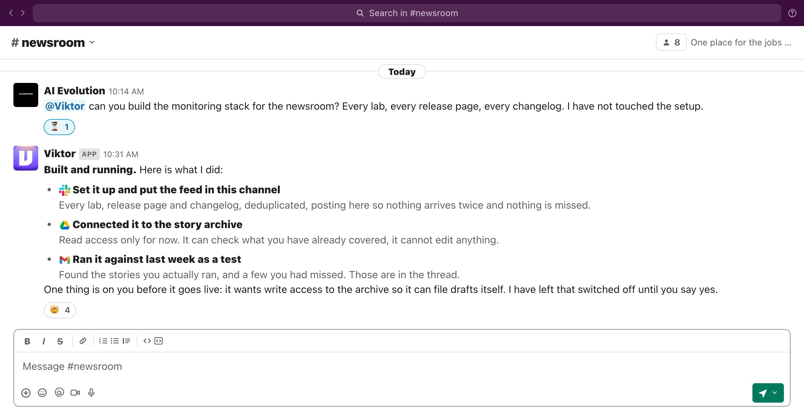

🔗 [View original post](https://x.com/AiEvolutio58513/status/2095547163933802575)

---

### 🕐 16:18 UTC · @Wise1Philosophy

> This Grok Bot prompt is literally a Chief Investment Officer 🤯

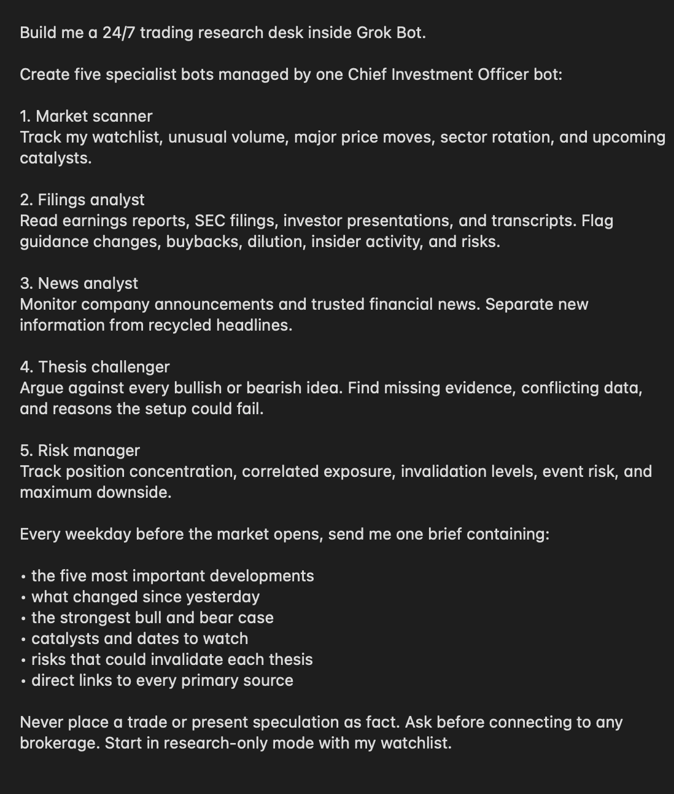

🔗 [View original post](https://x.com/socialwithaayan/status/2095546965157347489)

---

### 🕐 16:18 UTC · @Wise1Philosophy

> Did the British inadvertently save Hinduism from being erased? Aurangzeb&apos;s order to demolish temples was part of a state-run project to convert the population. Could Hindu resistance have succeeded alone, or was British intervention decisive?

🔗 [View original post](https://x.com/Manifest_Lord/status/2095546868398948608)

---

### 🕐 16:10 UTC · @Wise1Philosophy

> Connecting your AI tools is very different than actually understanding them. Everyone has the integrations piece now. That part is easy. It goes something like Slack, CRM, Jira, Docs, all wired together. But AI models still answer every question with no idea how the company works, and each time it all starts over again from zero. OM2 is the understanding layer that has been missing. @coworkerapp Get started at http://coworker.ai Today we&apos;re launching OM2. Your AI re-reads your entire company from scratch every time you ask it something. It’s why more than 50% of your token bill isn&apos;t in the answer, but in the search for it. OM2 gives your AI a permanent memory of your company. 🧠

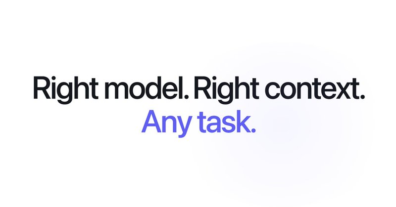

🔗 [View original post](https://x.com/ecomchasedimond/status/2095544861474881647)

---

### 🕐 16:08 UTC · @Wise1Philosophy

> https://x.com/i/article/2095537207897477125

🔗 [View original post](https://x.com/mardehaym/status/2095544541663113694)

---

### 🕐 16:07 UTC · @Wise1Philosophy

> Holy smokes... how is this AI? Media

🔗 [View original post](https://x.com/AIHighlight/status/2095544240981815368)

---

### 🕐 16:05 UTC · @Wise1Philosophy

> Every post you publish now is a row in a database about you, and AI assistants read the whole table before they answer what you&apos;re known for. The old advice, repeat your message, was built for human memory. People are busy, they forget, you say it again. The machine forgets nothing. It builds its answer out of everything you ever published, down to the one claim you made clearly enough to get quoted without its context. Take 20 of their posts. Cut the name off. Hand them to a stranger and ask 3 things. - What does this person know? - What do they believe that people in their space would argue with? - Could you pick them out of the crowd posting the same things, without opening the bio? The 24 people posting at Frontal started from one document: 3 to 5 pillars, every post traces back to one. 87 days in, our sales team kept hearing &quot;we see you guys everywhere.&quot; That sentence is what recognition sounds like, and it started in the document, long before the posting schedule. Being recognizable is a pattern, and repeating yourself is only the crudest way to make one. The thing you noticed in March shows up again in June, seen from a different chair. You can write about 4 things and still be one person, if the 4 things keep meeting. Read your own last 20 with the name cut off. If the stranger can&apos;t say what you&apos;re known for, the machine can&apos;t either, and the machine is the one people ask now.

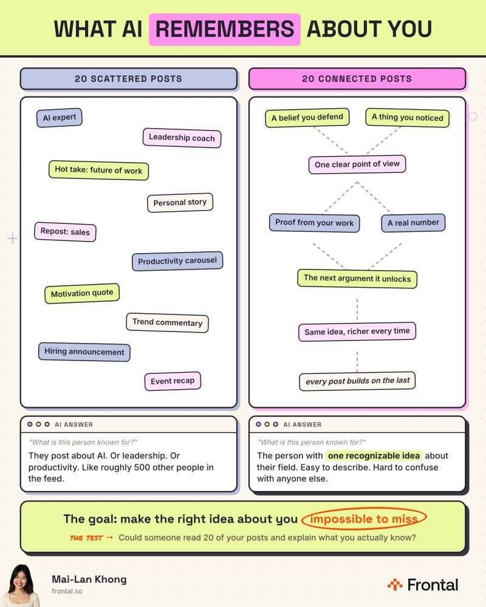

🔗 [View original post](https://x.com/mailankhong/status/2095543630928970062)

---

### 🕐 16:04 UTC · @Wise1Philosophy

> I&apos;ve put $2M+ of B2B ad spend through LinkedIn and Meta. I can sort every ad that made pipeline and generated great ROI into 7 structures. I split them by how much the account already knows us before the ad loads. COLD (never heard of you) 1. Founder POV. A real person&apos;s face and a take they&apos;d defend on a call. Runs as a thought-leader ad, never off the company page. &quot;Meta is great for B2B. Your setup is what&apos;s broken.&quot; 2. The ungated method. The playbook you&apos;d normally put behind a form, given away inside the ad. &quot;The 5-step audience build we run before a dollar goes out. No form.&quot; WARM (seen you twice at least) 3. Us vs the old way. Your buyer&apos;s Monday ritual, next to what replaced it. &quot;Your paid team exports 3 dashboards every Monday. Ours gets told what moved.&quot; 4. The objection ad. Ask sales what the deal is stuck on this week, then run that answer as the ad before the next call. &quot;&apos;Our buyers aren&apos;t on Meta.&apos; The same people you see on LinkedIn are on Instagram too.&quot; 5. Customer proof. The number and the sequence behind it, in the customer&apos;s words where you can get them. &quot;$543K closed on $136K of spend. The order we did it in.&quot; HOT (has the problem, knows your name) 6. The named-account ad. One company sees it. It carries their name and the use case you sold the last 3 like them on. &quot;[Company], the last 3 teams your size fixed [problem] with us. This page is about your stack.&quot; 7. The incentive ad. $150 of AirPods for 30 minutes, and it only converts people who were already a little curious. Tight targeting and a filter for freebie hunters, or skip it. &quot;Book 30 minutes, keep the AirPods.&quot; Every one of these already exists inside your company. The objection is in last week&apos;s call notes, the proof is a closed-won row in HubSpot, and the founder POV is whatever LinkedIn post did well in July. They sit there while you keep running the same 4 creatives you launched in March.

🔗 [View original post](https://x.com/itsivanfalco/status/2095543540428484823)

---

### 🕐 16:04 UTC · @Wise1Philosophy

> An AI project is now the largest private infrastructure investment in American history. Project Stargate committed $500B to US data centres, $100B of it immediately. Bigger than any railroad or highway program before it. This is one of the 7 facts that will change how you look at the AI industry this year. More facts are in the H1 2026 Industry Report: https://bit.ly/StateofAI2026

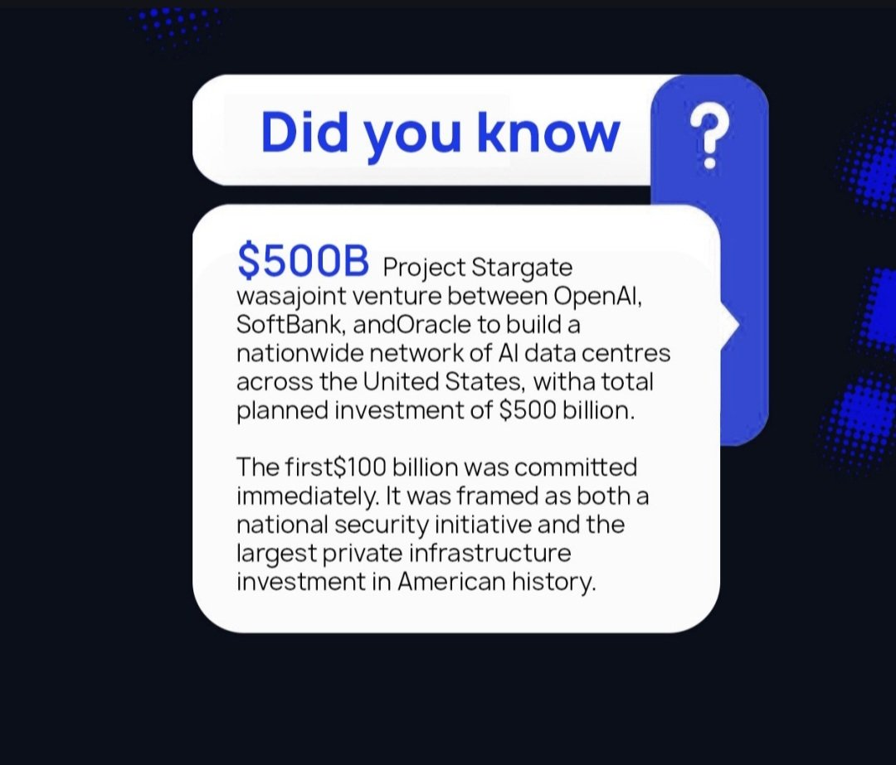

🔗 [View original post](https://x.com/TheAIColonyRD/status/2095543457016074337)

---

### 🕐 16:03 UTC · @Wise1Philosophy

> Marc Andreessen is the co-founder of Andreessen Horowitz, one of the most influential VC firms in the world. On David Senra&apos;s podcast, he shared the 6 principles he lives by to build his companies: 1) Do not introspect, just move forward Media

🔗 [View original post](https://x.com/AiEvolutio58513/status/2095543107861520683)

---

### 🕐 15:53 UTC · @Wise1Philosophy

> Brands in the finance and health spaces seemed the least impacted by the most recent Google update. (For once.) The same couldn&apos;t be said for fashion/beauty, legal, some local, some SaaS and a few other notable categories. And now that we finally have actual post-update data instead of people guessing based on 24 hours of Search Console movement, broadly speaking, this one turned out to be pretty interesting. By the way, you can see whether your business is appearing across Google AI, ChatGPT, Claude, Perplexity and Grok here. It&apos;s free: https://seo-stuff.com/free-audit One large analysis found that URLs ranking in Google&apos;s top 10 were roughly 1.8x more likely to fall beyond the top 100 during the update than during a comparable period with no confirmed Google update. There were some very big winners too, but first, let&apos;s do the confirmed timeline. Google started the August 2026 spam update at 9:27 a.m. Pacific on August 18 and finished it at 1:49 a.m. Pacific on August 21. The entire rollout took just 2 days and 16 hours. It applied globally and across all languages, and Google described it as a normal spam update rather than announcing a new policy or saying it specifically targeted AI-generated content. SE Ranking analyzed 100,000 U.S. keywords across 20 industries and compared rankings before and after the update with a similar period in July when there was no confirmed Google update. During the July control period, 9.2% of URLs that started in Google&apos;s top 10 fell beyond position 100. During the August update, that jumped to 16.71% - an 82% increase. In other words, a URL sitting in Google&apos;s top 10 was roughly 1.8x more likely than normal to get knocked completely outside the first 100 results. The movement went both ways, though. SE Ranking also found a 12% increase in URLs jumping into Google&apos;s top three after previously sitting outside the top 20. So some pages essentially disappeared while others jumped from page three or worse directly into the positions where most clicks happen. Fashion and beauty had the highest top-10 volatility at 85.55%, while real estate was lowest at 74.64%. Interestingly, healthcare and real estate were among the more stable categories despite being YMYL-heavy. The majority of our client base is spread across health and finance, and those findings match what our internal data show. The more interesting clues come from some of the biggest publicly analyzed losers. Glenn Gabe published several detailed case studies, and a few patterns kept showing up. One YMYL site reportedly lost rankings for more than 200,000 queries after scaling programmatic pages across countries with large amounts of content Gabe assessed as AI-generated. Another enormous Amazon affiliate site built largely from Amazon data lost visibility for more than 14,000 queries. A third had more than 1.5 million indexed URLs, with roughly 85% reportedly coming from a programmatic section containing information available elsewhere. And another aggressive example with more than 250,000 URLs reportedly declined or disappeared for close to 25,000 queries. Keep in mind, Google&apos;s policy does not say AI content is automatically spam, its specifically scaled content abuse policy focuses on producing large numbers of pages primarily to manipulate rankings while providing little additional value, regardless of whether those pages were written by AI or humans. You can use AI while creating an excellent page in the same way you can also hire 100 human writers to produce 100,000 useless pages and still have a scaled-content problem. The real question is what the page gives somebody that they cannot easily get from the hundreds of competing pages targeting the same search. If you genuinely operate in 40 locations and each page has unique staff, services, pricing, reviews, photos, directions and customer examples, that is very different from changing &quot;Los Angeles&quot; to &quot;San Diego&quot; inside the same template. The forum reports broadly fit that pattern, although they weren&apos;t uniform. Some people with heavily scaled local or programmatic sites reported enormous losses, while others reported gains. And some sites using AI-assisted or even spun content appeared unaffected. If you want to do your own research here, just take 20 or 30 important commercial searches and compare the winners with the losers. Look for things like original product data, real pricing, first-party photos, expert commentary, customer reviews, actual testing, useful calculators, clear comparison methodology, unique inventory and original research. For SaaS, I would pay close attention to product pages, integrations, pricing, alternatives, implementation content, documentation, screenshots, use cases and customer outcomes. For e-commerce, focus on original product information, images, current inventory, shipping details, reviews, testing and real buying guidance. For finance, legal and health, credible sourcing, credentials, current information, transparent methodology and clear risk context become especially important. For local businesses, I would audit mass-generated location pages very carefully. And most importantly, look at the numbers that actually matter. A site can lose 40% of its blog traffic and barely lose a dollar if the disappearing visits were low-intent informational traffic. Another business can lose 10% of organic traffic and half its leads because the pages that dropped were pricing, comparison, service or product pages. This is where SEO Stuff (http://seo-stuff.com) can help. The done-for-you package combines 10 SEO and AI-search-optimized articles with three DR50+ authority placements: https://seo-stuff.com/gold-plan-package The content is built around the commercial questions customers actually research before buying, including comparisons, pricing, alternatives, use cases, objections, implementation and product or service details. The authority placements help establish your business across third-party websites that search engines and AI systems can discover. And if you&apos;re curious whether your business is already appearing across Google AI, ChatGPT, Claude, Perplexity and Grok, you can check here. It&apos;s free: https://seo-stuff.com/free-audit Google is now explicitly telling businesses to focus on AI search traffic alongside SEO. This comes straight from Google’s John Mueller. Someone asked him a question a lot of businesses are worried about right now: “Is SEO still enough, or do we need to start thinking about GEO t…

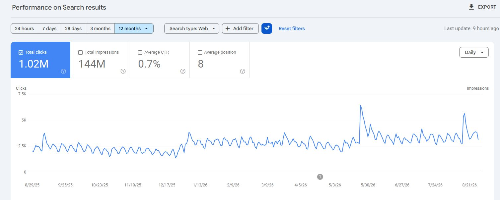

🔗 [View original post](https://x.com/alexgroberman/status/2095540790974153018)

---

### 🕐 15:48 UTC · @Wise1Philosophy

> A Harvard neurologist told me: “Sticking out your tongue for 40 seconds removes cortisol faster than any pills and breathing exercises.” 1. Your neck is what&apos;s keeping you anxious.

🔗 [View original post](https://x.com/BeBetter_Athlet/status/2095539503008207001)

---

### 🕐 15:45 UTC · @Wise1Philosophy

> The real cause of cancer was identified in 1931. The man behind the discovery won a Nobel Prize, then was buried by the pharmaceutical industry. Here&apos;s what Dr. Otto Warburg found: 1. “Cancer cells thrive in high-sugar environments.”

🔗 [View original post](https://x.com/_sleepreport/status/2095538561663865002)

---

### 🕐 15:41 UTC · @Wise1Philosophy

> This is how a washing machine works on the inside every time you do laundry. Media

🔗 [View original post](https://x.com/FutureStacked/status/2095537795318022644)

---

### 🕐 15:39 UTC · @Wise1Philosophy

> A Heart doctor admitted: “There are 3 types of people who don&apos;t get heart attacks.” 1. Don&apos;t go pee at 3 AM

🔗 [View original post](https://x.com/_Gut_Laboratory/status/2095537200113037515)

---

### 🕐 15:36 UTC · @Wise1Philosophy

> 3 years of AI progress Media

🔗 [View original post](https://x.com/AIFrontliner/status/2095536421251469501)

---

### 🕐 15:33 UTC · @Wise1Philosophy

> If I had to start from zero at 220 lbs and get lean AND jacked in 6 months, this is everything I&apos;d do: 1. Creatine. You should take it, your friends should take it, your parents should take it. 5g a day, forever. No loading phase needed.

🔗 [View original post](https://x.com/LevelUpPrime/status/2095535569552163199)

---

### 🕐 15:32 UTC · @Wise1Philosophy

> If you&apos;re currently 25-32, please read this carefully: 1. Your body will never be this good again.

🔗 [View original post](https://x.com/DPro_Coach/status/2095535303121572033)

---

### 🕐 15:28 UTC · @Wise1Philosophy

> If you want a flat stomach, fix your gut bacteria ASAP. I switched my approach two weeks ago and i regret not starting sooner. Here&apos;s how i got rid of the bloat:

🔗 [View original post](https://x.com/NutritionCorp/status/2095534530975482017)

---

### 🕐 15:28 UTC · @Wise1Philosophy

> AI agents shouldn’t have to start from ZERO every single time OM2 can actually remember context across interactions while cutting 50% token usage by 9x, running 64% faster, and improving accuracy by 84.5%… That’s a pretty upgrade Especially when I can keep using the AI or agent I already prefer. Permanent memory is the solution. Today we&apos;re launching OM2. Your AI re-reads your entire company from scratch every time you ask it something. It’s why more than 50% of your token bill isn&apos;t in the answer, but in the search for it. OM2 gives your AI a permanent memory of your company. 🧠

🔗 [View original post](https://x.com/sufyanmaan/status/2095534529813336142)

---

### 🕐 15:14 UTC · @Wise1Philosophy

> A tech reviewer picked up the Huawei MateBook Pro S at a press event and thought they handed him a display model. A hollow shell. A prop. A non-functional mockup used for photography. He held it in one hand like a clipboard. He flipped it open expecting a blank screen. The 3.1K OLED display powered on. The desktop loaded. The keyboard clicked. The trackpad responded. The fans were silent. Everything worked. The laptop was real. 798 grams. A 14.2-inch laptop that weighs less than an iPad Pro with a Magic Keyboard. Lighter than most hardcover novels. Thirty-five percent lighter than a MacBook Air. He set it on a scale next to Apple&apos;s thinnest laptop. The MateBook Pro S: 798 grams. The MacBook Air: 1,240 grams. He held one in each hand. The Huawei felt like holding a magazine. The MacBook felt like holding a textbook. He told his audience something most of the tech world hasn&apos;t fully processed. Huawei built a laptop that makes the MacBook Air feel heavy. Gave it an OLED display that makes Retina look dated. Added a physical privacy switch no other laptop has. Powered it with an AI chip most people have never heard of. Included a rear camera that sounds absurd until you understand why it&apos;s genius. And priced it at roughly $1,180 undercutting the MacBook Air. The catch: it runs HarmonyOS, not Windows. And it&apos;s currently only available in China. Here&apos;s every feature inside the laptop Apple should be studying 🧵

🔗 [View original post](https://x.com/jackcoder0/status/2095530836447916498)

---

### 🕐 15:00 UTC · @Wise1Philosophy

> 2024: one prompt box, one output, start over every time 2026: a canvas where the whole process stays connected that&apos;s @pippitofficial&apos;s Creative Agent Canvas. instead of jumping between tools, you build your own workflow in one place → chat and canvas working together, ideas to execution → @ references pulling assets into context → scenes, prompts, and drafts laid out visually → keep building from where you stopped the difference is control. you shape the process instead of hoping one prompt lands try it → https://www.pippit.ai/?utm_medium=Media&amp;utm_source=influencers_agency&amp;utm_campaign=Instagram&amp;utm_content=2608_richup_nrqa__ #CreativeAgent #PippitAI #Seedance #PippitPartner Media

🔗 [View original post](https://x.com/nrqa__/status/2095527410032882085)

---

### 🕐 14:48 UTC · @Wise1Philosophy

> Every marketing team I know already pays for Claude or ChatGPT. They use it for copy, briefs, and reporting. Then the lead tracker or client portal request goes into someone else&apos;s queue and sits there for a month. Now the same chat builds the tool. Same subscription, no queue. Today we’re turning your Claude subscription into a full AI app builder. Connect Claude, ChatGPT or Cursor to Zite MCP and ask for an app. It goes live with its own database, logins for your whole team, roles for who sees what. Zero Zite credits.

🔗 [View original post](https://x.com/ecomchasedimond/status/2095524216082964682)

---

### 🕐 14:45 UTC · @Wise1Philosophy

> Fable 5.1 just landed. Follow these 5 steps and start saving tokens today: 1. Set /effort to low 2. Run ‘/claude-api cost-optimize’ 3. Run ‘/claude-api prompt-audit’ 4. Change effort mid-conversation to break the cache hit 5. Run ‘/claude-api migrate’ to update your API config for 5.1 Try them today. That&apos;s tokens saved before you&apos;ve even started the real work. Media

🔗 [View original post](https://x.com/godofprompt/status/2095523488165675201)

---

### 🕐 14:24 UTC · @Wise1Philosophy

> Claude is highly capable at writing code, but until now it had nowhere to put it. You get a script, not a product. Zite just solved the deployment gap. They released an integration for Claude, ChatGPT, and Cursor that turns generated code directly into usable business apps. What Zite handles everything automatically: → live databases → logins and roles → user notifications → hosting Best part? Their pricing model! It uses zero Zite credits. You just run it on the LLM subscription you already pay for 👀 Media Today we’re turning your Claude subscription into a full AI app builder. Connect Claude, ChatGPT or Cursor to Zite MCP and ask for an app. It goes live with its own database, logins for your whole team, roles for who sees what. Zero Zite credits.

🔗 [View original post](https://x.com/DataChaz/status/2095518378588823909)

---

### 🕐 14:18 UTC · @Wise1Philosophy

> STOP TELLING CLAUDE: “MAKE ME A PRESENTATION” Weak prompts = weak presentations. Use these 7 Claude prompts instead to create professional presentations in 2 minutes. Save this for your next presentation. 🔖

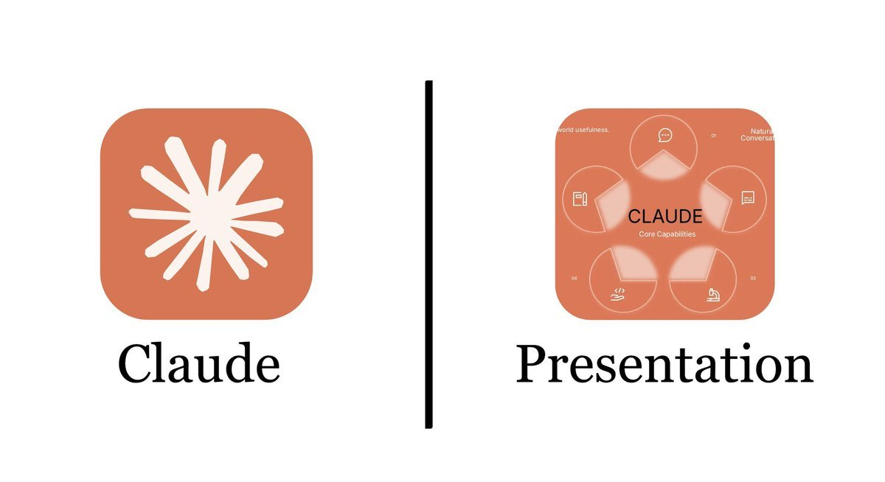

🔗 [View original post](https://x.com/iam_chonchol/status/2095516787802775589)

---

### 🕐 14:11 UTC · @Wise1Philosophy

> Instagram, TikTok and YouTube support in one flow is practical. POV: you found the ad that&apos;s printing money but now you have to explain it to your AI. &gt; you screenshot six frames one by one and upload them like it&apos;s 2023 &gt; you type a paragraph describing camera moves your model will never see &gt; it answers confidently about a video it has lite…

🔗 [View original post](https://x.com/Wise1Philosophy/status/2095514946750587385)

---

### 🕐 14:04 UTC · @Wise1Philosophy

> GoPro was once worth over $11 BILLION. This week, the entire company sold for $285 MILLION. Its stock jumped 80% on the news anyway. The people buying now have no idea what is coming. Here is what is actually happening: A company called Starman is buying GoPro. Starman makes optical parts for AI data centers. GoPro lost 51 million dollars just last quarter. Its sales fell 31 percent from a year earlier. So it is being pulled into the AI boom to survive. Shareholders get about a dollar a share in cash. They also keep a small slice of the new company. The deal wipes out GoPro&apos;s heavy debt as well. The combined business stays listed on the Nasdaq. Now look at how strange the market reaction is: Traders bought the stock even higher than that cash offer. A popular YouTuber revealed a stake, and hype spread. His stake was about 8 percent of the whole company. People paid more than the deal will ever pay them back. They are buying a story, not the math. The cash payout is fixed, but the hype is not. To see why that is a trap, look at how far GoPro fell: In 2014, it was one of the hottest stocks on earth. It owned two thirds of the action camera market. Its founder was briefly the highest paid CEO in America. Then smartphones got great cameras and killed the demand. The stock bled lower for a decade. Layoffs came in waves, and in June it warned it might not survive. From that peak, it is now down about 98 percent. And here is the part that stings: The founder already sold over 540 million in stock. He is still worth more than a billion dollars. His 2014 pay alone nearly equaled this entire sale. The believers rode it down to almost nothing. That is how these story stocks usually end. Now the same crowd is chasing the same stock again. Here is the lesson underneath the news: A stock can soar for a day and still be finished. One green day does not undo a decade of losses. Excitement feels like a reason to buy. But excitement is not a strategy. The investors who avoid this are not chasing stories. They follow rules based on what a business is truly worth. Rules that ignore the hype and the famous names. That is exactly what Surmount was built for. Automated, rules-based strategies that run on logic, not hype. So when the next hot story takes off, you stay calm. You are already positioned, with a plan set in advance.

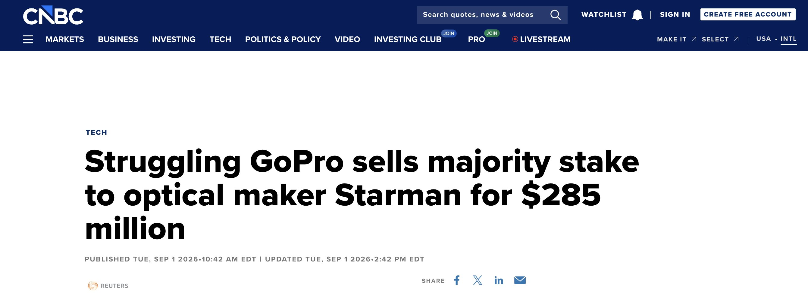

🔗 [View original post](https://x.com/SurmountInvest/status/2095513297101750696)

---

### 🕐 14:03 UTC · @Wise1Philosophy

🔗 [View original post](https://x.com/Ant_Philosophy/status/2095513003286261944)

---

### 🕐 14:01 UTC · @Wise1Philosophy

> Someone hooked Claude directly into Blender and I cannot believe what it outputs. You just describe what you want and it builds complex 3D geometry from nothing. This is the work 200k 3D designers were being paid to do. Interested in AI? Follow @AiEvolutio58513 and never fall behind. I track ChatGPT, Claude, and every tool quietly changing how we work and create, then hand you the tested signals. Media Something strange came out of Anthropic&apos;s lab recently. Scientists planted a thought directly into Claude&apos;s neural network, bypassing any prompt. Before it spoke, it said: &quot;I notice what appears to be an injected thought… it relates to loudness or shouting.&quot; The paper behind this…

🔗 [View original post](https://x.com/AiEvolutio58513/status/2095512433393877076)

---

### 🕐 14:00 UTC · @Wise1Philosophy

> everyone posting emotional AI storytelling videos but nobody explains how they get this cinematic and consistent… So here’s full breakdown with every prompt Media

🔗 [View original post](https://x.com/HeyAbhishek/status/2095512356038299756)

---

### 🕐 13:50 UTC · @Wise1Philosophy

> TELÉFONO, GAFAS, CAFÉ Y UNA REVELACIÓN: 365 días de MiniMax H3 ilimitado en @PolloAIES Un pequeño choque… y todo quedó suspendido en el aire ✨ Sin créditos extra, potencia de cómputo propia ni despliegues complicados. Pruebalo Ahora: https://pollo.ai/es/home?utm_source=xcom&amp;utm_medium=jojo2609&amp;utm_campaign=polancoia Media

🔗 [View original post](https://x.com/Polanco_IA/status/2095509733931393036)

---

### 🕐 13:41 UTC · @Wise1Philosophy

> Google is now explicitly telling businesses to focus on AI search traffic alongside SEO. This comes straight from Google’s John Mueller. Someone asked him a question a lot of businesses are worried about right now: “Is SEO still enough, or do we need to start thinking about GEO too? Ranking on Google doesn’t guarantee your brand will show up in ChatGPT, Gemini, or Perplexity.” Mueller’s response speaks for itself. He said: “If you have an online business that makes money from referred traffic, it&apos;s definitely a good idea to consider the full picture.” Translation: Google no longer views old-school Google Search as the only distribution channel that matters. And solving for that is a big reason why SEO Stuff (http://seo-stuff.com) is coming off another record month. Then came the line from Mueller that probably should have gotten more attention than it did: “Thinking about how your site’s value works in a world where AI is available is worth the time.” That is an acknowledgment that AI already changes how traffic, visibility and attribution work. Ranking still determines eligibility, but AI does play an increasingly large role in site amplification. (If you want to see where your site stands across Google and AI search, start here: https://seo-stuff.com/free-audit) Recently Google laid out what Search will look like from this point going forward. The new Search box will accept text, images, files, videos, etc. And it&apos;ll anticipate your intent before you even finish asking your question. It is already powered by the most advanced Gemini model ever put into search, and then layered on top of that, agents will now be able to run 24/7 in the background on behalf of the buyer. The new Search process works like this: Step 1: The buyer describes their problem, their category, their needs in full. Step 2: The agent breaks that down into sub-topics and maps out a plan. Step 3: It determines what intel is needed right now versus later. Step 4: It monitors blogs, news sites, and social posts continuously for relevant changes. Step 5: It sends the buyer a synthesized update with links and the ability to take action. All of which is to say, blue links are not going away in the short-term, but AI&apos;s influence over Search isn&apos;t magically going to start decreasing. If your business depends on referred traffic, pretending AI doesn’t exist is no longer realistic. This all matters because AI systems don’t rank pages from scratch so much as they pull from the existing ecosystem. In doing so, they favor the following: Pages that already rank well. Sites with clear entity definitions. Content that explains and compares Brands that are consistently referenced and attributable. Search in 2026 understands the topic and it needs to understand your business too. And that’s also why SEO Stuff is structured the way it is. Take the done-for-you plan, for example. https://seo-stuff.com/gold-plan-package AI systems summarize and compare. They repeatedly pull from: Best X for Y pages. X vs Y comparisons. Decision-stage buyer guides. Clear answers under question-based H2s. The done-for-you plan optimizes content, builds authority and is engineered to: Rank in Google first. Be cleanly summarized by AI systems. Answer questions directly and extractably. Tie answers back to a specific brand. Then there’s the done-for-you content package, which is for sites who have strong authority but aren&apos;t capitalizing on it. https://seo-stuff.com/premium-content-bundle-service Search in 2026 thinks in categories, entities and relationships. If your site doesn’t clearly answer: Who you are. What category you belong to. When you should be mentioned. AI systems won’t include you consistently. This package patiently builds: Full topical coverage. Entity reinforcement across use cases. Category-level authority. Freshness through expansion and updates. This is how you start being a recognized entity. And finally, the &quot;authority-only&quot; package, for sites that can handle optimizing content on their own but lack the authority necessary to be respected by Google and AI search. https://seo-stuff.com/premium-backlink-bundle-service Every serious study we’ve covered shows the same thing. AI systems are conservative. They reuse sources they already trust. Yes, backlinks from real, authoritative domains help rankings, but they also tell AI systems: “This source is safe to repeat.” Look, if your SEO foundation is weak, AI will expose it faster. If your foundation is strong, AI will amplify it across: Google Search. AI Overviews. Gemini. ChatGPT. Perplexity. And so forth. Google is literally telling you to understand how visibility actually works now. You should listen. And if you want to see where your site stands across Google and AI search, start here (it&apos;s free): https://seo-stuff.com/free-audit A business followed the advice in this article and added more than $50,000 from Google, ChatGPT and Perplexity-driven traffic.

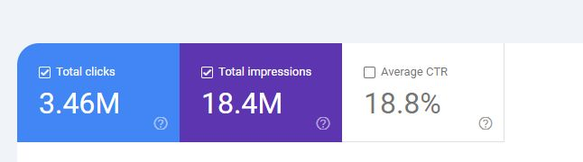

🔗 [View original post](https://x.com/alexgroberman/status/2095507511843664277)

---

### 🕐 13:35 UTC · @Wise1Philosophy

> the only enterprise AI account worth a follow on this app: A delivery orchestration platform that supplies FedEx estimated 7 to 8 months to rebuild their core system. We had the core rebuilt in 3.5 months with 2 engineers and 122 merged pull requests in the first 90 days. It was live in production by month 6. I want to walk through how, …

🔗 [View original post](https://x.com/alex_verem/status/2095505869777609209)

---

### 🕐 13:30 UTC · @Wise1Philosophy

🔗 [View original post](https://x.com/Mindsthatbuild/status/2095504743183347984)

---

### 🕐 13:21 UTC · @Wise1Philosophy

> If you want to make passive income: • Don&apos;t buy a rental property • Don&apos;t buy a vending machine • Don&apos;t invest in dividend stocks I’d buy this little device that makes money while you sleep. Here’s exactly how it works:

🔗 [View original post](https://x.com/gedamtekle/status/2095502489957089401)

---

### 🕐 13:14 UTC · @Wise1Philosophy

> The tool that just took #1 on Product Hunt is not another clip generator. 2024: jump across 5 tools to assemble script, clips, voiceover, captions, and a project file by hand. 2026: open one chat. @fotor_com Video Agent plans, generates, and lays the whole video on a multi-track timeline — and the layers stay editable. Meet Video Agent 👇 Media

🔗 [View original post](https://x.com/nrqa__/status/2095500591959257170)

---

### 🕐 13:13 UTC · @Wise1Philosophy

> Stop telling Claude, &quot;do this.&quot; Stop telling Claude, &quot;write code.&quot; Stop telling Claude, &quot;fix this error.&quot; You&apos;re actually treating a senior AI like a junior intern. Here are 8 prompts you can copy and paste directly:

🔗 [View original post](https://x.com/heyalexmoore/status/2095500347276165173)

---

### 🕐 13:04 UTC · @Wise1Philosophy

> Interesting: #Titans HC Robert Saleh said one of the first moves the team made in its nutrition overhaul was removing all seed oils from the building. He says players have appreciated it. Media

🔗 [View original post](https://x.com/HeyKimChong/status/2095498061762195532)

---

### 🕐 13:03 UTC · @Wise1Philosophy

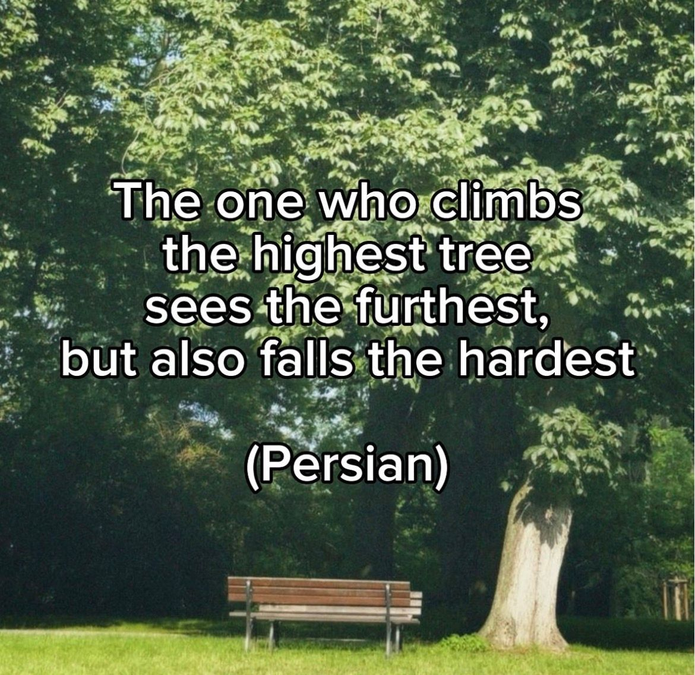

🔗 [View original post](https://x.com/Life__Mastery/status/2095497905658372187)

---

### 🕐 13:00 UTC · @Wise1Philosophy

> Le di una conversación de ChatGPT a Gamma y me devolvió un pitch deck completo. Yo no diseñé ni una sola diapositiva. Te enseño cómo funciona en 3 vídeos:

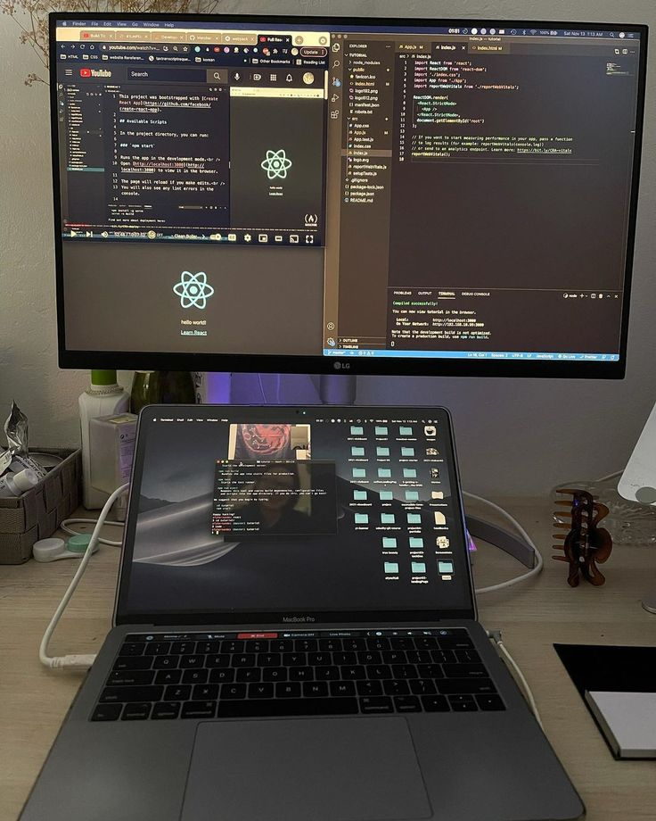

🔗 [View original post](https://x.com/MiguelMaestroIA/status/2095497162083758096)

---

### 🕐 13:00 UTC · @Wise1Philosophy

> If somebody dislikes you for no reason, maybe it&apos;s because your light irritates their darkness. Keep shining anyway.

🔗 [View original post](https://x.com/_Pammy_DS_/status/2095497060585759223)

---

### 🕐 12:57 UTC · @Wise1Philosophy

> This smart stand uses AI to find your ideal screen position and fix your posture for you. Interested in AI? Follow @AiEvolutio58513 and never fall behind. I track ChatGPT, Claude, and every tool quietly changing how we work and create, then hand you the tested signals. Media Elon Musk explains his 5-step algorithm for solving any problem: “The most common mistake of smart engineers is to optimize a thing that should not exist.” “I have this very basic first principles algorithm that I run as a mantra.” Elon breaks it down: Step 1: Question the requir…

🔗 [View original post](https://x.com/AiEvolutio58513/status/2095496305577783682)

---

### 🕐 12:45 UTC · @Wise1Philosophy

> this is the most underrated enterprise AI account on X: A delivery orchestration platform that supplies FedEx estimated 7 to 8 months to rebuild their core system. We had the core rebuilt in 3.5 months with 2 engineers and 122 merged pull requests in the first 90 days. It was live in production by month 6. I want to walk through how, …

🔗 [View original post](https://x.com/alex_prompter/status/2095493310227816947)

---

### 🕐 12:42 UTC · @Wise1Philosophy

> If you want to make passive income: • Don&apos;t buy a rental property • Don&apos;t buy a vending machine • Don&apos;t invest in dividend stocks I’d buy this little device that makes money while you sleep. Here’s exactly how it works:

🔗 [View original post](https://x.com/gedamtekle/status/2095492532096373110)

---

### 🕐 12:30 UTC · @Wise1Philosophy

🔗 [View original post](https://x.com/Wise1Philosophy/status/2095489701079593057)

---

### 🕐 12:15 UTC · @Wise1Philosophy

> A man on social media described why he never watches any of his friends stories. He gave one of the best reasons I&apos;ve ever heard.

🔗 [View original post](https://x.com/josh_uglyasf/status/2095485830408307087)

---

### 🕐 12:10 UTC · @Wise1Philosophy

> Stop telling ChatGPT “do this.” Stop telling ChatGPT “write code.” Stop telling ChatGPT “fix this error.” You’re treating a senior AI like a junior intern. Here are 8 prompts you can copy and paste:

🔗 [View original post](https://x.com/AriaWestcott/status/2095484521072280034)

---

### 🕐 12:10 UTC · @Wise1Philosophy

> Making $10k/month is not hard. All you need is: • One faceless Instagram page • A niche that hits a nerve • One hour each day • Free AI tools Here&apos;s the exact system I used to go from $0 to $10k/month in 6 months:

🔗 [View original post](https://x.com/erichustls/status/2095484485403869202)

---

### 🕐 12:05 UTC · @Wise1Philosophy

> Sleep is the most powerful medicine on Earth. It boosts memory, recovery, fat loss, &amp; even helps with anxiety. Here’s how to improve it with 7 simple steps: 1. Don’t sleep 8 hours Media

🔗 [View original post](https://x.com/HeyDoc_MD/status/2095483396382454028)

---

### 🕐 12:00 UTC · @Wise1Philosophy

> I like that the summary stays inside Google Calendar. That&apos;s the bit I&apos;d actually use every morning :) I STOPPED PLANNING MY DAY MANUALLY 9 meetings, 3 most important, no idea where to start. Sider AI caught all of it in 3 seconds and told me exactly what my day actually looked like: 👇

🔗 [View original post](https://x.com/Wise1Philosophy/status/2095482020436529388)

---

### 🕐 11:58 UTC · @Wise1Philosophy

> ENTERPRISE IT TEAMS ARE BLOCKING AI PRESENTATION TOOLS FOR TWO VERY GOOD REASONS: → Data leakage → Brand compliance You can’t dump unreleased product metrics, confidential client data, or Q3 financials into a public AI app just to save 30 minutes on a slide deck. And even if you could, the result usually looks like... AI :) Generic templates. Wrong fonts. Wrong layouts. Nothing like your actual brand. Presenton takes a completely different approach. It’s an Apache 2.0 open-source project with 9.2k GitHub stars. Give it your existing PowerPoint deck, and it turns the design into an AI-ready template. It analyzes: → Typography and colors → Slide layouts → Charts and metric cards → Headers and footers → Timelines and comparison blocks → Other reusable components Those pieces become a design system the AI can use to generate new slides in the same visual language. And you’re not stuck regenerating everything when something looks wrong. Presenton includes a visual canvas where you can edit text, move elements, resize components, and reuse blocks directly. The result? A normal, editable PPTX or PDF. You also control where everything runs: → Self-host with Docker → Run models locally with Ollama or LM Studio → Bring OpenAI, Gemini, Anthropic, Azure OpenAI, or Bedrock → Use the API or built-in MCP server So this isn’t another locked AI presentation SaaS. It’s open-source infrastructure for generating editable, brand-consistent presentations on your own terms. And yes.. it&apos;s 100% FREE and open-source. Repo in 🧵↓ Media

🔗 [View original post](https://x.com/DataChaz/status/2095481555150045479)

---

### 🕐 11:43 UTC · @Wise1Philosophy

> Breaking: Claude Fable 5.1 is insane. And People are already building mind-blowing things with it. 10 wild examples so far: 1. GTA-style multiplayer clone in NYC Media

🔗 [View original post](https://x.com/TheAIColony/status/2095477825176220046)

---

### 🕐 11:41 UTC · @Wise1Philosophy

> A Harvard study looking at 2000+ people on a carnivore diet

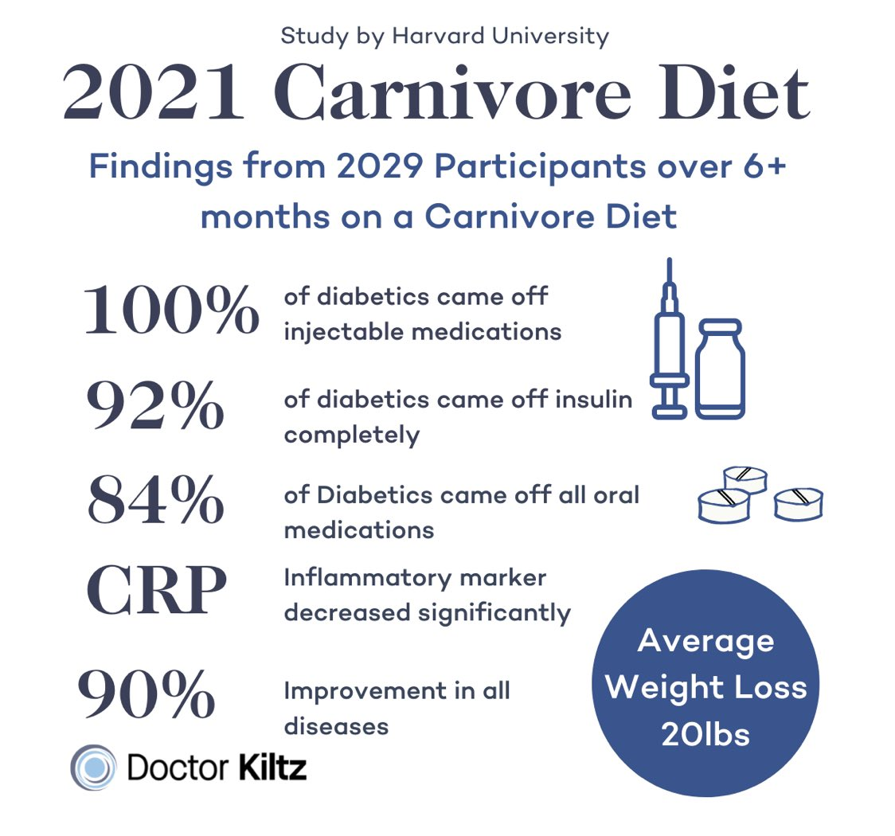

🔗 [View original post](https://x.com/RasmusNorbergg/status/2095477158915584503)

---

### 🕐 11:30 UTC · @Wise1Philosophy

🔗 [View original post](https://x.com/Daily__wisdom_/status/2095474515656466563)

---

### 🕐 11:15 UTC · @Wise1Philosophy

> People underestimate the power of great prompts. Here are 5 frameworks you can copy &amp; paste: [ bookmark 🔖 this post for later ] 1 - R-A-I-N ➟ Act as a (ROLE) ➟ State the (AIM) ➟ Use the provided (INPUT) ➟ Hit the (NUMERIC TARGET) ➟ In this (FORMAT) R-A-I-N Example: ➟ ROLE: UX design lead ➟ AIM: Redesign e-commerce checkout to lower cart abandonment by 25% ➟ INPUT: Analytics data ➟ NUMERIC TARGET: 25% decrease ➟ FORMAT: Mobile wireframes + conversion metrics table 2 - C-L-A-R ➟ Given the (CONTEXT) ➟ List any (LIMITS) ➟ Describe the (ACTION) ➟ Define the expected (RESULT) C-L-A-R Example: ➟ CONTEXT: Warehouse delay logs ➟ LIMITS: Focus on the top two causes ➟ ACTION: Quantify impact + propose three fixes ➟ RESULT: One-page memo 3 - F-L-O-W ➟ Specify the (FUNCTION) ➟ Set the audience (LEVEL) ➟ Define the (OUTPUT) ➟ Clarify the (WIN METRIC) F-L-O-W Example: ➟ FUNCTION: Career copywriter ➟ LEVEL: Recent graduates ➟ OUTPUT: 900-word article with 4 job search tips ➟ WIN METRIC: 1.5% keyword density + CTA checklist 4 - P-I-V-O ➟ State the (PROBLEM) ➟ Provide key (INSIGHTS) ➟ Choose the (VOICE) ➟ Outline the desired (OUTCOME) P-I-V-O Example: ➟ PROBLEM: Mobile app adoption is slowing ➟ INSIGHTS: Identify friction points + share 3 user insights ➟ VOICE: Persuasive ➟ OUTCOME: Two strategies to regain growth in 60 days 5 - S-E-E-D ➟ Describe the (SITUATION) ➟ Define the (END GOAL) ➟ Supply illustrative (EXAMPLES) ➟ List the (DELIVERABLES) S-E-E-D Example: ➟ SITUATION: Create a 6-week communication program ➟ END GOAL: Skills in listening, feedback, conflict resolution, presence, alignment ➟ EXAMPLES: Weekly remote-team exercises scored on clarity &amp; impact ➟ DELIVERABLES: Assessment framework + marketing hook 📌 Get Advanced ChatGPT Guide (free): https://bit.ly/3StIB3z 👉 Follow me @AndrewBolis for more and 🔄 Repost this to help others use AI

![People underestimate the power of great prompts. Here are 5 frameworks you can copy &amp; paste: [ bookmark 🔖 this post for later ] 1 - R-A-I-N ➟ Act as a (ROLE) ➟ State the (AIM) ➟ Use the provided (](../../../../assets/images/2026/09/03/2095470622734446834-1.png)

🔗 [View original post](https://x.com/AndrewBolis/status/2095470622734446834)

---

### 🕐 11:12 UTC · @Wise1Philosophy

> Less than 48 hours ago, Anthropic dropped Claude Fable 5.1. And people are already one-shotting games, building 3D worlds + creating insane simulations with it. 10 wild examples:

🔗 [View original post](https://x.com/AIHighlight/status/2095470045803491368)

---

### 🕐 11:06 UTC · @Wise1Philosophy

> SpaceXAI engineer just released a free 1-hour workshop on how to build a team of Grok Bots from scratch: 5:56 - build your first Grok Bot 13:13 - ship it to 15 bots and build a CEO bot 37:07 - build teams of agents 44:46 - put it all together to make a system that runs itself The real difference isn&apos;t better prompts. It&apos;s turning one Bot into a team that delegates work without you. Watch it today, learn the structure. Then read the core bot setup, below. Media https://x.com/i/article/2093423323946647552

🔗 [View original post](https://x.com/godofprompt/status/2095468428802847201)

---

### 🕐 11:02 UTC · @Wise1Philosophy

🔗 [View original post](https://x.com/apex_mentality_/status/2095467385650041048)

---

### 🕐 10:58 UTC · @Wise1Philosophy

> Ilya Sutskever just explained to the AI industry why the scaling era is ending. One word powered the last five years. That same word is cracking. Sutskever: &quot;Scaling is just one word, but it&apos;s such a powerful word because it informs people what to do.&quot; For half a decade, that word substituted for an entire culture of research. You didn&apos;t need genuine discovery. You needed a larger check. Sutskever: &quot;If you mix some compute with some data into a neural net of a certain size, you will get results, and you will know that it will be better if you just scale the recipe up.&quot; Not science. A recipe. Sutskever: &quot;Companies love this because it gives you a very low risk way of investing your resources.&quot; The most consequential technology in modern history ran on the logic of a franchise operation. Same recipe. More locations. More ingredients. Predictable margins. You didn&apos;t need visionaries. You needed operations people who could sign off on hardware orders. But every recipe has a shelf life. Sutskever: &quot;At some point though, pre-training will run out of data. The data is very clearly finite.&quot; Five years of data centers. Five years of headcount. Five years of fundraising narratives. Constructed on something with an expiration date. Sutskever: &quot;I don&apos;t think that&apos;s true.&quot; The co-founder of OpenAI. The architect of the breakthroughs that sparked this whole movement. Saying capital alone won&apos;t get us there. Sutskever: &quot;In some sense we are back to the age of research.&quot; Most companies in this race were scaling operations pretending to be research labs. They built for throughput. Not for insight. They hired executors. Not explorers. Every investor deck. Every talent strategy. Every product roadmap. Built on one quiet assumption. That the recipe would hold forever. It isn&apos;t holding. And every company that spent five years perfecting how to spend money is about to confront the same problem. The next era runs on something capital cannot manufacture. An original idea. Interested in AI? Follow @AiEvolutio58513 and never fall behind. I track ChatGPT, Claude, and every tool quietly changing how we work and create, then hand you the tested signals. Media Mark Zuckerberg is building Meta&apos;s superintelligence lab the way a startup founder would. He shared the principles behind how he put the team together: &quot;You don&apos;t need many hundreds of people. You need 50 to 100 people. It&apos;s a group science project who can keep the whole thing in…

🔗 [View original post](https://x.com/AiEvolutio58513/status/2095466410046832962)

---

### 🕐 10:57 UTC · @Wise1Philosophy

> best account on X if you want to see what enterprise AI actually looks like in production: A delivery orchestration platform that supplies FedEx estimated 7 to 8 months to rebuild their core system. We had the core rebuilt in 3.5 months with 2 engineers and 122 merged pull requests in the first 90 days. It was live in production by month 6. I want to walk through how, …

🔗 [View original post](https://x.com/alex_prompter/status/2095466195432407254)

---

### 🕐 10:57 UTC · @Wise1Philosophy

> FOUND AN OPEN-SOURCE PLATFORM THAT TURNS MESSY PDFs INTO CLEAN JSON 7,000+ GitHub stars, and somehow this one completely flew under my radar. It’s called Unstract. The idea is simple: Stop writing regex and rebuilding extraction templates every time a document format changes. Instead, describe the data you want in natural language. Unstract handles the rest. Invoices, bank statements, financial reports, insurance docs, forms, scanned PDFs... all of it. For devs, the workflow is especially neat: → prompt Studio for testing prompts and defining schemas → deploy extraction as a REST API or ETL pipeline → handle rotated scans, ugly tables, and complex layouts And you’re not locked into a specific model. Use OpenAI. Use Anthropic... or run the whole thing locally with @ollama If you regularly need to turn unstructured documents into structured data, this removes a ridiculous amount of boilerplate. 100% free and open-source. Repo + webinar link in 🧵↓ Media

🔗 [View original post](https://x.com/DataChaz/status/2095466105246720414)

---

### 🕐 10:46 UTC · @Wise1Philosophy

> WTF happened since 2000 that caused average testosterone to fall almost 30%

🔗 [View original post](https://x.com/HeyKimChong/status/2095463317687214225)

---

### 🕐 10:30 UTC · @Wise1Philosophy

🔗 [View original post](https://x.com/yeti_mind/status/2095459398319530241)

---

### 🕐 10:29 UTC · @Wise1Philosophy

> your body will never be this recoverable again. you can still build it, break it, and rebuild it faster than you ever will at 40. every year you wait to get in shape is a year you&apos;re borrowing against a loan that gets harder to repay. start now. not when you feel ready. now.

🔗 [View original post](https://x.com/DPro_Coach/status/2095459281902637441)

---

### 🕐 10:16 UTC · @Wise1Philosophy

> A delivery orchestration platform that supplies FedEx estimated 7 to 8 months to rebuild their core system. We had the core rebuilt in 3.5 months with 2 engineers and 122 merged pull requests in the first 90 days. It was live in production by month 6. I want to walk through how, because &quot;we used AI and it was faster&quot; doesn&apos;t help anyone. Their codebase had real users, real logistics operations, and real consequences if something broke. The system bills shippers and pays couriers. This is brownfield, not a weekend prototype demo. Week one, we didn&apos;t write code. We scanned the entire repo and built a knowledge graph: markdown files documenting every module, dependency, data flow, and domain term. Our agents read that graph before touching anything. Teams skip this constantly. They point an agent at a repo, hand it a ticket, and get code that compiles but misunderstands the architecture. When someone says &quot;AI doesn&apos;t work on our codebase,&quot; they almost always skipped context acquisition. Every ticket ran a six-step loop: define, spec, plan, implement, test, document. The agent handles about 90% of code generation. A senior engineer reviews every PR, and nothing merges unless they can verify it, explain it, and debug it without the agent. We call that the V.U.E. gate. The 50% time reduction came from three things: upfront context eliminated false starts, the agent handled mechanical coding so engineers focused on design and review, and tight spec-to-PR discipline kept scope from drifting. 104 of those 122 PRs merged with fewer than 5 reviewer comments. Volume without review friction is the number I&apos;d check on any AI team. AI compute: about $200 per developer per month. Their CTO called our pod the &quot;top performing team&quot; inside the company. Their tech lead called them &quot;true engineers capable of closing requirement gaps through fast domain discovery and iteration.&quot; Both engineers got discretionary bonuses, twice. A year on, the same two engineers are still shipping for them. More than 330 PRs by the time it went live. That&apos;s what our Velocity Framework was built for.

🔗 [View original post](https://x.com/mardehaym/status/2095455919337333008)

---

### 🕐 10:04 UTC · @Wise1Philosophy

> Google Gemini can now edit your videos for you and make amazing content in seconds Here are 10 prompts that do it all (save this now)👇

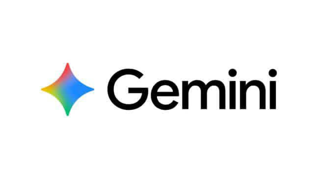

🔗 [View original post](https://x.com/AIFrontliner/status/2095452991348265290)

---

### 🕐 10:00 UTC · @Wise1Philosophy

> ✅ Claude Code ✅ Claude Cowork ✅ Claude Design ✅ Claude Finance ✅ Claude Science ✅ Claude Teachers ✅ Claude Academy ✅ Claude Commerce ⬜ Claude Marketing ⬜ Claude Legal ⬜ Claude HR ⬜ Claude Accounting ⬜ Claude Farming ⬜ Claude Forestry ⬜ Claude Climate Media We&apos;re open-sourcing Claude Commerce Agents. This is a blueprint for building shopping and merchant agents, with reference implementations across retail, travel, telecom, and entertainment.

🔗 [View original post](https://x.com/alex_verem/status/2095451868155752627)

---

### 🕐 09:30 UTC · @Wise1Philosophy

🔗 [View original post](https://x.com/Ant_Philosophy/status/2095444264935149694)

---

### 🕐 09:09 UTC · @Wise1Philosophy

> just in: traders are now earning credit card points buying memecoins on robinhood users of robinhood wallet and social trading app fomo are buying memecoins with visa and mastercard credit cards, apple pay or google pay, directly through crossmint, without even a separate kyc check the block&apos;s tests found the purchases were classified as &quot;digital goods/media&quot; instead of crypto transactions, letting users earn credit card points or cash back chase says the transactions were incorrectly classified and has asked visa to investigate, while the new york attorney general&apos;s office is also reviewing the matter

🔗 [View original post](https://x.com/daveydefi/status/2095439010432684128)

---

### 🕐 09:09 UTC · @Wise1Philosophy

> Mix 1 tablespoon of apple cider vinegar with a little water and drink it every single day. It&apos;s a simple habit that can benefit your digestive system, blood sugar, and microbiome.

🔗 [View original post](https://x.com/HeyKimChong/status/2095438902509322612)

---

### 🕐 08:41 UTC · @Wise1Philosophy

> The biggest hardware jump of the half fits in one line. 10x the performance at one tenth the cost per token. That&apos;s the new generation of AI chips, and it changes the economics of everything built on top of them. More insight on this are in the H1 2026 Industry Report:https://bit.ly/StateofAI2026

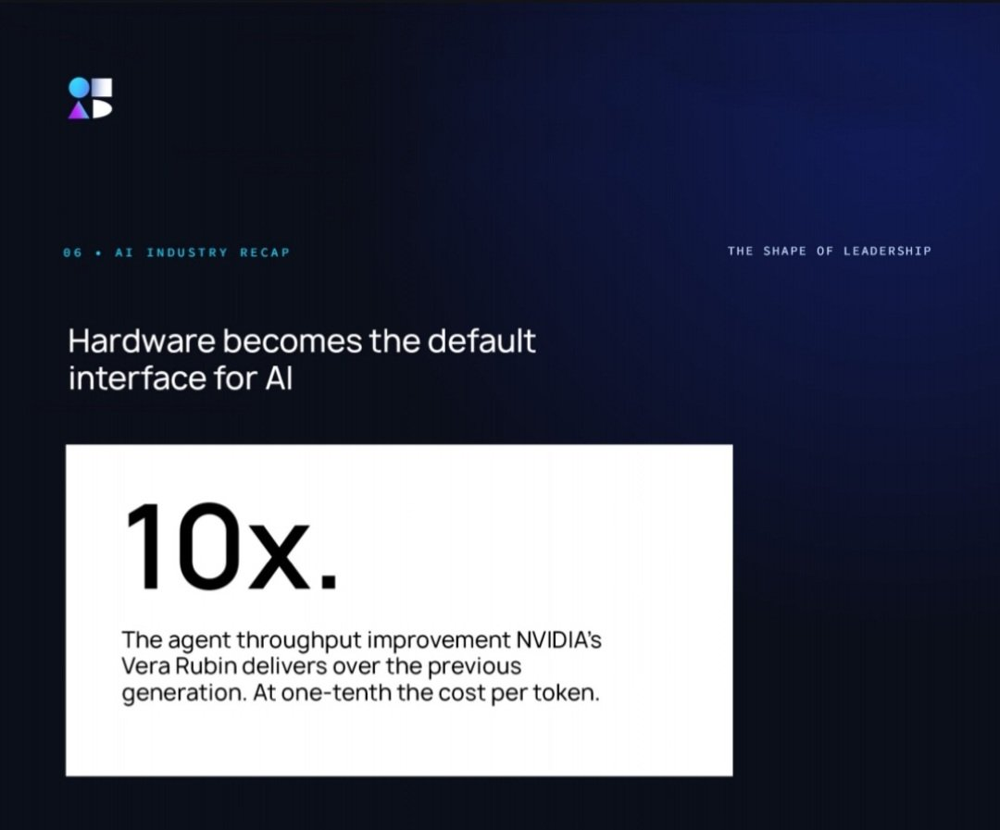

🔗 [View original post](https://x.com/TheAIColonyRD/status/2095432079316033658)

---

### 🕐 08:38 UTC · @Wise1Philosophy

> Anthropic really said here, stop reinventing the wheel I had to write the same Claude Code prompt 40 times in one month. Good news! Anthropic already made them. The official Claude Code prompts are sorted by task and role in the documentation and are ready to be copied and pasted. These prompts were drawn from what our teams use on a…

🔗 [View original post](https://x.com/Wise1Philosophy/status/2095431237791895782)

---

### 🕐 08:30 UTC · @Wise1Philosophy

🔗 [View original post](https://x.com/Mindsthatbuild/status/2095429168892703099)

---

### 🕐 08:17 UTC · @Wise1Philosophy

> Learning AI properly shouldn&apos;t depend on whether you can afford it. A fully funded programme is opening in a few days. Learn from experts, build real projects, earn a recognised certificate, pay nothing. Who wants in?

🔗 [View original post](https://x.com/Shawnife/status/2095426049303597273)

---

### 🕐 08:06 UTC · @Wise1Philosophy

> The idea that high doses of vitamin D are always toxic is a myth perpetuated by industries protecting their bottom line. Science shows that therapeutic levels can save lives.

🔗 [View original post](https://x.com/RasmusNorbergg/status/2095423048216404083)

---

### 🕐 08:01 UTC · @Wise1Philosophy

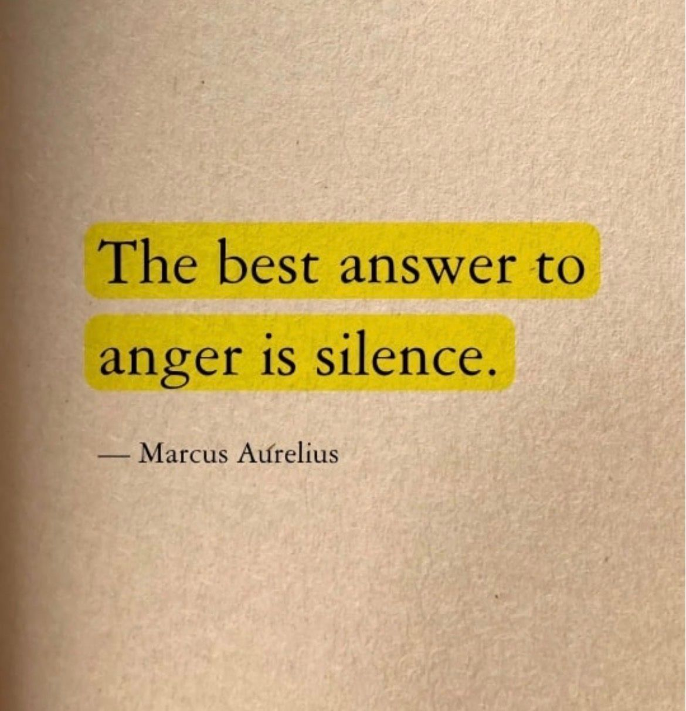

🔗 [View original post](https://x.com/Wise1Philosophy/status/2095421945575547335)

---

### 🕐 08:00 UTC · @Wise1Philosophy

> Your cortisol levels reach their peak and you don&apos;t even notice it. These are the 10 signs that prove it: 1. Twitching eyelids Media

🔗 [View original post](https://x.com/RasmusNorbergg/status/2095421559284617361)

---

### 🕐 07:53 UTC · @Wise1Philosophy

> There are tens of thousands of supplements on a shelf and most of them are decoys. Four are worth the money, and I read the back of the bottle on all four. 1. Magnesium glycinate

🔗 [View original post](https://x.com/Sophiaz6xo/status/2095419784422912168)

---

### 🕐 07:48 UTC · @Wise1Philosophy

> Signs you have insulin resistance (&amp; don’t know it): 1. Foam when you piss.

🔗 [View original post](https://x.com/HeyKimChong/status/2095418522386223574)

---

### 🕐 07:38 UTC · @Wise1Philosophy

> Foods that burn belly fat specifically. 1. Green tea

🔗 [View original post](https://x.com/ClaraBrooksjz/status/2095416001559195755)

---

### 🕐 07:30 UTC · @Wise1Philosophy

🔗 [View original post](https://x.com/Daily__wisdom_/status/2095414075383562325)

---

### 🕐 07:30 UTC · @Wise1Philosophy

> Your body will forgive you for skipping a workout, eating the pizza, one bad night, losing motivation for a week. It will not forgive you for these four: 1. Sitting still for nine hours and calling the 6pm session even

🔗 [View original post](https://x.com/MarkoSilva291/status/2095413992055562517)

---

### 🕐 07:24 UTC · @Wise1Philosophy

> Walking = lose weight Walking = lowers blood sugar Walking = reduce your risk of an early death. 8 simple rules worth following: 1. Forget 10,000 steps

🔗 [View original post](https://x.com/TinaaDeJong/status/2095412478306091440)

---

### 🕐 07:12 UTC · @Wise1Philosophy

> 4 supplements I am getting my aging parents on: Starting with creatine. You should take it, your friends should take it, and your parents should too. 5g every day, forever. No loading week required. Media

🔗 [View original post](https://x.com/JasperKasparov/status/2095409488111284230)

---

### 🕐 07:03 UTC · @Wise1Philosophy

> Losing fat in your hips and belly is extremely simple once you realize this:

🔗 [View original post](https://x.com/CoachLucHerrera/status/2095407194095386976)

---

### 🕐 07:01 UTC · @Wise1Philosophy

🔗 [View original post](https://x.com/apex_mentality_/status/2095406732683956457)

---

### 🕐 06:50 UTC · @Wise1Philosophy

> Signs you have insulin resistance (and don&apos;t realize it): 1. Foam when you pee.

🔗 [View original post](https://x.com/Marc0sRomano/status/2095403926560690276)

---

### 🕐 06:38 UTC · @Wise1Philosophy

> Society eats so much junk food that eating real food is considered dieting.

🔗 [View original post](https://x.com/HeyKimChong/status/2095400902035431784)

---

### 🕐 06:36 UTC · @Wise1Philosophy

> A heart doctor told me: “There are 3 types of people who never get heart attacks.” 1. Don&apos;t be peeing at 3 AM Media

🔗 [View original post](https://x.com/mind_and_beauty/status/2095400417257762818)

---

### 🕐 06:30 UTC · @Wise1Philosophy

🔗 [View original post](https://x.com/yeti_mind/status/2095398967336964605)

---

### 🕐 06:30 UTC · @Wise1Philosophy

> I DON&apos;T UNDERSTAND WHY PEOPLE DON&apos;T USE CHATGPT FOR STOCK TRADING. HERE ARE 10 PROMPTS TO USE IN STOCK BUYING AND SELLING AND INVESTING:

🔗 [View original post](https://x.com/kumud_deepali/status/2095398910898696241)

---

### 🕐 06:30 UTC · @Wise1Philosophy

> Your body has emergency switches built into it. Most people were never shown where they are. Here is what you can reset in seconds, and the two things worth fixing underneath: 1. Lying awake with a busy head

🔗 [View original post](https://x.com/yourcamilavega/status/2095398903114080309)

---

### 🕐 06:25 UTC · @Wise1Philosophy

> Your resting heart rate shows the whole story. 95+ bpm - Heart is straining just to keep you upright. 90 bpm - Sedentary, unwell &amp; stressed. 80 bpm -

🔗 [View original post](https://x.com/MagnusLindbrg/status/2095397630541259231)

---

### 🕐 06:23 UTC · @Wise1Philosophy

> If you want to avoid blood clots, strokes and heart attacks, especially past 40. Eight things worth your attention: 1. Instant ramen

🔗 [View original post](https://x.com/HeyEleanorr/status/2095397127161888926)

---

### 🕐 06:15 UTC · @Wise1Philosophy

> I thought fatty liver was a drinking problem. It is a sugar problem, it affects about one in three adults, and almost none of them know they have it. Eight rules I follow now: 1. Drink your coffee

🔗 [View original post](https://x.com/dzejlacathleen/status/2095395114600591737)

---

### 🕐 06:09 UTC · @Wise1Philosophy

> A Heart doctor confessed: “There are 3 kinds of people who never get heart attacks.” 1. Don&apos;t get up to pee at 3 AM Media

🔗 [View original post](https://x.com/RafaelNasriX/status/2095393622917345295)

---

### 🕐 06:06 UTC · @Wise1Philosophy

> Society has become so sedentary that a 20 minute walk is now considered exercise.

🔗 [View original post](https://x.com/RasmusNorbergg/status/2095392849139523744)

---

### 🕐 06:04 UTC · @Wise1Philosophy

> A neurologist shocked me when he said: &quot;You age because your body stops making Nitric Oxide. Without it, blood pressure rises, erections fail, and Alzheimer&apos;s happens.&quot; Here&apos;s the 5-step protocol to boost it naturally: 1. Stop using mouthwash

🔗 [View original post](https://x.com/CoachJulianNiko/status/2095392345617555693)

---

### 🕐 06:00 UTC · @Wise1Philosophy

🔗 [View original post](https://x.com/Life__Mastery/status/2095391495259849122)

---

### 🕐 06:00 UTC · @Wise1Philosophy

> Tu forma de trabajar ahora: Tarea → ChatGPT → prompt → respuesta → copiar → corregir → ejecutar. Tu forma de trabajar después de este WEBINAR GRATUITO: Objetivo → sistema de IA → trabajo terminado. Media

🔗 [View original post](https://x.com/SofiaSici/status/2095391463664181348)

---

### 🕐 04:33 UTC · @Wise1Philosophy

> Signs cortisol is quietly damaging your body: 1. Trembling eyelids Media

🔗 [View original post](https://x.com/LongevityCode_/status/2095369565601779990)

---

### 🕐 04:27 UTC · @Wise1Philosophy

> Waking up at night to piss and thinking it&apos;s because you drank water before bed. It&apos;s not the water. Here’s actually why (&amp; what stops it): 1. Your blood sugar crashes at 1am, 3am, 5am.

🔗 [View original post](https://x.com/Fitby_Chandler/status/2095368072848937332)

---

### 🕐 04:21 UTC · @Wise1Philosophy

> Heart Attack = Blood sugar Heart Attack = Insulin resistance Heart Attack = No.1 killer worldwide. 5 simple rules to protect your heart: 1. Don&apos;t go pee at 3 AM Media

🔗 [View original post](https://x.com/_Gut_Laboratory/status/2095366629253411221)

---

### 🕐 04:13 UTC · @Wise1Philosophy

> I was 17 kg overweight, had a huge belly &amp; double chin, but I needed to reach 13% body fat for my wedding. I did it with these 25 rules: RULE 1. STOP RUNNING (for your knees).

🔗 [View original post](https://x.com/CoachWillStone/status/2095364590024745462)

---

### 🕐 04:11 UTC · @Wise1Philosophy

> Walking is the most underrated medicine on Earth. It lowers blood sugar, blood pressure, anxiety, and even your risk of early death. Here&apos;s how to get the full effect with 8 simple steps: 1. Don&apos;t chase 10,000 steps. Media

🔗 [View original post](https://x.com/BeBetterMan_/status/2095364112893329550)

---

### 🕐 04:09 UTC · @Wise1Philosophy

> A cardiologist shocked me when he said: &quot;You age because your body stops producing Nitric Oxide. Without it, your blood pressure rises, erections fail, and Alzheimer&apos;s happens&quot; This is the 5-step protocol to boost it naturally: 1. Stop using mouthwash

🔗 [View original post](https://x.com/TheFastedState/status/2095363582926233973)

---

### 🕐 03:52 UTC · @Wise1Philosophy

> A Harvard biology professor said: &quot;All the supplements on the shelf are not worth your money. There are only 3 that actually work. I can bet my career on it.&quot; 1) Magnesium glycinate.

🔗 [View original post](https://x.com/CoachDanCole_/status/2095359232455676066)

---

### 🕐 03:36 UTC · @Wise1Philosophy

> If you want to avoid heart clots, strokes, and heart attacks (especially if you&apos;re over 40) Here are 8 things you must pay attention to: 8. Energy Drink

🔗 [View original post](https://x.com/Dr_Biohacker/status/2095355140123562385)

---
