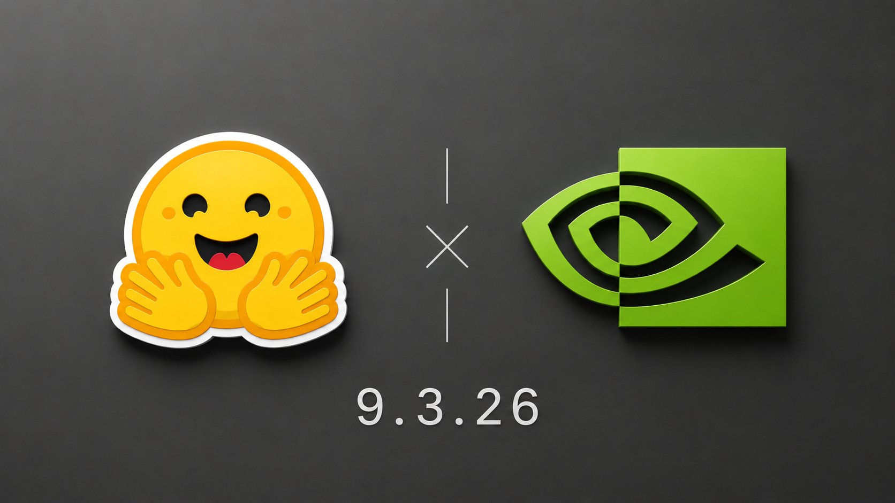
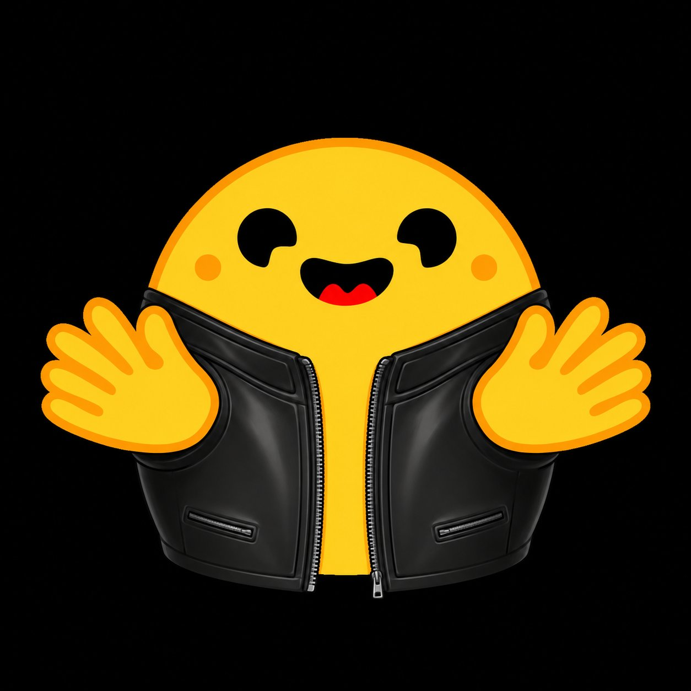
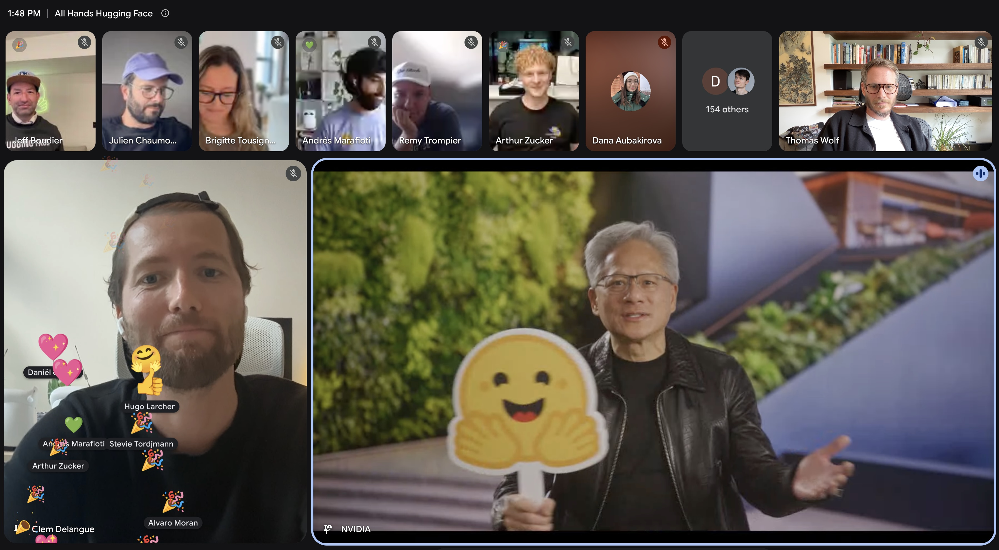
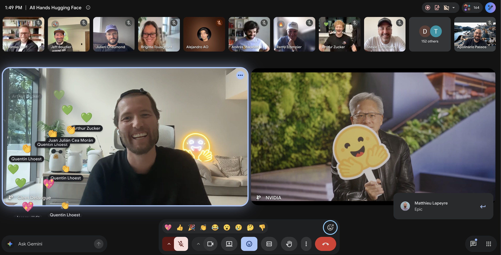

# 🐦 @_akhaliq

## 📅 September 03, 2026

> 4 post(s) archived.

---

### 🕐 12:23 UTC · @_akhaliq

> Super happy to officially announce that we are a̶c̶q̶u̶i̶r̶i̶n̶g̶ joining forces with @nvidia 🔥 Here is a more personal take: AI is at an inflection point. Open source AI can become less relevant in the coming years if the big closed labs run away with it, OR it can become the foundational fabric of the next phase of human civilization. Those are vastly different outcomes, and we need the critical mass to ensure we give our collective best shot to the second outcome. Given @JensenHuang&apos;s stance on open source AI and how he stepped up to defend it when it was under threat earlier in the summer, NVIDIA was the only partner we truly considered. HF will remain an independently run, neutral platform. This gives fuel to our long-term vision and mission of unlocking the community&apos;s progress to ensure that AI, which is the greatest breakthrough of our lifetime, is accessible to as many people as possible.

🔗 [View original post](https://x.com/julien_c/status/2095487938909876366)

---

### 🕐 12:22 UTC · @_akhaliq

> Yeah! It&apos;s official now.

🔗 [View original post](https://x.com/Gradio/status/2095487532196905284)

---

### 🕐 12:10 UTC · @_akhaliq

> So happy to finally share the news in person It’s been a wild ride for Hugging Face. We certainly did not anticipate, back in 2016, as a tiny team of scrappy underdogs, that the field would grow so much or that the impact we could have on it would become so massive. I remember @julien_c joking that « code will be a subset of ML » several years ago. The joke turned out to be true, and the pleasure we’ve had being part of this transformation and pushing an alternative vision of AI as open, collaborative and distributed has been and still is immense. We’ve always built things seriously while not taking ourselves too seriously at Hugging Face (special congrats if you find the Hugging Face and Nvidia references hidden in our $12,930,300,000 acquisition price), and we plan to keep doing what we&apos;ve been doing, just at a much bigger scale, backed by the resources, expertise and drive of Nvidia. And to be clear, nothing changes for our users today. No company in the world has been a more natural fit with our mission than Nvidia. From open-source, open-weights and open science to robotics and AI for science, they have been close partners across everything we care about. So when Jensen offered @ClementDelangue the opportunity to double down on building the Hub as an open, independent and compute agnostic platform, we decided the time was right to start the next 10 years of our journey together. We’re at an important inflection point for open-source AI, where scale and compute are becoming increasingly essential. We’re excited to have the resources to push further, build more ambitiously, and bring you even more projects and news in the coming months.

🔗 [View original post](https://x.com/Thom_Wolf/status/2095484543541068005)

---

### 🕐 12:04 UTC · @_akhaliq

> Super happy to share our intention to join forces with NVIDIA in a $12,930,300,000 acquisition 💛💚 10 years after starting Hugging Face, open-source AI is at an inflection point. Thanks to the community, we’ve shown that it can be a complement, and even an alternative, to closed-source APIs. But for it to happen at larger scale, it needs more compute, more support, more collaboration and more visibility. That’s why we went to talk to Jensen, who offered to do exactly that with us. In addition to doubling down on NVIDIA’s massive contributions to open-source AI (I called them the “King of American open-source AI” earlier this year), they’ve committed to strongly supporting Hugging Face and our mission while keeping the platform open, independent and compute agnostic. The founders and the team are all staying to keep pushing this mission forward. Together, we think we can make open source the default way to build AI, with the goal of empowering 100 million AI builders to own their intelligence rather than rent it. Excited about the next 10 years! 🤗🤗🤗

🔗 [View original post](https://x.com/ClementDelangue/status/2095482998674112733)

---
