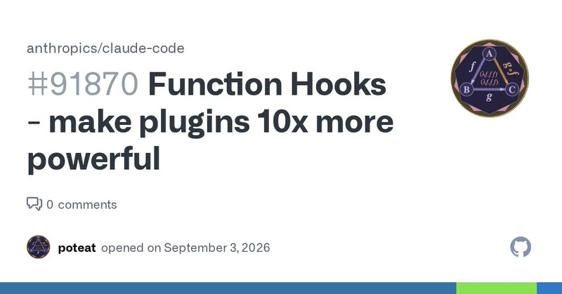

# 🐦 @bcherny

## 📅 September 03, 2026

> 2 post(s) archived.

---

### 🕐 19:11 UTC · @bcherny

> Your input needed: would you use this? This is an early look at how we&apos;re thinking about making Claude Code way more extensible. It&apos;s a little crazy, and very exciting. More details here: https://github.com/anthropics/claude-code/issues/91870 We&apos;re exploring a new way to let you extend and customize Claude Code: Function Hooks. Here&apos;s a couple videos showing what you&apos;d be able to do. It hasn&apos;t shipped yet, we&apos;d love feedback on this on our GitHub issue.

🔗 [View original post](https://x.com/bcherny/status/2095590515765060076)

---

### 🕐 05:10 UTC · @bcherny

> Background computer use is underrated Claude can now use your computer in the background in Claude Cowork and Claude Code. Give it something to do on your desktop and Claude clicks, types, and opens apps just like you would, while you work on something else.

🔗 [View original post](https://x.com/bcherny/status/2095378890370019683)

---
