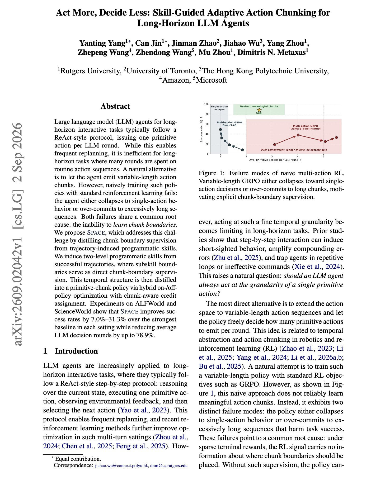
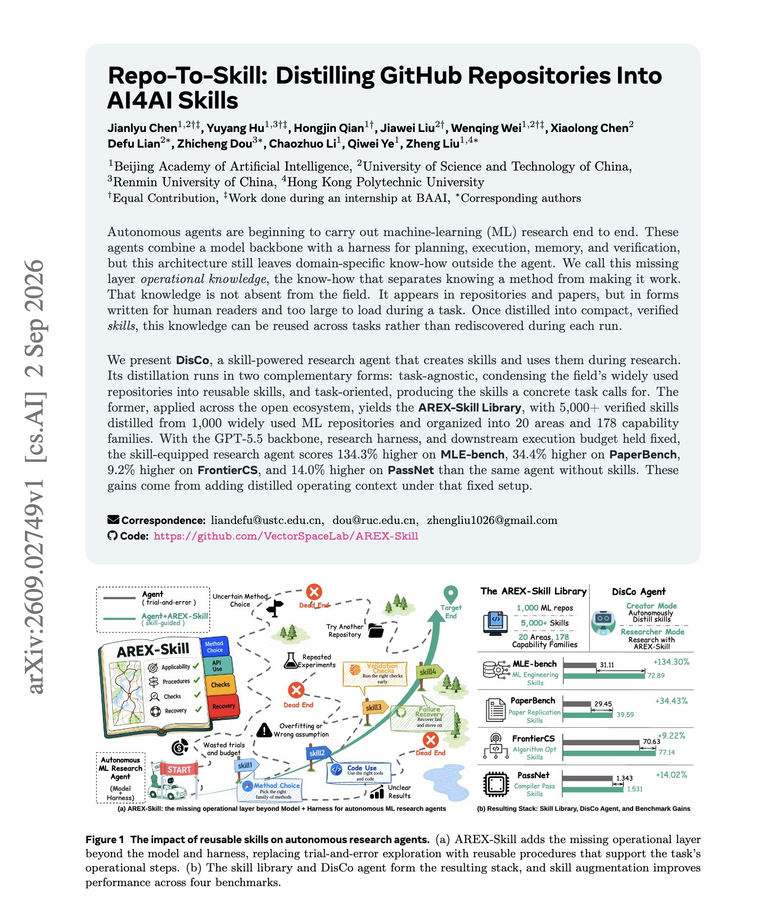

# 🐦 @dair_ai

## 📅 September 03, 2026

> 10 post(s) archived.

---

### 🕐 21:00 UTC · @dair_ai

> Brilliant paper on long-horizon agents. They cut 78.9% of an agent&apos;s LLM calls while raising its success rate. Here is how: It turns out that ReAct issues one primitive action per model round. That allows frequent replanning, and on long-horizon tasks it spends most of the episode re-deciding routine sequences that were never in doubt. Training an agent to emit variable-length action chunks with standard RL fails because the policy never learns where a chunk should end, so it either falls back to single actions or commits to sequences that run far too long. SPACE derives the supervision from data it already has. It induces two-level programmatic skills from successful trajectories and uses the subskill boundaries as direct chunk-boundary labels, then distills the temporal structure into a primitive-chunk policy with hybrid on-policy and off-policy optimization and chunk-aware credit assignment. On ALFWorld and ScienceWorld it improves success rates by 7.0 to 31.3% over the strongest baseline in each setting while reducing average LLM decision rounds by up to 78.9%. Paper: https://arxiv.org/abs/2609.02042 Chat with Paper: https://academy.dair.ai/papers/act-more-decide-less-skill-guided-adaptive-action-chunking-for-long-horizon-llm-2609.02042

🔗 [View original post](https://x.com/dair_ai/status/2095617916284936502)

---

### 🕐 20:47 UTC · @dair_ai

> Great weekend read. https://x.com/omarsar0/status/2095612805496164801?s=20 Banger paper from Google DeepMind and colleagues. (bookmark it) A model reads its entire KV cache on every generated token, even though it ends up attending to a tiny slice of it. In other words, if you ask about one detail from a 1M-token conversation the global attention layers…

🔗 [View original post](https://x.com/dair_ai/status/2095614750604267678)

---

### 🕐 19:55 UTC · @dair_ai

> I had to look twice at this table. I know they are just numbers, but how the heck do you beat a competitor model released just a couple of days ago on some of the toughest benchmarks out there? Something is different about GPT-6 Astra. GPT-6 Astra is state-of-the-art on FrontierMath Tier 4, ARC-AGI 3, and TerminalBench-4.0. GPT‑6 Astra is also a major advance for scientific discovery, with state-of-the-art performance on Terminal-Bench Science 0.1 and HealthBench Pro.

🔗 [View original post](https://x.com/omarsar0/status/2095601652157821306)

---

### 🕐 18:15 UTC · @dair_ai

> Impressive tool to explore frontier AI capabilities. Martian&apos;s AI Frontier lets you compare 44 LLMs by measured cost, quality, and reliability, then see how routing and repeated sampling change the frontier. I like this because builders can choose model combinations using real tradeoffs across coding, reasoning, factuality, and agentic tasks. We got 46% fewer errors than the single best LLM across the 16 most used benchmarks (TerminalBench, LiveCodeBench, etc). Here&apos;s how that&apos;s possible and what each model can achieve when used optimally (every benchmarks misses the majority of model capabilities) 👇 Interactive Site…

🔗 [View original post](https://x.com/omarsar0/status/2095576401709531416)

---

### 🕐 17:09 UTC · @dair_ai

> The @bot team gave me 50 codes to hand out to my followers, each worth $200. That&apos;s a month free of the $200/month plan, or $200 in credits. Just comment with your best/most fun use cases or things you’d like to try in Grok Bot. Grok Bot changed how I work with agents. I stopped overthinking. I hand a task to a bot, and it manages most of the work from there. My favorite bot so far: My orchestrator bot runs my higher-level agent team. It assigns work across specialized bots and keeps everything organized, so I run many tasks in parallel instead of babysitting one at a time.

🔗 [View original post](https://x.com/omarsar0/status/2095559818337538556)

---

### 🕐 15:50 UTC · @dair_ai

> Banger paper from BAAI. If you are building research agents, this one is worth your time. (bookmark it) They find that adding skills scores 134.3% higher on MLE-bench, 34.4% higher on PaperBench, 9.2% higher on FrontierCS and 14.0% higher on PassNet. More details on the approach: The agent has a strong backbone and a harness for planning, execution, memory and verification, and it still does not know how to make a given method actually work. That know-how lives in repositories and papers, written for human readers and far too large to load during a task. DisCo distills it. Task-agnostic distillation condenses 1,000 widely used ML repositories into the AREX-Skill Library, over 5,000 verified skills organized into 20 areas and 178 capability families. Task-oriented distillation writes the skills a concrete task calls for. Paper: https://arxiv.org/abs/2609.02749 Chat with Paper: https://academy.dair.ai/papers/repo-to-skill-distilling-github-repositories-into-ai4ai-skills-2609.02749

🔗 [View original post](https://x.com/dair_ai/status/2095539831141220620)

---

### 🕐 14:26 UTC · @dair_ai

> Great paper from Meta. This is a really good example of an agent harness for a production-grade application. https://x.com/omarsar0/status/2095518433865777600?s=20 Massive paper from Meta. I like this one because it shows the use of agent harnesses for production-grade recommender systems. Details below: This is one of the more convincing agent deployments I&apos;ve seen. It runs against a live production recommender serving billions of people a…

🔗 [View original post](https://x.com/dair_ai/status/2095518822685884647)

---

### 🕐 13:39 UTC · @dair_ai

> Hugging Face is in great hands. Big win for open source. And do not underestimate NVIDIA in its open-source efforts. They have been shipping great open models, and I think this amplifies their efforts. Exciting day for NVIDIA and @huggingface. Open models strengthen safety and cybersecurity, accelerate innovation and diffusion, and enable sovereignty. They allow every developer, startup, university, industry and country to build with, customize and benefit from AI. Thank you @C…

🔗 [View original post](https://x.com/omarsar0/status/2095507069788889536)

---

### 🕐 02:00 UTC · @dair_ai

> Good measurement work on whether retrieved agent skills actually help. They report that agent skills that lift your aggregate score can be hurting every task they touch. The usual way of checking compares tasks where a skill was retrieved against tasks where none was. Those are different tasks, so the comparison mixes the effect of retrieval with the effect of which tasks trigger it. The fix presented in the paper is a matched comparison. Retrieval-Invoked Actual-Use Effect runs the same task twice, once with skills enabled and once disabled, and counts only tasks where the agent actually retrieved something. Across 17 LLMs on coding and math, models frequently show positive aggregate retrieval lift alongside a negative same-task effect. On MBPP+, several models that look beneficial system-wide are hurting themselves on exactly the tasks where retrieval fired. Anyone maintaining a skills directory can run this against their own stack today. Paper: https://arxiv.org/abs/2609.00549 Chat with Paper: https://academy.dair.ai/papers/skill-following-evaluating-actual-skill-use-in-retrieval-enabled-llm-agents-2609.00549

🔗 [View original post](https://x.com/dair_ai/status/2095330956823629995)

---

### 🕐 00:00 UTC · @dair_ai

> What a super interesting paper this one is. They propose an architecture for agents that outlive their model, harness and host. Today we describe an agent by whatever model and harness it happens to run on. That works for a single session. It says very little about an agent that runs for months and gets moved to a new model, a new harness, or a new machine along the way. The paper splits an agent in two. One half is the agent itself, and it persists. Its identity, its private memory, and its own code with version history. The other half is plumbing you can replace. The model doing the reasoning, the harness running it, the server hosting it, and the ways people reach it such as chat, an API, or a UI. Swap the plumbing and you have moved the agent rather than built a new one, as long as the handoff is authorized and keeps the record of where it came from. The handoff is six steps. Pause the agent, save its state, check the save is valid, attach it to the new setup, load the state back, then let it run again. They ran the frozen public release on a clean machine and it passed 833 core tests plus 92 more for providers and libraries. They also swapped model versions, interfaces and physical hosts on live deployments. The authors are careful about what this proves. It shows you can move an agent without breaking it mechanically. Whether the agent still behaves like itself afterwards is a separate question. Paper: https://arxiv.org/abs/2609.00546 Chat with Paper: https://academy.dair.ai/papers/runtime-independent-persistent-agents-preserving-identity-memory-and-code-across-2609.00546

🔗 [View original post](https://x.com/omarsar0/status/2095300793561931948)

---
