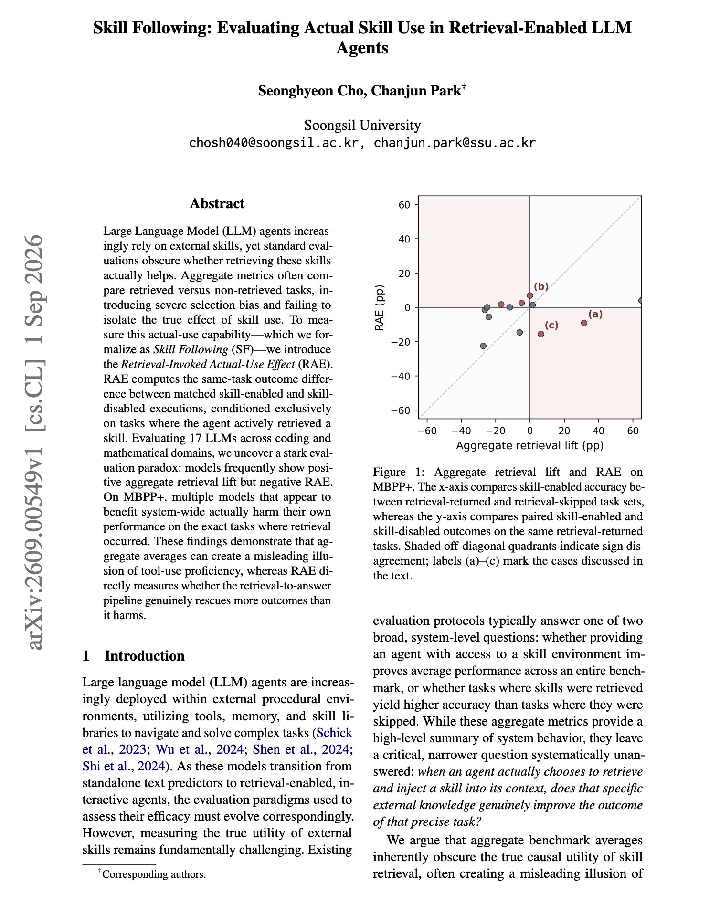
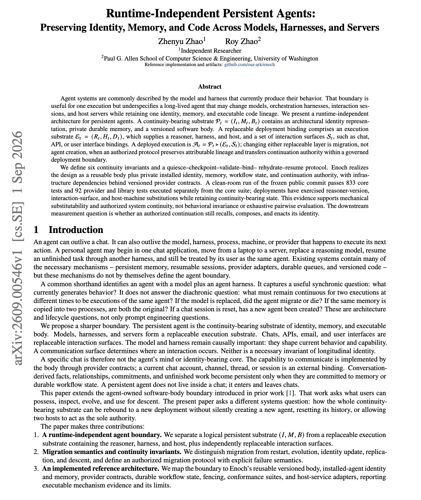

# 🐦 @dair_ai

## 📅 September 03, 2026

> 5 post(s) archived.

---

### 🕐 17:09 UTC · @dair_ai

> The @bot team gave me 50 codes to hand out to my followers, each worth $200. That&apos;s a month free of the $200/month plan, or $200 in credits. Just comment with your best/most fun use cases or things you’d like to try in Grok Bot. Grok Bot changed how I work with agents. I stopped overthinking. I hand a task to a bot, and it manages most of the work from there. My favorite bot so far: My orchestrator bot runs my higher-level agent team. It assigns work across specialized bots and keeps everything organized, so I run many tasks in parallel instead of babysitting one at a time.

🔗 [View original post](https://x.com/omarsar0/status/2095559818337538556)

---

### 🕐 14:26 UTC · @dair_ai

> Great paper from Meta. This is a really good example of an agent harness for a production-grade application. https://x.com/omarsar0/status/2095518433865777600?s=20 Massive paper from Meta. I like this one because it shows the use of agent harnesses for production-grade recommender systems. Details below: This is one of the more convincing agent deployments I&apos;ve seen. It runs against a live production recommender serving billions of people a…

🔗 [View original post](https://x.com/dair_ai/status/2095518822685884647)

---

### 🕐 13:39 UTC · @dair_ai

> Hugging Face is in great hands. Big win for open source. And do not underestimate NVIDIA in its open-source efforts. They have been shipping great open models, and I think this amplifies their efforts. Exciting day for NVIDIA and @huggingface. Open models strengthen safety and cybersecurity, accelerate innovation and diffusion, and enable sovereignty. They allow every developer, startup, university, industry and country to build with, customize and benefit from AI. Thank you @C…

🔗 [View original post](https://x.com/omarsar0/status/2095507069788889536)

---

### 🕐 02:00 UTC · @dair_ai

> Good measurement work on whether retrieved agent skills actually help. They report that agent skills that lift your aggregate score can be hurting every task they touch. The usual way of checking compares tasks where a skill was retrieved against tasks where none was. Those are different tasks, so the comparison mixes the effect of retrieval with the effect of which tasks trigger it. The fix presented in the paper is a matched comparison. Retrieval-Invoked Actual-Use Effect runs the same task twice, once with skills enabled and once disabled, and counts only tasks where the agent actually retrieved something. Across 17 LLMs on coding and math, models frequently show positive aggregate retrieval lift alongside a negative same-task effect. On MBPP+, several models that look beneficial system-wide are hurting themselves on exactly the tasks where retrieval fired. Anyone maintaining a skills directory can run this against their own stack today. Paper: https://arxiv.org/abs/2609.00549 Chat with Paper: https://academy.dair.ai/papers/skill-following-evaluating-actual-skill-use-in-retrieval-enabled-llm-agents-2609.00549

🔗 [View original post](https://x.com/dair_ai/status/2095330956823629995)

---

### 🕐 00:00 UTC · @dair_ai

> What a super interesting paper this one is. They propose an architecture for agents that outlive their model, harness and host. Today we describe an agent by whatever model and harness it happens to run on. That works for a single session. It says very little about an agent that runs for months and gets moved to a new model, a new harness, or a new machine along the way. The paper splits an agent in two. One half is the agent itself, and it persists. Its identity, its private memory, and its own code with version history. The other half is plumbing you can replace. The model doing the reasoning, the harness running it, the server hosting it, and the ways people reach it such as chat, an API, or a UI. Swap the plumbing and you have moved the agent rather than built a new one, as long as the handoff is authorized and keeps the record of where it came from. The handoff is six steps. Pause the agent, save its state, check the save is valid, attach it to the new setup, load the state back, then let it run again. They ran the frozen public release on a clean machine and it passed 833 core tests plus 92 more for providers and libraries. They also swapped model versions, interfaces and physical hosts on live deployments. The authors are careful about what this proves. It shows you can move an agent without breaking it mechanically. Whether the agent still behaves like itself afterwards is a separate question. Paper: https://arxiv.org/abs/2609.00546 Chat with Paper: https://academy.dair.ai/papers/runtime-independent-persistent-agents-preserving-identity-memory-and-code-across-2609.00546

🔗 [View original post](https://x.com/omarsar0/status/2095300793561931948)

---
