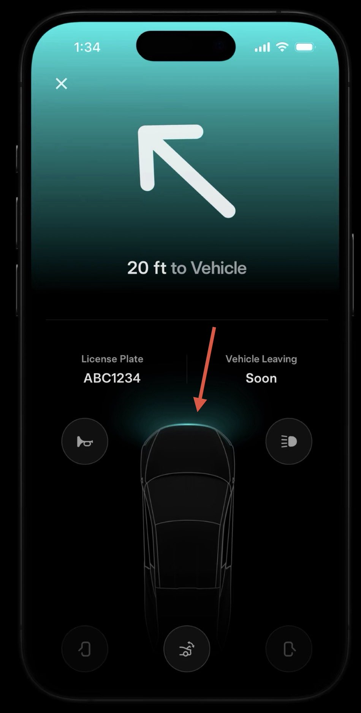
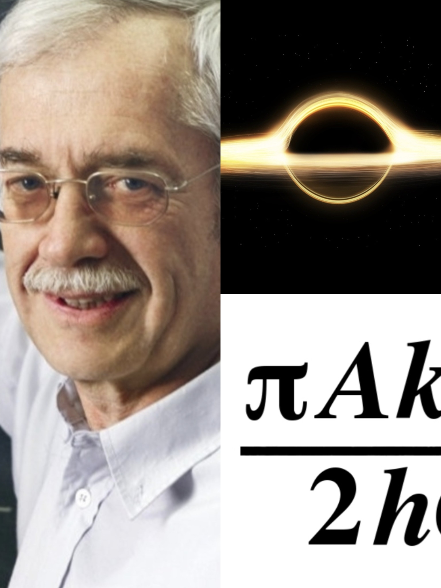
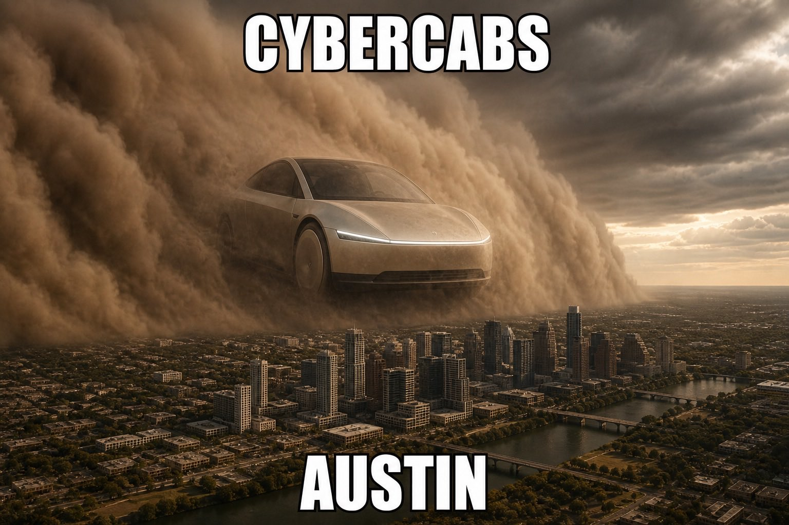
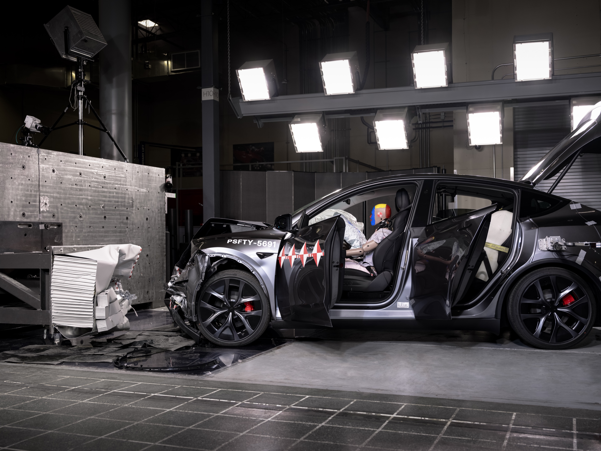
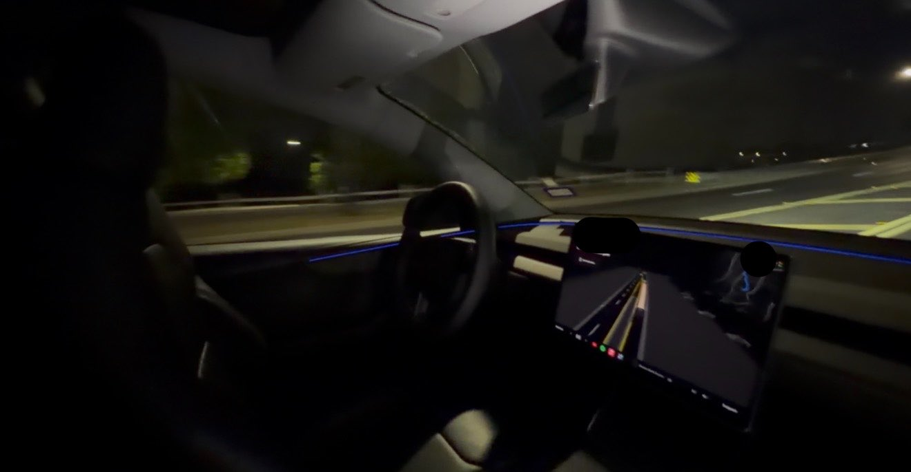
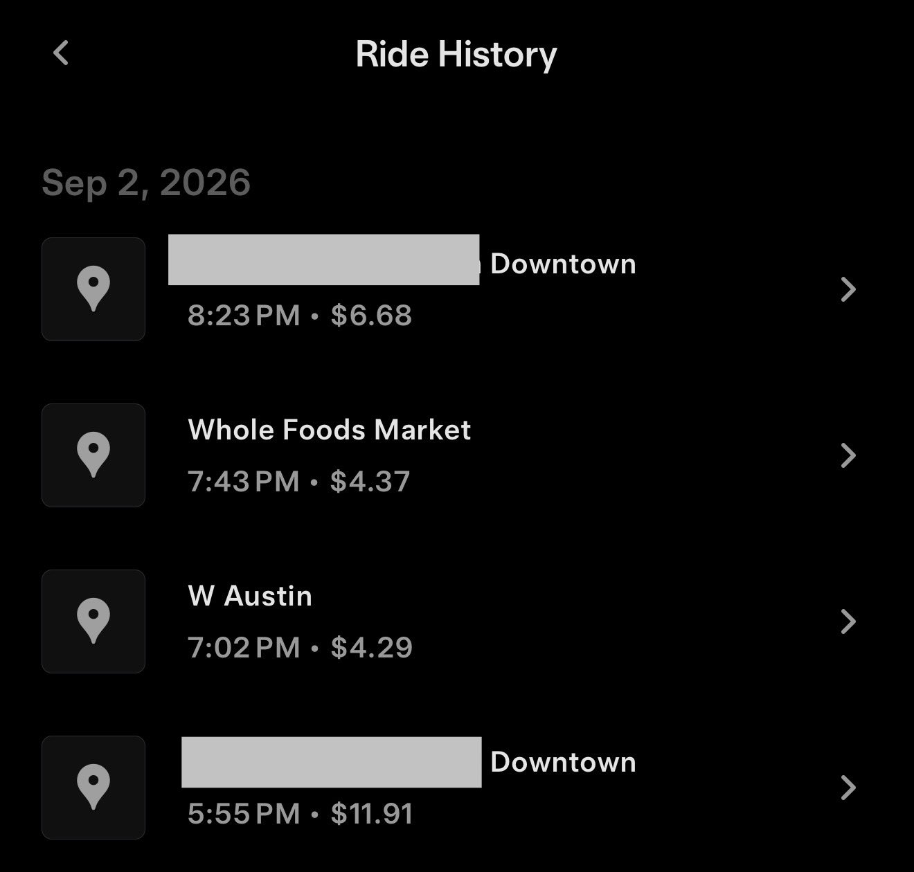

# 🐦 @elonmusk

## 📅 September 03, 2026

> 20 post(s) archived.

---

### 🕐 15:04 UTC · @elonmusk

> This is what Tesla’s Robotaxi app looks like when your Cybercab arrives. The screen glows to match whatever the color the RGB front light bar is on the Cybercab, while an arrow points to where the vehicle is located. You can also flash the lights and honk the horn to identity it.

🔗 [View original post](https://x.com/SawyerMerritt/status/2095528435011485748)

---

### 🕐 15:04 UTC · @elonmusk

> It is indeed a disgrace. Those publications have an obligation to adhere to the truth and yet have become woke propaganda outlets. The degeneration of Nature, Science, NEJM, and Scientific American into woke propaganda dispensers (and their refusal to publish normie, centrist, common-sense responses) is a scientific scandal.

🔗 [View original post](https://x.com/elonmusk/status/2095528299090854111)

---

### 🕐 14:04 UTC · @elonmusk

> Talk to @Grok in your Tesla Today I drove past a house for sale that looked nice ... So I asked Grok in the Tesla how much it was. It pulled the listing, price, beds/baths, square footage, days on market, and market analysis — all while FSD kept driving. No phone. No searching. Just talking.

🔗 [View original post](https://x.com/Tesla/status/2095513199135088756)

---

### 🕐 12:56 UTC · @elonmusk

> The second law of thermodynamics says that the total entropy of a closed system cannot decrease. Entropy is a measure of how many microscopic states are possible in a system. At first, black holes might seem to have very little entropy because they are described by only a few properties, such as their mass, charge, and angular momentum. However, in 1972, physicist Jacob Bekenstein proposed that black holes should have entropy. His argument was based on the second law of thermodynamics. If an object with entropy falls into a black hole, its entropy would no longer be directly accessible outside the black hole. If the black hole had no entropy of its own, this could lead to a decrease in the total entropy of the universe, which would conflict with the second law. So, how much entropy does a black hole have? In 1974, Stephen Hawking showed that black holes have a temperature and emit thermal radiation, now called Hawking radiation. This means that black holes have thermodynamic properties. Using the relationship between energy, temperature, and entropy, physicists found that the entropy of a black hole is proportional to the area of its event horizon. This result is known as the Bekenstein–Hawking formula: S = A/4ℓₚ² where S is the black hole&apos;s entropy, A is the area of its event horizon, and ℓₚ is the Planck length. The important point is that black holes do not violate the second law of thermodynamics. Instead, they can contain an extremely large amount of entropy. For a given region of space, a black hole represents the maximum possible entropy allowed by known physics. So, although a black hole looks simple from the outside, its entropy can be extremely large.

🔗 [View original post](https://x.com/Math_files/status/2095496222157197613)

---

### 🕐 12:02 UTC · @elonmusk

> Exciting day for NVIDIA and @huggingface. Open models strengthen safety and cybersecurity, accelerate innovation and diffusion, and enable sovereignty. They allow every developer, startup, university, industry and country to build with, customize and benefit from AI. Thank you @ClementDelangue for coming to me. NVIDIA is going to be a great home for Hugging Face, its community and the future of open models. 🤗 https://blogs.nvidia.com/blog/nvidia-to-acquire-hugging-face/

🔗 [View original post](https://x.com/JensenHuang/status/2095482647355244762)

---

### 🕐 08:27 UTC · @elonmusk

> Grok Bot is like a self-guided missile when it comes to cancelling DTC subscriptions I impulse bought but never have time to cancel

🔗 [View original post](https://x.com/beffjezos/status/2095428434474512784)

---

### 🕐 05:26 UTC · @elonmusk

> Starlink now in UAE! 🇦🇪 Starlink&apos;s high-speed, low-latency internet is now available in the United Arab Emirates! 🛰️🇦🇪❤️ → https://starlink.com/unitedarabemirates

🔗 [View original post](https://x.com/elonmusk/status/2095382960337997885)

---

### 🕐 04:47 UTC · @elonmusk

> Congrats Tesla Australia! For the first time ever, EVs outsold ICE vehicles in Australia 🇦🇺 Model Y was the #1 vehicle &amp; Tesla the #3 best-selling brand overall for the month of August https://www.drive.com.au/news/australian-new-car-sales-in-august-2026-electric-outsells-petrol-for-the-first-time-as-te…

🔗 [View original post](https://x.com/elonmusk/status/2095373194115051538)

---

### 🕐 04:41 UTC · @elonmusk

🔗 [View original post](https://x.com/elonmusk/status/2095371552628023542)

---

### 🕐 04:14 UTC · @elonmusk

> Grok @Bot 👏👏👏😊 Grokbot!

🔗 [View original post](https://x.com/elonmusk/status/2095364788713136229)

---

### 🕐 04:11 UTC · @elonmusk

> 💯 The thing is: &quot;All nations are former slave-trading nations.&quot;

🔗 [View original post](https://x.com/elonmusk/status/2095364149870248184)

---

### 🕐 04:11 UTC · @elonmusk

> lmao Here’s just a few of the “geniuses” who declared that “Elon destroyed Twitter” after he purchased this site.

🔗 [View original post](https://x.com/elonmusk/status/2095363970765062439)

---

### 🕐 04:10 UTC · @elonmusk

> Cool Not only can you get @Starlink high-speed internet on @United flights but you can now watch the Starship documentary series 🚀

🔗 [View original post](https://x.com/elonmusk/status/2095363661045104658)

---

### 🕐 04:02 UTC · @elonmusk

> Model Y earns Top Safety Pick+ Award from IIHS

🔗 [View original post](https://x.com/tesla_na/status/2095361643118989594)

---

### 🕐 03:52 UTC · @elonmusk

> Tesla Robotaxi just drove us 35 minutes across Austin to our hotel perfectly and dropped us off directly in front of the door. The driving and comfort on these unsupervised cars are next level. It even avoided road debris. So impressed after all the rides I took today @robotaxi

🔗 [View original post](https://x.com/BLKMDL3/status/2095359231864058074)

---

### 🕐 03:08 UTC · @elonmusk

> One company alone managing more than 11,000 satellites in orbit is completely insane SpaceX is basically becoming the traffic controller of low Earth orbit Every Starlink satellite has autonomous collision avoidance onboard If collision probability rises above just 1 in 100,000, the satellite begins planning an avoidance maneuver That is 10× more conservative than the 1-in-10,000 industry threshold SpaceX cites But the impressive part goes beyond Starlink itself SpaceX continuously shares precise orbital data and planned trajectories with the U.S. Space Force, LeoLabs and other satellite operators so everyone can screen for potential conjunctions and coordinate maneuvers Starlink satellites can then calculate safer trajectories and autonomously move when needed 11,000+ spacecraft Constantly moving Constantly tracking risk Constantly coordinating with everything else in orbit SpaceX built the largest satellite constellation in history and then built an autonomous traffic management system around it Media

🔗 [View original post](https://x.com/XFreeze/status/2095348181936771479)

---

### 🕐 03:06 UTC · @elonmusk

> I took four Unsupervised Model Y Robotaxi rides today, totaling 50 minutes and 8 miles of travel for a combined $27.25. I took one 20 minute Uber ride today for $33 (including tip), and it smelled.

🔗 [View original post](https://x.com/SawyerMerritt/status/2095347583191322822)

---

### 🕐 01:30 UTC · @elonmusk

> The future has arrived. Media

🔗 [View original post](https://x.com/stevenmarkryan/status/2095323483068862651)

---

### 🕐 01:25 UTC · @elonmusk

> Now that silicon-based intelligence has been bootloaded, we should view the next era as bio-silicon co-design. We need to be much more open-minded about modifying the biological substrate and exploring its parameter space, like we do for artificial life in silicon. The response to a rapid acceleration of complexification in the non-biological subtrate should be one where we accelerate biology. An actually-serious case that being a “biological bootloader for digital superintelligence” (per @elonmusk) is a credible, dignified, and good-enough “meaning of life.” I started writing this one partly as a joke (“Elon Musk accidentally solved the meaning of life in a tweet!”) a…

🔗 [View original post](https://x.com/beffjezos/status/2095322353773502525)

---

### 🕐 00:29 UTC · @elonmusk

> I am currently in downtown Austin. There are @Tesla Cybercabs EVERYWHERE. All of the Cybercabs in these clips have no steering wheels or pedals. Makes the vibe downtown feel so futuristic. Can’t wait for tomorrow! 🤖 Media

🔗 [View original post](https://x.com/SawyerMerritt/status/2095308059383845238)

---
