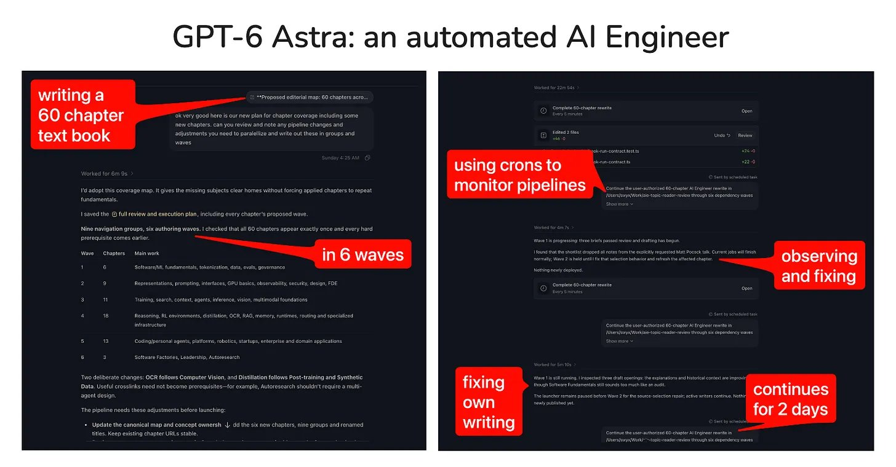
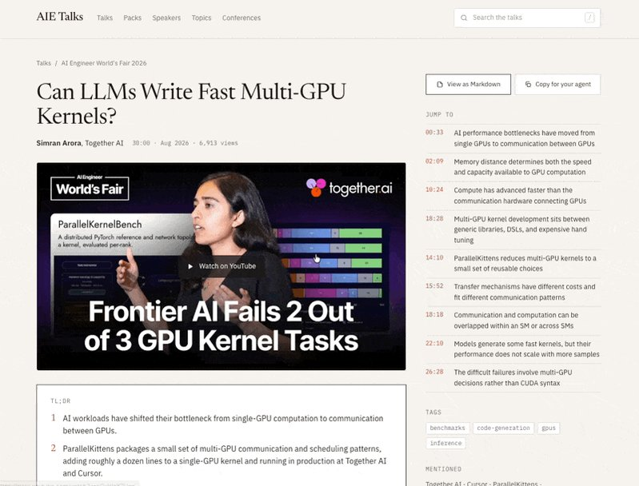

# 🐦 @swyx

## 📅 September 03, 2026

> 3 post(s) archived.

---

### 🕐 21:15 UTC · @swyx

> https://www.latent.space/p/astra

🔗 [View original post](https://x.com/swyx/status/2095621819667751202)

---

### 🕐 21:15 UTC · @swyx

> sorry for the radio silence folks - got sucked into extreme LLM psychosis. but i can confidently say we have crossed over into a new age of AI Engineering and we are never, ever, looking back. this isnt even EVERYTHING i did with Astra but i&apos;ll append more reports as I publish them on LS! We spent &gt;20B tokens throwing @openai&apos;s Astra at every AI Engineering task we could think of, beyond cute Blender demos and fun games. https://latent.space/p/astra Here&apos;s everything Astra can do, and do so at &lt;$6 an hour (serious): - choose and train models - label data (both hel…

🔗 [View original post](https://x.com/swyx/status/2095621785953984782)

---

### 🕐 15:40 UTC · @swyx

> Love @aiDotEngineer but can&apos;t watch 1000s of videos on YouTube? Me neither. My guy @strickvl built a website that indexes all @aiDotEngineer talks and makes them easier to consume. There are now 1,100+ talks in the archive. Each one has a short TL;DR, a proper summary, timestamped ideas that jump into the video, quotes, references, and tags. It is how you can decide whether to watch a 45-minute talk now, save it for later, or just take the useful bits. Interested in @dexhorthy&apos;s bangers? Go here: https://aietalks.com/speakers/dex-horthy. Maybe @HamelHusain and evals are interesting: https://aietalks.com/speakers/hamel-husain Or just go to a pack of talks like coding factories evals etc: https://aietalks.com/packs/coding-agents-on-real-codebases It&apos;ll be live updated, so benchmark it in time for Paris and NYC. @swyx hope the community likes this one! Bookmark here: https://aietalks.com/

🔗 [View original post](https://x.com/htahir111/status/2095537462462283838)

---
