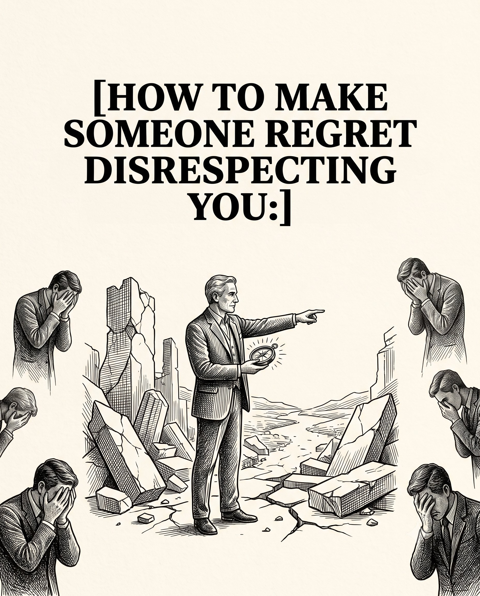

# 🐦 @theendeavorpath

## 📅 September 03, 2026

> 14 post(s) archived.

---

### 🕐 16:41 UTC · @theendeavorpath

> 8 things about the crisper drawer that nobody explains: 1. The slider is a vent, not a dial

🔗 [View original post](https://x.com/EnergyUp_/status/2095552824994300399)

---

### 🕐 16:36 UTC · @theendeavorpath

> Control your Emotions Control your MIND Control your life Work on Mental Models: - Think clearer - Decide better - Achieve more People like Elon Musk, Naval Ravikant &amp; Warren Buffet use them to make better decisions Start making smart decisions: https://gumroad.com/a/994154003/AxfYH

🔗 [View original post](https://x.com/theendeavorpath/status/2095551641357516919)

---

### 🕐 16:36 UTC · @theendeavorpath

> 10/ Let your actions answer them. You don’t need a perfect comeback. You don’t need the final word. Sometimes the strongest reply is simply treating them like someone who no longer gets your time.

🔗 [View original post](https://x.com/theendeavorpath/status/2095551638132097184)

---

### 🕐 16:36 UTC · @theendeavorpath

> 9/ If they come back, don’t forget what happened. Being friendly again doesn’t mean giving them the same place in your life. Forgiveness and access are two different things.

🔗 [View original post](https://x.com/theendeavorpath/status/2095551634579616127)

---

### 🕐 16:36 UTC · @theendeavorpath

> 8/ Don’t try to make them jealous. Fake happiness is still fake. Go enjoy your life because you actually want to. Not because you’re hoping someone is watching.

🔗 [View original post](https://x.com/theendeavorpath/status/2095551631345713253)

---

### 🕐 16:36 UTC · @theendeavorpath

> 7/ Don’t chase an apology. If someone has to be dragged into saying sorry, the words won’t mean much anyway. Watch what they do after the incident. That tells you far more.

🔗 [View original post](https://x.com/theendeavorpath/status/2095551627302498685)

---

### 🕐 16:36 UTC · @theendeavorpath

> 6/ Stop doing favors. This is where people usually understand. The person they could call at midnight suddenly isn’t picking up anymore. Not out of spite. You simply stopped making room for poor treatment

🔗 [View original post](https://x.com/theendeavorpath/status/2095551624370585802)

---

### 🕐 16:36 UTC · @theendeavorpath

> 5/ Don’t insult them back. That turns one bad moment into a competition. You have nothing to prove. Say less. Do less. Walk away.

🔗 [View original post](https://x.com/theendeavorpath/status/2095551620637655310)

---

### 🕐 16:36 UTC · @theendeavorpath

> 3/ Change how available you are. No more instant replies. No more dropping everything for them. No more being there whenever they call. Let the relationship match the way they treated you.

🔗 [View original post](https://x.com/theendeavorpath/status/2095551614539215061)

---

### 🕐 16:36 UTC · @theendeavorpath

> 4/ Keep your mouth shut about the situation. Don’t tell ten people. Don’t post about it. Don’t throw little hints online. Move differently and let them figure it out themselves.

🔗 [View original post](https://x.com/theendeavorpath/status/2095551617588469868)

---

### 🕐 16:36 UTC · @theendeavorpath

> 2/ Stop giving explanations. You don’t have to write a paragraph about why their behavior bothered you. If they crossed the line, they crossed it. That’s enough.

🔗 [View original post](https://x.com/theendeavorpath/status/2095551611280277854)

---

### 🕐 16:36 UTC · @theendeavorpath

> 1/ Don’t snap back. They already know they annoyed you. Losing your temper gives them exactly what they wanted. Take a breath. Answer later, or don’t answer at all.

🔗 [View original post](https://x.com/theendeavorpath/status/2095551608117748173)

---

### 🕐 16:36 UTC · @theendeavorpath

> How to make someone regret disrespecting you: Not by getting even. By making them realize they messed with the wrong person. A thread 🧵

🔗 [View original post](https://x.com/theendeavorpath/status/2095551603524993276)

---

### 🕐 15:02 UTC · @theendeavorpath

> 9 REASONS WHY THE OCEAN IS SCARIER THAN SPACE... 🚨👇

🔗 [View original post](https://x.com/stoicmen_/status/2095527942789194191)

---
