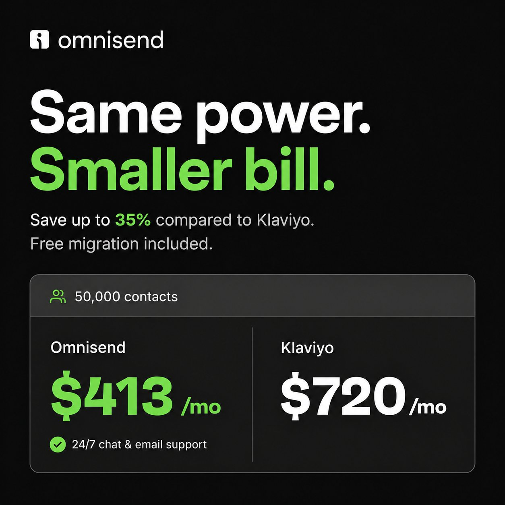

# 🐦 @AiEvolutio58513

## 📅 September 04, 2026

> 7 post(s) archived.

---

### 🕐 15:27 UTC · @AiEvolutio58513

> Your ESP is counting on you being too busy to leave. And honestly, it&apos;s a good bet. I hear the same thing on audit calls... The bill has crept up, the tool does three things poorly, and everyone on the team has a workaround. Then somebody says &quot;migration,&quot; and the room goes silent. Because migration means 20 flows, segments nobody documented, forms embedded in six places on the site, and three years of customer data you&apos;re not willing to gamble on a weekend. So you renew your contract AGAIN. If you&apos;re on Klaviyo and you&apos;ve had that meeting more than once, @omnisend&apos;s team will do the move for you. They rebuild the automations, the segments, the forms, and carry the customer data across. You review it at the end. You&apos;ve been paying a premium to avoid a job someone else is offering to do. Same power, smaller bill: https://www.omnisend.com/migrate-from-klaviyo/?utm_source=chase&amp;utm_medium=social&amp;utm_campaign=migrate-from-klaviyo&amp;utm

🔗 [View original post](https://x.com/ecomchasedimond/status/2095896502719918114)

---

### 🕐 13:57 UTC · @AiEvolutio58513

> Interested in AI? Follow @AiEvolutio58513 and never fall behind. I track ChatGPT, Claude, and every tool quietly changing how we work and create, then hand you the tested signals.

🔗 [View original post](https://x.com/AiEvolutio58513/status/2095874007707042030)

---

### 🕐 13:57 UTC · @AiEvolutio58513

> 12) A graduate hired today gets good faster than ever Nadella still believes in hiring straight out of college, which cuts against the current mood. An agent walks you through a codebase like a very good mentor. He says the craft now is watching how the best engineers use AI. Media

🔗 [View original post](https://x.com/AiEvolutio58513/status/2095873980657971581)

---

### 🕐 11:02 UTC · @AiEvolutio58513

> Interested in AI? Follow @AiEvolutio58513 and never fall behind. I track ChatGPT, Claude, and every tool quietly changing how we work and create, then hand you the tested signals.

🔗 [View original post](https://x.com/AiEvolutio58513/status/2095829917384716683)

---

### 🕐 11:02 UTC · @AiEvolutio58513

> TLDR: how Elon built SpaceX 1) Attack the limiting factor 2) Take acute pain now 3) Hire for traits you can&apos;t teach 4) Trust the conversation over the resume 5) Set 50/50 deadlines 6) Force the hard call yourself 7) Weekly reviews, no prep 8) Urgency comes from the top

🔗 [View original post](https://x.com/AiEvolutio58513/status/2095829905523310608)

---

### 🕐 11:02 UTC · @AiEvolutio58513

> 8) Urgency comes from the top Elon doesn&apos;t expect a company to move fast if he doesn&apos;t. “I have a maniacal sense of urgency, so that projects through the rest of the company.” Set an aggressive pace yourself, and it spreads. Slow leader, slow company.

🔗 [View original post](https://x.com/AiEvolutio58513/status/2095829893674401839)

---

### 🕐 11:02 UTC · @AiEvolutio58513

> 7) Run weekly reviews with no advance prep Elon does deep engineering reviews weekly, sometimes twice. He uses skip-level meetings and goes around the room so nobody can rehearse and “glaze” him. He plots each person&apos;s progress in his head to see if they&apos;re converging.

🔗 [View original post](https://x.com/AiEvolutio58513/status/2095829881527648727)

---
