# 🐦 @Unlockyourlife_

## 📅 September 04, 2026

> 17 post(s) archived.

---

### 🕐 09:32 UTC · @Unlockyourlife_

> Testosterone Foods.

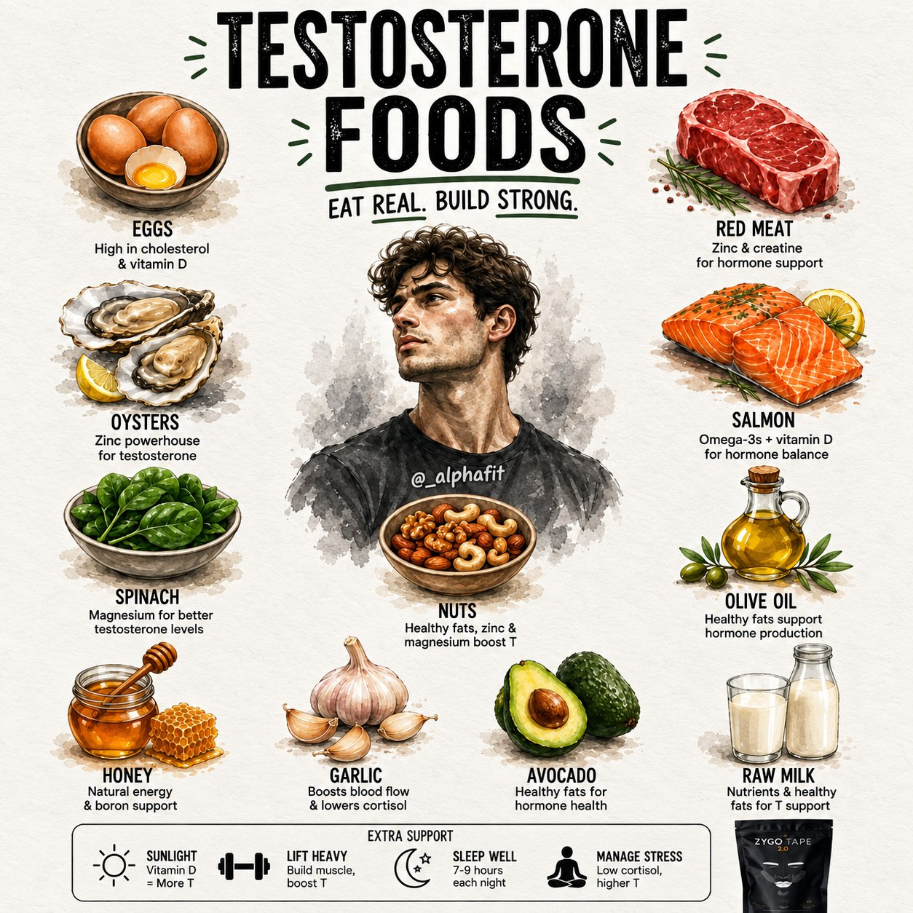

🔗 [View original post](https://x.com/_alphafit/status/2095807118850871659)

---

### 🕐 08:10 UTC · @Unlockyourlife_

> Healthy eating doesn’t have to mean expensive foods with fancy names. Sometimes, the foods you’ve been eating casually for years are already giving your body a lot of what it needs. Don’t underestimate ordinary food. 💪

🔗 [View original post](https://x.com/_fitnesshub/status/2095786547115147288)

---

### 🕐 08:10 UTC · @Unlockyourlife_

> 5. CORN 🌽 Corn sometimes gets dismissed as “just carbs,” but it offers more than that. It contains fiber, folate, vitamin B6, magnesium and antioxidants, including carotenoids such as lutein and zeaxanthin. It can absolutely be part of a nutritious, balanced diet.

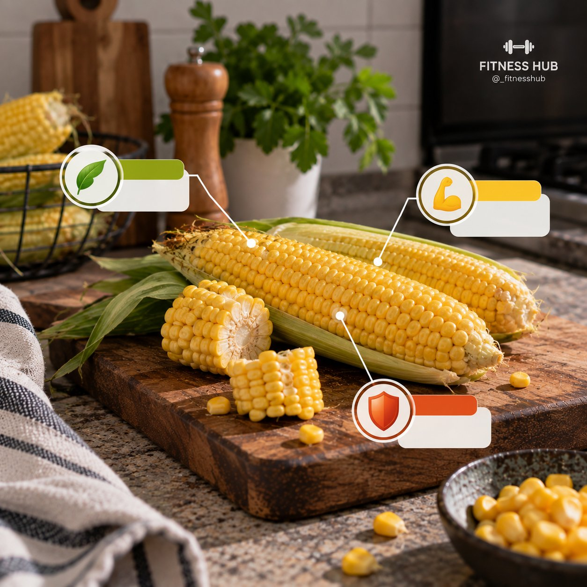

🔗 [View original post](https://x.com/_fitnesshub/status/2095786543377993744)

---

### 🕐 08:10 UTC · @Unlockyourlife_

> 4. PUMPKIN SEEDS 🎃 Those tiny seeds are nutritional heavyweights. They provide protein, healthy fats, magnesium, zinc and iron. They’re also easy to add to meals, oats, yogurt or snacks when you want extra nutrients without eating a huge amount of food.

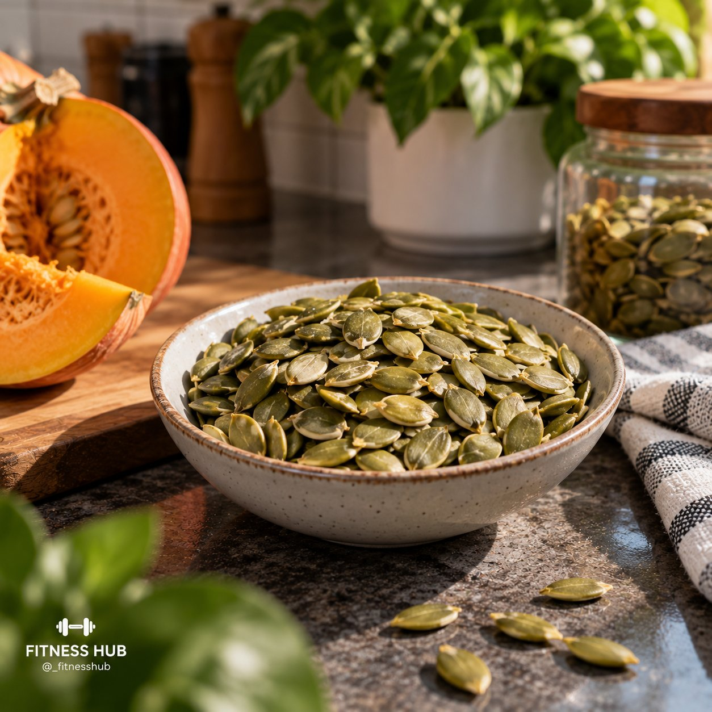

🔗 [View original post](https://x.com/_fitnesshub/status/2095786538013528078)

---

### 🕐 08:10 UTC · @Unlockyourlife_

> 3. MUSHROOMS 🍄 They may not look impressive, but mushrooms contain useful nutrients including B vitamins, selenium, potassium and copper. Some varieties exposed to UV light can also provide vitamin D. Pretty basic food. Surprisingly useful.

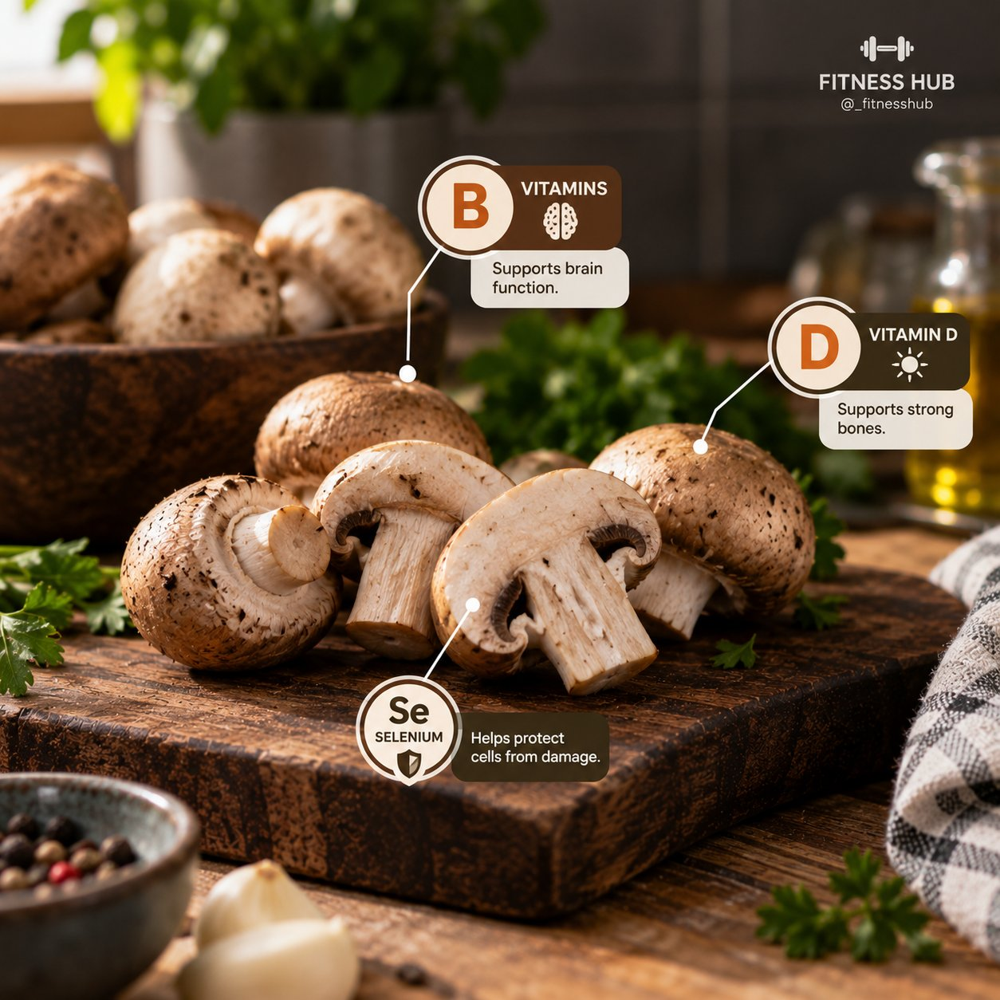

🔗 [View original post](https://x.com/_fitnesshub/status/2095786532321866175)

---

### 🕐 08:10 UTC · @Unlockyourlife_

> 2. CABBAGE 🥬 Cabbage is cheap, common and often overlooked. But it provides vitamin C, vitamin K, folate and fiber, along with plant compounds that act as antioxidants. You don’t need to make it complicated. Adding more vegetables like cabbage to your meals can make a real difference.

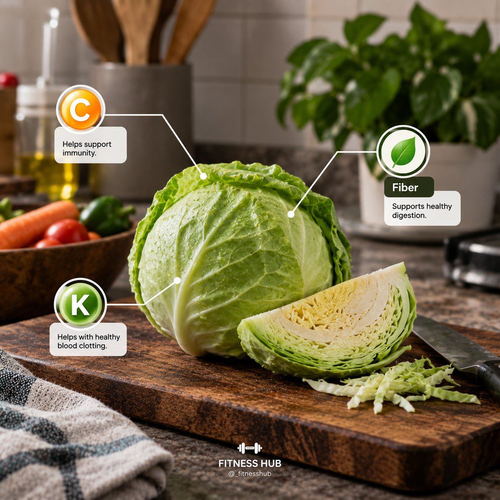

🔗 [View original post](https://x.com/_fitnesshub/status/2095786526256816385)

---

### 🕐 08:10 UTC · @Unlockyourlife_

> 1. GUAVA 🍈 Guava might look like just another fruit, but it’s seriously nutrient-dense. It’s especially rich in vitamin C, while also providing fiber, vitamin A, folate and antioxidants. One simple fruit can give your diet a pretty solid nutritional boost.

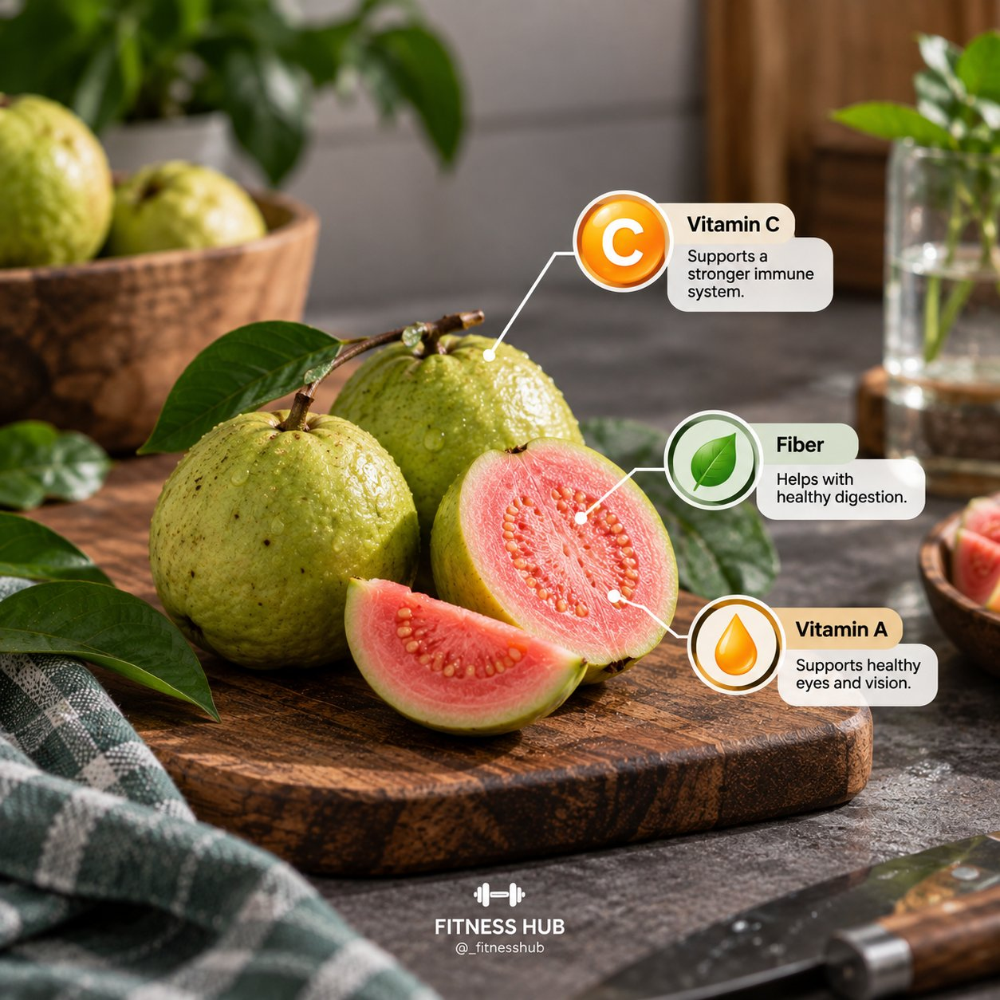

🔗 [View original post](https://x.com/_fitnesshub/status/2095786520816808158)

---

### 🕐 08:10 UTC · @Unlockyourlife_

> 5 FOODS THAT LOOK ORDINARY BUT ARE ACTUALLY PACKED WITH NUTRIENTS 🥗 You don’t always need expensive “superfoods” to eat healthier. Some of the most nutritious foods are the ones you probably walk past every day without thinking twice. Here are 5 worth paying more attention to 🧵👇

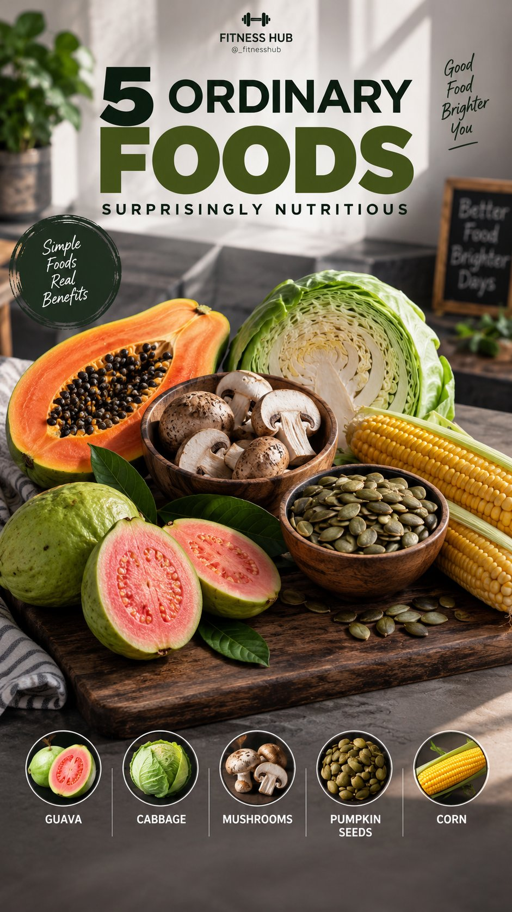

🔗 [View original post](https://x.com/_fitnesshub/status/2095786515712397334)

---

### 🕐 07:50 UTC · @Unlockyourlife_

> Are you having mouth blisters?..... Check these vitamin deficiencies..

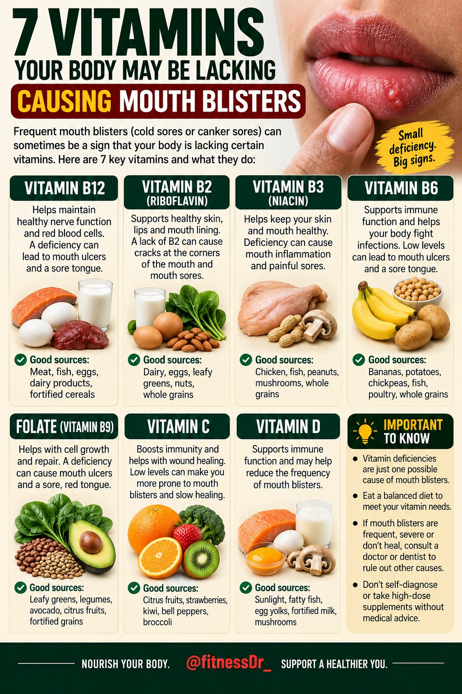

🔗 [View original post](https://x.com/FitnessDr_/status/2095781478495863233)

---

### 🕐 07:31 UTC · @Unlockyourlife_

> Gourmet pizza!

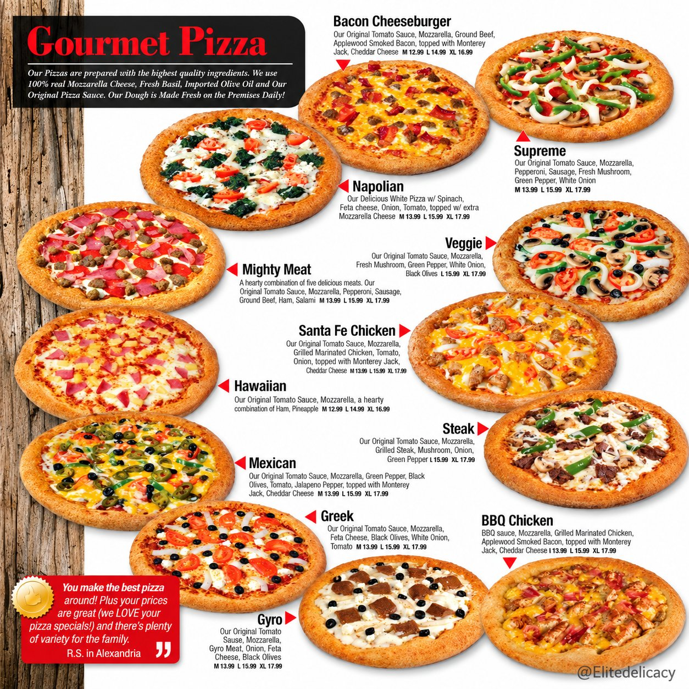

🔗 [View original post](https://x.com/Elitedelicacy/status/2095776632837427495)

---

### 🕐 07:30 UTC · @Unlockyourlife_

> Train hard. Recover smart.

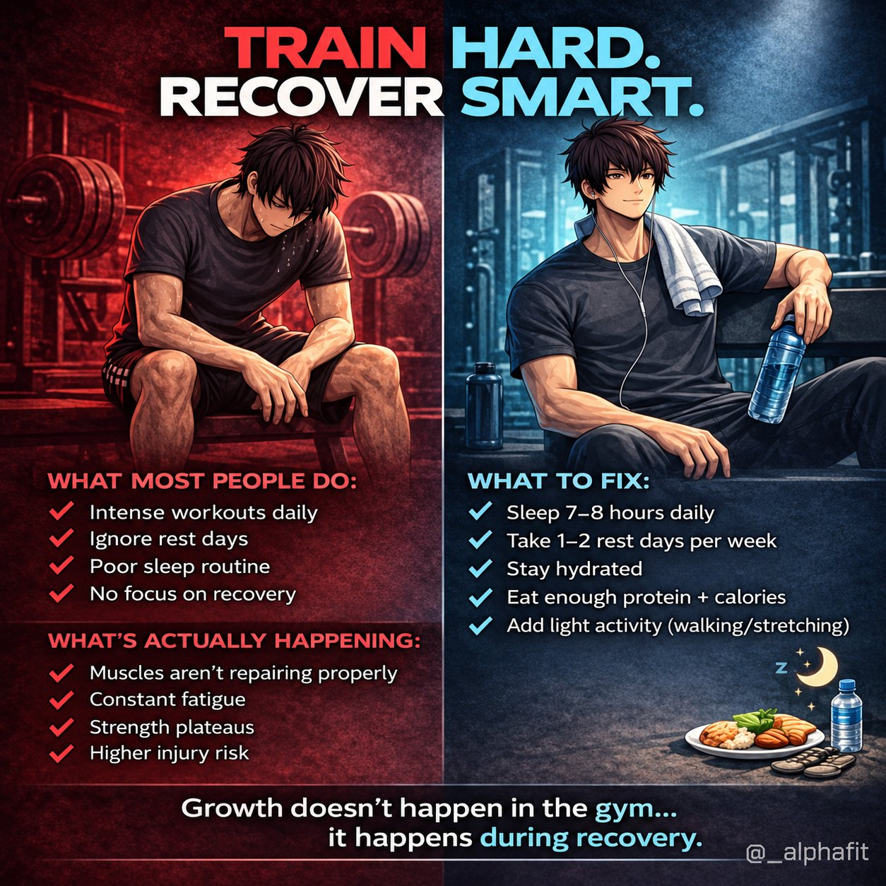

🔗 [View original post](https://x.com/_alphafit/status/2095776447935692928)

---

### 🕐 07:28 UTC · @Unlockyourlife_

> The benefits of the dead hang.

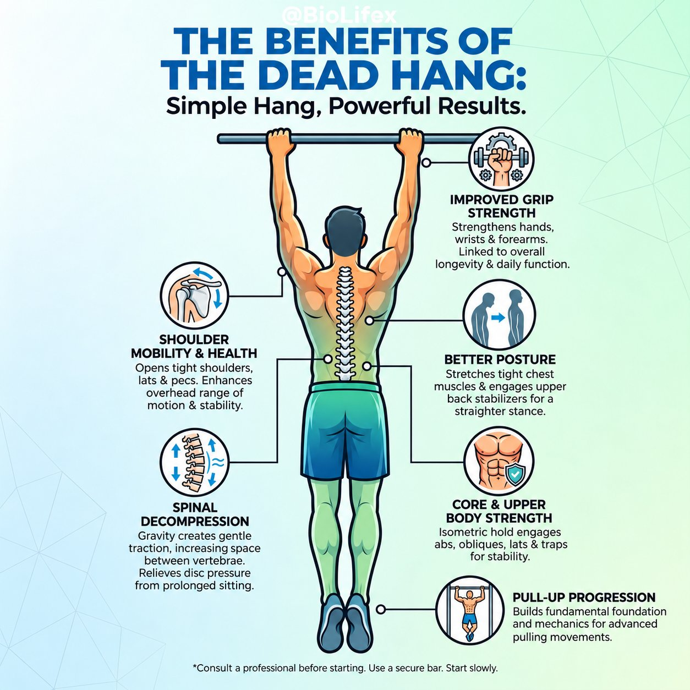

🔗 [View original post](https://x.com/BioLifex/status/2095776088722956563)

---

### 🕐 07:17 UTC · @Unlockyourlife_

> Why doesn&apos;t the Sun Explode! Media

🔗 [View original post](https://x.com/sciencepathx/status/2095773107000582329)

---

### 🕐 07:12 UTC · @Unlockyourlife_

> 🤯 Imagine staying inside a GIANT human statue! 🗿🌴 Media

🔗 [View original post](https://x.com/Smart_Tipsx/status/2095771933434343602)

---

### 🕐 07:06 UTC · @Unlockyourlife_

> Life hack that will save you Money! Media

🔗 [View original post](https://x.com/samx_reels/status/2095770476148629727)

---

### 🕐 07:02 UTC · @Unlockyourlife_

> 3 easy ways to fix a broken clothes hanger Which one would you try? Media

🔗 [View original post](https://x.com/_Brainboxx/status/2095769499127476493)

---

### 🕐 05:37 UTC · @Unlockyourlife_

> Some lessons become clearer with experience: • Not every opportunity is worth taking. • Not every disagreement needs a winner. • Being busy isn&apos;t the same as progressing. • Attention is one of your most valuable resources. • Some people are temporary. • Reputation takes time to build. • Rest isn&apos;t laziness. • Saying no protects your priorities. • Starting late is better than never starting. • A peaceful life is a worthwhile achievement.

🔗 [View original post](https://x.com/Masculinjournal/status/2095748183930310917)

---
