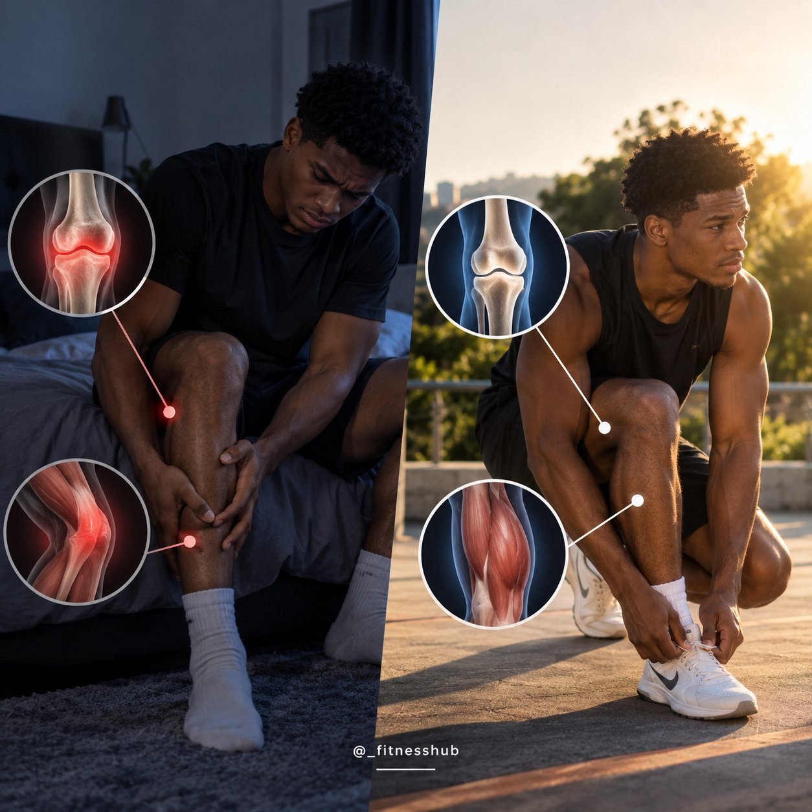
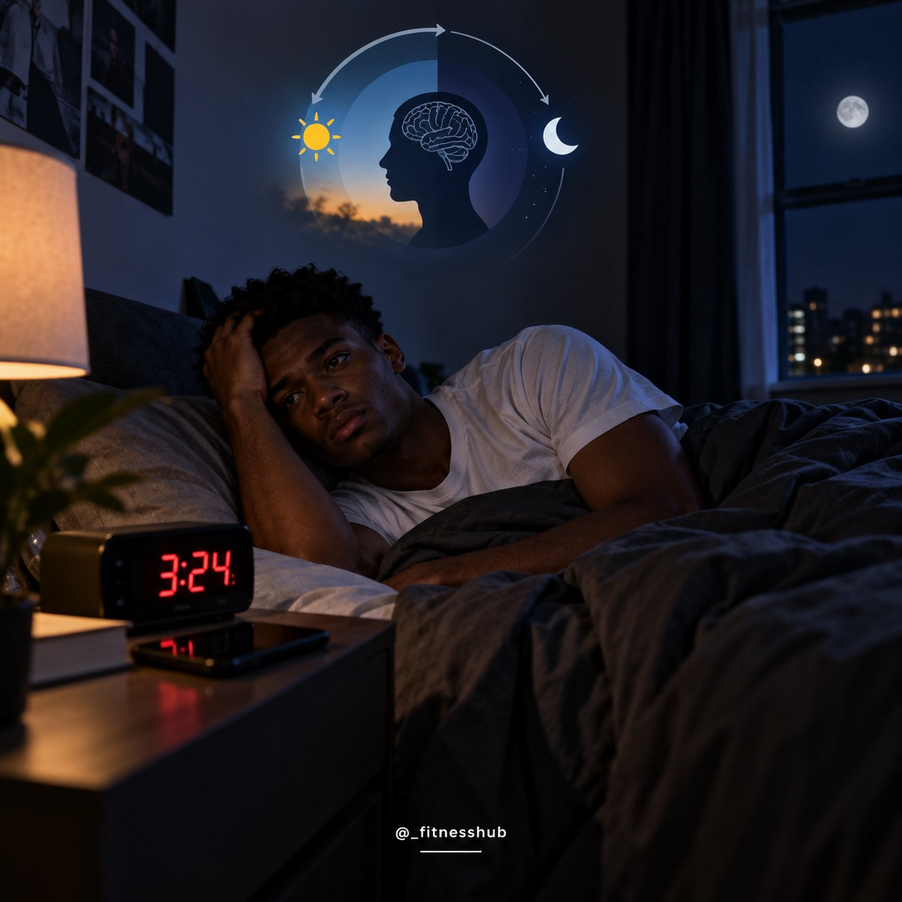
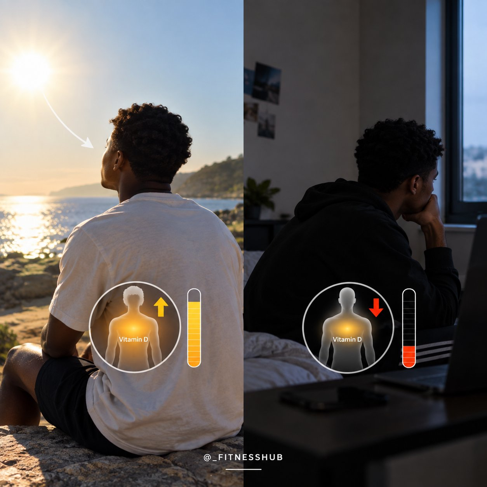
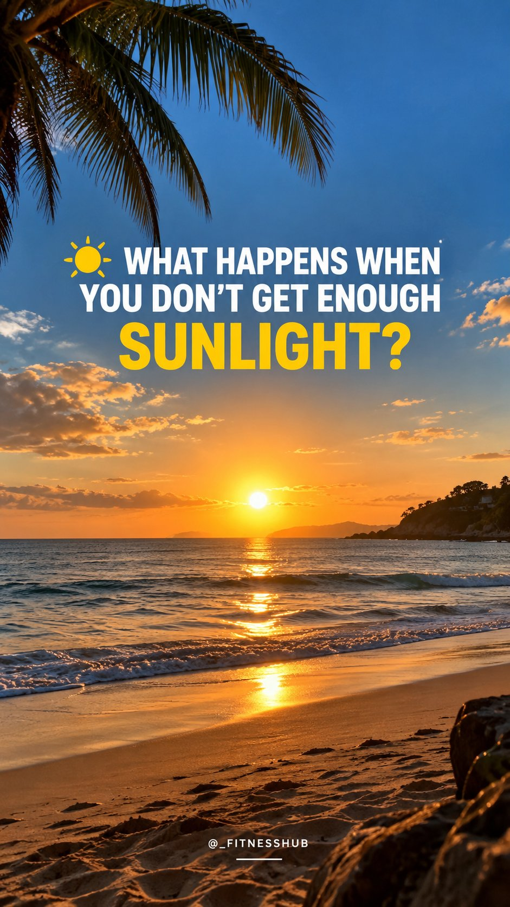
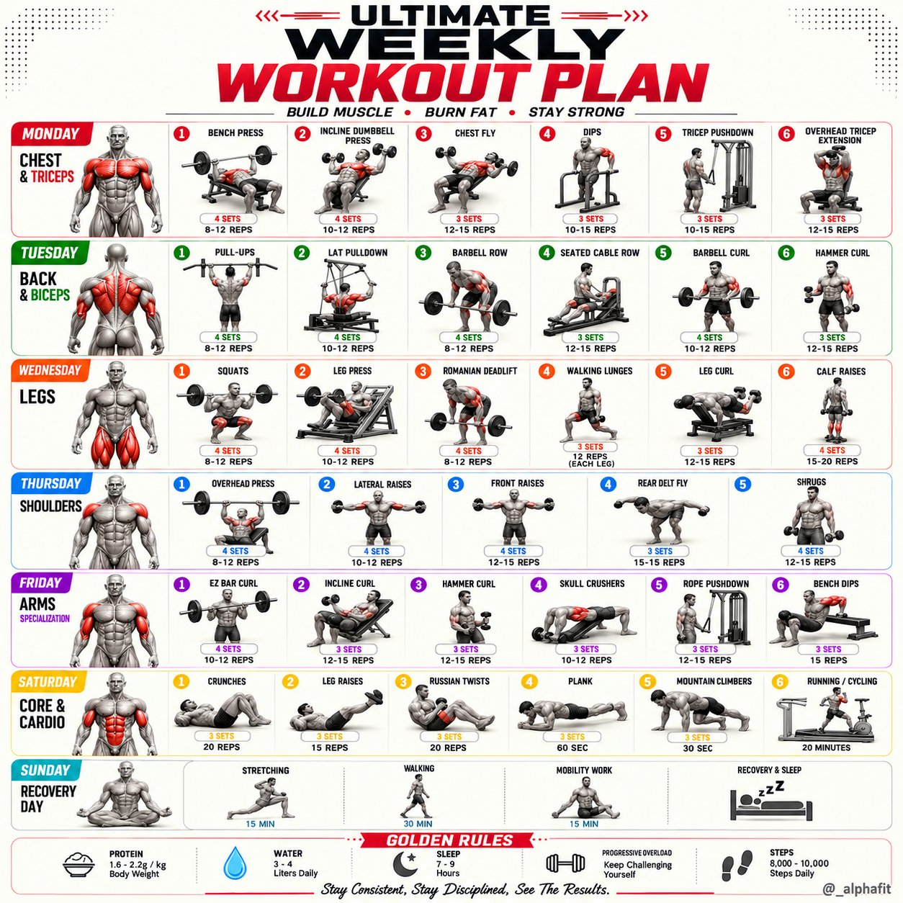
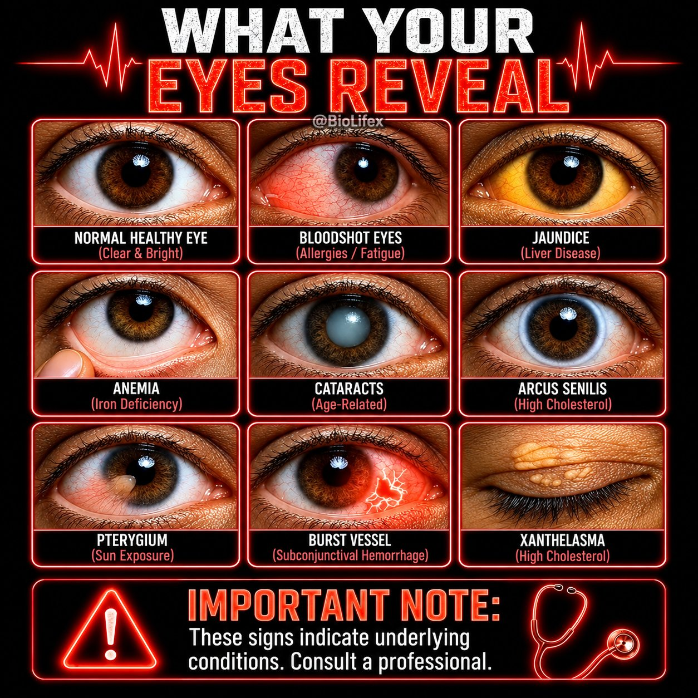
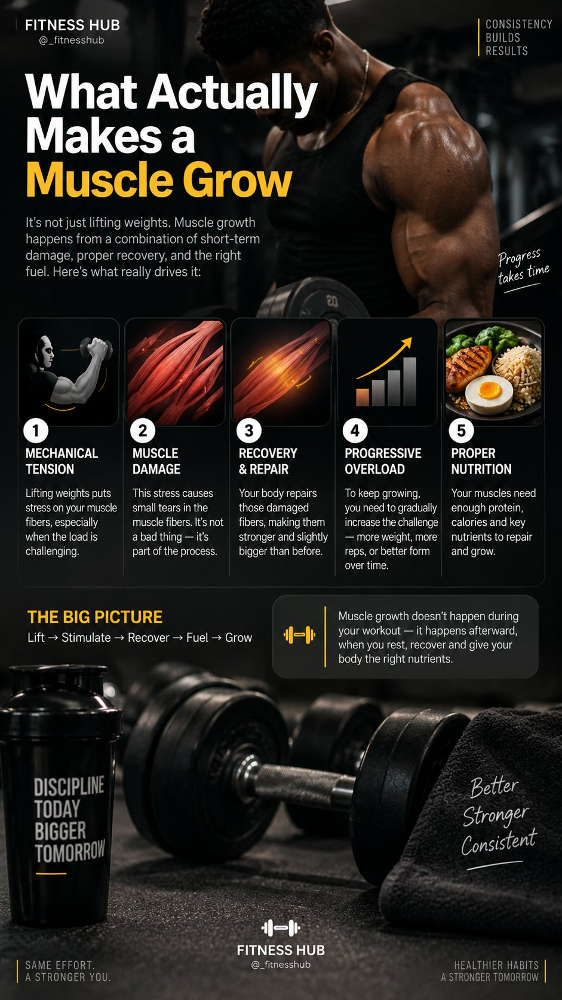
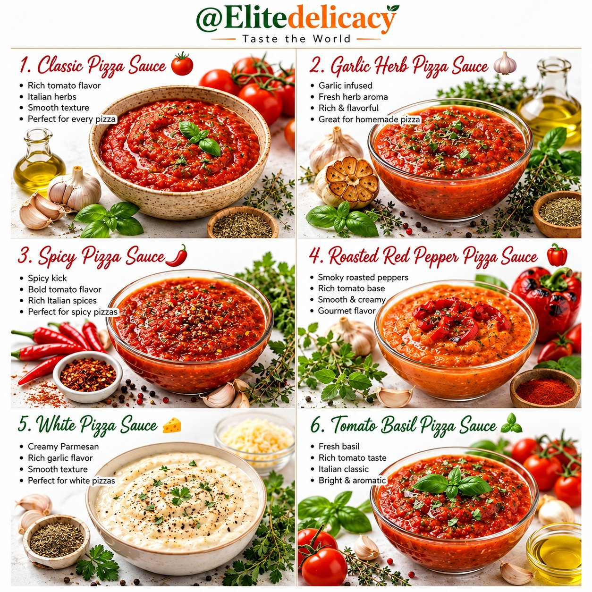
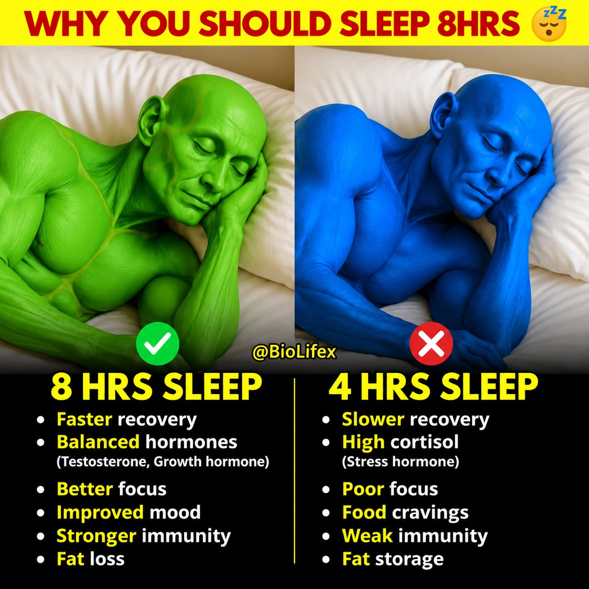

# 🐦 @Unlockyourlife_

## 📅 September 04, 2026

> 38 post(s) archived.

---

### 🕐 14:00 UTC · @Unlockyourlife_

> You don’t need to spend hours baking in the sun. Regular, sensible exposure to daylight — especially earlier in the day — can support your body clock, vitamin D production and overall wellbeing. Your body needs sunlight, but balance is key. 🌞

🔗 [View original post](https://x.com/_fitnesshub/status/2095874696013123596)

---

### 🕐 14:00 UTC · @Unlockyourlife_

> 5. YOU MAY FEEL MORE TIRED AND SLUGGISH Natural daylight helps promote daytime alertness and keeps your body clock on schedule. If you spend most of your day indoors with little exposure to natural light, you may feel less energized or find it harder to maintain a healthy sleep routine.

🔗 [View original post](https://x.com/_fitnesshub/status/2095874690401141072)

---

### 🕐 14:00 UTC · @Unlockyourlife_

> 4. YOUR BONES AND MUSCLES MAY SUFFER Vitamin D plays an important role in calcium absorption and normal muscle function. If low sunlight exposure contributes to vitamin D deficiency, your bones and muscles can eventually be affected.

🔗 [View original post](https://x.com/_fitnesshub/status/2095874681911783632)

---

### 🕐 14:00 UTC · @Unlockyourlife_

> 3. YOUR MOOD MAY BE AFFECTED Light exposure influences brain systems involved in mood and alertness. Spending more time in natural daylight can help you feel more awake during the day, while consistently getting very little daylight may contribute to low mood in some people.

🔗 [View original post](https://x.com/_fitnesshub/status/2095874674450186287)

---

### 🕐 14:00 UTC · @Unlockyourlife_

> 2. YOUR SLEEP SCHEDULE CAN GET MESSED UP Natural light helps your brain know when it’s daytime. Getting enough bright light during the day helps regulate your circadian rhythm — your body’s internal clock that influences when you feel awake and when you feel sleepy. Less daytime light can make your sleep-wake rhythm less consistent.

🔗 [View original post](https://x.com/_fitnesshub/status/2095874665142952005)

---

### 🕐 14:00 UTC · @Unlockyourlife_

> 1. YOUR VITAMIN D LEVELS CAN DROP Your skin produces vitamin D when exposed to sunlight. Vitamin D helps your body absorb calcium and supports healthy bones, muscles and normal immune function. Not getting enough sunlight can increase the risk of vitamin D deficiency, especially if your diet doesn’t provide enough vitamin D.

🔗 [View original post](https://x.com/_fitnesshub/status/2095874656540512521)

---

### 🕐 14:00 UTC · @Unlockyourlife_

> ☀️ WHAT HAPPENS WHEN YOU DON’T GET ENOUGH SUNLIGHT? Sunlight isn’t just about getting a tan or feeling warm. Your body actually uses sunlight to support several important processes. Spending very little time outdoors for long periods can affect you in ways you might not expect. Here are 5 things that can happen 👇🏽

🔗 [View original post](https://x.com/_fitnesshub/status/2095874644129517828)

---

### 🕐 13:09 UTC · @Unlockyourlife_

> A healthier dating life often comes down to these 10 habits: • Be clear about your intentions. • Don&apos;t chase mixed signals. • Notice patterns, not promises. • Ask instead of assuming. • Keep your standards realistic. • Respect her boundaries. • Protect your own too. • Don&apos;t rush emotional intimacy. • Learn to handle rejection. • Choose compatibility over chemistry alone.

🔗 [View original post](https://x.com/Masculinjournal/status/2095861846674714734)

---

### 🕐 12:37 UTC · @Unlockyourlife_

> Your vitamin D May be dangerously low 😳 Media

🔗 [View original post](https://x.com/sciencepathx/status/2095853850322157914)

---

### 🕐 12:29 UTC · @Unlockyourlife_

> Can you solve this Multiplication Trick! Media

🔗 [View original post](https://x.com/_Brainboxx/status/2095851629941498324)

---

### 🕐 12:15 UTC · @Unlockyourlife_

> Making handmade wooden spoon! Media

🔗 [View original post](https://x.com/samx_reels/status/2095848152456679910)

---

### 🕐 12:03 UTC · @Unlockyourlife_

> DIY emergency phone charger! Media

🔗 [View original post](https://x.com/Smart_Tipsx/status/2095845151344087383)

---

### 🕐 12:00 UTC · @Unlockyourlife_

> Ultimate Weekly Workout Plan.

🔗 [View original post](https://x.com/_alphafit/status/2095844333039845832)

---

### 🕐 12:00 UTC · @Unlockyourlife_

> What Your Eyes Reveal!

🔗 [View original post](https://x.com/BioLifex/status/2095844324621590543)

---

### 🕐 11:05 UTC · @Unlockyourlife_

> What makes a muscle grow

🔗 [View original post](https://x.com/_fitnesshub/status/2095830585084199319)

---

### 🕐 11:04 UTC · @Unlockyourlife_

> The Physics of pressure inside a bottle! Media

🔗 [View original post](https://x.com/sciencepathx/status/2095830335472738332)

---

### 🕐 10:59 UTC · @Unlockyourlife_

> The hidden technique behind professional door repair! Media

🔗 [View original post](https://x.com/Smart_Tipsx/status/2095829018700382220)

---

### 🕐 10:56 UTC · @Unlockyourlife_

> A PVC pipe trick that experienced plumbers won’t tell you! Media

🔗 [View original post](https://x.com/samx_reels/status/2095828440427483562)

---

### 🕐 10:52 UTC · @Unlockyourlife_

> Smart Way to Make a Hand washing Tap from Simple Materials! Media

🔗 [View original post](https://x.com/_Brainboxx/status/2095827286746366018)

---

### 🕐 09:34 UTC · @Unlockyourlife_

> Which sause would you prefer most?

🔗 [View original post](https://x.com/Elitedelicacy/status/2095807701963907381)

---

### 🕐 09:32 UTC · @Unlockyourlife_

> Why you should sleep 8Hrs!

🔗 [View original post](https://x.com/BioLifex/status/2095807323922956290)

---

### 🕐 09:32 UTC · @Unlockyourlife_

> Testosterone Foods.

🔗 [View original post](https://x.com/_alphafit/status/2095807118850871659)

---

### 🕐 08:10 UTC · @Unlockyourlife_

> Healthy eating doesn’t have to mean expensive foods with fancy names. Sometimes, the foods you’ve been eating casually for years are already giving your body a lot of what it needs. Don’t underestimate ordinary food. 💪

🔗 [View original post](https://x.com/_fitnesshub/status/2095786547115147288)

---

### 🕐 08:10 UTC · @Unlockyourlife_

> 5. CORN 🌽 Corn sometimes gets dismissed as “just carbs,” but it offers more than that. It contains fiber, folate, vitamin B6, magnesium and antioxidants, including carotenoids such as lutein and zeaxanthin. It can absolutely be part of a nutritious, balanced diet.

🔗 [View original post](https://x.com/_fitnesshub/status/2095786543377993744)

---

### 🕐 08:10 UTC · @Unlockyourlife_

> 4. PUMPKIN SEEDS 🎃 Those tiny seeds are nutritional heavyweights. They provide protein, healthy fats, magnesium, zinc and iron. They’re also easy to add to meals, oats, yogurt or snacks when you want extra nutrients without eating a huge amount of food.

🔗 [View original post](https://x.com/_fitnesshub/status/2095786538013528078)

---

### 🕐 08:10 UTC · @Unlockyourlife_

> 3. MUSHROOMS 🍄 They may not look impressive, but mushrooms contain useful nutrients including B vitamins, selenium, potassium and copper. Some varieties exposed to UV light can also provide vitamin D. Pretty basic food. Surprisingly useful.

🔗 [View original post](https://x.com/_fitnesshub/status/2095786532321866175)

---

### 🕐 08:10 UTC · @Unlockyourlife_

> 2. CABBAGE 🥬 Cabbage is cheap, common and often overlooked. But it provides vitamin C, vitamin K, folate and fiber, along with plant compounds that act as antioxidants. You don’t need to make it complicated. Adding more vegetables like cabbage to your meals can make a real difference.

🔗 [View original post](https://x.com/_fitnesshub/status/2095786526256816385)

---

### 🕐 08:10 UTC · @Unlockyourlife_

> 1. GUAVA 🍈 Guava might look like just another fruit, but it’s seriously nutrient-dense. It’s especially rich in vitamin C, while also providing fiber, vitamin A, folate and antioxidants. One simple fruit can give your diet a pretty solid nutritional boost.

🔗 [View original post](https://x.com/_fitnesshub/status/2095786520816808158)

---

### 🕐 08:10 UTC · @Unlockyourlife_

> 5 FOODS THAT LOOK ORDINARY BUT ARE ACTUALLY PACKED WITH NUTRIENTS 🥗 You don’t always need expensive “superfoods” to eat healthier. Some of the most nutritious foods are the ones you probably walk past every day without thinking twice. Here are 5 worth paying more attention to 🧵👇

🔗 [View original post](https://x.com/_fitnesshub/status/2095786515712397334)

---

### 🕐 07:50 UTC · @Unlockyourlife_

> Are you having mouth blisters?..... Check these vitamin deficiencies..

🔗 [View original post](https://x.com/FitnessDr_/status/2095781478495863233)

---

### 🕐 07:31 UTC · @Unlockyourlife_

> Gourmet pizza!

🔗 [View original post](https://x.com/Elitedelicacy/status/2095776632837427495)

---

### 🕐 07:30 UTC · @Unlockyourlife_

> Train hard. Recover smart.

🔗 [View original post](https://x.com/_alphafit/status/2095776447935692928)

---

### 🕐 07:28 UTC · @Unlockyourlife_

> The benefits of the dead hang.

🔗 [View original post](https://x.com/BioLifex/status/2095776088722956563)

---

### 🕐 07:17 UTC · @Unlockyourlife_

> Why doesn&apos;t the Sun Explode! Media

🔗 [View original post](https://x.com/sciencepathx/status/2095773107000582329)

---

### 🕐 07:12 UTC · @Unlockyourlife_

> 🤯 Imagine staying inside a GIANT human statue! 🗿🌴 Media

🔗 [View original post](https://x.com/Smart_Tipsx/status/2095771933434343602)

---

### 🕐 07:06 UTC · @Unlockyourlife_

> Life hack that will save you Money! Media

🔗 [View original post](https://x.com/samx_reels/status/2095770476148629727)

---

### 🕐 07:02 UTC · @Unlockyourlife_

> 3 easy ways to fix a broken clothes hanger Which one would you try? Media

🔗 [View original post](https://x.com/_Brainboxx/status/2095769499127476493)

---

### 🕐 05:37 UTC · @Unlockyourlife_

> Some lessons become clearer with experience: • Not every opportunity is worth taking. • Not every disagreement needs a winner. • Being busy isn&apos;t the same as progressing. • Attention is one of your most valuable resources. • Some people are temporary. • Reputation takes time to build. • Rest isn&apos;t laziness. • Saying no protects your priorities. • Starting late is better than never starting. • A peaceful life is a worthwhile achievement.

🔗 [View original post](https://x.com/Masculinjournal/status/2095748183930310917)

---
