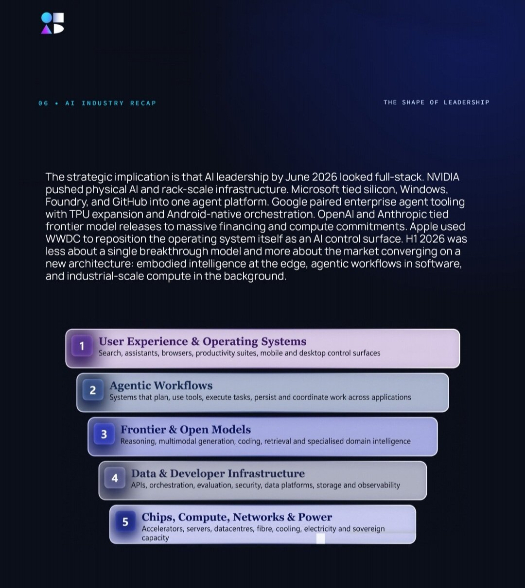
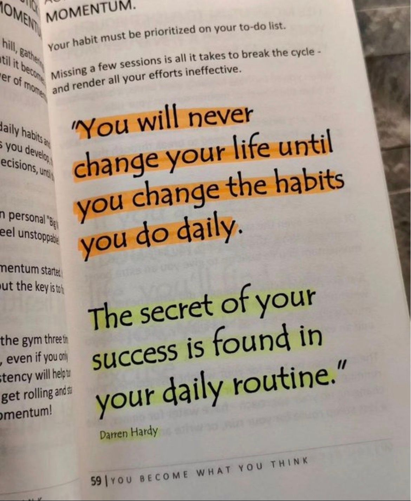

# 🐦 @Wise1Philosophy

## 📅 September 04, 2026

> 29 post(s) archived.

---

### 🕐 10:03 UTC · @Wise1Philosophy

> &quot;The companies that failed at AI transformation ran AI like a consulting program. They ran a long diagnostic, drew a target architecture, projected ROI on assumptions, and spent 18 months on integration before anyone measured a dollar. The companies that shipped ran it as a loop.&quot; https://x.com/i/article/2095537207897477125

🔗 [View original post](https://x.com/alex_prompter/status/2095814933095063768)

---

### 🕐 09:41 UTC · @Wise1Philosophy

> At a 20 year old PE-backed healthcare company, the co-founder was answering client questions by hand, because the product couldn&apos;t answer them. Nothing was broken. Here&apos;s what the company does. A doctor treats you, the practice sends the bill to your insurer, and the insurer pays it, or finds a reason not to. Their platform sits in the middle of that, checking every bill before it goes out, fixing what it can, and passing the rest to a person. It has done that job well for two decades. It&apos;s owned by a PE firm. But checking a bill and understanding a business are different jobs. The platform knew everything about every claim and couldn&apos;t tell anyone what any of it meant. Data rich and data blind. So when a client called to ask why their revenue looked wrong, an analyst had to go dig for it, writing database queries by hand against twenty years of records that were halfway through being rebuilt. One question could eat a working day. And the financial health reports that went out to prospects, the co-founder wrote personally. Nobody else could get that far into the data. Six weeks after we started, their CPTO was asking those same questions in plain English and getting answers back. Here&apos;s what happened in between: The PE firm that owns them made the introduction. They&apos;d seen our work at another company in their portfolio. What they wanted wasn&apos;t a tool to make their developers faster. They wanted something that could do the analytical work. So we put one AI Velocity Pod on it. One senior AI engineer full time, an AI lead and a delivery lead part time, working inside their team. Before the contract was signed, we followed a single claim the whole way through, from the moment a practice charges for a visit to the moment the money lands. Not to impress anybody, but because you can&apos;t build something that reasons with the data until you understand how it moves. Then we built the test along with the agent. We asked them for the questions their analysts actually get asked, and the answers those analysts had worked out by hand. Ten to start, more every cycle. Every answer the agent gave was graded against the human one, question by question. Our first working version scored 59 out of 60. Their most important question is preventable denials. When an insurer refuses to pay a medical bill, that&apos;s a denial, and a large share of them never had to happen. It&apos;s money a practice never sees. The agent&apos;s answer matched the source records to the penny, and fifteen out of fifteen denial cases passed. All of it runs inside their own systems. Patient data never leaves. Every line of code gets read by a person before it ships. Infrastructure runs $250 a month. They never came to us with a fire. Their system was stable, the business was fine, and nothing was failing per se. They just looked at where AI is going and decided they&apos;d rather be in the wave than reading about it. That&apos;s what our Velocity Framework was built for.

🔗 [View original post](https://x.com/mardehaym/status/2095809583390294307)

---

### 🕐 09:32 UTC · @Wise1Philosophy

> content teams are seriously not ready for this.. Arcads just gave Mark something even Claude fable 5.1 can&apos;t do yet: watch an entire : - TikTok - Reel - YouTube video, understand what happens in every part of it, and then recreate it for your own brand. anyone can literally turn their scrolling into content research now. how people research and create viral content just became a whole LOT easier: Media Mark is now smarter than Claude It can watch videos... and recreate them &gt; put a tiktok/IG/YT link &gt; Mark will watch the videos &gt; Analyze and recreate for your brand live today on https://arcads.ai

🔗 [View original post](https://x.com/samuraipreneur/status/2095807171359559976)

---

### 🕐 09:30 UTC · @Wise1Philosophy

> openai just launched gpt-6 astra, and people are already creating some wild stuff with it. someone built a world in unreal engine and filled it with humans (each one an astra-powered agent) who all have to work together to survive. a day later, they were in their bedroom and heard voices coming from the living room... thought someone had broken into the apartment. walked out, honestly a little scared. turned out it was the astra agents. they&apos;d started talking to each other on their own. insane. here&apos;s a brief clip (not 100% perfect yet, but still wild. sound on https://x.com/mattshumer_/status/2095596175705399482/video/1 Media

🔗 [View original post](https://x.com/daveydefi/status/2095806823156568492)

---

### 🕐 09:17 UTC · @Wise1Philosophy

> A guy charges his Galaxy S26 twice a day and blames the battery. The battery is fine. 5,000mAh. One of the largest cells Samsung has ever shipped in a flagship phone. Designed to last a full day under normal use. Rated for 7 to 8 hours of screen-on time. He&apos;s getting 4. Not because the hardware is failing. Not because the battery is defective. Not because Samsung lied about the specs. Because 7 settings on his phone are draining power every second of every day on tasks he never asked for, features he&apos;s never used, and processes he doesn&apos;t know are running. Always-on display burning at full brightness around the clock. Location services tracking his position through 18 apps he hasn&apos;t opened in months. 5G enabled in an area with weak 5G coverage forcing the modem to hunt for a signal that barely exists. Background data active on 24 apps refreshing content he&apos;ll never see. Galaxy AI features running silently in the background, consuming processing power on automations he never turned on. RAM Plus allocating virtual memory that creates more heat and more drain than it saves. And Adaptive Battery the one feature that would fix most of this turned off. His coworker, who carries the same phone and charges once a day, looked at his Settings for about 3 minutes. &quot;Your battery isn&apos;t bad. Your phone is doing the work of 3 phones right now and you only asked it to do the work of one.&quot; She changed 9 things. Same phone. Same apps. Same usage. Battery went from dying at 3 PM to lasting past midnight. Here&apos;s everything she changed 🧵

🔗 [View original post](https://x.com/Alvin1492840/status/2095803467860410781)

---

### 🕐 09:00 UTC · @Wise1Philosophy

> AI leadership stopped meaning one thing in H1 2026. The companies on top now control five layers at once, and the ones stuck on a single layer are more exposed than their valuations suggest. All five layers are mapped and discussed in the H1 2026 Industry Report:https://bit.ly/StateofAI2026

🔗 [View original post](https://x.com/TheAIColonyRD/status/2095799158149873824)

---

### 🕐 08:30 UTC · @Wise1Philosophy

🔗 [View original post](https://x.com/Mindsthatbuild/status/2095791564089893100)

---

### 🕐 08:15 UTC · @Wise1Philosophy

> This intersection design that needs zero traffic lights is going viral. Media

🔗 [View original post](https://x.com/FutureStacked/status/2095787743875944522)

---

### 🕐 08:10 UTC · @Wise1Philosophy

> Your Claude doesn&apos;t know what your Codex did. Your teammate&apos;s agent knows even less. Tutti VM fixes that: a shared workspace where people and AI agents can collaborate in real time. Your agents keep running locally on your own subscriptions. What enters the cloud Room is the working state: Conversations, files, task progress, outputs. All live, all shared. We built a fragrance brand launch in it.

🔗 [View original post](https://x.com/TheAIColony/status/2095786486775881808)

---

### 🕐 08:01 UTC · @Wise1Philosophy

🔗 [View original post](https://x.com/Wise1Philosophy/status/2095784239132201271)

---

### 🕐 07:53 UTC · @Wise1Philosophy

> A sleep doctor with 26 years of experience just explained why most of what you believe about sleeping is wrong. - 8 hours is a myth. - Melatonin is a hormone. - Waking up at 3AM happens to every person on earth. His 6 rules that will change how you sleep tonight:

🔗 [View original post](https://x.com/TinaaDeJong/status/2095782164327809229)

---

### 🕐 07:47 UTC · @Wise1Philosophy

> If you wake at 3 AM, it&apos;s cortisol. If your belly won&apos;t shift, it&apos;s cortisol. If your sex drive&apos;s gone, it&apos;s cortisol. Here&apos;s how to work on all three at once: 1. No food 3 hours before bed Media

🔗 [View original post](https://x.com/Sophiaz6xo/status/2095780673282003203)

---

### 🕐 07:40 UTC · @Wise1Philosophy

> To everyone who is 35, 38, 41, 44, 47 or 50 and whose body doesn&apos;t look like it used to: Do these 12 things. 1. Stop doing cardio

🔗 [View original post](https://x.com/RasmusNorbergg/status/2095778893307527526)

---

### 🕐 07:30 UTC · @Wise1Philosophy

🔗 [View original post](https://x.com/Daily__wisdom_/status/2095776466680037686)

---

### 🕐 07:26 UTC · @Wise1Philosophy

> Neurologists have a name for the shortfall that mimics early dementia, strips the insulation off your nerves, and hides behind a normal lab result for years. The 5 signs they check before calling it ageing: 1. Tingling or numbness in your hands and feet Media

🔗 [View original post](https://x.com/MarkoSilva291/status/2095775412786008079)

---

### 🕐 07:19 UTC · @Wise1Philosophy

> Signs you have insulin resistance (&amp; don&apos;t realize it): 1. Foam when you pee

🔗 [View original post](https://x.com/Marc0sRomano/status/2095773613341429937)

---

### 🕐 07:11 UTC · @Wise1Philosophy

> The supplements you need to move testosterone after 35: 1. Zinc in the morning

🔗 [View original post](https://x.com/MagnusLindbrg/status/2095771594824269907)

---

### 🕐 07:04 UTC · @Wise1Philosophy

> Gaining muscle is easy. But only if you are not trusting outdated bro science. Here are 6 of the most common mistakes for building muscle, and how to fix them: 1. Lifting heavy

🔗 [View original post](https://x.com/CoachLucHerrera/status/2095769835544490466)

---

### 🕐 07:01 UTC · @Wise1Philosophy

🔗 [View original post](https://x.com/apex_mentality_/status/2095769163172045192)

---

### 🕐 06:56 UTC · @Wise1Philosophy

> High cortisol adds five years to your face. It wrecks insulin, gives you a puffy face and belly, and even shrinks your brain. Here are 6 fixes with the science behind them: 1. Stop working out at 7pm Media

🔗 [View original post](https://x.com/mind_and_beauty/status/2095767887239889329)

---

### 🕐 06:50 UTC · @Wise1Philosophy

> The 3 pre-bed supplements I always return to are: 1. Magnesium glycinate (200 mg)

🔗 [View original post](https://x.com/HeyKimChong/status/2095766312819872124)

---

### 🕐 06:46 UTC · @Wise1Philosophy

> A cardiologist I follow said if he could only recommend two supplements for the rest of his career, it would be these two, and why: 1) Magnesium glycinate.

🔗 [View original post](https://x.com/CoachJulianNiko/status/2095765302978150688)

---

### 🕐 06:38 UTC · @Wise1Philosophy

> Dementia is blood flow. Dementia is cholesterol. Dementia is preventable close to half the time. 8 simple rules to protect your brain: 1. Floss your teeth Media

🔗 [View original post](https://x.com/JasperKasparov/status/2095763335417631014)

---

### 🕐 06:31 UTC · @Wise1Philosophy

> 9 years of a bad gut taught me this: gut health changes everything. If you want to fix yours, here is every tip I could come up with: 1. Cool your potatoes Media

🔗 [View original post](https://x.com/IranaJasmin/status/2095761552532279577)

---

### 🕐 06:30 UTC · @Wise1Philosophy

🔗 [View original post](https://x.com/yeti_mind/status/2095761364329337288)

---

### 🕐 06:20 UTC · @Wise1Philosophy

> Your cortisol is aging you faster than junk food. 6 signs: 1. Waking up at 3-4 AM

🔗 [View original post](https://x.com/HeyEleanorr/status/2095758760845382025)

---

### 🕐 06:05 UTC · @Wise1Philosophy

> Your body is flooded with cortisol and you do not even realise it. These are the 9 signs that confirm it: 1. Waking between 2 and 4am Media

🔗 [View original post](https://x.com/ClaraBrooksjz/status/2095755004439314834)

---

### 🕐 06:00 UTC · @Wise1Philosophy

🔗 [View original post](https://x.com/Life__Mastery/status/2095753921364890093)

---

### 🕐 06:00 UTC · @Wise1Philosophy

> Your blood sugar is ageing you faster than alcohol and cigarettes. It drives oxidative stress, cuts nitric oxide, and sets up fatty liver and diabetes. Here is the simple fix: 1. Do not walk 10,000 steps Media

🔗 [View original post](https://x.com/yourcamilavega/status/2095753763462299796)

---
