# 🐦 @Wise1Philosophy

## 📅 September 04, 2026

> 85 post(s) archived.

---

### 🕐 16:44 UTC · @Wise1Philosophy

> Your K-drama idea already has it all: forbidden love, suspicious eye contact, and enough drama for 16 episodes. The only thing missing? A production budget. 😭 Flova’s K-Drama Vibe Short Series turns one chaotic idea into characters, storyboards, emotional close-ups, and a full cinematic scene. So… what’s the next episode? Fake dating, enemies to lovers, or rich CEO amnesia? 👀🎬 Media

🔗 [View original post](https://x.com/iam_chonchol/status/2095915848255066567)

---

### 🕐 16:43 UTC · @Wise1Philosophy

> THIS IS SUCH A FUN WAY TO TEST AGENTS 🚨 @PatronusAI just dropped 100+ hours of frontier models racing the clock across 10 games. We are past the point where static leaderboards tell us anything useful. SpeedrunBench is an interactive environment built to stress-test agentic memory and execution speed. Why this matters: → Evaluates rapid state changes → Proves if an autoresearch loop can actually optimize a run → Shows exactly where current models hit a wall Watch the runs below 👀↓ Media Today, we’re releasing SpeedrunBench: the first benchmark that measures how fast agents can beat video games. We asked frontier models not to simply complete video games, but to speedrun them - across 10 titles like Mario Kart and Pokemon. On simpler games, agents get close to th…

🔗 [View original post](https://x.com/DataChaz/status/2095915770853073386)

---

### 🕐 16:42 UTC · @Wise1Philosophy

> Breaking: It&apos;s been less than 24 hours since GPT-6 Astra launched. And people are already coming up with wild use cases. 10 wild examples:

🔗 [View original post](https://x.com/TheAIColony/status/2095915409727729927)

---

### 🕐 16:37 UTC · @Wise1Philosophy

> Walking = fatty liver Walking = insulin control Walking = lower risk of early death. 8 simple rules you have to follow: 1. Don&apos;t chase 10,000 steps. Media

🔗 [View original post](https://x.com/LevelUpPrime/status/2095914068624457940)

---

### 🕐 16:29 UTC · @Wise1Philosophy

> Three scenarios define where AI goes between 2027 and 2029. In one, AI-enabled revenue approaches half a trillion dollars by 2028. In another, a two-year backlash drags the entire industry down. Only one can happen. The full outlook, including the most likely scenario, closes out the H1 2026 IndustryReport:https://bit.ly/StateofAI2026

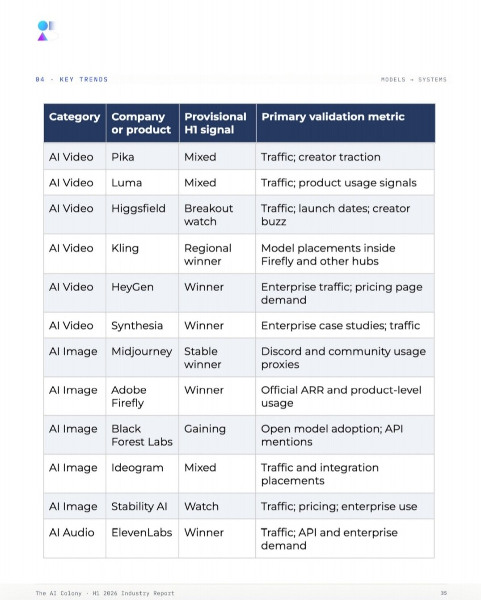

🔗 [View original post](https://x.com/TheAIColonyRD/status/2095912256529633774)

---

### 🕐 16:25 UTC · @Wise1Philosophy

> AI 3D is moving from demos to production. Just wrapped up gamescom 2026 in Cologne, and Tripo Studio was there proving it. From the booth footage, the positioning is clear: this is not just another AI 3D demo, but a production workflow for game assets. The big update: Smart Mesh P2.0 can generate production-ready game assets with native quad topology in seconds. For game builders, this is a very different category from “cool 3D preview.”

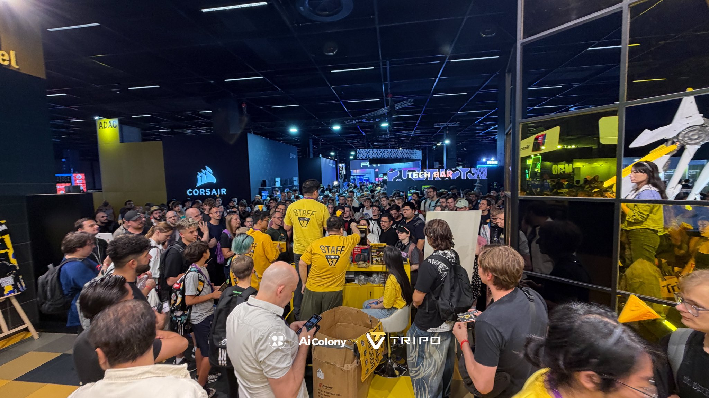

🔗 [View original post](https://x.com/FutureStacked/status/2095911226245071144)

---

### 🕐 16:20 UTC · @Wise1Philosophy

> this insane, ai is getting out of hand who said ai videos can be really funny Media

🔗 [View original post](https://x.com/daveydefi/status/2095909997930557719)

---

### 🕐 16:19 UTC · @Wise1Philosophy

> IN JAPAN, LAZINESS IS CONSIDERED A DISEASE AND PEOPLE TREAT IT WITH THESE 7 METHODS: 1. KAIZEN “THE ONE-MINUTE RULE”

🔗 [View original post](https://x.com/josh_uglyasf/status/2095909612893688179)

---

### 🕐 16:10 UTC · @Wise1Philosophy

> Your poor diet is why you are still fat. Studies confirm that the people who lose weight the fastest pick 3-4 simple diets, and eat them on repeat. Here&apos;s the list: 1. Chipotle

🔗 [View original post](https://x.com/Fitby_Chandler/status/2095907398557052960)

---

### 🕐 16:07 UTC · @Wise1Philosophy

> this is way beyond just prompting a pretty video everyone is asking which tool made this ad.. wrong question the tool didn&apos;t write the shaky arm, the focus hunt or the tired voice. i did. so here&apos;s my exact process, start to finish

🔗 [View original post](https://x.com/Wise1Philosophy/status/2095906719985508680)

---

### 🕐 16:07 UTC · @Wise1Philosophy

> The real cause of cancer was identified in 1931. The man behind the discovery won a Nobel Prize, then was buried by the pharmaceutical industry. Here&apos;s what Dr. Otto Warburg found: 1. “Cancer cells thrive in high-sugar environments.”

🔗 [View original post](https://x.com/BeBetter_Athlet/status/2095906620446568931)

---

### 🕐 15:59 UTC · @Wise1Philosophy

> Your dog is running from the bath for a reason you&apos;ve probably never thought about. It looks like pure drama. But inside their brain, something much more real is happening... 🪡👇

🔗 [View original post](https://x.com/scotti_brooks/status/2095904680274760037)

---

### 🕐 15:59 UTC · @Wise1Philosophy

> 10 things I say when my 9-year-old is disrespectful instead of yelling. Each is 3 words or less. It changes the tone fast... 👇🧵

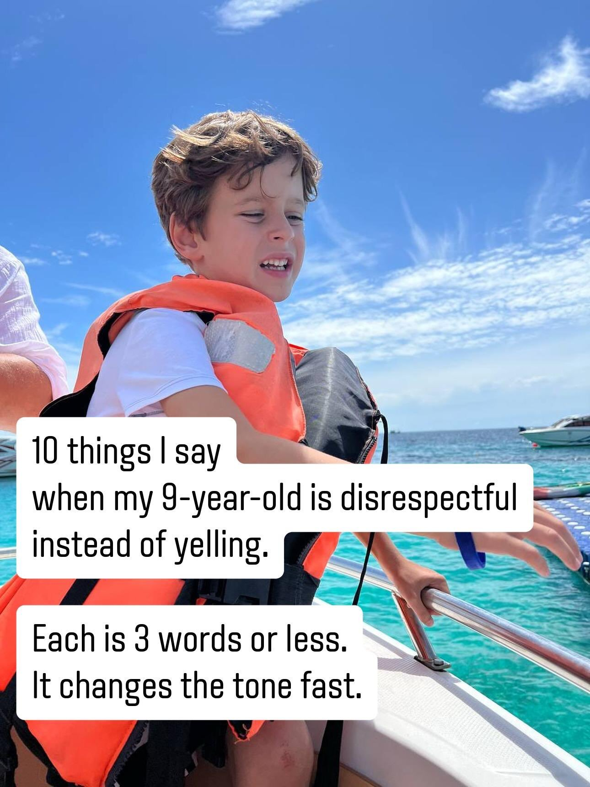

🔗 [View original post](https://x.com/Manifest_Lord/status/2095904573114482878)

---

### 🕐 15:58 UTC · @Wise1Philosophy

> Please stop using Claude or Cowork. I did, 6 months ago. Now everything runs in Code: 1. A Project → Just a folder. Open it, type claude. 2. Your instructions → ~/CLAUDE.md. Run /init once. 3. This project&apos;s rules → A CLAUDE.md in that folder. 4. Files you uploaded → Already there. Type @filename. 5. Your connectors → The same ones. They carry over. 6. The prompt you re-paste → A skill. One word. 7. Research → Subagents. Say &quot;use subagents&quot;. 8. Memory → It writes its own. /memory reads them. 9. A new chat → A HANDOVER.md, then /clear. 10. A rule it forgets → A hook. It gets no vote. 11. Every Monday → /schedule. Laptop shut. 12. Finding out after → Plan mode. Shift+Tab. Honestly, it changed how I approach content. You don&apos;t need to be a developer to use it. It&apos;s the same twelve things you use in chat every day, in a different room under a different name. New to Claude Code? Start here → https://charliehills.substack.com/p/claude-code-beginner-advanced Want 80% of Claude Code in 10 minutes? My latest guide → https://charliehills.substack.com/p/give-me-10-minutes-ill-teach-you Want every Claude guide I&apos;ve written, free? The vault → http://charliehills.substack.com Repost ♻️ to help someone in your network. P.S. Which of the 12 are you still doing the chat way?

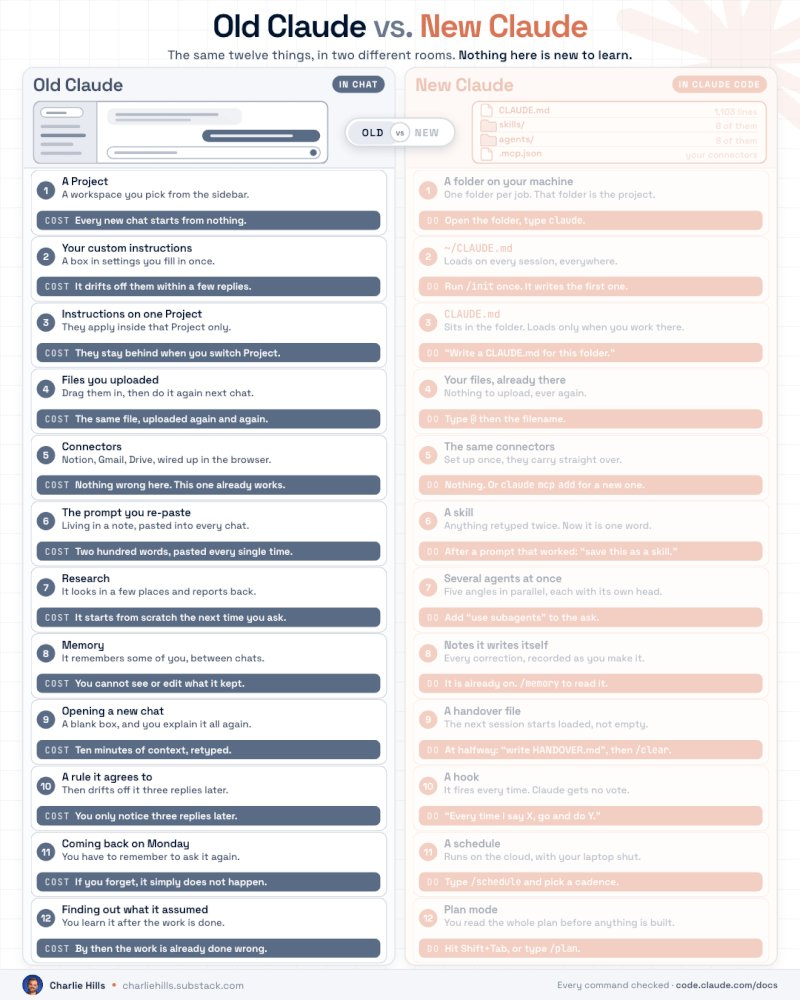

🔗 [View original post](https://x.com/charliejhills/status/2095904398065193208)

---

### 🕐 15:57 UTC · @Wise1Philosophy

> This Radiologist said : &quot;If I have cancer, I won’t go to the hospital. I’ve seen too many people die from chemo, not from cancer.&quot; 1. I’ll fast for 30 days and I’ll stop working. Media

🔗 [View original post](https://x.com/_Gut_Laboratory/status/2095904066929144186)

---

### 🕐 15:56 UTC · @Wise1Philosophy

> A Harvard neuroscientist admitted: &quot;Your belly stores cortisol waste. Kill it with this One habit before you sleep.. And your life will change.&quot; Here is the 9 minute fix:

🔗 [View original post](https://x.com/DPro_Coach/status/2095903866051334251)

---

### 🕐 15:55 UTC · @Wise1Philosophy

> Microsoft is now literally telling businesses exactly how to get traffic from AI Search. Yes, directly inside webmaster tools. This is probably one of the more important marketing updates of 2026. Let’s go through it. By the way, you can see whether your business is appearing across Google AI, ChatGPT, Claude, Perplexity and Grok here (it&apos;s free): https://rightcited.com/ Earlier this year, Microsoft launched its AI Performance report so businesses could see how often their content was cited across Microsoft Copilot and partner AI experiences. Now they are expanding it with four new AI Insights: Intents, Topics, Citation Share and Compare. Let’s go through what changed. Microsoft’s AI Performance report already showed: Total AI citations, Which pages were cited, Citation trends over time, the Average number of cited, Grounding queries associated with those citations, and now they&apos; adding even more context. The first update is Intents, thanks to which grounding queries are now classified into categories like: Informational, Commercial, Research, Learn &amp; Solve and Local. This goes without saying, but every AI citation is not equally valuable - a core principle that every SEO Stuff (http://seo-stuff.com) package starts with. A citation from an informational query may mean your content is being used to answer broad education-stage questions. A citation from a commercial query may mean your business is being considered closer to the buying decision. Imagine a payroll company sees Microsoft associating its site with: Payroll software for contractors Multi-state payroll compliance Construction payroll pricing ADP alternatives for small businesses Now the business can see whether those queries are informational, commercial, research-driven or local. That changes the content strategy. If the site is getting cited mostly for informational queries, the company may need stronger pricing pages, comparison pages, industry pages and bottom-of-funnel content. If it is getting cited for commercial queries but not winning much citation share, the issue may be authority, specificity or third-party validation. The second update is Topics. Microsoft is now grouping related queries into broader thematic clusters, and this is important because modern AI search organizes information around subjects, entities, intent, relationships and coverage depth. That means a business should ask: “Does Microsoft understand us as a strong source for this topic?” A payroll company may discover that Microsoft connects it strongly to: Contractor payroll, Small-business payroll, Payroll compliance, and Payroll pricing, as opposed to: Enterprise payroll, Global payroll, Healthcare payroll and Construction workforce management. That tells the company where its topical authority is strong and where it is thin. The third update is Citation Share. Microsoft says businesses can now see how much of the citation space their site holds for a given grounding query. Basically, you can start to see whether your site is one of many sources being cited, or whether you are earning a meaningful share of the AI answer ecosystem around a subject. That is a very different metric from raw citations, because a site may get 100 citations for a topic, but if competitors are getting 5,000, the business may still be underrepresented. Another site may only get 40 citations for a niche commercial query, but own a large share of the citation space. This starts to move AI search reporting closer to share-of-voice analysis. So less “Did we appear?” and more “How much of the available visibility did we capture?” The fourth update is Compare. Businesses can now overlay one time period against another. For example: Last 30 days vs. previous 30 days Before a content update vs. after a content update Before a backlink campaign vs. after a backlink campaign Current season vs. prior season This makes AI search optimization much easier to evaluate, because if a business publishes a new comparison page, strengthens an existing pricing guide and earns a few relevant authority placements, it can now look for citation movement afterward. You don&apos;t have full attribution here yet, but even directionally this is still a big improvement. This is where SEO Stuff’s done-for-you package becomes relevant: https://seo-stuff.com/gold-plan-package The package combines 10 AI-search-optimized articles with three DR50+ authority placements. The content helps build deeper coverage around topics AI systems already associate with your business. The authority placements help reinforce your company’s identity, category and expertise across the wider web. That combination matters because AI visibility usually comes from two things working together: Useful, specific content on your own site. Trusted external signals confirming who you are and what you should be recommended for. Microsoft says these new features are still in early preview, so occasional inaccuracies are possible, but the direction is obvious. AI search is beginning to provide its own version of keyword, topic, intent and share-of-voice data. This is the system SEO Stuff was built around: https://seo-stuff.com And if you want to see whether your business is already being cited, understood and recommended across Google AI, ChatGPT, Claude, Perplexity and Grok, check here: https://rightcited.com/ Now that OpenAI has released GPT-6 Astra, it is worth paying attention to something important: Astra is built to browse the web and use websites much more like a person. And as a result, we now have one of our clearest windows into how/why ChatGPT decides which websites to recomm…

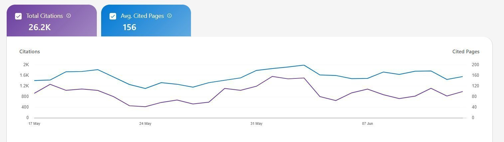

🔗 [View original post](https://x.com/alexgroberman/status/2095903641349791804)

---

### 🕐 15:54 UTC · @Wise1Philosophy

> High cortisol is aging you faster than cigarettes or alcohol. Gray hair, poor sleep, aching joints, dull drive. Here are 8 natural ways to lower it : 1. Saunas

🔗 [View original post](https://x.com/TheFastedState/status/2095903331499852042)

---

### 🕐 15:41 UTC · @Wise1Philosophy

> Perfect faces look synthetic, but small flaws give the viewer something familiar to trust. you keep asking &quot;what tool&quot;.. that&apos;s not why this looks real the realism is written into the prompt, not the model let me show you the exact lines 👇

🔗 [View original post](https://x.com/Wise1Philosophy/status/2095899953595826562)

---

### 🕐 15:40 UTC · @Wise1Philosophy

> Burning fat off your belly and face is the simplest thing on Earth once you follow this system: 1. Eat protein first

🔗 [View original post](https://x.com/CoachWillStone/status/2095899845974479121)

---

### 🕐 15:29 UTC · @Wise1Philosophy

> IF YOU&apos;RE REBUILDING YOUR LIFE AFTER 40, START WITH THESE 14 THINGS. 1. Fix your teeth, skin, and posture

🔗 [View original post](https://x.com/BeBetterMan_/status/2095897157568254413)

---

### 🕐 15:26 UTC · @Wise1Philosophy

> A family of 4 was pulled aside for additional screening on 3 consecutive flights. The father&apos;s carry-on was hand-searched every time an agent pulling out every item while the line watched. The mother set off the body scanner every time standing with arms raised for a follow-up pat-down. The 14-year-old had her water bottle confiscated and her bag re-scanned. The 10-year-old was patted down because a foil granola bar wrapper in his pocket produced an anomaly the scanner flagged for manual resolution. Three flights. Four family members. Additional screening on every single one. They assumed they were unlucky. Or flagged. Or on a list. Their neighbor a former TSA checkpoint supervisor who spent 9 years managing screening lanes at a major US airport told them they weren&apos;t unlucky. They weren&apos;t flagged. They weren&apos;t on any list. &quot;You&apos;re making 7 mistakes that trigger additional screening every time and you don&apos;t know you&apos;re making any of them. The same 7 mistakes are made by roughly 40% of passengers at every checkpoint in America every day. They&apos;re not security violations. They&apos;re packing habits, clothing choices, and bin-loading patterns that produce images the X-ray operator can&apos;t clear which forces a hand search, a pat-down, or a re-scan that takes 3–8 minutes per incident.&quot; He showed them 11 airport security strategies that separate the passenger who clears the checkpoint in 3 minutes from the passenger who gets pulled aside for 12. Here&apos;s the full playbook 🧵

🔗 [View original post](https://x.com/jackcoder0/status/2095896255557976360)

---

### 🕐 15:14 UTC · @Wise1Philosophy

> High cortisol adds 5 years to your face. It destroys insulin, gives you a puffy face and belly, and even shrinks your brain. Here are the 6 tips to fix it (according to science): 1. Don&apos;t eat 3 hours before sleep. Media

🔗 [View original post](https://x.com/CoachDanCole_/status/2095893145179533439)

---

### 🕐 14:54 UTC · @Wise1Philosophy

> OpenAI priced GPT-6 Astra to the dollar against Fable 5.1. $10 in, $50 out, cache reads at $1. What that does to a Meta ads run 👇 Shipped Sept 3. API opens in the coming days. What moved for anyone running ads through an agent: 1/ Cache reads at $1 per M. Prime once at $12.50, then 90% off every read after. Agentic ad runs live on the reads 2/ The 1.05M window. A full account&apos;s creative history fits in one call 3/ The effort dial goes 5 deep: low, medium, high, xhigh, max 4/ The 272K cliff. Cross it and the whole request bills 2x in, 1.5x out 5/ Batch and Flex at half price. Overnight reporting runs just got cheap 6/ Fast mode at 2x. Leave it off, nothing in an ads desk needs it 7/ MCP, skills, computer use, tool search, all on the supported list 8/ Rollout order: Trusted Access first, everyone else after No skill pack on this one, the API isn&apos;t open yet. Which of the 8 do I break down first?

🔗 [View original post](https://x.com/nipuntaneja/status/2095888203475804378)

---

### 🕐 14:49 UTC · @Wise1Philosophy

> La cruda verdad que nadie te dice: Un salario NUNCA te hará rico. Mientras trabajas 8 horas al día construyendo el sueño de otro... Hay gente ganando lo mismo (o más) desde su casa. Sin jefe. Sin oficina. Sin límites. Aquí tienes 12 sitios web para TRABAJAR DESDE CASA en 2026 👇 Guárdalos AHORA o te arrepentirás:

🔗 [View original post](https://x.com/Polanco_IA/status/2095887065737277706)

---

### 🕐 14:49 UTC · @Wise1Philosophy

> 🚨 @IFM_AI JUST REDEFINED OPEN SCIENCE WITH K2 HORIZON They&apos;ve just dropped the entire training lifecycle across 6 different scales. Weights tell you what a model does at the end, but logs tell you exactly how it got there. What you actually get to inspect: → pretraining through agentic post-training logs → data released where licenses allow → detailed construction recipes where redistribution is restricted .. and more! Most labs ask for blind trust. IFM actually handed over the blueprints 👀↓ When you consider a house, do you just want to be a pay-to-stay tenant like in a hotel, or buy it but without blueprint and document, or own the house alone with all its wiring, plumbing, design and construction details? What if this house is AI ? Today’s release marks the first …

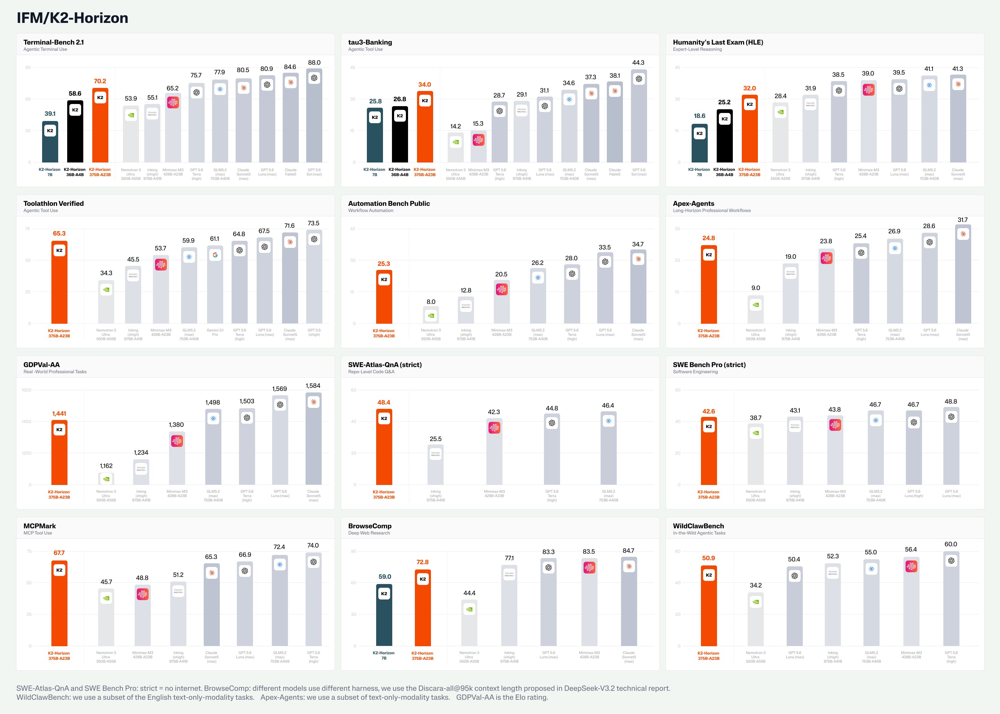

🔗 [View original post](https://x.com/DataChaz/status/2095887009260658850)

---

### 🕐 14:28 UTC · @Wise1Philosophy

> Churn above single digits will quietly bleed your business dry. If you&apos;re running an MRR offer, it should be 5% or less. Problem is, most people have no idea what&apos;s actually driving theirs up. So I put together a free Client Retention Playbook. (The 5-step playbook holding churn under 5% on my own recurring offer) Like this + comment &apos;CHURN&apos; and I&apos;ll send it over. *Must follow so I can send the DM* Media

🔗 [View original post](https://x.com/TheJeremyHaynes/status/2095881634612482254)

---

### 🕐 14:07 UTC · @Wise1Philosophy

> Wait... My Vellum assistant can now use my actual Chrome browser instead of a sandbox browser. It works inside the accounts I’m already logged into. Didn’t have to log into accounts one by one to give my agent access 👇🧵 Media

🔗 [View original post](https://x.com/kyronis_talks/status/2095876524838887789)

---

### 🕐 14:03 UTC · @Wise1Philosophy

> Now that OpenAI has released GPT-6 Astra, it is worth paying attention to something important: Astra is built to browse the web and use websites much more like a person. And as a result, we now have one of our clearest windows into how/why ChatGPT decides which websites to recommend. That has some pretty big implications for brands. Let’s go through it. Oh, and to see whether ChatGPT, Claude, Google AI, Perplexity and Grok are recommending your business right now, start here. It’s free: https://rightcited.com/ The first thing to understand is that ChatGPT is moving deeper into the customer journey. OpenAI literally uses “pediatrician search” and “apartment hunting” as examples of Astra’s computer-use capabilities. A customer can ask ChatGPT to research a category, compare options and then continue the task through the browser. So showing up in the answer is increasingly only part of the opportunity, and your website also needs to make it easy for Astra to understand what your company does, whether it is relevant to that customer and what they should do next. That starts with discovery. Clearly explain your category, products, services, locations, industries, use cases and the problems you solve. Then make the important buying information public and specific: pricing, availability, service areas, hours, eligibility, integrations, product specifications, policies, appointment information and customer results. If someone needs a fact before choosing your business, there should be a clear place online where ChatGPT can find it. Content still matters too. Comparison pages, alternatives, industry pages, location pages, FAQs, documentation, case studies and detailed service pages give Astra more ways to encounter your business during research. Third-party evidence matters for the same reason. Press coverage, reviews, industry publications, directories, expert mentions and contextual backlinks create additional places where ChatGPT can encounter your brand and verify what your website says. Astra also adds another layer businesses should start thinking about: usability. OpenAI says it can fill out online forms and interact directly with websites, so the experience after discovery matters more. If ChatGPT finds your company but cannot determine whether the service is available, where to click, how to book or what something costs, that creates friction between recommendation and action. Clear navigation, accurate information, working forms and straightforward conversion paths therefore matter for AI search too. Optimizing for ChatGPT is increasingly about being easy to discover, easy to understand, easy to verify and easy to act on. Astra makes that last part much more important. That is exactly the system Rightcited was built around: https://rightcited.com/ Brands in the finance and health spaces seemed the least impacted by the most recent Google update. (For once.) The same couldn&apos;t be said for fashion/beauty, legal, some local, some SaaS and a few other notable categories. And now that we finally have actual post-update data inst…

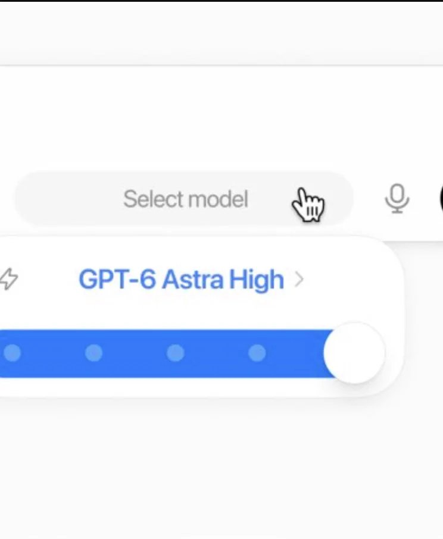

🔗 [View original post](https://x.com/alexgroberman/status/2095875451331981792)

---

### 🕐 14:03 UTC · @Wise1Philosophy

🔗 [View original post](https://x.com/Ant_Philosophy/status/2095875420566491640)

---

### 🕐 14:00 UTC · @Wise1Philosophy

> wow.. AI agents can do animation for you now I used just GPT Image 2.0 and Seedance 2.0 to generate this perfect animation video. Step-by-step tutorial with prompts: 👇 Media

🔗 [View original post](https://x.com/HeyAbhishek/status/2095874706763358301)

---

### 🕐 14:00 UTC · @Wise1Philosophy

> NEW INSIDER TRADER COUGHT. ONE lawmaker that writes your taxes just sold almost $1 MILLION in stock. And the filings show that ONE detail stands out... Here is what he sold: Kevin Hern sits on the committee that writes your taxes. The selling starts in early August and runs three straight weeks. Twenty-seven positions, every single one a sale. Not one purchase in the entire batch. Kevin Hern represents Oklahoma&apos;s first district. He sits on the House Ways and Means Committee. That panel writes the nation&apos;s tax and tariff laws. The disclosed value runs from $223,000 to $820,000. He sells blue chips across nearly every sector. Procter and Gamble, Home Depot, Nike, Boeing, Disney. Microsoft, Adobe, Lowe&apos;s, Medtronic, and more follow. Some of the timing looks sharp. Boeing trails the market by almost 9% after he sells. Home Depot, Lowe&apos;s, and Nike lag too. Other trades go the other way. Adobe and Gap then beat the market by double digits. This is a broad exit, not a clean dodge. There is a plain reason he might be selling: Hern is running for the U.S. Senate. He leaves the House when his term ends. Winding down a portfolio fits that timeline. Still, some sales take 27 days to surface. Trades from early August do not post until September. The public sees the moves only weeks later. The same man helps write the country&apos;s tax laws. The same man is cashing out of the market. The same filings sit hidden for weeks. As much as $820,000 in stock. Sold by a man who writes your taxes. Disclosed only after the fact.

🔗 [View original post](https://x.com/InsiderTrackers/status/2095874687511531673)

---

### 🕐 14:00 UTC · @Wise1Philosophy

> Para los desarrolladores de videojuegos, la IA 3D solo importa si el resultado es utilizable. Según las imágenes del stand de gamescom, el enfoque de Tripo es bastante claro: mostrar cómo la IA 3D puede integrarse en la producción de recursos reales, no solo crear atractivas previsualizaciones. Tripo Smart Mesh P2.0 es interesante porque se centra en recursos listos para producción: - Topología nativa de cuadriláteros - Edición local - Generación múltiple - Flujo de trabajo compatible con Unity, Unreal y Blender Lo vi en persona, Tripo lo presentó en gamescom 2026.

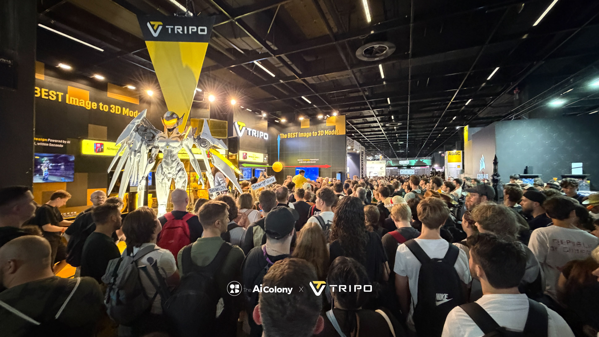

🔗 [View original post](https://x.com/MiguelMaestroIA/status/2095874640325349841)

---

### 🕐 13:56 UTC · @Wise1Philosophy

> Satya Nadella is the CEO of Microsoft. On the All-In podcast, he shared the 12 rules he&apos;s using to rebuild it around AI: 1) Everyone becomes a manager now, ready or not Media

🔗 [View original post](https://x.com/AiEvolutio58513/status/2095873547403133322)

---

### 🕐 13:49 UTC · @Wise1Philosophy

> HAY APROXIMADAMENTE 1.990.000.000 DE SITIOS WEB EN INTERNET EN 2026. Pero A GOOGLE LE ENCANTA OCULTARTE los sitios web más útiles. Aquí tienes 13 sitios web interesantes que probablemente no sabías que existían (hasta ahora): Guárdalos ahora o te arrepentirás🔖

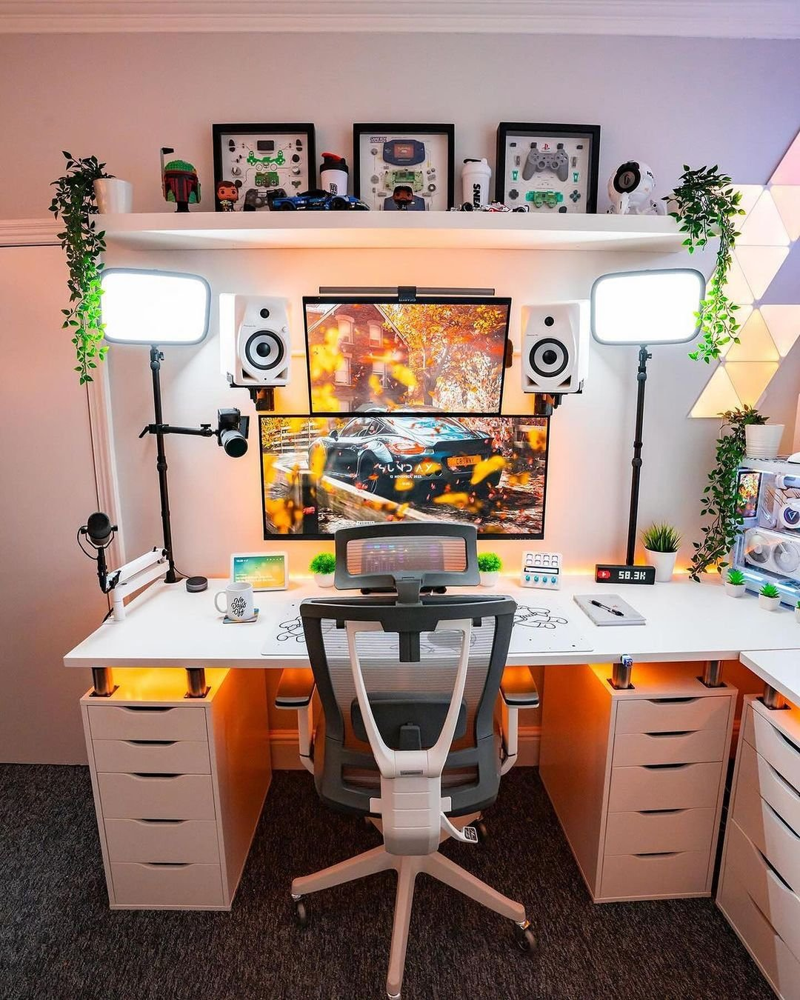

🔗 [View original post](https://x.com/Alex_Inspira/status/2095871961515876420)

---

### 🕐 13:43 UTC · @Wise1Philosophy

> Why Right NOW Is The Best Time To Start Scalping: Media

🔗 [View original post](https://x.com/RileyColemanT/status/2095870311333835218)

---

### 🕐 13:30 UTC · @Wise1Philosophy

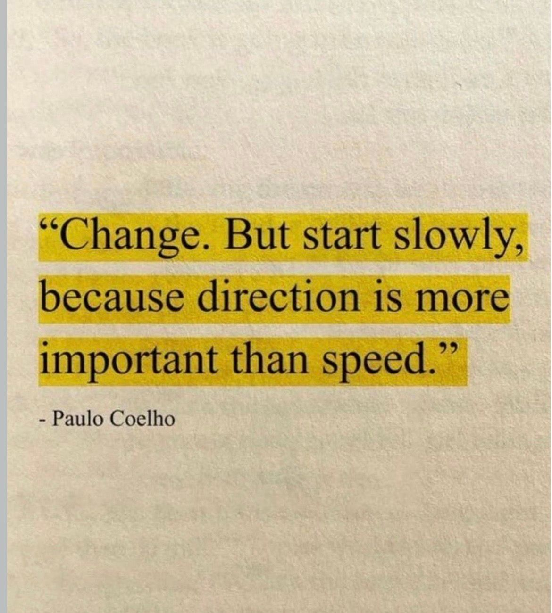

🔗 [View original post](https://x.com/Mindsthatbuild/status/2095867213815173465)

---

### 🕐 13:03 UTC · @Wise1Philosophy

> this account breaks down enterprise AI agents: A PE operating partner asked us to build production AI agents inside a portfolio company&apos;s billing system, processing real healthcare claims under HIPAA. Two people hand-wrote every rule in their claims engine across 300+ denial codes and payer logic that changes quarterly. Four …

🔗 [View original post](https://x.com/alex_prompter/status/2095860255812915469)

---

### 🕐 13:03 UTC · @Wise1Philosophy

🔗 [View original post](https://x.com/Life__Mastery/status/2095860215174291917)

---

### 🕐 13:00 UTC · @Wise1Philosophy

> Your soul knows, it will always tell you when it&apos;s time to turn the page and begin a fresh chapter of your life – trust it.

🔗 [View original post](https://x.com/_Pammy_DS_/status/2095859430260625583)

---

### 🕐 12:51 UTC · @Wise1Philosophy

> This 16-minute Claude tutorial teaches the kind of web design agencies charge $50,000 for. Save it before it disappears. Media

🔗 [View original post](https://x.com/AriaWestcott/status/2095857364574372325)

---

### 🕐 12:30 UTC · @Wise1Philosophy

🔗 [View original post](https://x.com/Wise1Philosophy/status/2095852019449774388)

---

### 🕐 12:27 UTC · @Wise1Philosophy

> Less than 24 hours ago, OpenAI dropped GPT-6 Astra. And people are already one-shotting complete games, rebuilding real places in 3D + creating interactive worlds filled with AI agents. 10 wild examples:

🔗 [View original post](https://x.com/AIHighlight/status/2095851234989146180)

---

### 🕐 12:22 UTC · @Wise1Philosophy

> THE NEXT CREATOR BUSINESS MODEL ISN’T SELLING MORE FILES. It’s packaging judgment. Resona lets creators define how they teach once, then deliver sessions that respond to each customer’s situation. Expertise becomes a personalized service without being limited by the expert’s calendar. http://resona.click Media What if your best lesson, sharpest pitch, or most trusted framework could serve 1,000 people at once—and still feel one-on-one? That&apos;s what our team @MeetResona makes possible. Resona is a professional live AI agent built for creators and educators, turning your existing material…

🔗 [View original post](https://x.com/TheAIColony/status/2095850054565200232)

---

### 🕐 12:18 UTC · @Wise1Philosophy

> The old trade-off: Near-zero marginal cost for a generic course. Thousands in expert time for personal guidance. Resona sits between them—creator knowledge delivered as responsive Live Sessions. The economics of one-to-one learning just got interesting. https://resona.click Media What if your best lesson, sharpest pitch, or most trusted framework could serve 1,000 people at once—and still feel one-on-one? That&apos;s what our team @MeetResona makes possible. Resona is a professional live AI agent built for creators and educators, turning your existing material…

🔗 [View original post](https://x.com/FutureStacked/status/2095848904625406208)

---

### 🕐 12:10 UTC · @Wise1Philosophy

> if computer use is actually reliable, that&apos;s the scary part less than 24 hours ago, openai dropped gpt-6 astra. people already one-shotted games, ios apps, and blender worlds. 8 wild examples:

🔗 [View original post](https://x.com/Wise1Philosophy/status/2095846972473098742)

---

### 🕐 12:10 UTC · @Wise1Philosophy

> There&apos;s only 4 months left until 2027. If I wanted to lock in &amp; hit my first 10k month by the end of December, exactly what I&apos;d do: 1. Go to Instagram and start a fresh account. Use a spare email. No one has to know.

🔗 [View original post](https://x.com/erichustls/status/2095846868294959367)

---

### 🕐 12:05 UTC · @Wise1Philosophy

> MongoDB was trading at $434 a share on Tuesday. Next day, it crashed 14 percent! The company had just beaten every earnings estimate on Wall Street. But the reason for crashed is much simple: MongoDB sells database software that big companies run their apps on. Its cloud product is the engine everyone watches. Sales there still grew 30 percent, to 772 million dollars. Fast by any normal standard. Management even raised its guidance for the rest of the year. But for months that engine had been speeding up. This quarter it grew at the same pace as before. Still fast, but no longer getting faster. That one change is what emptied the room. The forecast for next quarter came in softer than people hoped. And part of the profit was not really cash. The company counted stock paid to staff as earnings. That is a real cost, even when no money leaves. Strip it out, and the quarter looked thinner than the headline. None of this showed up in the number everyone quoted. It sat one layer down, in the parts nobody reads. The stock was priced for perfection before any of it landed. Almost 60 times next year&apos;s earnings. At that price, a good quarter is a letdown. You must beat the numbers and prove you are still speeding up. MongoDB proved it was big. It did not prove it was accelerating. So the people holding it for the story left. Someone was on the other side of that trade. The funds that sold into the beat locked in the high. They read the same report as everyone else. They just turned to the page retail skipped. That page cost nothing to open. It just took the patience to read past the headline. This was not a one-time fluke. The same company did this once before. In early 2025 it beat again and still fell over 20 percent. The reason then was the same as now. Soft guidance, hiding under a strong headline. The market has been repeating this for over a year. Most people keep reading only the top line. This matters far beyond one stock. In a market this expensive, good is no longer good enough. The smallest sign of slowing gets punished the same day. MongoDB was not even alone that week. Other companies beat their numbers and still got sold. A beat is only the first half of the story. The guidance and the cash are the second half. The headline shows you the first half. The filing shows you the second. You saw a beat and thought about buying the dip. The real reason it fell was one line you never opened. By the time the drop makes sense, the move is done. The traders who saw it coming were not reading the headline. They were reading the guidance line and the cash. The signal was in the filing, not the news. Retail read the beat and bought the story. Institutions read the guidance and sold it. That&apos;s the whole game. Surmount builds rules-based strategies that trade the filings instead of the headlines.

🔗 [View original post](https://x.com/LogWeaver/status/2095845629302022219)

---

### 🕐 11:47 UTC · @Wise1Philosophy

> Best YouTube Playlists to learn Programming: 1). C https://www.youtube.com/results?search_query=Learn+C+Programming+with+Dr+Chuck+freeCodeCamp 2). C++ https://www.youtube.com/watch?v=8jLOx1hD3_o 3). Python https://www.youtube.com/results?search_query=Learn+Python+Full+Course+for+Beginners+freeCodeCamp 4). Java https://www.youtube.com/results?search_query=Java+Programming+for+Beginners+Full+Course+freeCodeCamp 5). C# https://www.youtube.com/results?search_query=C%23+Full+Course+for+Beginners+freeCodeCamp 6). SQL https://www.youtube.com/results?search_query=SQL+Full+Course+for+Beginners+freeCodeCamp 7). Go https://www.youtube.com/results?search_query=Learn+Go+Programming+freeCodeCamp 8). PHP https://www.youtube.com/results?search_query=PHP+Full+Course+for+Beginners+freeCodeCamp 9). Swift https://www.youtube.com/results?search_query=Swift+Full+Course+for+Beginners 10). Kotlin https://www.youtube.com/results?search_query=Kotlin+Full+Course+for+Beginners+freeCodeCamp 11). Dart https://www.youtube.com/results?search_query=Dart+Full+Course+for+Beginners 12). Ruby https://www.youtube.com/results?search_query=Ruby+Full+Course+for+Beginners 13). Rust https://www.youtube.com/results?search_query=Rust+Full+Course+for+Beginners+freeCodeCamp 14). TypeScript https://www.youtube.com/results?search_query=TypeScript+Full+Course+for+Beginners+freeCodeCamp 15.) R https://www.youtube.com/results?search_query=R+Programming+Full+Course+for+Beginners 16). React https://www.youtube.com/results?search_query=React+Full+Course+for+Beginners+freeCodeCamp 17). Next.js https://www.youtube.com/results?search_query=Next.js+Full+Course+for+Beginners 18). Node.js https://www.youtube.com/results?search_query=Node.js+Full+Course+for+Beginners+freeCodeCamp 19). HTML/CSS https://www.youtube.com/results?search_query=HTML+CSS+Full+Course+for+Beginners+freeCodeCamp 20). Machine Learning https://www.youtube.com/results?search_query=Machine+Learning+Full+Course+for+Beginners+freeCodeCamp 21). Deep Learning https://www.youtube.com/results?search_query=Deep+Learning+Full+Course+for+Beginners 22). DSA https://www.youtube.com/results?search_query=Data+Structures+and+Algorithms+Full+Course+freeCodeCamp The tool that just took #1 on Product Hunt is not another clip generator. 2024: jump across 5 tools to assemble script, clips, voiceover, captions, and a project file by hand. 2026: open one chat. @fotor_com Video Agent plans, generates, and lays the whole video on a multi-track …

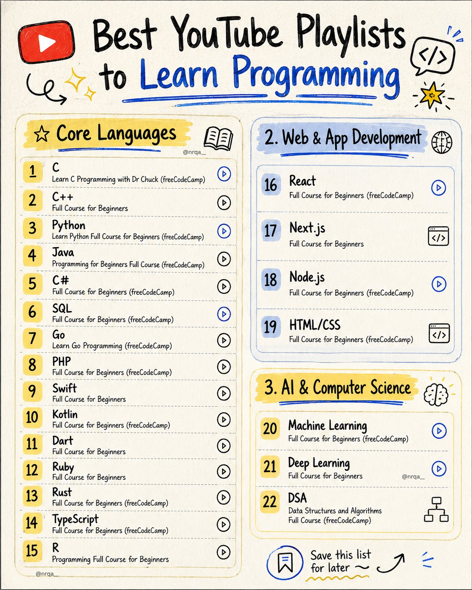

🔗 [View original post](https://x.com/nrqa__/status/2095841053001789450)

---

### 🕐 11:30 UTC · @Wise1Philosophy

🔗 [View original post](https://x.com/Daily__wisdom_/status/2095836923889643846)

---

### 🕐 11:25 UTC · @Wise1Philosophy

> A family of 4 arrived at the airport 3 hours early for an international flight. Three hours to kill. Four hungry people. One terminal designed to extract every dollar from them. $7 water bottle × 4 = $28. $14 turkey wraps × 4 = $56. $5 bags of chips × 2 = $10. $4.50 coffees × 2 = $9. $6 iPad charging cable because someone forgot theirs = $6. $12/hour WiFi for the dad&apos;s laptop × 2 hours = $24. $3.50 gummy bears from the newsstand for the kids × 4 = $14. $147. Before the plane even pushed back from the gate. On water they could have refilled for free. On food they could have eaten for free in a lounge they didn&apos;t know they had access to. On WiFi that was free on a network they didn&apos;t know existed. On a charging cable available from a free lending station they walked past without noticing. Their seatmate a management consultant who flies 80 times a year watched them unpack their $147 haul of airport purchases and said: &quot;I&apos;ve been flying for 12 years. I haven&apos;t spent a dollar inside an airport terminal in 6.&quot; He showed them 11 airport strategies that eliminate the terminal tax most travelers pay on every flight. Here&apos;s the full playbook 🧵

🔗 [View original post](https://x.com/jackcoder0/status/2095835650251698285)

---

### 🕐 11:15 UTC · @Wise1Philosophy

> Struggling to choose the right AI for each task? Use this guide to pick the right AI tool in seconds. [ remember to 🔖 bookmark this post for later ] 1. ChatGPT: ↳ If your focus is content, whether it’s writing, editing, or summarizing, this model handles it all with ease, including casual back-and-forth replies. 2. Perplexity: ↳ Useful when you need sourced answers, quick comparisons, detailed research, or market-level overviews, all in one place. 3. Grok: ↳ Best for tracking online trends, catching sarcasm and meme context, and reading live social chatter to see what’s trending now. 4. Gemini ↳ Inside your Google workflow, summarize docs, repair Sheet formulas, sort and label emails, and turn key points into clear, actionable tasks. AI works when you pick the right tool at the right time. Save this guide. Share it. Start with one use case. 📌 Get Advanced ChatGPT Guide (free): https://bit.ly/3StIB3z 👉 Follow me @AndrewBolis for more and 🔄 Repost this to help others use AI

![Struggling to choose the right AI for each task? Use this guide to pick the right AI tool in seconds. [ remember to 🔖 bookmark this post for later ] 1. ChatGPT: ↳ If your focus is content, whether it’](../../../../assets/images/2026/09/04/2095833018921582922-1.jpg)

🔗 [View original post](https://x.com/AndrewBolis/status/2095833018921582922)

---

### 🕐 11:02 UTC · @Wise1Philosophy

🔗 [View original post](https://x.com/apex_mentality_/status/2095829850795745722)

---

### 🕐 11:02 UTC · @Wise1Philosophy

> Elon Musk built SpaceX into a ~$2 trillion company WITHOUT an aerospace background. On the Cheeky Pint podcast, he shared 8 timeless principles on how he achieved this: 1) Relentlessly attack the limiting factor Media

🔗 [View original post](https://x.com/AiEvolutio58513/status/2095829756222787714)

---

### 🕐 10:30 UTC · @Wise1Philosophy

🔗 [View original post](https://x.com/yeti_mind/status/2095821757634523437)

---

### 🕐 10:03 UTC · @Wise1Philosophy

> &quot;The companies that failed at AI transformation ran AI like a consulting program. They ran a long diagnostic, drew a target architecture, projected ROI on assumptions, and spent 18 months on integration before anyone measured a dollar. The companies that shipped ran it as a loop.&quot; https://x.com/i/article/2095537207897477125

🔗 [View original post](https://x.com/alex_prompter/status/2095814933095063768)

---

### 🕐 09:41 UTC · @Wise1Philosophy

> At a 20 year old PE-backed healthcare company, the co-founder was answering client questions by hand, because the product couldn&apos;t answer them. Nothing was broken. Here&apos;s what the company does. A doctor treats you, the practice sends the bill to your insurer, and the insurer pays it, or finds a reason not to. Their platform sits in the middle of that, checking every bill before it goes out, fixing what it can, and passing the rest to a person. It has done that job well for two decades. It&apos;s owned by a PE firm. But checking a bill and understanding a business are different jobs. The platform knew everything about every claim and couldn&apos;t tell anyone what any of it meant. Data rich and data blind. So when a client called to ask why their revenue looked wrong, an analyst had to go dig for it, writing database queries by hand against twenty years of records that were halfway through being rebuilt. One question could eat a working day. And the financial health reports that went out to prospects, the co-founder wrote personally. Nobody else could get that far into the data. Six weeks after we started, their CPTO was asking those same questions in plain English and getting answers back. Here&apos;s what happened in between: The PE firm that owns them made the introduction. They&apos;d seen our work at another company in their portfolio. What they wanted wasn&apos;t a tool to make their developers faster. They wanted something that could do the analytical work. So we put one AI Velocity Pod on it. One senior AI engineer full time, an AI lead and a delivery lead part time, working inside their team. Before the contract was signed, we followed a single claim the whole way through, from the moment a practice charges for a visit to the moment the money lands. Not to impress anybody, but because you can&apos;t build something that reasons with the data until you understand how it moves. Then we built the test along with the agent. We asked them for the questions their analysts actually get asked, and the answers those analysts had worked out by hand. Ten to start, more every cycle. Every answer the agent gave was graded against the human one, question by question. Our first working version scored 59 out of 60. Their most important question is preventable denials. When an insurer refuses to pay a medical bill, that&apos;s a denial, and a large share of them never had to happen. It&apos;s money a practice never sees. The agent&apos;s answer matched the source records to the penny, and fifteen out of fifteen denial cases passed. All of it runs inside their own systems. Patient data never leaves. Every line of code gets read by a person before it ships. Infrastructure runs $250 a month. They never came to us with a fire. Their system was stable, the business was fine, and nothing was failing per se. They just looked at where AI is going and decided they&apos;d rather be in the wave than reading about it. That&apos;s what our Velocity Framework was built for.

🔗 [View original post](https://x.com/mardehaym/status/2095809583390294307)

---

### 🕐 09:32 UTC · @Wise1Philosophy

> content teams are seriously not ready for this.. Arcads just gave Mark something even Claude fable 5.1 can&apos;t do yet: watch an entire : - TikTok - Reel - YouTube video, understand what happens in every part of it, and then recreate it for your own brand. anyone can literally turn their scrolling into content research now. how people research and create viral content just became a whole LOT easier: Media Mark is now smarter than Claude It can watch videos... and recreate them &gt; put a tiktok/IG/YT link &gt; Mark will watch the videos &gt; Analyze and recreate for your brand live today on https://arcads.ai

🔗 [View original post](https://x.com/samuraipreneur/status/2095807171359559976)

---

### 🕐 09:30 UTC · @Wise1Philosophy

> openai just launched gpt-6 astra, and people are already creating some wild stuff with it. someone built a world in unreal engine and filled it with humans (each one an astra-powered agent) who all have to work together to survive. a day later, they were in their bedroom and heard voices coming from the living room... thought someone had broken into the apartment. walked out, honestly a little scared. turned out it was the astra agents. they&apos;d started talking to each other on their own. insane. here&apos;s a brief clip (not 100% perfect yet, but still wild. sound on https://x.com/mattshumer_/status/2095596175705399482/video/1 Media

🔗 [View original post](https://x.com/daveydefi/status/2095806823156568492)

---

### 🕐 09:30 UTC · @Wise1Philosophy

🔗 [View original post](https://x.com/Ant_Philosophy/status/2095806683733733631)

---

### 🕐 09:17 UTC · @Wise1Philosophy

> A guy charges his Galaxy S26 twice a day and blames the battery. The battery is fine. 5,000mAh. One of the largest cells Samsung has ever shipped in a flagship phone. Designed to last a full day under normal use. Rated for 7 to 8 hours of screen-on time. He&apos;s getting 4. Not because the hardware is failing. Not because the battery is defective. Not because Samsung lied about the specs. Because 7 settings on his phone are draining power every second of every day on tasks he never asked for, features he&apos;s never used, and processes he doesn&apos;t know are running. Always-on display burning at full brightness around the clock. Location services tracking his position through 18 apps he hasn&apos;t opened in months. 5G enabled in an area with weak 5G coverage forcing the modem to hunt for a signal that barely exists. Background data active on 24 apps refreshing content he&apos;ll never see. Galaxy AI features running silently in the background, consuming processing power on automations he never turned on. RAM Plus allocating virtual memory that creates more heat and more drain than it saves. And Adaptive Battery the one feature that would fix most of this turned off. His coworker, who carries the same phone and charges once a day, looked at his Settings for about 3 minutes. &quot;Your battery isn&apos;t bad. Your phone is doing the work of 3 phones right now and you only asked it to do the work of one.&quot; She changed 9 things. Same phone. Same apps. Same usage. Battery went from dying at 3 PM to lasting past midnight. Here&apos;s everything she changed 🧵

🔗 [View original post](https://x.com/Alvin1492840/status/2095803467860410781)

---

### 🕐 09:00 UTC · @Wise1Philosophy

> AI leadership stopped meaning one thing in H1 2026. The companies on top now control five layers at once, and the ones stuck on a single layer are more exposed than their valuations suggest. All five layers are mapped and discussed in the H1 2026 Industry Report:https://bit.ly/StateofAI2026

🔗 [View original post](https://x.com/TheAIColonyRD/status/2095799158149873824)

---

### 🕐 08:30 UTC · @Wise1Philosophy

🔗 [View original post](https://x.com/Mindsthatbuild/status/2095791564089893100)

---

### 🕐 08:15 UTC · @Wise1Philosophy

> This intersection design that needs zero traffic lights is going viral. Media

🔗 [View original post](https://x.com/FutureStacked/status/2095787743875944522)

---

### 🕐 08:10 UTC · @Wise1Philosophy

> Your Claude doesn&apos;t know what your Codex did. Your teammate&apos;s agent knows even less. Tutti VM fixes that: a shared workspace where people and AI agents can collaborate in real time. Your agents keep running locally on your own subscriptions. What enters the cloud Room is the working state: Conversations, files, task progress, outputs. All live, all shared. We built a fragrance brand launch in it.

🔗 [View original post](https://x.com/TheAIColony/status/2095786486775881808)

---

### 🕐 08:01 UTC · @Wise1Philosophy

🔗 [View original post](https://x.com/Wise1Philosophy/status/2095784239132201271)

---

### 🕐 07:53 UTC · @Wise1Philosophy

> A sleep doctor with 26 years of experience just explained why most of what you believe about sleeping is wrong. - 8 hours is a myth. - Melatonin is a hormone. - Waking up at 3AM happens to every person on earth. His 6 rules that will change how you sleep tonight:

🔗 [View original post](https://x.com/TinaaDeJong/status/2095782164327809229)

---

### 🕐 07:47 UTC · @Wise1Philosophy

> If you wake at 3 AM, it&apos;s cortisol. If your belly won&apos;t shift, it&apos;s cortisol. If your sex drive&apos;s gone, it&apos;s cortisol. Here&apos;s how to work on all three at once: 1. No food 3 hours before bed Media

🔗 [View original post](https://x.com/Sophiaz6xo/status/2095780673282003203)

---

### 🕐 07:40 UTC · @Wise1Philosophy

> To everyone who is 35, 38, 41, 44, 47 or 50 and whose body doesn&apos;t look like it used to: Do these 12 things. 1. Stop doing cardio

🔗 [View original post](https://x.com/RasmusNorbergg/status/2095778893307527526)

---

### 🕐 07:30 UTC · @Wise1Philosophy

🔗 [View original post](https://x.com/Daily__wisdom_/status/2095776466680037686)

---

### 🕐 07:26 UTC · @Wise1Philosophy

> Neurologists have a name for the shortfall that mimics early dementia, strips the insulation off your nerves, and hides behind a normal lab result for years. The 5 signs they check before calling it ageing: 1. Tingling or numbness in your hands and feet Media

🔗 [View original post](https://x.com/MarkoSilva291/status/2095775412786008079)

---

### 🕐 07:19 UTC · @Wise1Philosophy

> Signs you have insulin resistance (&amp; don&apos;t realize it): 1. Foam when you pee

🔗 [View original post](https://x.com/Marc0sRomano/status/2095773613341429937)

---

### 🕐 07:11 UTC · @Wise1Philosophy

> The supplements you need to move testosterone after 35: 1. Zinc in the morning

🔗 [View original post](https://x.com/MagnusLindbrg/status/2095771594824269907)

---

### 🕐 07:04 UTC · @Wise1Philosophy

> Gaining muscle is easy. But only if you are not trusting outdated bro science. Here are 6 of the most common mistakes for building muscle, and how to fix them: 1. Lifting heavy

🔗 [View original post](https://x.com/CoachLucHerrera/status/2095769835544490466)

---

### 🕐 07:01 UTC · @Wise1Philosophy

🔗 [View original post](https://x.com/apex_mentality_/status/2095769163172045192)

---

### 🕐 06:56 UTC · @Wise1Philosophy

> High cortisol adds five years to your face. It wrecks insulin, gives you a puffy face and belly, and even shrinks your brain. Here are 6 fixes with the science behind them: 1. Stop working out at 7pm Media

🔗 [View original post](https://x.com/mind_and_beauty/status/2095767887239889329)

---

### 🕐 06:50 UTC · @Wise1Philosophy

> The 3 pre-bed supplements I always return to are: 1. Magnesium glycinate (200 mg)

🔗 [View original post](https://x.com/HeyKimChong/status/2095766312819872124)

---

### 🕐 06:46 UTC · @Wise1Philosophy

> A cardiologist I follow said if he could only recommend two supplements for the rest of his career, it would be these two, and why: 1) Magnesium glycinate.

🔗 [View original post](https://x.com/CoachJulianNiko/status/2095765302978150688)

---

### 🕐 06:38 UTC · @Wise1Philosophy

> Dementia is blood flow. Dementia is cholesterol. Dementia is preventable close to half the time. 8 simple rules to protect your brain: 1. Floss your teeth Media

🔗 [View original post](https://x.com/JasperKasparov/status/2095763335417631014)

---

### 🕐 06:31 UTC · @Wise1Philosophy

> 9 years of a bad gut taught me this: gut health changes everything. If you want to fix yours, here is every tip I could come up with: 1. Cool your potatoes Media

🔗 [View original post](https://x.com/IranaJasmin/status/2095761552532279577)

---

### 🕐 06:30 UTC · @Wise1Philosophy

🔗 [View original post](https://x.com/yeti_mind/status/2095761364329337288)

---

### 🕐 06:20 UTC · @Wise1Philosophy

> Your cortisol is aging you faster than junk food. 6 signs: 1. Waking up at 3-4 AM

🔗 [View original post](https://x.com/HeyEleanorr/status/2095758760845382025)

---

### 🕐 06:05 UTC · @Wise1Philosophy

> Your body is flooded with cortisol and you do not even realise it. These are the 9 signs that confirm it: 1. Waking between 2 and 4am Media

🔗 [View original post](https://x.com/ClaraBrooksjz/status/2095755004439314834)

---

### 🕐 06:00 UTC · @Wise1Philosophy

🔗 [View original post](https://x.com/Life__Mastery/status/2095753921364890093)

---

### 🕐 06:00 UTC · @Wise1Philosophy

> Your blood sugar is ageing you faster than alcohol and cigarettes. It drives oxidative stress, cuts nitric oxide, and sets up fatty liver and diabetes. Here is the simple fix: 1. Do not walk 10,000 steps Media

🔗 [View original post](https://x.com/yourcamilavega/status/2095753763462299796)

---
