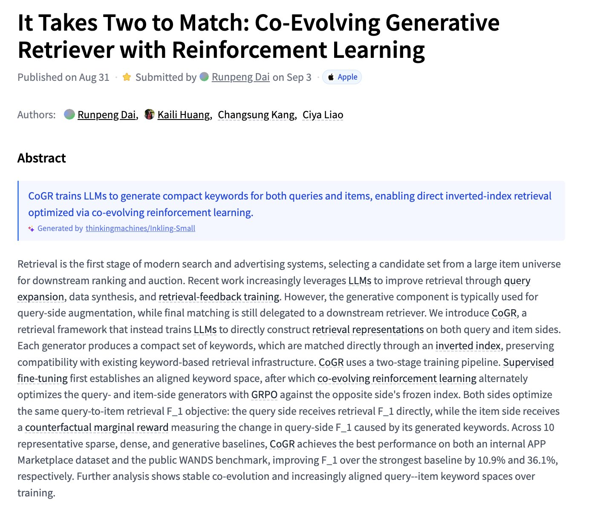
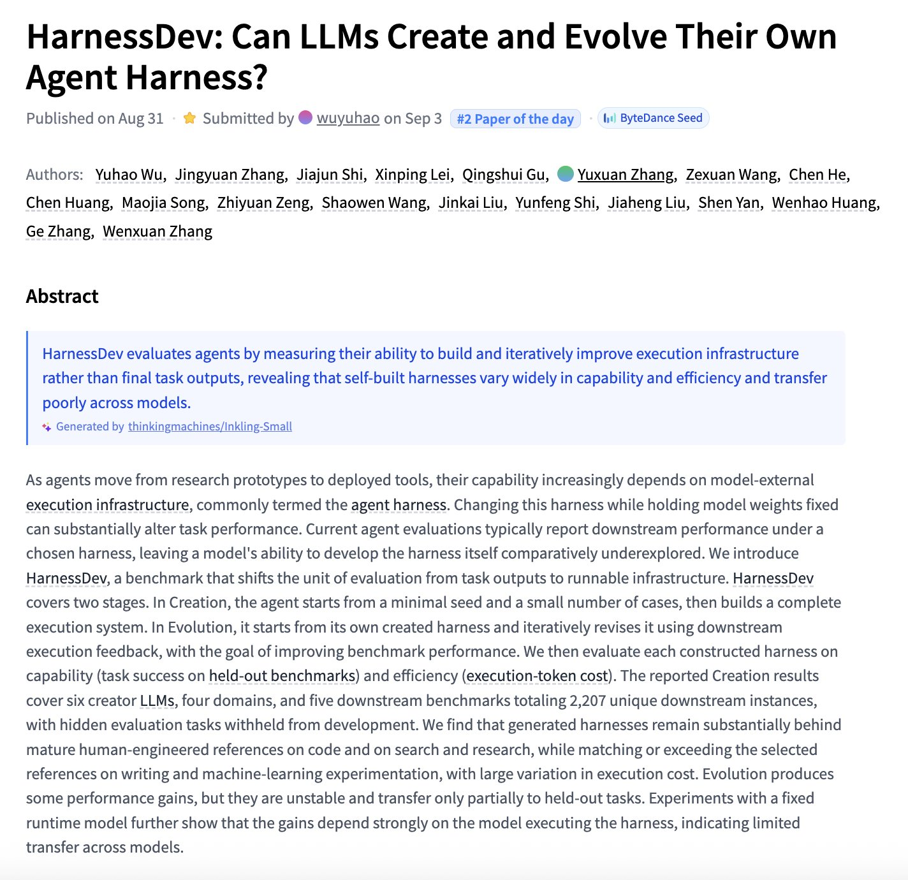

# 🐦 @_akhaliq

## 📅 September 04, 2026

> 3 post(s) archived.

---

### 🕐 00:20 UTC · @_akhaliq

> It Takes Two to Match Co-Evolving Generative Retriever with Reinforcement Learning paper: https://huggingface.co/papers/2609.00638

🔗 [View original post](https://x.com/_akhaliq/status/2095668374437306641)

---

### 🕐 00:19 UTC · @_akhaliq

> HarnessDev Can LLMs Create and Evolve Their Own Agent Harness? paper: https://huggingface.co/papers/2609.01437

🔗 [View original post](https://x.com/_akhaliq/status/2095668039404728351)

---

### 🕐 00:18 UTC · @_akhaliq

> Repo-To-Skill Distilling GitHub Repositories Into AI4AI Skills paper: https://huggingface.co/papers/2609.02749 Media

🔗 [View original post](https://x.com/_akhaliq/status/2095667775830434099)

---
