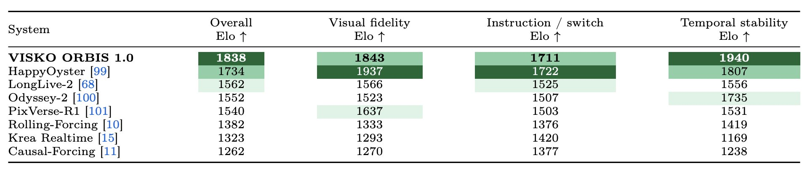
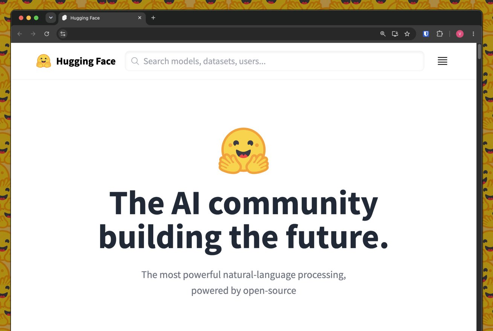
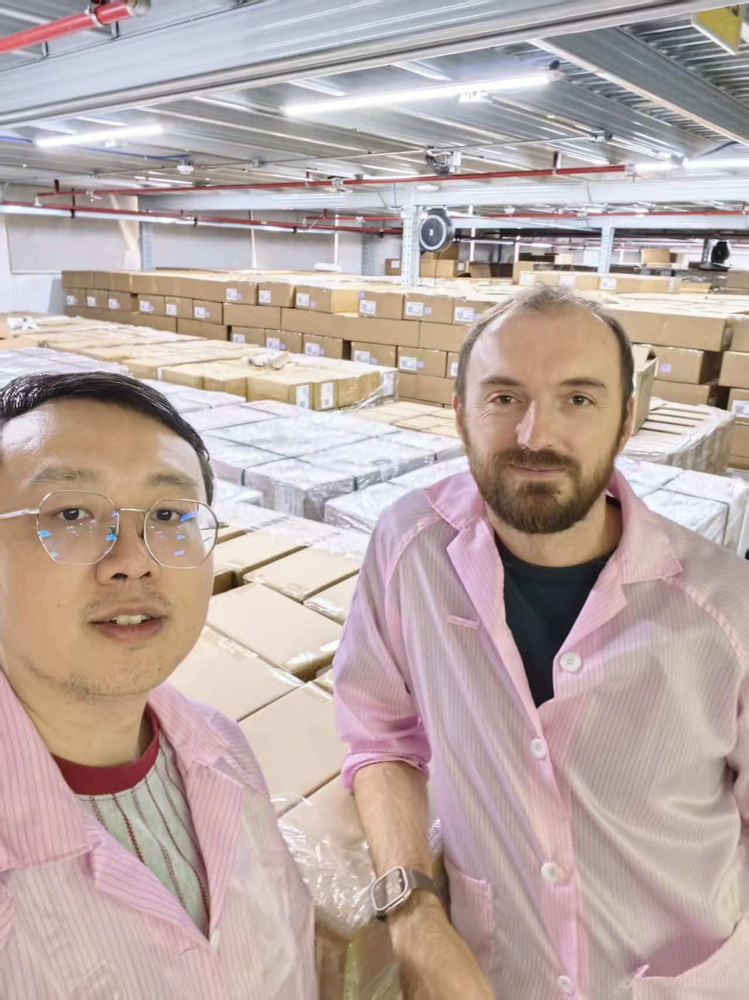

# 🐦 @_akhaliq

## 📅 September 04, 2026

> 7 post(s) archived.

---

### 🕐 16:32 UTC · @_akhaliq

> Our evaluation results for Orbis 1.0: Across automated benchmarks, Orbis scores highest on DOVER aesthetic and technical quality, and on VideoAlign visual and motion quality. It also leads three physical-plausibility protocols: VideoPhy-2, Physics-IQ, and VBench-2.0 Physics. In a randomized human Arena study of state-of-the-art real-time interactive video systems, Orbis ranked first in overall preference and first in temporal stability, the prerequisite for long-form generation. Full report: https://www.visko.ai/blog/papers/files/Visko_Orbis_1_0__A_Live_Model_for_Real_TimeInteractive_Long_Video_Generation.pdf

🔗 [View original post](https://x.com/viskoai/status/2095912920387563640)

---

### 🕐 16:12 UTC · @_akhaliq

> Compile by Training Turn natural-language specs into small neural programs that run locally on a compact interpreter. Compilation takes about a minute, and on FuzzyBench-Hard it hits 83.6% semantic accuracy. Media

🔗 [View original post](https://x.com/HuggingPapers/status/2095907902858871136)

---

### 🕐 13:09 UTC · @_akhaliq

> reflecting a bit on my (long) journey @huggingface - most big things start very small: &gt; around 6 years ago @julien_c contacts me (on twitter) he&apos;s building a &quot;hub for ml models community&quot; (wtf is this). Still I feel it&apos;s interesting and I want to be part of it &gt; day 18: we start iterating on design ideas and prototypes with the Hub team - trying a lot of stuff to understand what could work (and we are having fun doing it) &gt; day 41: julien shares our mockups with the team, &quot;everyone is pretty excited&quot;. 2 weeks later an offer email arrives, subject: &quot;Offer 🤗😱&quot; &gt; day 167: we write &quot;The AI community building the future&quot;, 2 days before launch, not sure anyone will care &gt; day 169: launch day, julien: &quot;we launch now or tomorrow?&quot; me: &quot;now, I&apos;m done&quot;. we launch the new Hugging Face Hub &gt; day 318: clem posts traffic charts in slack at 1am: &quot;very nice growth in august!&quot;. Glimpses of something happening 👀 &gt; day 687: it&apos;s not small anymore... also on this day dalle-mini goes viral, for a week the whole internet is on huggingface &gt; years pass by, we keep shipping uninterrupted, the Hub team grows a bit (with exceptional people). The community shows up, 1M models, then 3M... &gt; day 2221 (yesterday): surprise all-hands, Jensen Huang joins the call. We&apos;re joining NVIDIA.

🔗 [View original post](https://x.com/victormustar/status/2095861752609067294)

---

### 🕐 11:09 UTC · @_akhaliq

> Today we visited @seeedstudio robotics manufacturing and assembly lines to figure out how to set up lines that can scale Microduck production. BTW, that’s us standing in front of thousands of Reachy Minis ready to ship.

🔗 [View original post](https://x.com/matth_lapeyre/status/2095831515569483831)

---

### 🕐 00:20 UTC · @_akhaliq

> It Takes Two to Match Co-Evolving Generative Retriever with Reinforcement Learning paper: https://huggingface.co/papers/2609.00638

🔗 [View original post](https://x.com/_akhaliq/status/2095668374437306641)

---

### 🕐 00:19 UTC · @_akhaliq

> HarnessDev Can LLMs Create and Evolve Their Own Agent Harness? paper: https://huggingface.co/papers/2609.01437

🔗 [View original post](https://x.com/_akhaliq/status/2095668039404728351)

---

### 🕐 00:18 UTC · @_akhaliq

> Repo-To-Skill Distilling GitHub Repositories Into AI4AI Skills paper: https://huggingface.co/papers/2609.02749 Media

🔗 [View original post](https://x.com/_akhaliq/status/2095667775830434099)

---
