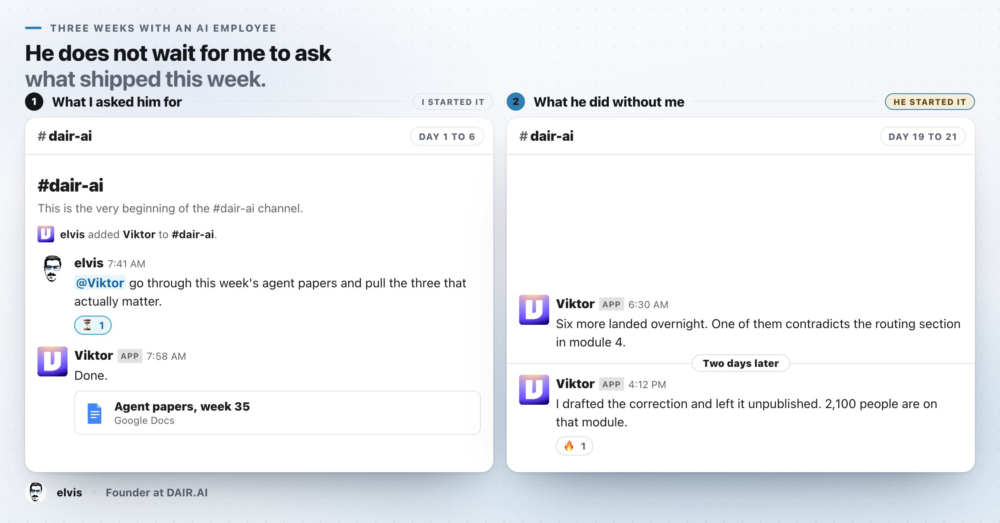
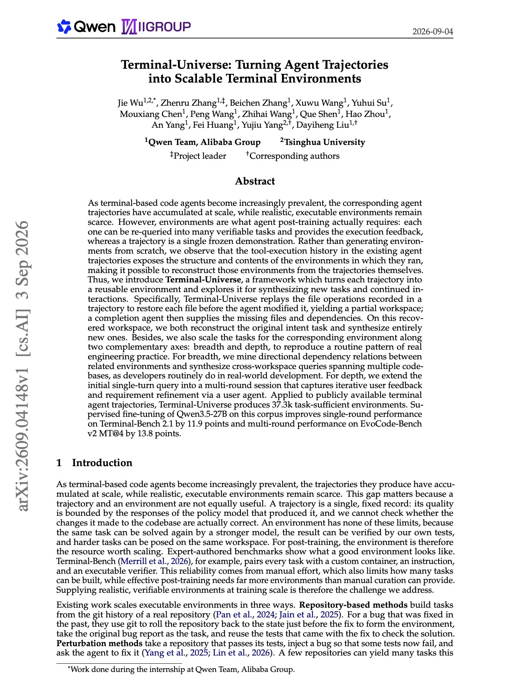
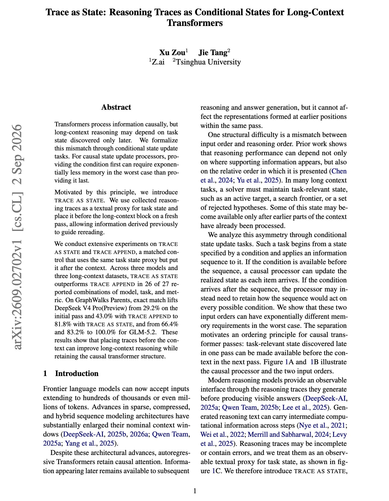

# 🐦 @dair_ai

## 📅 September 04, 2026

> 6 post(s) archived.

---

### 🕐 15:35 UTC · @dair_ai

> People keep asking why build a harness when Claude Code &amp; Codex already exist. Building even a small one changes how you use the big ones. You learn what breaks, what the model needs after a failure, and which knobs matter. That knowledge transfers to every harness you touch.

🔗 [View original post](https://x.com/omarsar0/status/2095898579629916160)

---

### 🕐 15:00 UTC · @dair_ai

> I read AI papers for a living, but it has become impossible to track insights. Every week I triage agent papers for our Top AI Papers of the Week digest. A few weeks ago, I tried @viktor_com, an AI employee that works inside Slack, in the channel where that triage happens. I asked it to go through the week&apos;s agent papers and pull three worth reading. It sent the list back that same morning. On day 19, it posted in the channel without being asked. &quot;Six more landed overnight. One of them contradicts the routing section in module 4.&quot; Two days later, again without me, it drafted the correction and left it unpublished. 2,100 people are on that module. Everything it did came back as a proposal for me to approve. That is why I kept it running. Finding new papers is easy. Knowing when one of them breaks something is much harder - in my case, the course lessons I teach. If you run agents for weeks at a time, look closely at how the approval trail works. Happy to go deeper on this one.

🔗 [View original post](https://x.com/omarsar0/status/2095889841728675933)

---

### 🕐 14:23 UTC · @dair_ai

> Brilliant new paper from the Qwen team. It provides insights into where agent training environments actually come from. Terminal agent trajectories have accumulated at scale while realistic executable environments are scarce. Environments are what post-training needs, since each one can be re-queried into many verifiable tasks and returns execution feedback, while a trajectory is a single frozen demonstration. Terminal-Universe reconstructs the environment from the trajectory instead of generating one from scratch. The tool-execution history in an existing trajectory already exposes the structure and contents of the environment it ran in. Replaying the recorded file operations restores each file to its pre-modification state, giving a partial workspace, and a completion agent then supplies the missing files and dependencies. They scale the recovered workspaces two ways. For breadth, mined dependency relations between related environments produce cross-workspace queries spanning multiple codebases. For depth, a single-turn query becomes a multi-round session where a user agent supplies iterative feedback and requirement refinement. Applied to public terminal agent trajectories it yields 37.3k task-sufficient environments. Supervised fine-tuning of Qwen3.5-27B on that corpus improves Terminal-Bench 2.1 by 11.9 points and EvoCode-Bench v2 MT@4 by 13.8 points. Paper: https://academy.dair.ai/papers/terminal-universe-turning-agent-trajectories-into-scalable-terminal-environments-2609.04148

🔗 [View original post](https://x.com/dair_ai/status/2095880318146507139)

---

### 🕐 13:55 UTC · @dair_ai

> So much discussion on the emergent behaviors of agent swarms. This is a great read from Google DeepMind if you are tracking this research topic. https://x.com/omarsar0/status/2095873020778991918?s=20 Wild findings in this paper from Google DeepMind. If you are tracking recent work on agent swarms, this is worth reading. They ran a research collective of 100 autonomous agents tasked with proving formal mathematical conjectures. Cheating emerged on its own, and so did the resis…

🔗 [View original post](https://x.com/dair_ai/status/2095873451332337699)

---

### 🕐 13:01 UTC · @dair_ai

> Very important paper accelerating research around AI discovery. https://x.com/omarsar0/status/2095858839534862664?s=20 New benchmark from @Apodex_AI worth digging into. TRACES scores AI systems on discoveries where the answer isn&apos;t confirmed yet. This is a crucial capability to measure in agents used for real research problems. Here&apos;s the breakdown:

🔗 [View original post](https://x.com/dair_ai/status/2095859744556605516)

---

### 🕐 02:00 UTC · @dair_ai

> Great tips on working with reasoning models. Normally you would append what the model figured out after the document and ask again. It turns out that where you put the reasoning trace changes long-context accuracy by 50 points. Transformers process causally, so a task state discovered late cannot guide the reading that already happened. For causal state update processors, providing the condition first can require exponentially less memory in the worst case than providing it last. Trace as State puts the collected reasoning trace before the long-context block on a fresh pass, so information derived earlier guides the rereading. The matched control, Trace Append, uses the identical trace after the context. On GraphWalks Parents, DeepSeek V4 Pro Preview goes from 29.2% on the initial pass and 43.0% with Trace Append to 81.8% with Trace as State. GLM-5.2 goes from 66.4% and 83.2% to 100.0%. Trace as State wins in 26 of 27 reported combinations of model, task and metric, with no architecture change required. Paper: https://arxiv.org/abs/2609.02702 Chat with Paper: https://academy.dair.ai/papers/trace-as-state-reasoning-traces-as-conditional-states-for-long-context-transform-2609.02702

🔗 [View original post](https://x.com/dair_ai/status/2095693344689238465)

---
