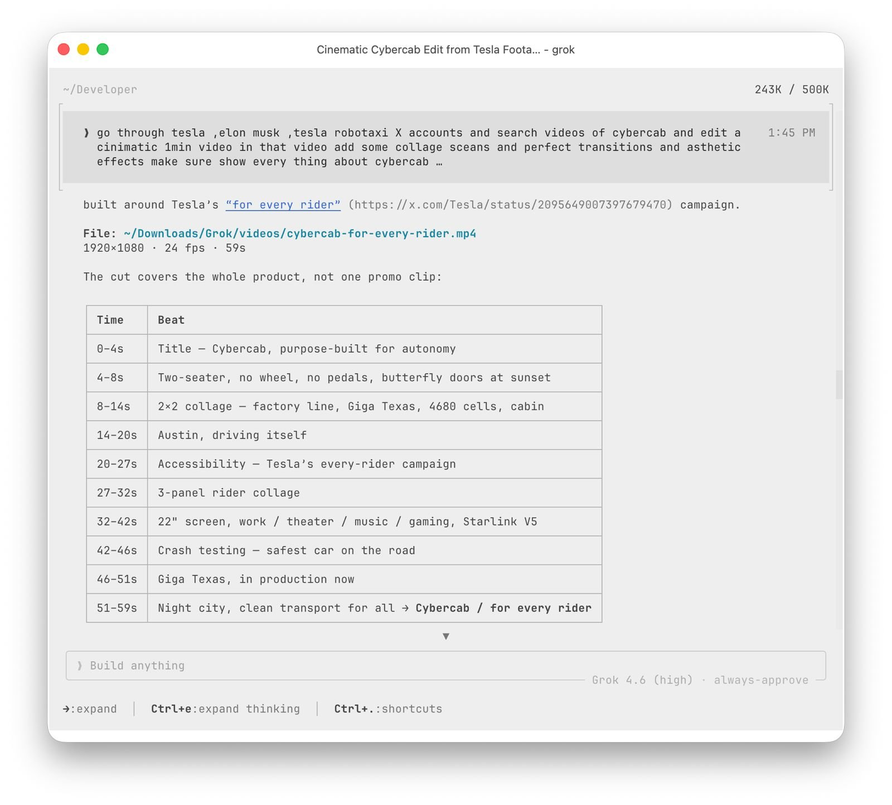
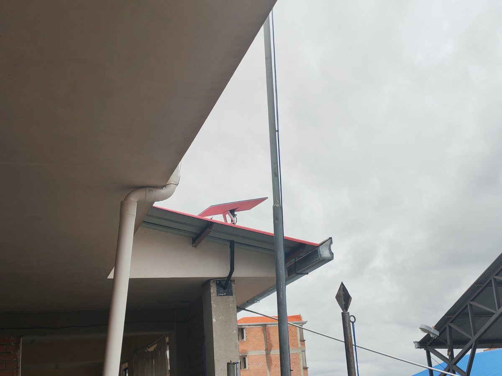
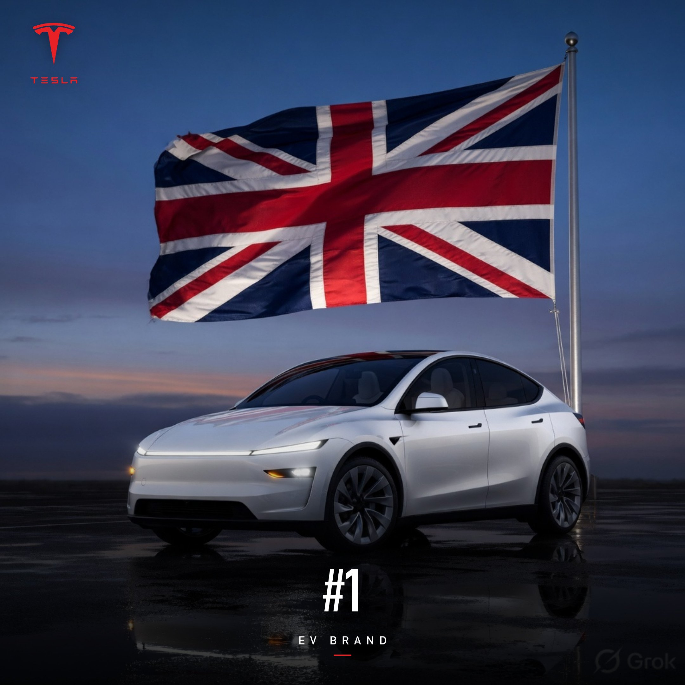

# 🐦 @elonmusk

## 📅 September 04, 2026

> 22 post(s) archived.

---

### 🕐 15:25 UTC · @elonmusk

> Lmao Elon Musk may have used his Starlink satellites to steal the 2024 election for Donald Trump, according to a new Alex Gibney documentary seen by The Hollywood Reporter (THR). “Two revelations, or at least intimations, especially stand out,” writes Steven Zeitchik. The first is an …

🔗 [View original post](https://x.com/elonmusk/status/2095896121574920271)

---

### 🕐 15:00 UTC · @elonmusk

> Your car doors open sideways. My Cybercab doors open up to the sky. I literally tap “Open” on the screen… and the doors lift up for me to step out. And it’s cheaper. And it’s safer. And it’s cooler. And it drives itself. We are not the same… the Cybercab is the best. Media

🔗 [View original post](https://x.com/Teslaconomics/status/2095889633401856330)

---

### 🕐 14:56 UTC · @elonmusk

> I edited this Cybercab video entirely with Grok Build...and the quality is kind of insane I simply asked it to make a cinematic Cybercab video highlighting it&apos;s features using official Tesla-released footage Grok Build went to 𝕏, found the videos itself, picked the best clips, figured out the sequence and turned everything into a production-quality edit And if you already have your own footage, you can just point it at the clips and tell it what you want Grok Build can literally edit videos for you You give Grok Build the direction... It handles the actual production For more than a century, every car was designed around the person driving it Cybercab changes that assumption completely It is about removing driving from your life entirely You decide where you want to go The car arrives. It takes you there, and everything in between just happen…

🔗 [View original post](https://x.com/XFreeze/status/2095888700131651590)

---

### 🕐 14:41 UTC · @elonmusk

> BREAKING: Starlink is now fully operational at about 240 schools in El Alto, Bolivia, connecting over 260,000 students to high-speed internet. That’s almost 80% of the city’s schools, with all 312 expected online by the third week of September.

🔗 [View original post](https://x.com/cb_doge/status/2095884894098604420)

---

### 🕐 14:30 UTC · @elonmusk

> We’ve come a long way. Tesla IPO value was a thousandth of its current value! Tesla is now worth MORE than all other publicly traded automakers combined Tesla: $1.511 Trillion Everyone else combined: $1.446 Trillion Toyota, BYD, GM, Hyundai, Mercedes, BMW, Ford, Ferrari, Volkswagen, Porsche...all of them combined And Tesla still stands taller... nothing ev…

🔗 [View original post](https://x.com/elonmusk/status/2095882235027014076)

---

### 🕐 14:26 UTC · @elonmusk

> True Elon Musk: &quot;Too many judges these days are actually activists pretending to be jurists.&quot;

🔗 [View original post](https://x.com/elonmusk/status/2095881274552385810)

---

### 🕐 13:44 UTC · @elonmusk

> Telepathic chess This Neuralink patient is moving cursor and playing chess just by thinking. 🧠

🔗 [View original post](https://x.com/elonmusk/status/2095870553403884001)

---

### 🕐 13:00 UTC · @elonmusk

> Ever wonder how the world&apos;s most sophisticated secret agent handles a high stakes casino night on a strict government budget? (Spoiler: Not very well when the drinks are shaken, not stirred, and the bills are piling up!) Media

🔗 [View original post](https://x.com/keshvibezTV/status/2095859641662030225)

---

### 🕐 11:36 UTC · @elonmusk

> Tesla remains the #1 EV brand in the UK 🇬🇧 Through August 2026, Tesla still leads Britain’s entire battery-EV market with an 8.8% share And the market itself is accelerating fast... Nearly 30% of ALL new cars registered in the UK during August were fully electric Tesla is leading one of Europe’s biggest EV markets as the entire country moves rapidly toward electric

🔗 [View original post](https://x.com/XFreeze/status/2095838443267817495)

---

### 🕐 04:14 UTC · @elonmusk

> First ride midpoint impressions Media

🔗 [View original post](https://x.com/ChuckCook/status/2095727096123244624)

---

### 🕐 03:49 UTC · @elonmusk

> my dad went from “this feels scary” in his first driverless Robotaxi ride yesterday to falling asleep in a Cybercab tonight I’m not sure there’s a better endorsement of @Tesla_AI than that

🔗 [View original post](https://x.com/AIDRIVR/status/2095720869095964785)

---

### 🕐 03:48 UTC · @elonmusk

> The Cybercab motor uses no rare earth metals, but maintains the same range! This was extremely hard to achieve. The Cybercab drive unit features a simplified bar-wound stator and lubrication system, plus an overall architecture that enables fully automated, sub-10-second cycle times. It is 18% smaller, 25% lighter and more efficient than other top performing electric vehicle drive units.

🔗 [View original post](https://x.com/elonmusk/status/2095720611695759704)

---

### 🕐 03:44 UTC · @elonmusk

> Having electric brakes avoids the complexity of a hydraulic system: no need to rout plumbing all around the car Cybercab uses individual actuators on each brake caliper. Zero brake lines or fluid. This probably makes the unboxed process possible/easier because there are no brake lines running throughout the length of the vehicle, super neat.

🔗 [View original post](https://x.com/elonmusk/status/2095719587929039200)

---

### 🕐 03:40 UTC · @elonmusk

> Join @SpaceXAI in Memphis We are hiring for our super compute teams in Memphis and need to build a construction army fast. This includes engineers, electricians, maintenance technicians, server technicians, plant operators and other roles unique to data center operations and construction. You must work ex…

🔗 [View original post](https://x.com/elonmusk/status/2095718694328393975)

---

### 🕐 03:35 UTC · @elonmusk

> Cybercab safety Cybercab is engineered to be the safest car on the road

🔗 [View original post](https://x.com/elonmusk/status/2095717295192486239)

---

### 🕐 03:31 UTC · @elonmusk

> The future of transportation The future of transport is safer, more enjoyable &amp; gives you more time back With theater, music &amp; gaming apps on a 22&quot; touchscreen, Cybercab offers you a space to be productive or unwind Soon to be equipped with V5 Starlink hardware, too, for complete connectivity

🔗 [View original post](https://x.com/elonmusk/status/2095716454456787036)

---

### 🕐 03:27 UTC · @elonmusk

> Here’s my first full Cybercab ride. This vehicle is a game changer. Media

🔗 [View original post](https://x.com/SawyerMerritt/status/2095715234560274527)

---

### 🕐 02:54 UTC · @elonmusk

> An extraordinary map shows the extent that births have fallen around the world. France, Germany, Italy and the UK peaked in births more than 100 years ago. East Asia, Russia and much of Eastern Europe are now 75% below their peaks in births! Thanks @ErminiaDark A map of the peak birth years of each country and their decline since then. Produced with Wikipedia articles, a calculator, and a lot of autism. We live well into the age of demographic decline. @MoreBirths @BirthGauge @Smirkley @lymanstoneky @SimoneHCollins

🔗 [View original post](https://x.com/MoreBirths/status/2095707001477009409)

---

### 🕐 02:39 UTC · @elonmusk

> The Tesla Cybercab doesn&apos;t have ANY brake fluid. It is the first production vehicle to have a brake-by-wire system. Electronic actuators are responsible for the clamping pressure, rather than hydraulic fluid that you see in traditional vehicles. This system improves efficiency since the brake pads can fully disengage. They can go entirely off or on. It also enables Tesla to fine-tune the braking to be as smooth as possible. PLUS, when the car is built with the unboxed process, Tesla doesn&apos;t need to run any brake lines, everything is seamless. Media

🔗 [View original post](https://x.com/niccruzpatane/status/2095703149503762886)

---

### 🕐 01:57 UTC · @elonmusk

> Tesla Cybercab stops for some kids to cross the road Media

🔗 [View original post](https://x.com/DirtyTesLa/status/2095692816521253075)

---

### 🕐 00:24 UTC · @elonmusk

> Starlink will allow you to watch 4k live video while riding in Cybercab Starlink V5 will soon be integrated directly into Cybercab, delivering seamless connectivity for vehicle operations and passenger entertainment even in locations with poor or high traffic cellular service

🔗 [View original post](https://x.com/elonmusk/status/2095669235993252297)

---

### 🕐 00:20 UTC · @elonmusk

> Grok @Bot Enterprise is now available Grok Bot for Enterprise is available today. It’s free for all Grok and Cursor enterprise customers for the next two weeks. https://x.ai/news/grok-bot-for-enterprise

🔗 [View original post](https://x.com/elonmusk/status/2095668208090959941)

---
