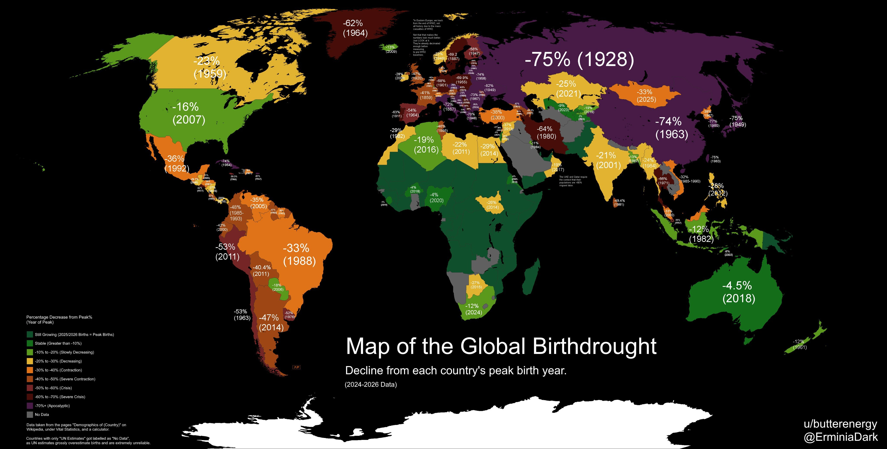

# 🐦 @elonmusk

## 📅 September 04, 2026

> 12 post(s) archived.

---

### 🕐 04:14 UTC · @elonmusk

> First ride midpoint impressions Media

🔗 [View original post](https://x.com/ChuckCook/status/2095727096123244624)

---

### 🕐 03:48 UTC · @elonmusk

> The Cybercab motor uses no rare earth metals, but maintains the same range! This was extremely hard to achieve. The Cybercab drive unit features a simplified bar-wound stator and lubrication system, plus an overall architecture that enables fully automated, sub-10-second cycle times. It is 18% smaller, 25% lighter and more efficient than other top performing electric vehicle drive units.

🔗 [View original post](https://x.com/elonmusk/status/2095720611695759704)

---

### 🕐 03:44 UTC · @elonmusk

> Having electric brakes avoids the complexity of a hydraulic system: no need to rout plumbing all around the car Cybercab uses individual actuators on each brake caliper. Zero brake lines or fluid. This probably makes the unboxed process possible/easier because there are no brake lines running throughout the length of the vehicle, super neat.

🔗 [View original post](https://x.com/elonmusk/status/2095719587929039200)

---

### 🕐 03:40 UTC · @elonmusk

> Join @SpaceXAI in Memphis We are hiring for our super compute teams in Memphis and need to build a construction army fast. This includes engineers, electricians, maintenance technicians, server technicians, plant operators and other roles unique to data center operations and construction. You must work ex…

🔗 [View original post](https://x.com/elonmusk/status/2095718694328393975)

---

### 🕐 03:35 UTC · @elonmusk

> Cybercab safety Cybercab is engineered to be the safest car on the road

🔗 [View original post](https://x.com/elonmusk/status/2095717295192486239)

---

### 🕐 03:31 UTC · @elonmusk

> The future of transportation The future of transport is safer, more enjoyable &amp; gives you more time back With theater, music &amp; gaming apps on a 22&quot; touchscreen, Cybercab offers you a space to be productive or unwind Soon to be equipped with V5 Starlink hardware, too, for complete connectivity

🔗 [View original post](https://x.com/elonmusk/status/2095716454456787036)

---

### 🕐 03:27 UTC · @elonmusk

> Here’s my first full Cybercab ride. This vehicle is a game changer. Media

🔗 [View original post](https://x.com/SawyerMerritt/status/2095715234560274527)

---

### 🕐 02:54 UTC · @elonmusk

> An extraordinary map shows the extent that births have fallen around the world. France, Germany, Italy and the UK peaked in births more than 100 years ago. East Asia, Russia and much of Eastern Europe are now 75% below their peaks in births! Thanks @ErminiaDark A map of the peak birth years of each country and their decline since then. Produced with Wikipedia articles, a calculator, and a lot of autism. We live well into the age of demographic decline. @MoreBirths @BirthGauge @Smirkley @lymanstoneky @SimoneHCollins

🔗 [View original post](https://x.com/MoreBirths/status/2095707001477009409)

---

### 🕐 02:39 UTC · @elonmusk

> The Tesla Cybercab doesn&apos;t have ANY brake fluid. It is the first production vehicle to have a brake-by-wire system. Electronic actuators are responsible for the clamping pressure, rather than hydraulic fluid that you see in traditional vehicles. This system improves efficiency since the brake pads can fully disengage. They can go entirely off or on. It also enables Tesla to fine-tune the braking to be as smooth as possible. PLUS, when the car is built with the unboxed process, Tesla doesn&apos;t need to run any brake lines, everything is seamless. Media

🔗 [View original post](https://x.com/niccruzpatane/status/2095703149503762886)

---

### 🕐 01:57 UTC · @elonmusk

> Tesla Cybercab stops for some kids to cross the road Media

🔗 [View original post](https://x.com/DirtyTesLa/status/2095692816521253075)

---

### 🕐 00:24 UTC · @elonmusk

> Starlink will allow you to watch 4k live video while riding in Cybercab Starlink V5 will soon be integrated directly into Cybercab, delivering seamless connectivity for vehicle operations and passenger entertainment even in locations with poor or high traffic cellular service

🔗 [View original post](https://x.com/elonmusk/status/2095669235993252297)

---

### 🕐 00:20 UTC · @elonmusk

> Grok @Bot Enterprise is now available Grok Bot for Enterprise is available today. It’s free for all Grok and Cursor enterprise customers for the next two weeks. https://x.ai/news/grok-bot-for-enterprise

🔗 [View original post](https://x.com/elonmusk/status/2095668208090959941)

---
