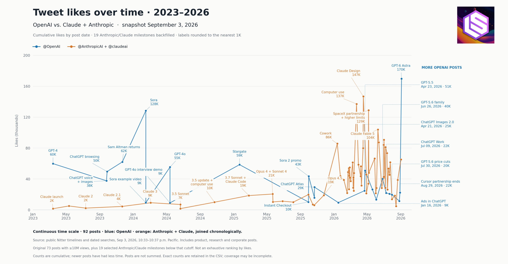

# 🐦 @swyx

## 📅 September 04, 2026

> 2 post(s) archived.

---

### 🕐 06:15 UTC · @swyx

> the reception is unlike anything i thought possible for a 2026 OAI launch https://x.com/latentspacepod/status/2095757111854866639 for the first time in a year, @OpenAI&apos;s model launch has been better received than a Claude launch. https://www.latent.space/p/ainews-gpt-6-astra-openais-biggest this is a huge upset that we had previously not thought possible this year.

🔗 [View original post](https://x.com/swyx/status/2095757526726025348)

---

### 🕐 06:13 UTC · @swyx

> for the first time in a year, @OpenAI&apos;s model launch has been better received than a Claude launch. https://www.latent.space/p/ainews-gpt-6-astra-openais-biggest this is a huge upset that we had previously not thought possible this year. sorry for the radio silence folks - got sucked into extreme LLM psychosis. but i can confidently say we have crossed over into a new age of AI Engineering and we are never, ever, looking back. this isnt even EVERYTHING i did with Astra but i&apos;ll append more reports as I publish th…

🔗 [View original post](https://x.com/latentspacepod/status/2095757111854866639)

---
