# 🐦 @Unlockyourlife_

## 📅 September 05, 2026

> 38 post(s) archived.

---

### 🕐 14:10 UTC · @Unlockyourlife_

> Your lungs can repair some smoking-related damage after you stop, and quitting at any age can improve your health. The earlier you quit, the more you can reduce your risk of smoking-related disease. Your lungs don&apos;t need smoke to function. They need clean air.

🔗 [View original post](https://x.com/_fitnesshub/status/2096239503451083240)

---

### 🕐 14:10 UTC · @Unlockyourlife_

> 5. IT INCREASES THE RISK OF SERIOUS LUNG DISEASE Long-term smoking significantly increases the risk of COPD, emphysema, chronic bronchitis and lung cancer. The longer and more heavily someone smokes, the greater the risk.

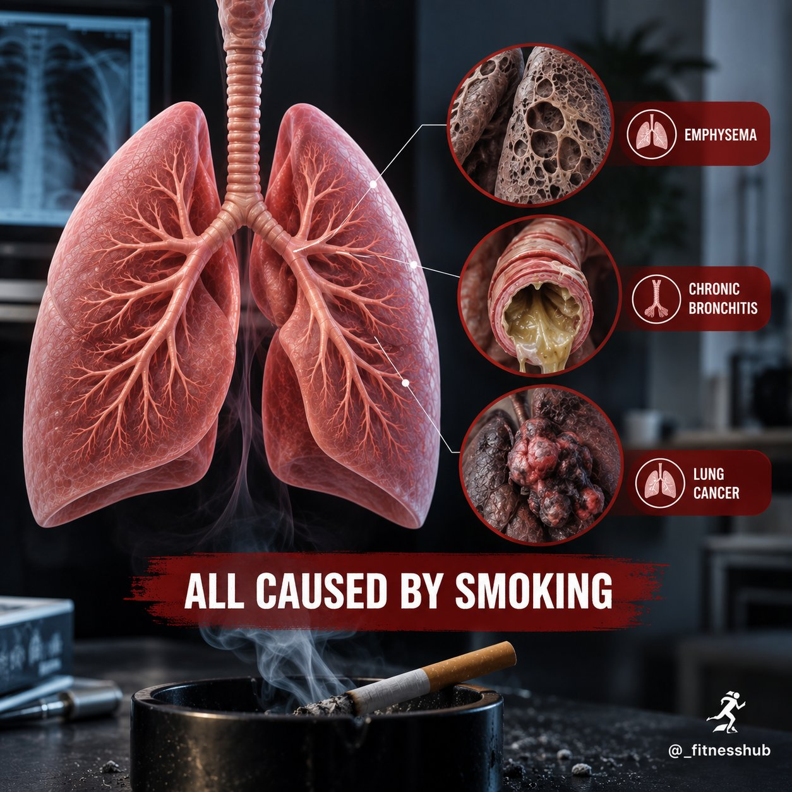

🔗 [View original post](https://x.com/_fitnesshub/status/2096239496882700589)

---

### 🕐 14:10 UTC · @Unlockyourlife_

> 4. IT MAKES YOU PRODUCE MORE MUCUS Smoking stimulates the airways to produce more mucus while also making it harder to clear. That can contribute to persistent coughing, phlegm and chest congestion.

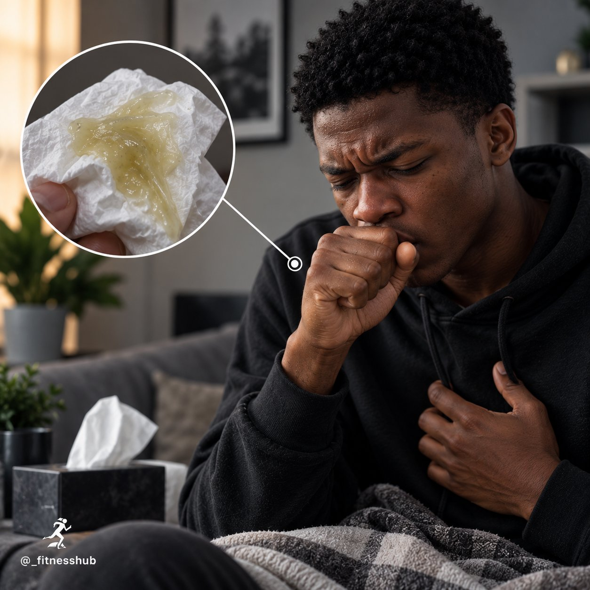

🔗 [View original post](https://x.com/_fitnesshub/status/2096239488045396110)

---

### 🕐 14:10 UTC · @Unlockyourlife_

> 3. IT DAMAGES THE AIR SACS Deep inside your lungs are millions of tiny air sacs called alveoli, where oxygen enters your blood. Smoking can damage and destroy these delicate structures, reducing the lungs’ ability to exchange oxygen effectively.

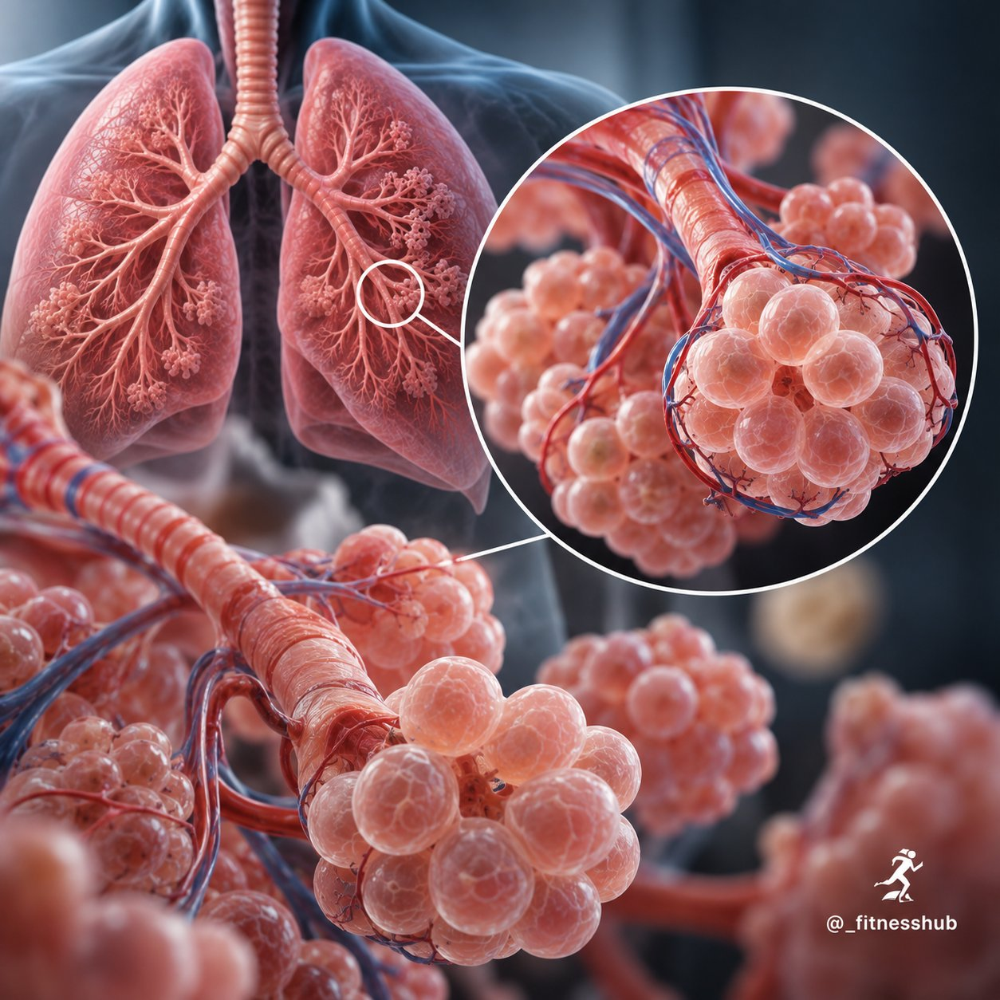

🔗 [View original post](https://x.com/_fitnesshub/status/2096239477245055120)

---

### 🕐 14:10 UTC · @Unlockyourlife_

> 2. IT DESTROYS THE LUNGS’ CLEANING SYSTEM Your airways have tiny hair-like structures called cilia that help move mucus and trapped particles out of your lungs. Smoking damages these cilia, allowing mucus and harmful particles to build up more easily.

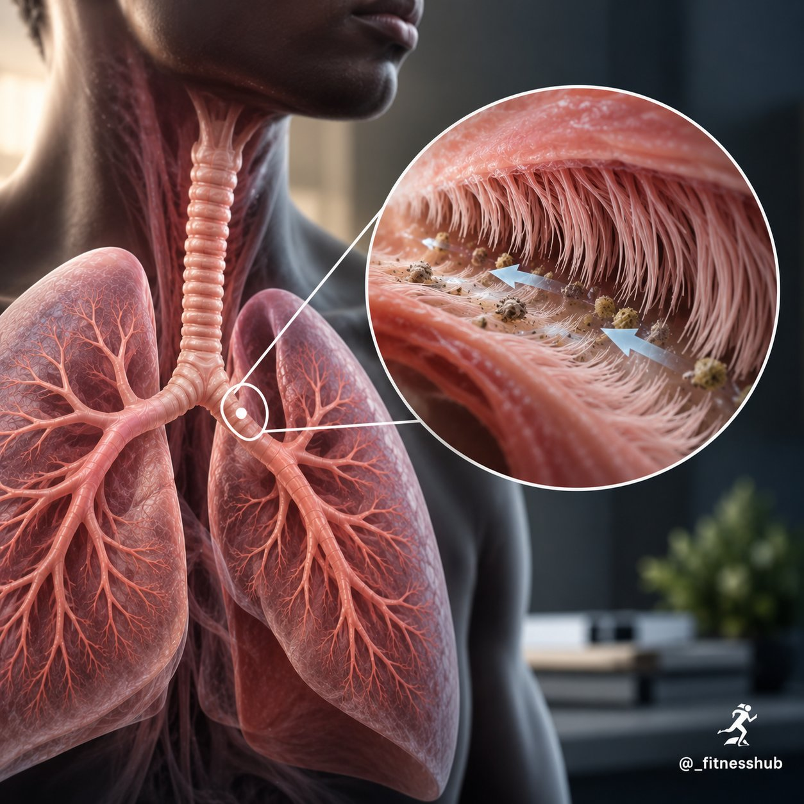

🔗 [View original post](https://x.com/_fitnesshub/status/2096239468541862196)

---

### 🕐 14:10 UTC · @Unlockyourlife_

> 1. IT DAMAGES THE AIRWAYS Smoke irritates and inflames the lining of your airways. Over time, this can make the airways narrower, making it harder for air to move in and out of your lungs.

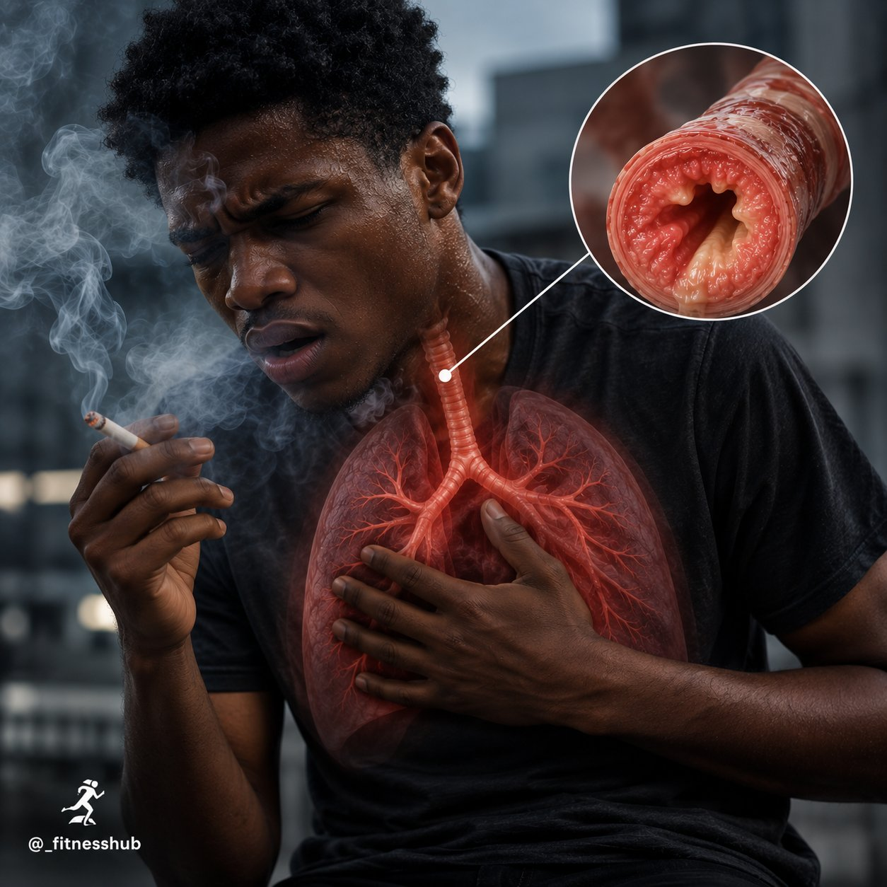

🔗 [View original post](https://x.com/_fitnesshub/status/2096239457586319411)

---

### 🕐 14:10 UTC · @Unlockyourlife_

> WHAT SMOKING DOES TO YOUR LUNGS 🚬🫁 Your lungs are constantly working to bring oxygen into your body and remove waste gases. But every time you smoke, you expose them to thousands of chemicals that can damage the delicate tissues responsible for breathing. Here’s what smoking can actually do to your lungs:

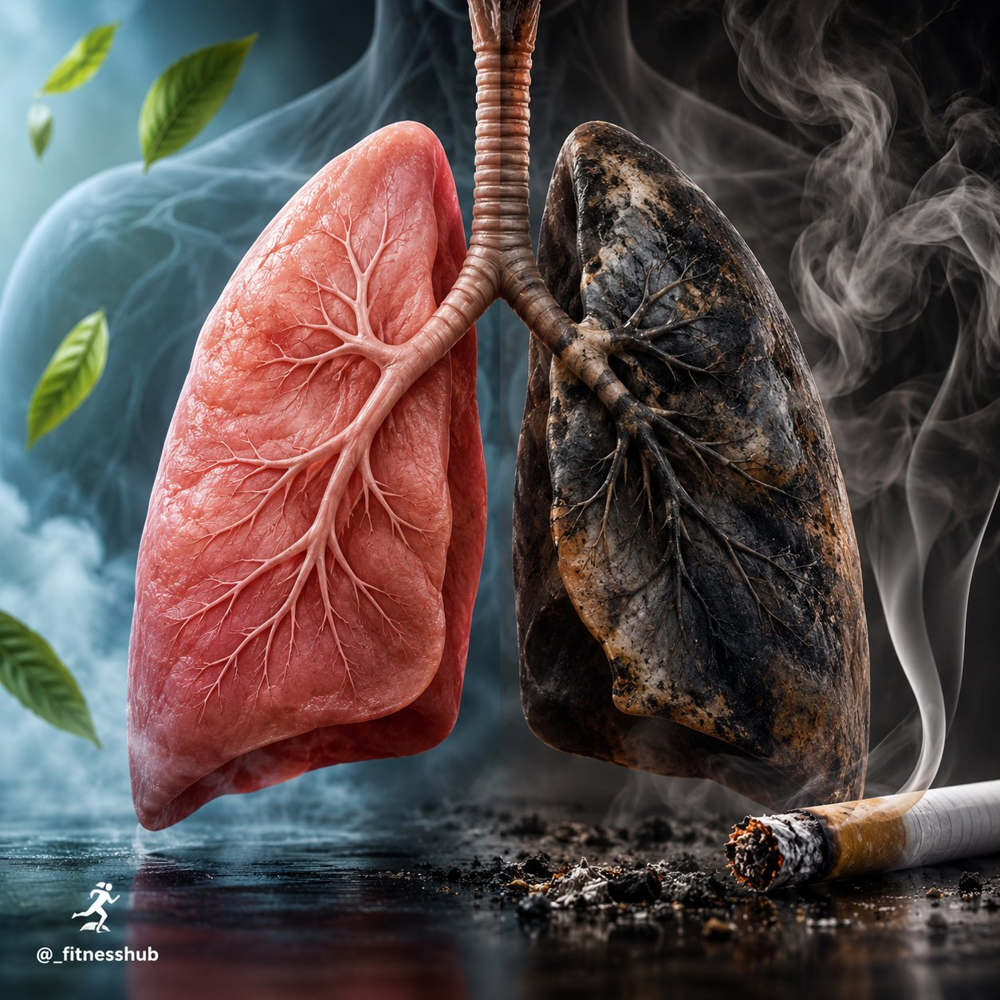

🔗 [View original post](https://x.com/_fitnesshub/status/2096239448514052201)

---

### 🕐 13:59 UTC · @Unlockyourlife_

> Here is how to build a retaining wall Media

🔗 [View original post](https://x.com/_learnskills/status/2096236682785742852)

---

### 🕐 13:33 UTC · @Unlockyourlife_

> How the Solar system moves in Space 🤯 Media

🔗 [View original post](https://x.com/sciencepathx/status/2096230173553176883)

---

### 🕐 12:35 UTC · @Unlockyourlife_

> Diy Handy Bench you would love! Media

🔗 [View original post](https://x.com/samx_reels/status/2096215614268338605)

---

### 🕐 12:22 UTC · @Unlockyourlife_

> No natural drink can magically burn body fat. The best choices are low-calorie drinks that help you stay hydrated and replace sugary beverages. Combine them with a balanced diet, regular movement, good sleep and consistency for lasting weight management.

🔗 [View original post](https://x.com/FitnessDr_/status/2096212306086543601)

---

### 🕐 12:22 UTC · @Unlockyourlife_

> 5. Cinnamon Tea

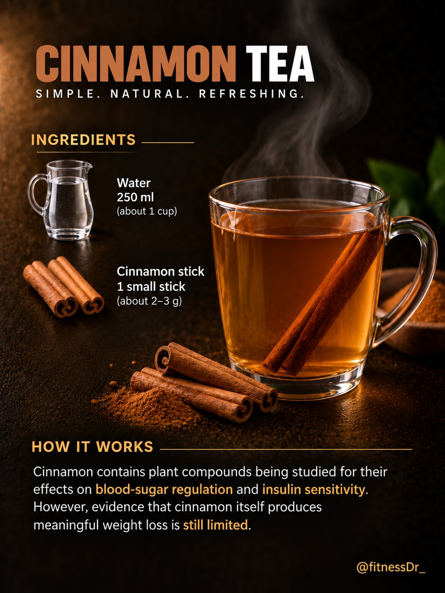

🔗 [View original post](https://x.com/FitnessDr_/status/2096212303674794261)

---

### 🕐 12:22 UTC · @Unlockyourlife_

> 4. Ginger &amp; lemon water

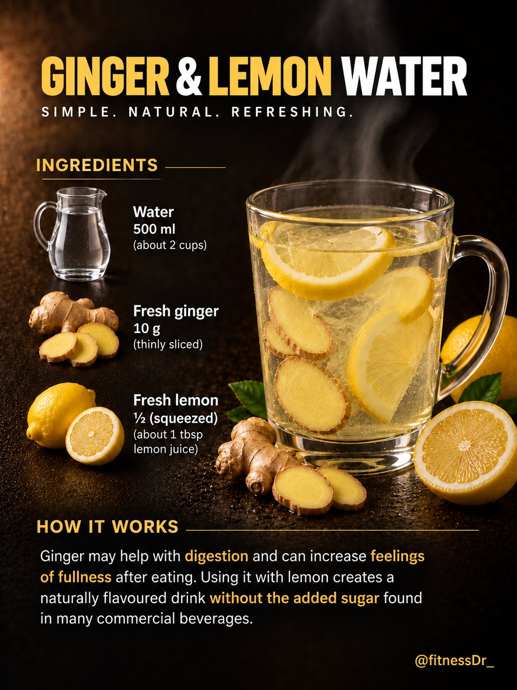

🔗 [View original post](https://x.com/FitnessDr_/status/2096212293545586781)

---

### 🕐 12:22 UTC · @Unlockyourlife_

> 3. Cucumber &amp; mint water

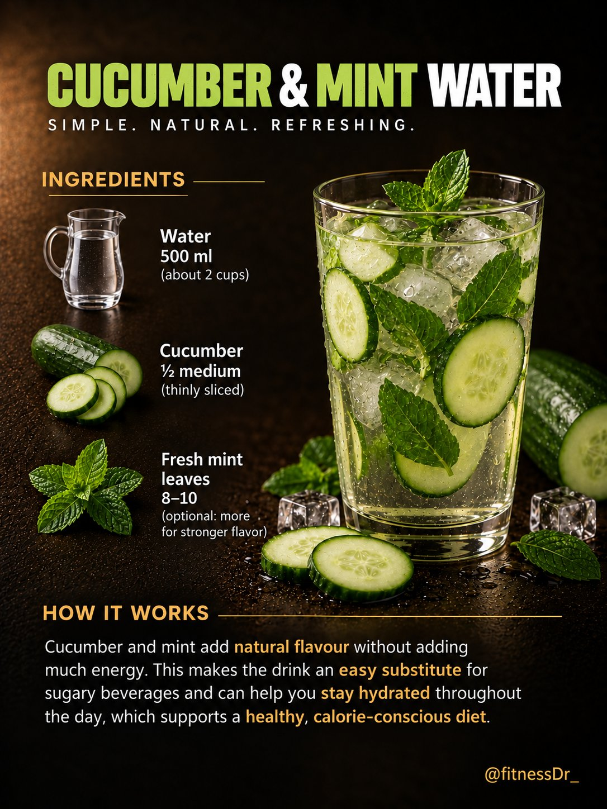

🔗 [View original post](https://x.com/FitnessDr_/status/2096212280732004732)

---

### 🕐 12:22 UTC · @Unlockyourlife_

> 2. Green Tea

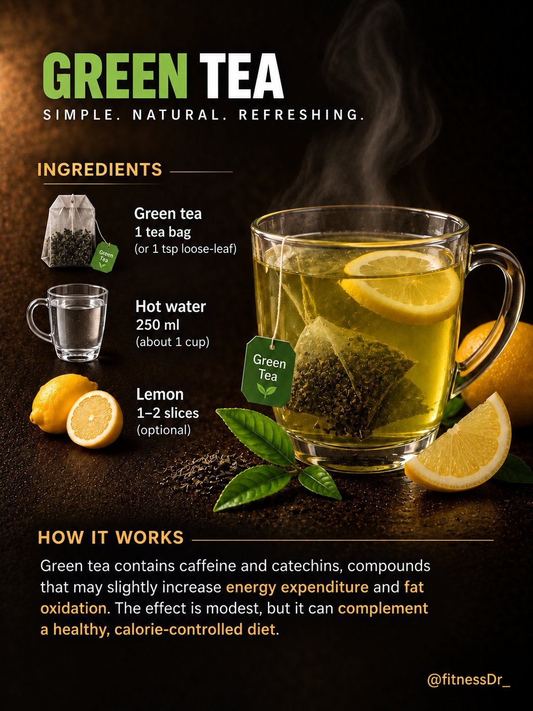

🔗 [View original post](https://x.com/FitnessDr_/status/2096212270539829414)

---

### 🕐 12:22 UTC · @Unlockyourlife_

> 5 NATURAL DRINKS THAT CAN SUPPORT WEIGHT LOSS. 1. Lemon water

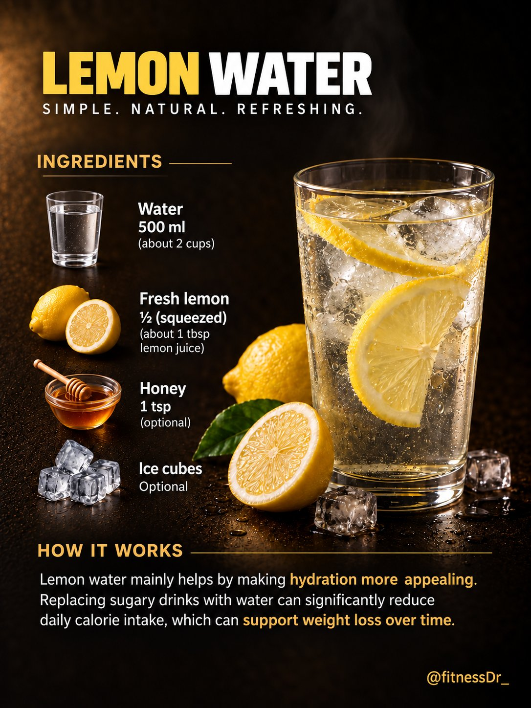

🔗 [View original post](https://x.com/FitnessDr_/status/2096212261090066685)

---

### 🕐 12:15 UTC · @Unlockyourlife_

> Skills you can&apos;t Buy🔥 Media

🔗 [View original post](https://x.com/Smart_Tipsx/status/2096210667887796598)

---

### 🕐 12:13 UTC · @Unlockyourlife_

> For 80+ years, researchers have been studying one question: What actually makes a good life? The answer isn’t what most people think. Here are 8 things quietly shaping your quality of life:

🔗 [View original post](https://x.com/Mastering_life_/status/2096210020635705701)

---

### 🕐 12:11 UTC · @Unlockyourlife_

> Professional Car Bumper Repair! Media

🔗 [View original post](https://x.com/_Brainboxx/status/2096209586000662726)

---

### 🕐 11:10 UTC · @Unlockyourlife_

> Walking vs Running .

🔗 [View original post](https://x.com/_fitnesshub/status/2096194279148322856)

---

### 🕐 10:22 UTC · @Unlockyourlife_

> Find Your Undertone In 5 Seconds.

🔗 [View original post](https://x.com/BioLifex/status/2096182139351957621)

---

### 🕐 10:21 UTC · @Unlockyourlife_

> Do This Before Workout

🔗 [View original post](https://x.com/_alphafit/status/2096181863702208662)

---

### 🕐 10:20 UTC · @Unlockyourlife_

> Chicken Salami.

🔗 [View original post](https://x.com/Elitedelicacy/status/2096181700577366330)

---

### 🕐 09:07 UTC · @Unlockyourlife_

> Science so Cool it Looks Like a Magic Trick! Media

🔗 [View original post](https://x.com/sciencepathx/status/2096163402108248345)

---

### 🕐 09:05 UTC · @Unlockyourlife_

> How a car Airbag works.

🔗 [View original post](https://x.com/_learnskills/status/2096162768080523765)

---

### 🕐 08:08 UTC · @Unlockyourlife_

> Tool tips new smart tips and hacks! Media

🔗 [View original post](https://x.com/Smart_Tipsx/status/2096148481840648642)

---

### 🕐 08:01 UTC · @Unlockyourlife_

> You don&apos;t have to destroy yourself in the gym to be healthier. Sometimes, simply getting up and walking more is a great place to start. MORE STEPS. MORE MOVEMENT. BETTER HEALTH. 🚶🔥

🔗 [View original post](https://x.com/_fitnesshub/status/2096146710678397318)

---

### 🕐 08:01 UTC · @Unlockyourlife_

> 5. IT CAN HELP YOU SLEEP BETTER 😴 Regular physical activity is associated with better sleep quality. Getting outside for a walk during the day can also help you stay active and maintain a healthier daily routine

🔗 [View original post](https://x.com/_fitnesshub/status/2096146705813000292)

---

### 🕐 08:01 UTC · @Unlockyourlife_

> 4. IT HELPS KEEP YOUR BODY STRONG 🚶‍♂️ Walking regularly keeps your legs and muscles active while also providing some weight-bearing activity that supports bone health. It&apos;s a simple way to stay mobile as you get older.

🔗 [View original post](https://x.com/_fitnesshub/status/2096146698548449379)

---

### 🕐 08:01 UTC · @Unlockyourlife_

> 3. IT SUPPORTS HEALTHY BLOOD SUGAR 🩸 Regular walking helps your muscles use glucose for energy, which can help your body manage blood sugar more effectively. Even a short walk after meals can be a simple way to add more movement to your day.

🔗 [View original post](https://x.com/_fitnesshub/status/2096146691418145196)

---

### 🕐 08:01 UTC · @Unlockyourlife_

> 1. IT SUPPORTS HEART HEALTH ❤️ Regular walking gets your heart working and can improve your cardiovascular fitness. Over time, staying active can also help support healthy blood pressure and circulation.

🔗 [View original post](https://x.com/_fitnesshub/status/2096146677442719836)

---

### 🕐 08:01 UTC · @Unlockyourlife_

> 🚶 5 BENEFITS OF WALKING EVERY DAY You don&apos;t need an intense workout every single day to do something good for your body. Something as simple as walking regularly can have some pretty solid benefits. Here are 5 reasons to get more steps in: 🧵👇

🔗 [View original post](https://x.com/_fitnesshub/status/2096146670375305440)

---

### 🕐 07:59 UTC · @Unlockyourlife_

> DIY Power Bank That Charges Your Phone in Just 10 Minutes! 🚀📱 Media

🔗 [View original post](https://x.com/samx_reels/status/2096146224751546547)

---

### 🕐 07:38 UTC · @Unlockyourlife_

> Can you solve this fractions trick! Media

🔗 [View original post](https://x.com/_Brainboxx/status/2096140841030967623)

---

### 🕐 07:13 UTC · @Unlockyourlife_

> 3 Signs You&apos;re Losing Muscle As You Age.

🔗 [View original post](https://x.com/_alphafit/status/2096134502535880795)

---

### 🕐 07:12 UTC · @Unlockyourlife_

> Sperms Health Drinks.

🔗 [View original post](https://x.com/BioLifex/status/2096134328358953079)

---

### 🕐 07:11 UTC · @Unlockyourlife_

> Impact Of Boiling Time On Potatoes.

🔗 [View original post](https://x.com/Elitedelicacy/status/2096134080165204340)

---

### 🕐 07:03 UTC · @Unlockyourlife_

> For healthier spine?..... Do This

🔗 [View original post](https://x.com/FitnessDr_/status/2096132067817889908)

---
