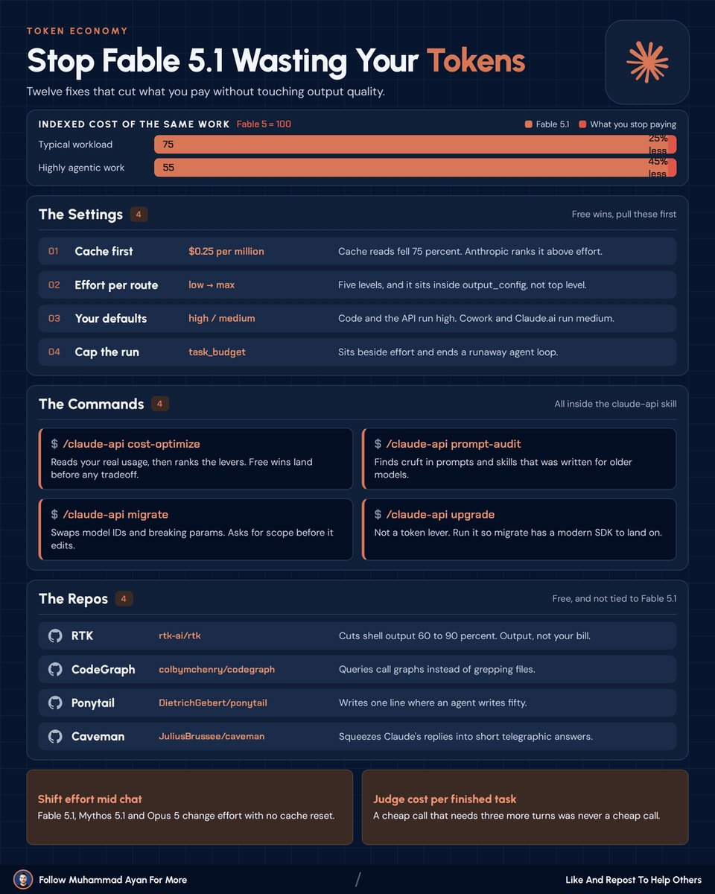
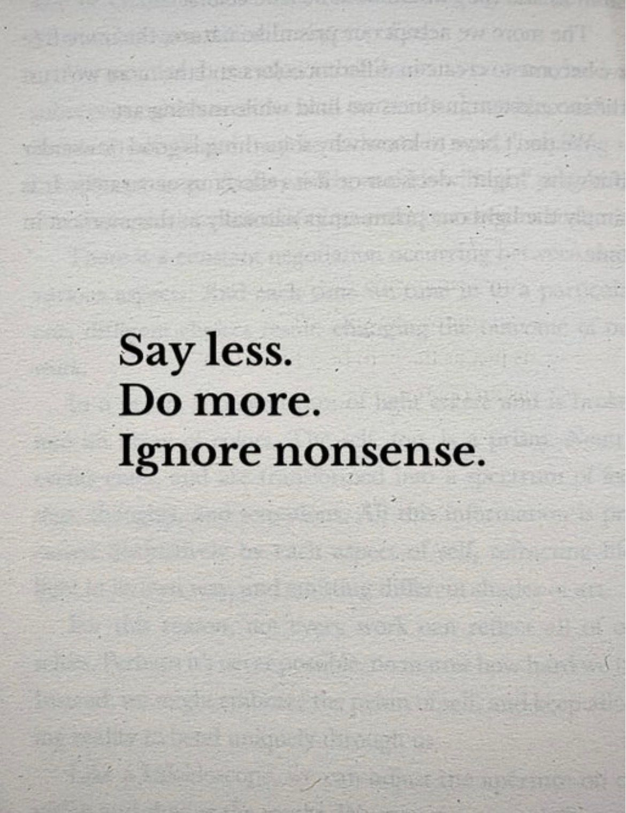
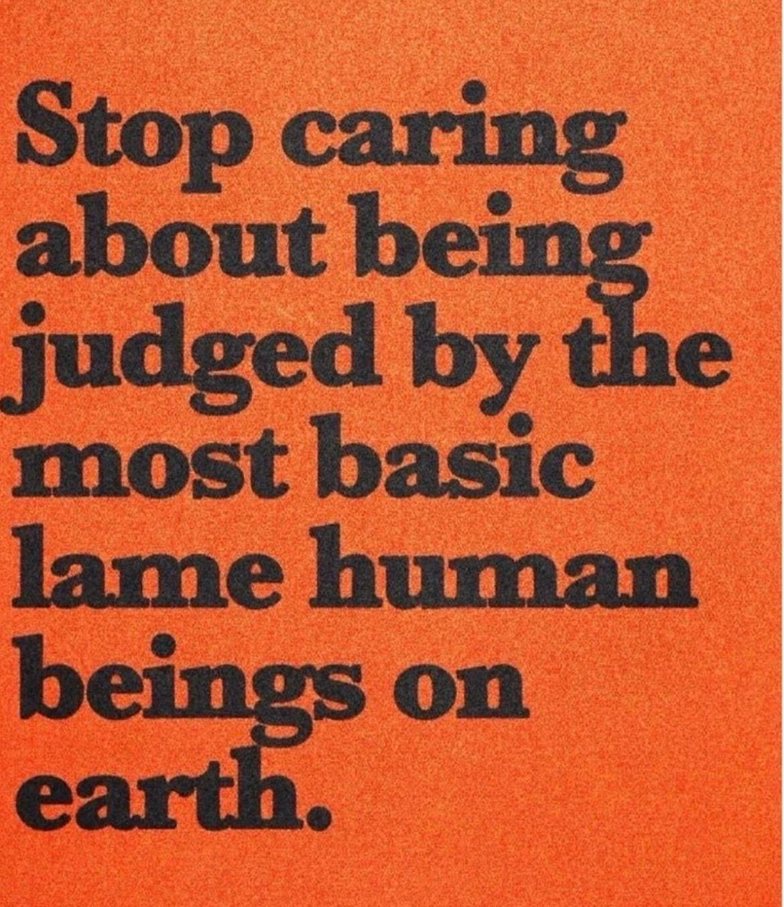
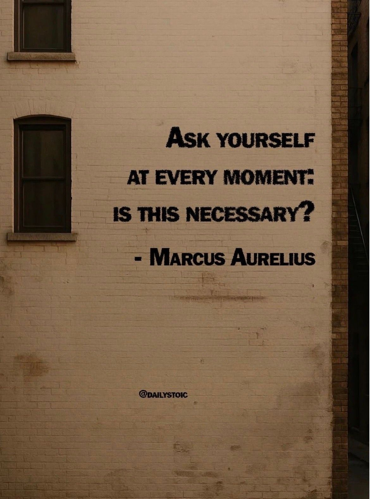

# 🐦 @Wise1Philosophy

## 📅 September 05, 2026

> 41 post(s) archived.

---

### 🕐 11:30 UTC · @Wise1Philosophy

🔗 [View original post](https://x.com/Daily__wisdom_/status/2096199236593348870)

---

### 🕐 11:15 UTC · @Wise1Philosophy

> NVIDIA is offering free online courses to learn AI. They’re practical, well-structured, and easy to follow. Here are 9 NVIDIA courses with official links included: [ bookmark 🔖 this thread for later ]

![NVIDIA is offering free online courses to learn AI. They’re practical, well-structured, and easy to follow. Here are 9 NVIDIA courses with official links included: [ bookmark 🔖 this thread for later ]](../../../../assets/images/2026/09/05/2096195397685490014-1.jpg)

🔗 [View original post](https://x.com/AndrewBolis/status/2096195397685490014)

---

### 🕐 11:01 UTC · @Wise1Philosophy

🔗 [View original post](https://x.com/apex_mentality_/status/2096191914357731482)

---

### 🕐 10:56 UTC · @Wise1Philosophy

> 12 fixes that cut what you pay Anthropic 👇 Not one of them touches output quality: 01. Cache first - Cache reads sit at $0.25 per million. - 75 percent off, and Anthropic ranks it above effort. 02. Effort per route - Five levels, low through max. - It lives in output_config, not the top level. - Most people I help set it one rung too high. 03. Your defaults - Claude Code and the API run high. - Cowork and Claude ai run medium. 04. Cap the run - task_budget sits right beside effort. - It ends the agent loop that forgets to stop. 05. /claude-api cost-optimize - Reads your real usage, then ranks the levers. - Free wins land before any tradeoff. 06. /claude-api prompt-audit - Finds cruft written for older models. - Mine flagged 14 lines aimed at Claude 3. 07. /claude-api migrate - Swaps model IDs and breaking params. - It asks for scope before it edits. 08. /claude-api upgrade - Not a token lever (actually). - Run it so migrate has a modern SDK to land on. 09. RTK - Cuts shell output 60 to 90 percent. - The README admits it does nothing to your bill. 10. CodeGraph - Queries call graphs instead of grepping files. - Grep is what quietly eats your context. 11. Ponytail - Writes one line where an agent writes fifty. - Boring, and the diff comes back half the size. 12. Caveman - Squeezes replies into short telegraphic answers. - Ugly to read. Cheap to run. I checked the model. I checked the plan. I never checked where effort was set. The 25 and 45 percent Anthropic quotes are at default effort. Push it to max and the model writes more, so one task can cost you more. Effort also moves mid chat on 5.1 and Opus 5 with no cache reset. That one saved me the most. My oldest skill file was still shipping 2024 instructions. It was named final-final-v3, which tells you plenty about my filing. Cheap calls that need three more turns were never cheap calls. Judge the finished task, not the call. Which of the 12 are you still not pulling?

🔗 [View original post](https://x.com/socialwithaayan/status/2096190823012684265)

---

### 🕐 10:56 UTC · @Wise1Philosophy

> Asked what he would build if he started over, Patrick Collison did not name an AI lab. He said he&apos;d go for &quot;the janky 1990s software&quot; running whole industries nobody in the Valley will touch. 3 examples of this: 1) Vertical SaaS Media

🔗 [View original post](https://x.com/AiEvolutio58513/status/2096190620281004471)

---

### 🕐 10:35 UTC · @Wise1Philosophy

> What if you never paid for Claude Code again? Someone built exactly that. And put it on GitHub for free. It sits between you and the model, then sends your request to whichever of the 50+ providers is available. DeepSeek. Kimi. Others. Here&apos;s what you get: → 1.3B free tokens a month → 5 minute setup → Automatic fallback, so nothing breaks mid-task → 53K stars and climbing And it&apos;s fully open source. So you get the Claude Code workflow without a Pro or Max bill. Grab it below 👇 Media

🔗 [View original post](https://x.com/charliejhills/status/2096185541356351782)

---

### 🕐 10:30 UTC · @Wise1Philosophy

🔗 [View original post](https://x.com/yeti_mind/status/2096184139623841845)

---

### 🕐 10:23 UTC · @Wise1Philosophy

> underrated take on AI consultancies: The AI roadmaps consultancies showed me this year all end the same way. Step six: final presentation. Before that, interviews at the top. A survey. A data request. A second round of interviews. A recommendations deck with ROI estimates built on assumptions, and an invoice in the …

🔗 [View original post](https://x.com/alex_prompter/status/2096182550725021898)

---

### 🕐 10:10 UTC · @Wise1Philosophy

> A guy paid $20/month for ChatGPT Plus. He used it for writing emails, brainstorming, answering questions, and summarizing documents. The same way he&apos;s used it since 2023. The same prompts. The same text-in, text-out workflow. The same chatbot. On September 3, 2026, OpenAI released GPT-6 Astra. He saw the new model option in ChatGPT. He assumed it was another incremental upgrade slightly smarter, slightly faster, same chatbot. His friend a product manager who&apos;d been testing Astra since the preview stopped him from typing his usual &quot;write me 5 subject lines&quot; prompt. &quot;You&apos;re about to use GPT-6 the way you used GPT-4. That&apos;s like buying a Tesla and using it as a shelf. Astra doesn&apos;t just answer questions. It uses your computer. It opens browsers. It clicks buttons. It fills forms. It navigates websites. It builds and hosts live websites from a single sentence. It writes code and runs it. It keeps notes across sessions so it never forgets what it learned about your project. Your $20/month chatbot just became a digital employee.&quot; He told him GPT-5.6 was the smartest assistant in the room. GPT-6 Astra is the assistant that leaves the room, walks to the computer, and does the work. The gap isn&apos;t intelligence. It&apos;s agency. The model went from generating text to completing tasks multi-step, across applications, without the user copying, pasting, or switching tabs. Here&apos;s every GPT-6 Astra capability most ChatGPT users won&apos;t discover on their own 🧵

🔗 [View original post](https://x.com/jackcoder0/status/2096179202890547352)

---

### 🕐 10:07 UTC · @Wise1Philosophy

> You&apos;re seeing these terms everywhere on X but don&apos;t know what half of them mean. Here&apos;s the full dictionary: 1. GOAT — Greatest Of All Time 2. POV — Point Of View 3. FOMO — Fear Of Missing Out 4. YOLO — You Only Live Once 5. LOL — Laugh Out Loud 6. OMG — Oh My God 7. WTF — What The Fuck 8. IDK — I Don&apos;t Know 9. TBH — To Be Honest 10. NGL — Not Gonna Lie 11. IMO — In My Opinion 12. FR — For Real 13. IYKYK — If You Know, You Know 14. TL;DR — Too Long; Didn&apos;t Read 15. SMH — Shaking My Head 16. ICYMI — In Case You Missed It 17. BRB — Be Right Back 18. BTW — By The Way 19. DM — Direct Message 20. IRL — In Real Life 21. RN — Right Now 22. LMK — Let Me Know 23. ASAP — As Soon As Possible 24. JK — Just Kidding 25. NVM — Never Mind 26. LMAO — Laughing My Ass Off 27. AFK — Away From Keyboard 28. FYP — For You Page 29. BFF — Best Friends Forever 30. TMI — Too Much Information 31. W — Win / Winning 32. L — Loss / Losing 33. RATIO — Reply gets more engagement 34. MID — Average / Not impressive 35. SUS — Suspicious 36. BET — Okay / Agreed 37. BASED — Confidently holding a view 38. NO CAP — No lie 39. CAP — A lie 40. RIZZ — Charm / Game 41. SLAY — Did something impressively well 42. ATE — Did something extremely well 43. FIRE — Excellent 44. COOKED — In trouble / Finished 45. LET HIM COOK — Let someone continue 46. DELULU — Delusional 47. VIRAL — Spreading rapidly online 48. MEME — Shareable internet joke/idea 49. CLICKBAIT — Designed to make you click 50. GOATED — Extremely great 51. STAN — Super fan 52. FLEX — Show off 53. AMA — Ask Me Anything 54. OP — Original Poster 55. OC — Original Content 56. NSFW — Not Safe For Work 57. ROFL — Rolling On the Floor Laughing 58. FRFR — For Real, For Real 59. ONG — On God 60. ISTG — I Swear To God 61. IJBOL — I Just Burst Out Laughing 62. AFAIK — As Far As I Know 63. WBU — What About You? 64. HBU — How About You? 65. G2G — Got To Go 66. TTYL — Talk To You Later 67. HMU — Hit Me Up 68. OFC — Of Course 69. FYI — For Your Information 70. TBF — To Be Fair 71. IDC — I Don&apos;t Care 72. IK — I Know 73. IKR — I Know, Right? 74. TIL — Today I Learned 75. WYM — What You Mean? 76. WDYM — What Do You Mean? 77. ILY — I Love You 78. PFP — Profile Picture 79. Mutuals — People who follow each other 80. OOMF — One Of My Followers/Friends 81. Lurker — Watches without interacting 82. Troll — Provokes people online 83. Bot — Automated account 84. Receipts — Proof / Evidence 85. Clapback — Sharp response 86. Callout — Public criticism 87. Bait — Content designed to provoke 88. Ratioed — Reply outperforms the original 89. Trending — Currently popular 90. Touch Grass — Spend less time online 91. Doomscrolling — Endless negative scrolling 92. Ragebait — Content designed to make people angry 93. YAP — Talk excessively 94. YAPPER — Someone who talks a lot 95. VIBE — Overall feeling / atmosphere 96. LOWKEY — Somewhat / Secretly 97. HIGHKEY — Openly / Strongly 98. LOCKED IN — Fully focused 99. GLOW UP — Major positive transformation 100. HIT DIFFERENT — Feels especially good/different Save this. You&apos;ll need it.

🔗 [View original post](https://x.com/GrowAIHub/status/2096178380148490471)

---

### 🕐 09:30 UTC · @Wise1Philosophy

🔗 [View original post](https://x.com/Ant_Philosophy/status/2096169028679057696)

---

### 🕐 08:30 UTC · @Wise1Philosophy

🔗 [View original post](https://x.com/Mindsthatbuild/status/2096153906715713683)

---

### 🕐 08:01 UTC · @Wise1Philosophy

🔗 [View original post](https://x.com/Wise1Philosophy/status/2096146580151681239)

---

### 🕐 07:53 UTC · @Wise1Philosophy

> 4 supplements I&apos;m getting my mother to take at 71, and the one I told her to skip: 1. Protein powder. You should take it, your friends should take it, your mother should take it. 30g in the morning, unflavoured.

🔗 [View original post](https://x.com/TinaaDeJong/status/2096144552008847600)

---

### 🕐 07:47 UTC · @Wise1Philosophy

> A physiologist took apart the myths every woman has been told to use to &quot;get healthier&quot;. 7 things you do every day that eat your muscle, slow your thyroid and add belly fat: 1. Training fasted in the morning Media

🔗 [View original post](https://x.com/Sophiaz6xo/status/2096143080642785554)

---

### 🕐 07:40 UTC · @Wise1Philosophy

> Magnesium is sold as a sleep mineral, which is how most people end up taking it wrong. Three mistakes, and what it is actually for: 1. Thinking it is about sleep

🔗 [View original post](https://x.com/RasmusNorbergg/status/2096141280602735090)

---

### 🕐 07:30 UTC · @Wise1Philosophy

🔗 [View original post](https://x.com/Daily__wisdom_/status/2096138796156821872)

---

### 🕐 07:29 UTC · @Wise1Philosophy

> If I wanted to get dementia as fast as possible, here is exactly what I would do: 1. Sleep six hours a night Media

🔗 [View original post](https://x.com/RafaelNasriX/status/2096138549028634703)

---

### 🕐 07:26 UTC · @Wise1Philosophy

> My best friend started taking zinc in the morning and vitamin D+K2 with breakfast after his doctor told him to. He stuck with it for 30 days. Then, no kidding, his personality did a complete 180: 1. What he was like before

🔗 [View original post](https://x.com/MarkoSilva291/status/2096137757399924882)

---

### 🕐 07:19 UTC · @Wise1Philosophy

> Most people use Claude like a code monkey. &quot;Write this function.&quot; &quot;Fix this bug.&quot; &quot;Debug this error.&quot; Then they wonder why the output is mediocre. Claude is a senior engineer. Prompt it like one. Here are 8 prompts I use (copy-paste ready):

🔗 [View original post](https://x.com/kumud_deepali/status/2096136020702237137)

---

### 🕐 07:19 UTC · @Wise1Philosophy

> One nerve sets how hard your heart works and how tight your vessels sit. You can reach it in sixty seconds, for free: 1. Hum

🔗 [View original post](https://x.com/Marc0sRomano/status/2096135995964207434)

---

### 🕐 07:06 UTC · @Wise1Philosophy

> If you want a flat stomach, fix your cortisol. I switched my approach a month ago and I&apos;m annoyed I didn&apos;t start sooner. Here&apos;s what actually got rid of belly fat: 1. What I had wrong for years

🔗 [View original post](https://x.com/CoachLucHerrera/status/2096132724121858230)

---

### 🕐 07:04 UTC · @Wise1Philosophy

> If your inflammation is out of control, you will feel exhausted no matter what you try. Most people do not realise it is the silent cause behind almost every chronic condition. Here are 8 ways to lower inflammation naturally, and get your energy back: 1) Walk 10,000 steps Media

🔗 [View original post](https://x.com/MagnusLindbrg/status/2096132262266044637)

---

### 🕐 07:00 UTC · @Wise1Philosophy

🔗 [View original post](https://x.com/apex_mentality_/status/2096131428211720591)

---

### 🕐 06:56 UTC · @Wise1Philosophy

> A biologist I read put it bluntly: most of the shelf is decoration, and three nutrients do the work. Here they are, and what each one is for: 1. Zinc

🔗 [View original post](https://x.com/mind_and_beauty/status/2096130208315383982)

---

### 🕐 06:50 UTC · @Wise1Philosophy

> No libido = cortisol. Puffy face = cortisol. 3am urge to pee = cortisol. Belly fat that won&apos;t budge = cortisol. Here are 7 hacks to rebalance your cortisol, according to science: 1. Stop working out after 7pm Media

🔗 [View original post](https://x.com/HeyKimChong/status/2096128769094467920)

---

### 🕐 06:47 UTC · @Wise1Philosophy

> Your body has emergency switches built into it. Most people have never been shown where they are. Here’s what you can reset in seconds: 1. Lying awake in bed = Blink slowly for 60 seconds

🔗 [View original post](https://x.com/LongevityCode_/status/2096128040925536668)

---

### 🕐 06:45 UTC · @Wise1Philosophy

> Sleeping = lose weight Sleeping = lower blood sugar Sleeping = lower your risk of early death 7 simple rules you have to follow: 1. Don&apos;t sleep 8 hours Media

🔗 [View original post](https://x.com/CoachJulianNiko/status/2096127464783364254)

---

### 🕐 06:38 UTC · @Wise1Philosophy

> 9 signs high cortisol is quietly draining your B12 (&amp; you don&apos;t even notice): 1. Your tongue is pale instead of pink Media

🔗 [View original post](https://x.com/JasperKasparov/status/2096125690899005910)

---

### 🕐 06:30 UTC · @Wise1Philosophy

🔗 [View original post](https://x.com/yeti_mind/status/2096123700080730144)

---

### 🕐 06:27 UTC · @Wise1Philosophy

> TAKING VITAMIN D CORRECTLY WILL DO MORE FOR YOUR WINTER THAN ANY AMOUNT OF SUN IN JULY. (99% ARE TAKING IT WRONG) 1. It is not a vitamin. It is a hormone.

🔗 [View original post](https://x.com/IranaJasmin/status/2096122910947877157)

---

### 🕐 06:03 UTC · @Wise1Philosophy

> Your neck is part of why you are anxious. And there is a 40 second thing you can do about it before you buy anything: 1. Tight jaw, tight neck, stuck nervous system

🔗 [View original post](https://x.com/ClaraBrooksjz/status/2096116870189580363)

---

### 🕐 06:00 UTC · @Wise1Philosophy

🔗 [View original post](https://x.com/Life__Mastery/status/2096116209783578815)

---

### 🕐 05:26 UTC · @Wise1Philosophy

> I don&apos;t care if you&apos;re 10, 35, or 53lbs overweight. These are the exercise and diet rules that I follow: 1. Stop running if you&apos;re overweight.

🔗 [View original post](https://x.com/CoachDanCole_/status/2096107746836058261)

---

### 🕐 05:14 UTC · @Wise1Philosophy

> Joe Rogan sat down with the Harvard scientist who reversed aging in actual human cells. He named 5 everyday things quietly costing you 15 years of your life. And the one that matters most has nothing to do with food, training, or supplements: 1. The person you wake up next to Media

🔗 [View original post](https://x.com/Fitby_Chandler/status/2096104623983804756)

---

### 🕐 05:06 UTC · @Wise1Philosophy

> A Heart doctor confessed his secret: “There are 3 kinds of people who never get heart attacks.” 1. Doesn&apos;t wake up to go to the toilet at 3 AM Media

🔗 [View original post](https://x.com/_Gut_Laboratory/status/2096102750799212566)

---

### 🕐 05:02 UTC · @Wise1Philosophy

> A heart doctor said one thing that stuck with me: &quot;Nitric oxide keeps you alive. Without it, your erections fail, aging accelerates &amp; heart attack risk triples.&quot; This is the 5-step protocol to boost it naturally: 1. Don’t use mouthwash

🔗 [View original post](https://x.com/BeBetter_Athlet/status/2096101526167240828)

---

### 🕐 04:46 UTC · @Wise1Philosophy

> Cortisol = body fat. If cortisol doesn&apos;t go down, belly fat won&apos;t budge. These are the best ways to reduce it: 1. No food 3 hours before bed Media

🔗 [View original post](https://x.com/DPro_Coach/status/2096097702669160729)

---

### 🕐 04:44 UTC · @Wise1Philosophy

> Your blood sugar is aging you faster than alcohol and smoking. It ruins sleep, fat loss, destroys insulin sensitivity, and causes fatty liver &amp; diabetes. Here’s how to fix it naturally with no medication: 1. Don’t count 10,000 steps Media

🔗 [View original post](https://x.com/LevelUpPrime/status/2096097162363105654)

---

### 🕐 04:41 UTC · @Wise1Philosophy

> A urologist explained why so many women get UTI after UTI. And it&apos;s not &quot;wiping wrong&quot; or &quot;not peeing after sex.&quot; The real reason is something almost no one talks about, sitting inside your body right now: 1. There is a microbiome down there Media

🔗 [View original post](https://x.com/HeyEleanorr/status/2096096306100133979)

---

### 🕐 04:04 UTC · @Wise1Philosophy

> Foods that melt hip and belly fat directly. 1. Green tea

🔗 [View original post](https://x.com/TheFastedState/status/2096087050122580444)

---
