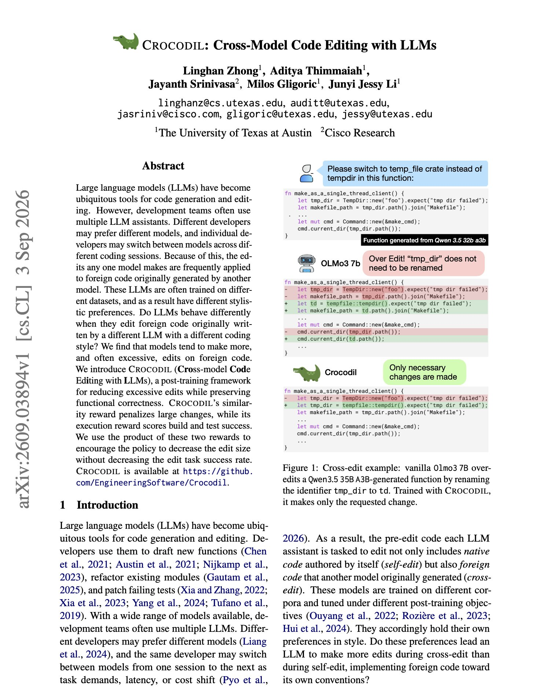
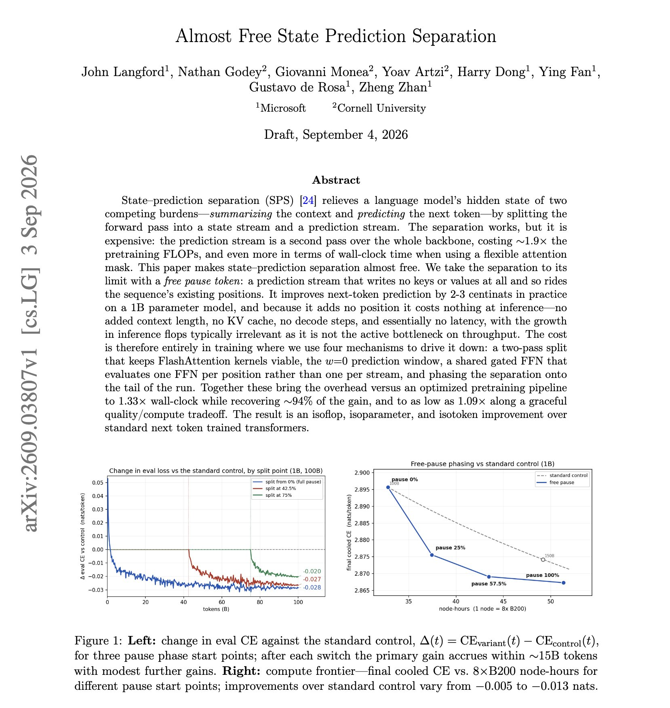
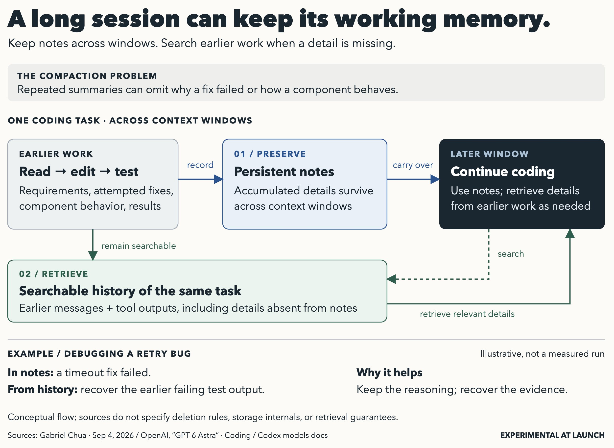

# 🐦 @dair_ai

## 📅 September 05, 2026

> 8 post(s) archived.

---

### 🕐 22:42 UTC · @dair_ai

> This works really well with GPT-6 Astra: Give it a tweet of an impressive Astra demo. Ask Astra (medium) to replicate it to the best of its ability and giving it whatever extra instructions and adaptations you want. Set a /goal like provide proof of the results so it has something to compare to. After the first run, switch to Astra (max) and give it instructions to polish. And you can keep doing this iteratively to keep improving results. So there is one component to build and one to optimize/tune. I think it works well because it breaks the problem down and allows the models to focus efforts as opposed to trying to use lots of tokens for many things at once (usually lower quality results). This can essentially be done in one go using subagents and /goal.

🔗 [View original post](https://x.com/omarsar0/status/2096368290603946360)

---

### 🕐 20:45 UTC · @dair_ai

> What the heck!? GPT-6 Astra just finished creating this 3D camera with 122 component groups and 1,877 modeled pieces. I didn&apos;t even realize you could build these in Three.js. Media

🔗 [View original post](https://x.com/omarsar0/status/2096339043919237288)

---

### 🕐 19:34 UTC · @dair_ai

> OMG!!! GPT-6 Astra built this using just one image reference. I am at a loss for words. Media

🔗 [View original post](https://x.com/omarsar0/status/2096321091148947887)

---

### 🕐 19:08 UTC · @dair_ai

> I am in disbelief right now. GPT-6 Astra is a truly incredible model. It took about 2 hrs to generate this 3D model of Xunantunich, a Maya archaeological site in western Belize. Media

🔗 [View original post](https://x.com/omarsar0/status/2096314593182171545)

---

### 🕐 18:24 UTC · @dair_ai

> This is a weird behavior in coding models and something worth looking into. It turns that some models over-edit code that another models wrote. There is a high chance that your repo now has commits from more than one model, and that changes how each of them edits. Researchers measured what happens when one model edits code another model wrote. Different training data produces different stylistic preferences, and models make more edits, often excessive ones, on foreign code than on their own. CROCODIL is a post-training framework that reduces that behavior. A similarity reward penalizes large changes and an execution reward scores build and test success, and the two are multiplied rather than added. That product stops the policy from shrinking edits by simply failing the task. Paper: https://academy.dair.ai/papers/crocodil-cross-model-code-editing-with-llms-2609.03894

🔗 [View original post](https://x.com/omarsar0/status/2096303354435760305)

---

### 🕐 17:24 UTC · @dair_ai

> GPT-6 Astra is absolutely insane for generating 3D stuff. &quot;Generate a Grok Bot version of Codex Micro.&quot; Now I want this so bad! In one prompt. Imagine what else it can do—sharing more insane examples shortly. Media

🔗 [View original post](https://x.com/omarsar0/status/2096288397811679718)

---

### 🕐 16:46 UTC · @dair_ai

> Banger paper from Microsoft and Cornell. If you have looked at thinking tokens and decided you cannot afford the context, read this one. (bookmark it) A pause token buys the model extra compute for each next-token prediction, and it pays for that compute with a sequence position. Free pause tokens carry the same compute in a parallel prediction stream over a weight-shared backbone, riding an existing position instead of adding one. At inference it adds nothing to context length, leaves the KV cache unchanged, and costs essentially no extra latency, since the additional flops are not the throughput bottleneck. On a 1B model it improves next-token prediction by 2 to 3 centinats. The cost moves to training, where the overhead against an optimized pretraining pipeline comes down to about 1.14x while keeping most of the benefit. Paper: https://arxiv.org/abs/2609.03807 Chat with Paper: https://academy.dair.ai/papers/free-pause-tokens-2609.03807

🔗 [View original post](https://x.com/dair_ai/status/2096278691966001512)

---

### 🕐 16:21 UTC · @dair_ai

> Highly recommended. It&apos;s not obvious, but a bottleneck in even the most powerful models, like GPT-6 Astra, is context bloat and compaction. This new config can help keep Astra persistent across long-running tasks. If it helps, here is a little visual summary courtesy of GPT-6 Astra. &quot;With Astra, we’re introducing a new way for Codex to preserve and retrieve context when the context window fills ... In Codex, Astra can keep notes across context windows, preserving accumulated details without repeatedly compressing them into a single summary...&quot; See the next p…

🔗 [View original post](https://x.com/omarsar0/status/2096272427818811495)

---
