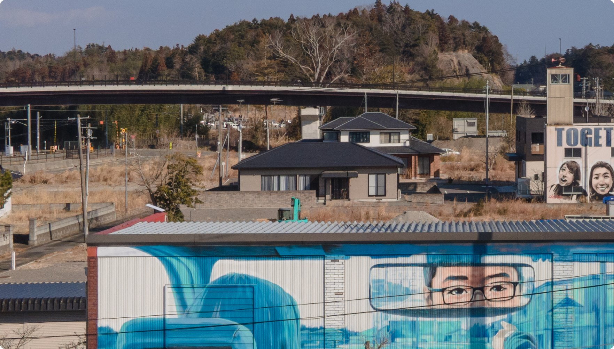

# 🐦 @elonmusk

## 📅 September 05, 2026

> 7 post(s) archived.

---

### 🕐 05:18 UTC · @elonmusk

> When Elon Musk visited the U.S. Air Force Academy in 2022. 🇺🇸 Media

🔗 [View original post](https://x.com/cb_doge/status/2096105725273727343)

---

### 🕐 03:54 UTC · @elonmusk

> @elonmusk I love when the hard-hitting cosmic realities sink in for people and pique their interest....and there are sextillions of other G-type stars in the observable universe broadly similar to our own.

🔗 [View original post](https://x.com/NASAAdmin/status/2096084607200321664)

---

### 🕐 03:33 UTC · @elonmusk

> The Sun is ~100% of solar system mass Elon really put into perspective just how insanely massive the Sun is compared to Earth The Sun contains ~99.86% of all the mass in the entire Solar System Earth is basically a rounding error We live on this tiny rock next to an object so massive that almost everything else in th…

🔗 [View original post](https://x.com/elonmusk/status/2096079231214113027)

---

### 🕐 02:14 UTC · @elonmusk

> The factory system that makes Cybercab is unlike any other automotive production line A very high level look underneath Cybercab Nerd video with much more detail coming soon on YouTube

🔗 [View original post](https://x.com/elonmusk/status/2096059393376678391)

---

### 🕐 01:29 UTC · @elonmusk

> The @Tesla Cybercab had over 200 MPGE! BEST EVER 🥇 It disrupted painting cars with new injection molding (huge emissions saver) A new sustainability paradigm for transportation ⚡️🌱 Where are the environmentalists? This is an insane W

🔗 [View original post](https://x.com/Gfilche/status/2096048085529165844)

---

### 🕐 00:55 UTC · @elonmusk

> 【Starlink ホーム お客様の声】 東日本大震災後、福島県双葉町で避難指示が解除されてから数年経っても、従来のインターネット環境が復旧しなかったため、Starlinkを導入することにしました。通信速度も非常に速く快適に使えており本当に助かっています。

🔗 [View original post](https://x.com/Starlink/status/2096039486929219645)

---

### 🕐 00:28 UTC · @elonmusk

> I just paid for 2 drinks at the bar with 𝕏 Money after spending the entire day riding around Austin in Cybercabs. This is one of the biggest reasons I invested in 𝕏. I don’t look at 𝕏 as just a social media app like many do. I believe Elon is building a place where eventually your entire financial life can live here. You earn $ money here. You send $ money here. You pay for things here. You invest here. You run your entire business here. And tonight, I literally used $ money I earned on 𝕏 to pay for drinks in the real world. I know people will say that vision sounds crazy today. A lot of things Elon builds sound crazy… until they work. And personally, betting on Elon has worked out pretty damn well for me. He’s NEVER lost me $ money from backing him. So yes, I believe he’s going to make my 𝕏 investment back too… that many said was super overpriced at $44B. One day, I believe managing your entire financial life through 𝕏 won’t sound that crazy as it may today. Media

🔗 [View original post](https://x.com/Teslaconomics/status/2096032778747838658)

---
