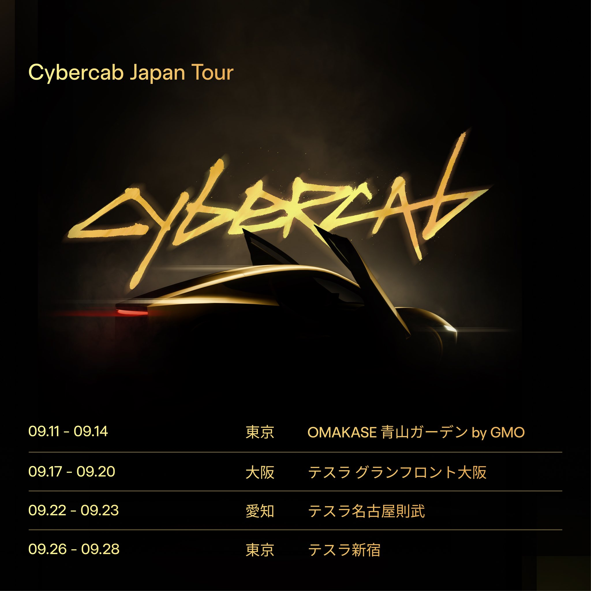
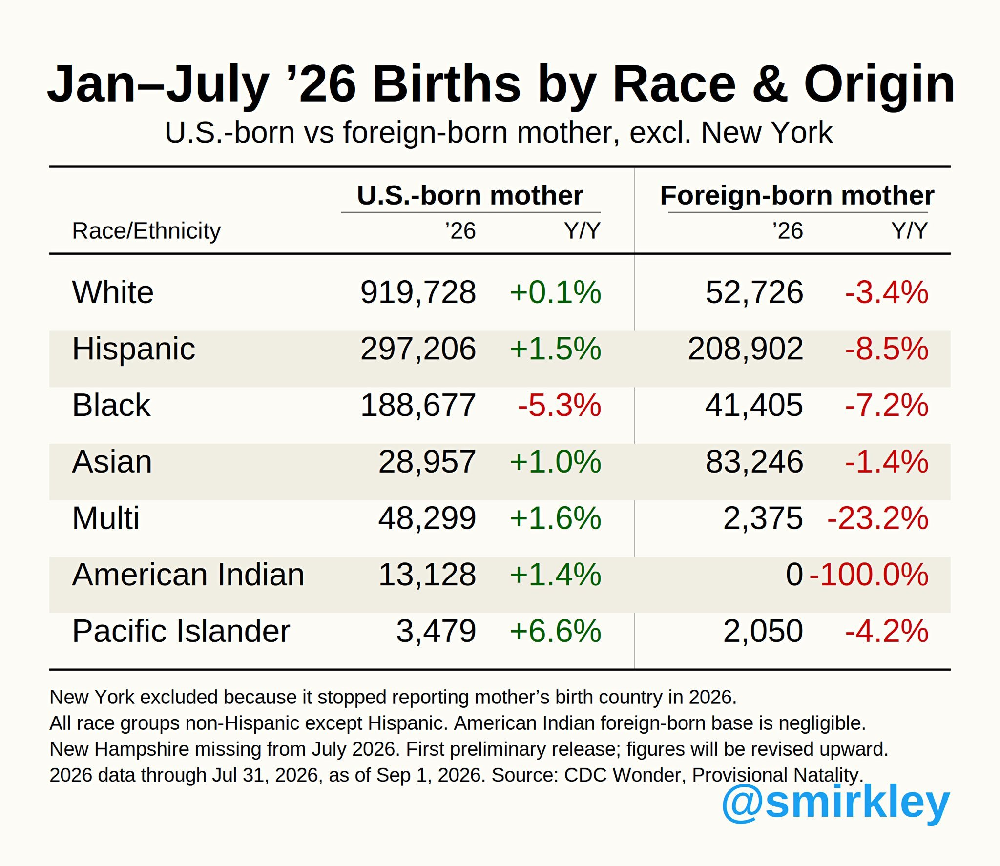
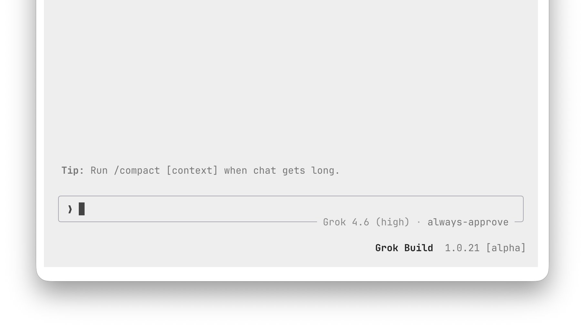

# 🐦 @elonmusk

## 📅 September 05, 2026

> 19 post(s) archived.

---

### 🕐 17:47 UTC · @elonmusk

> He was right Antonio Gramsci – The Most Dangerous Intellectual of the Twentieth Century. Not the most famous. Not the most read. The most dangerous and the most consequential – because he was the one who figured out why the revolution kept failing, and what to do instead. The man who invented…

🔗 [View original post](https://x.com/elonmusk/status/2096294063666286708)

---

### 🕐 17:23 UTC · @elonmusk

> Humanity is dying out JUST IN: People aged 65 &amp; older now outnumber children 5 &amp; under worldwide for the first time in recorded history.

🔗 [View original post](https://x.com/elonmusk/status/2096288211962056736)

---

### 🕐 15:17 UTC · @elonmusk

> Over 600 autonomous rocket landings so far Most people don’t realize how insanely autonomous Falcon 9 already is Once Falcon 9 lifts off, almost the entire mission is executed by the rocket itself And the crazy part is This autonomy does not depend on generative AI It comes from brutally refined flight software, physics, …

🔗 [View original post](https://x.com/elonmusk/status/2096256303895081204)

---

### 🕐 15:13 UTC · @elonmusk

> “Results in reading, mathematics and science were above the national average and comparable to the average results in Germany and Sweden.” These are the results of our pilot program, which includes AI tutors and has been running in 171 public schools for just over a year. It was evaluated by PISA for Schools in June of this year. Since then, it has already expanded to more than 1,000 schools, and within 18 months, it will be in every public school in our country. In a few years, El Salvador will inspire the world. Security was just the beginning 🇸🇻 The highly promising results from El Salvador’s first PISA for Schools assessment show what education reform can achieve when student learning is placed at the center—and change reaches the classroom. What is at stake is more than a score. It is a generation’s future and its pros…

🔗 [View original post](https://x.com/nayibbukele/status/2096255497410118075)

---

### 🕐 15:04 UTC · @elonmusk

> A Hero That Trusted His Intuition. The problem wasn’t that Morgan Stanley didn’t believe him. Rick Rescorla had already been right once. After the 1993 basement bombing of the World Trade Center, the firm’s security chief walked the towers, studied the site, and reached a conclusion most people preferred not to hear: the World Trade Center was still a target. Next time, he said, it would not be a truck. It would be an airplane. An airplane. In a 1993 report. Executives listened. Then they looked at the lease. Morgan Stanley was the largest tenant in the complex—twenty-two floors of the South Tower, thousands of brokers, and a trading infrastructure that could not be packed into boxes and wheeled across the Hudson. They literally made it a trading center. The contract with the Port Authority ran until 2006. Walking away from premium Manhattan space of that scale would have meant penalties measured in the hundreds of millions, plus the operational chaos of relocating an entire downtown machine. So the company stayed. Rescorla adjusted. If they could not leave the building, they would learn to escape it. He built a protocol and treated it like doctrine. Unannounced drills. No exemptions. Brokers who billed by the minute were pulled off their desks and sent into the stairwells two by two, starting from the top floors, leaving a lane for firefighters coming the other way. People complained. He did not care. Practice, he believed, was the only thing that would beat panic. On the morning of September 11, 2001, American Airlines Flight 11 hit the North Tower. From the 44th floor of the South Tower, Rescorla could see the fire. Then the Port Authority came over the speakers: the South Tower was secure. Stay at your desks. Rescorla grabbed a bullhorn and ignored them. He started the drill his people already knew by heart. Floor by floor, two by two, down the stairs. He sang as he moved—Cornish songs from childhood, then “God Bless America”—keeping the line moving, refusing to let the stairwell become a stampede. Seventeen minutes later, the second plane struck the South Tower. By then, most of Morgan Stanley was already on the way out. Of the 2,687 employees in the building that morning, all but 13 survived. It was stunning. Rescorla could have been outside with them. He went back up instead. Colleagues told him to leave. He said he would, as soon as he was sure no one was left behind. He was last seen around the 10th floor, heading higher. The South Tower fell at 9:59 a.m. They never found him. He was one of the 13. He was a hero in every sense of the word. Remember Rick Rescorla, he remembered for us.

🔗 [View original post](https://x.com/BrianRoemmele/status/2096253194880110603)

---

### 🕐 14:07 UTC · @elonmusk

> Texas Should Shut Down the Education Cartel! Even in a deep red state, shadowy left-wing NGO&apos;s scheme to conquer institutions, amass HUGE sums of public money, and use it against us to subvert democracy, overcoming their election losses. We are waking up and fighting back. 🧵

🔗 [View original post](https://x.com/JTLonsdale/status/2096238830651048224)

---

### 🕐 07:28 UTC · @elonmusk

> It will only get better I’ve spent many many hours in every AV I can get my hands on and I can confidently say the Tesla Cybercab is the most enjoyable rider experience I’ve ever had

🔗 [View original post](https://x.com/elonmusk/status/2096138449250091368)

---

### 🕐 07:26 UTC · @elonmusk

> True Most people have no idea how far ahead Tesla is, because the cars look and drive like other cars. But under the hood, Teslas bear little resemblance to other cars. Every component is (or will be) re-thought from first principles. Even if legacy automakers had the will to start fr…

🔗 [View original post](https://x.com/elonmusk/status/2096137939134591024)

---

### 🕐 07:21 UTC · @elonmusk

> Media

🔗 [View original post](https://x.com/elonmusk/status/2096136730751414581)

---

### 🕐 06:06 UTC · @elonmusk

> Meet Cybercab 東京・大阪・名古屋の全4会場を回るCybercab Japan Tourはまもなくスタート https://www.tesla.com/ja_jp/event/2026sep_cc_tour_getupdate

🔗 [View original post](https://x.com/teslajapan/status/2096117640716771612)

---

### 🕐 06:02 UTC · @elonmusk

> Elon has managed to meme the birthrate back up. To celebrate, @elonmusk should put up the Shinzo Abe meme but with him on it in Times Square. 😂

🔗 [View original post](https://x.com/AdamLowisz/status/2096116714618368480)

---

### 🕐 05:18 UTC · @elonmusk

> When Elon Musk visited the U.S. Air Force Academy in 2022. 🇺🇸 Media

🔗 [View original post](https://x.com/cb_doge/status/2096105725273727343)

---

### 🕐 03:54 UTC · @elonmusk

> @elonmusk I love when the hard-hitting cosmic realities sink in for people and pique their interest....and there are sextillions of other G-type stars in the observable universe broadly similar to our own.

🔗 [View original post](https://x.com/NASAAdmin/status/2096084607200321664)

---

### 🕐 03:33 UTC · @elonmusk

> The Sun is ~100% of solar system mass Elon really put into perspective just how insanely massive the Sun is compared to Earth The Sun contains ~99.86% of all the mass in the entire Solar System Earth is basically a rounding error We live on this tiny rock next to an object so massive that almost everything else in th…

🔗 [View original post](https://x.com/elonmusk/status/2096079231214113027)

---

### 🕐 02:14 UTC · @elonmusk

> The factory system that makes Cybercab is unlike any other automotive production line A very high level look underneath Cybercab Nerd video with much more detail coming soon on YouTube

🔗 [View original post](https://x.com/elonmusk/status/2096059393376678391)

---

### 🕐 01:29 UTC · @elonmusk

> The @Tesla Cybercab had over 200 MPGE! BEST EVER 🥇 It disrupted painting cars with new injection molding (huge emissions saver) A new sustainability paradigm for transportation ⚡️🌱 Where are the environmentalists? This is an insane W

🔗 [View original post](https://x.com/Gfilche/status/2096048085529165844)

---

### 🕐 00:55 UTC · @elonmusk

> 【Starlink ホーム お客様の声】 東日本大震災後、福島県双葉町で避難指示が解除されてから数年経っても、従来のインターネット環境が復旧しなかったため、Starlinkを導入することにしました。通信速度も非常に速く快適に使えており本当に助かっています。

🔗 [View original post](https://x.com/Starlink/status/2096039486929219645)

---

### 🕐 00:28 UTC · @elonmusk

> I just paid for 2 drinks at the bar with 𝕏 Money after spending the entire day riding around Austin in Cybercabs. This is one of the biggest reasons I invested in 𝕏. I don’t look at 𝕏 as just a social media app like many do. I believe Elon is building a place where eventually your entire financial life can live here. You earn $ money here. You send $ money here. You pay for things here. You invest here. You run your entire business here. And tonight, I literally used $ money I earned on 𝕏 to pay for drinks in the real world. I know people will say that vision sounds crazy today. A lot of things Elon builds sound crazy… until they work. And personally, betting on Elon has worked out pretty damn well for me. He’s NEVER lost me $ money from backing him. So yes, I believe he’s going to make my 𝕏 investment back too… that many said was super overpriced at $44B. One day, I believe managing your entire financial life through 𝕏 won’t sound that crazy as it may today. Media

🔗 [View original post](https://x.com/Teslaconomics/status/2096032778747838658)

---

### 🕐 00:14 UTC · @elonmusk

> Three Grok Build updates in a single day: v1.0.19 → v1.0.20 → v1.0.21 And the latest one keeps polishing the experience......permission modes now stay visible through plan mode, sessions open instantly when you start typing or pasting, and crowded terminal layouts behave properly The release cadence here is getting ridiculous again Release Notes: v1.0.21 Bug Fixes: • Permission mode (auto / always-approve) now stays visible when the agent enters plan mode and is restored on exit. • Typing, pasting, or pressing Shift+Tab on the welcome screen now immediately opens the session instead of creating a duplicate one. • Dock sections, queue body, and reveal rows now stay within their documented height rules even on crowded terminals. Grok Build just got way better at keeping complex agent work moving without getting in your way Scheduled loops now run fully in the background, resumed sessions remember active loops, subagents and workflows, headless runs can launch inside isolated git worktrees, and MCP-heavy …

🔗 [View original post](https://x.com/XFreeze/status/2096029282506322168)

---
