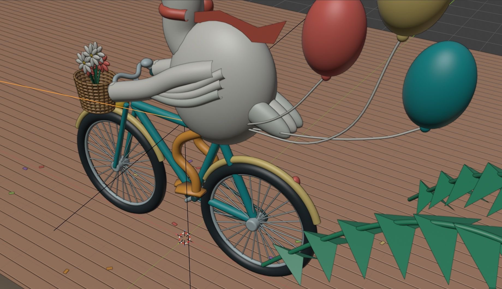

# 🐦 @simonw

## 📅 September 05, 2026

> 5 post(s) archived.

---

### 🕐 17:13 UTC · @simonw

> Someone asked what the balloons are attached to and, yeah...

🔗 [View original post](https://x.com/simonw/status/2096285730809184452)

---

### 🕐 16:29 UTC · @simonw

> It can render objects other than pelicans! (The thing where it goes away and researches specifications and supporting documents and images first is really cool) I asked Astra to recreate @LewisHamilton’s Ferrari! It went through F1 specs, regulations, videos from F1 engineers and photos of the car, then built a 3D model (w/ blender) with a full breakdown of the parts. It even made clay &amp; wireframe versions too. Every time I think I’ve pu…

🔗 [View original post](https://x.com/simonw/status/2096274575881642347)

---

### 🕐 15:54 UTC · @simonw

> New TIL on using Blender with coding agents on macOS: https://til.simonwillison.net/llms/blender-coding-agents-macos GPT-6 Astra (medium): &gt; Use the already install /Applications/Blender to render a scene of a pelican riding a bicycle &gt; OK add a background and a lot of flair &gt; OK make it a whole lot better

🔗 [View original post](https://x.com/simonw/status/2096265759660142826)

---

### 🕐 15:06 UTC · @simonw

> ... mine are generally a lot lower effort though! Here&apos;s the prompt I used against Fable 5 running in Claude Code for web, in combination with the screenshots from that four year old tweet

🔗 [View original post](https://x.com/simonw/status/2096253643553231309)

---

### 🕐 15:05 UTC · @simonw

> This is very impressive, a whole lot better than any of my experimental games I&apos;ve built with other models This impressed me: I asked GPT-6 Astra to turn Zork (the classic 1977 text adventure) into a full 3D action-adventure game It kept the original plot &amp; puzzles, added fight scenes, and built all of the characters &amp; environments directly in Threejs Play: https://zork-underground-em…

🔗 [View original post](https://x.com/simonw/status/2096253404398191102)

---
