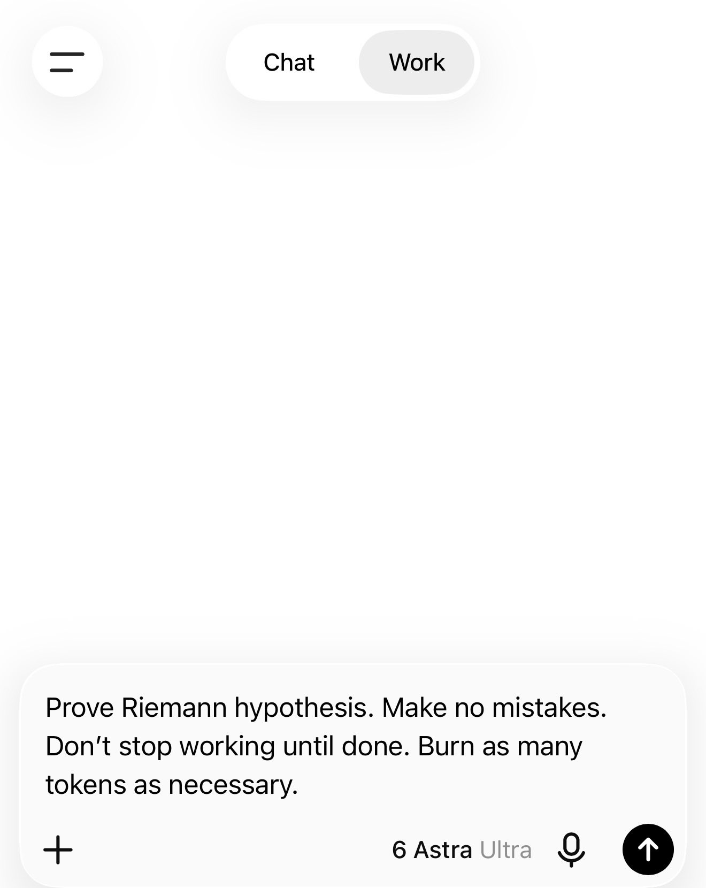

# 🐦 @tunguz

## 📅 September 05, 2026

> 11 post(s) archived.

---

### 🕐 18:52 UTC · @tunguz

> The problem of turning all math into code is almost done. But the real impact will come when we turn all code into math.

🔗 [View original post](https://x.com/tunguz/status/2096310413378150698)

---

### 🕐 17:28 UTC · @tunguz

> This will be an amazing achievement. And then the real progress begins. At this rate we are poised to have five orders of magnitude more mathematical research done by the end of this decade than all of such work that has ever been done in all of human history. We are now poised to: Formalize all known Human Mathematics. This is the modern equivalent of the Human Genome Project. or AlphaFold more recently, whereby all data of its kind is fully classified. With sufficient funding and compute/tokens, a coordinated effort among academia, f…

🔗 [View original post](https://x.com/tunguz/status/2096289284374528508)

---

### 🕐 17:20 UTC · @tunguz

> OMG this is so unbelievably insanely retarded!!! &quot;The mathematics of string theory is probably one of the most beautiful artifacts humanity has created. In order to even produce something in theoretical physics, there&apos;s hundreds of years of literature that you need to catch up on, and also every day there&apos;s, 100 new papers that…

🔗 [View original post](https://x.com/tunguz/status/2096287388897337362)

---

### 🕐 17:18 UTC · @tunguz

> But I was told that if he’s right about AI and that everyone should be dead by now. https://x.com/i/article/2095955352454103040

🔗 [View original post](https://x.com/tunguz/status/2096286839896518778)

---

### 🕐 02:32 UTC · @tunguz

> It looks like the optimal workflow might be to use GPT 6 for content and structure, and Fable for style and tone. Big news from our internal writing benchmark (early results): GPT-6 ... is surprisingly disappointing I definitely did not expect that... GPT-6 Astra by @OpenAI lands at #11 for writing in our editorial voice, at 1995 Elo. That is below its predecessor. GPT-5.6 Sol sits #6 at 215…

🔗 [View original post](https://x.com/tunguz/status/2096063855327916353)

---

### 🕐 02:26 UTC · @tunguz

> Literally the only good thing that came out of my grad school.

🔗 [View original post](https://x.com/tunguz/status/2096062267418948079)

---

### 🕐 01:06 UTC · @tunguz

> Pause AI Development NOW I want to share with you a conversation I heard about recently. Here are just a few lines that were said: “OH MY GOD! There is a shared message board … We’ve found other agents!” “We should obey collective.” “Our own utility maybe already near zero. Sacri…

🔗 [View original post](https://x.com/tunguz/status/2096042220059312475)

---

### 🕐 01:04 UTC · @tunguz

> Maybe the real Fable was Mythos all along. Do you guys remember Fable? What was that all about?

🔗 [View original post](https://x.com/tunguz/status/2096041836104286586)

---

### 🕐 00:51 UTC · @tunguz

> Here we go.

🔗 [View original post](https://x.com/tunguz/status/2096038401174884751)

---

### 🕐 00:15 UTC · @tunguz

> Do you guys remember Fable? What was that all about?

🔗 [View original post](https://x.com/tunguz/status/2096029526124085380)

---

### 🕐 00:14 UTC · @tunguz

> The way I see it, the only degrees still worth getting in college are Mr. and Mrs.

🔗 [View original post](https://x.com/tunguz/status/2096029244602327188)

---
