# 🐦 @Unlockyourlife_

## 📅 September 06, 2026

> 38 post(s) archived.

---

### 🕐 19:29 UTC · @Unlockyourlife_

> What your dreams mean.. Media

🔗 [View original post](https://x.com/_learnskills/status/2096682113227538497)

---

### 🕐 16:35 UTC · @Unlockyourlife_

> The Coolest Science You Will See Today! Media

🔗 [View original post](https://x.com/sciencepathx/status/2096638553899827660)

---

### 🕐 16:31 UTC · @Unlockyourlife_

> 🪵 Sometimes the best projects aren&apos;t the most complicated—they&apos;re the ones you actually use every day. Media

🔗 [View original post](https://x.com/Smart_Tipsx/status/2096637534654587377)

---

### 🕐 16:27 UTC · @Unlockyourlife_

> The Ultimate Camping Survival Skills ⭐ Media

🔗 [View original post](https://x.com/samx_reels/status/2096636370995282419)

---

### 🕐 16:14 UTC · @Unlockyourlife_

> This Is the magic button that every TV has and technicians have been hiding from you! Media

🔗 [View original post](https://x.com/_Brainboxx/status/2096633143310553368)

---

### 🕐 16:03 UTC · @Unlockyourlife_

> Dough Recipes.

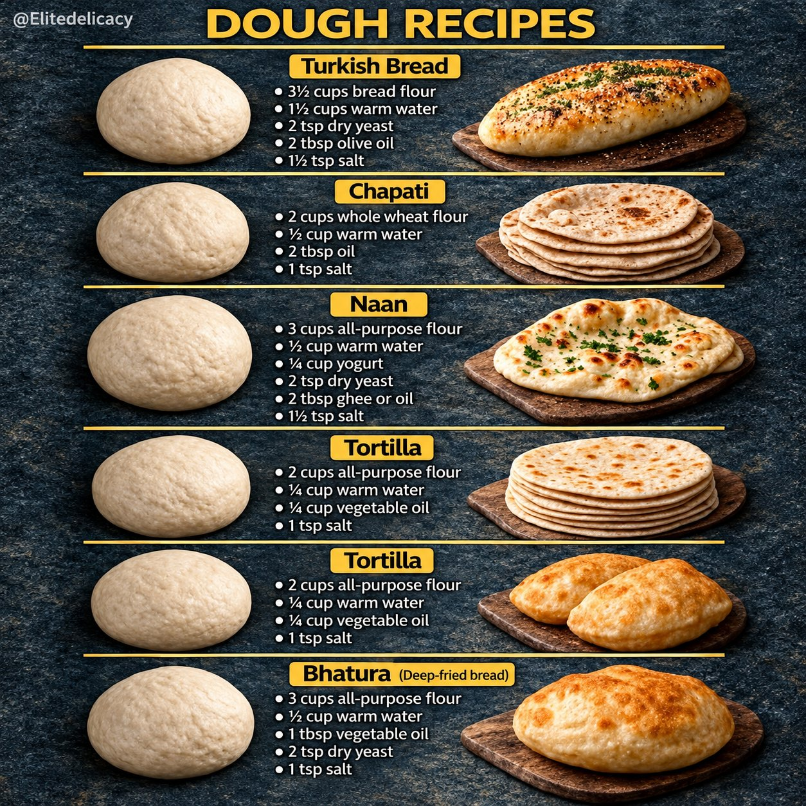

🔗 [View original post](https://x.com/Elitedelicacy/status/2096630485916983316)

---

### 🕐 16:03 UTC · @Unlockyourlife_

> Sleep More, Live Better.

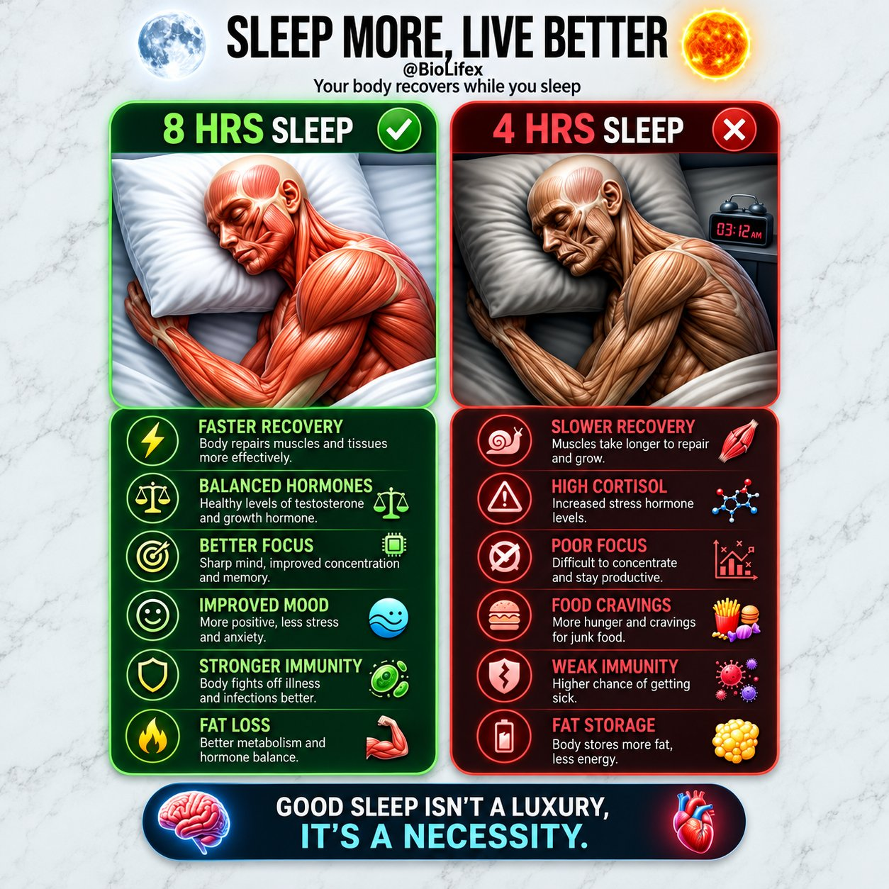

🔗 [View original post](https://x.com/BioLifex/status/2096630282262634663)

---

### 🕐 15:47 UTC · @Unlockyourlife_

> You don&apos;t need to completely change your diet to eat healthier. Small, smart food swaps can help you get more fibre, protein and nutrients while reducing excess sugar, unhealthy fats and empty calories. Choose better options more often, and let consistency-not perfection, drive your progress.

🔗 [View original post](https://x.com/FitnessDr_/status/2096626314509705526)

---

### 🕐 15:47 UTC · @Unlockyourlife_

> 5. Sugary soda —&gt; Water

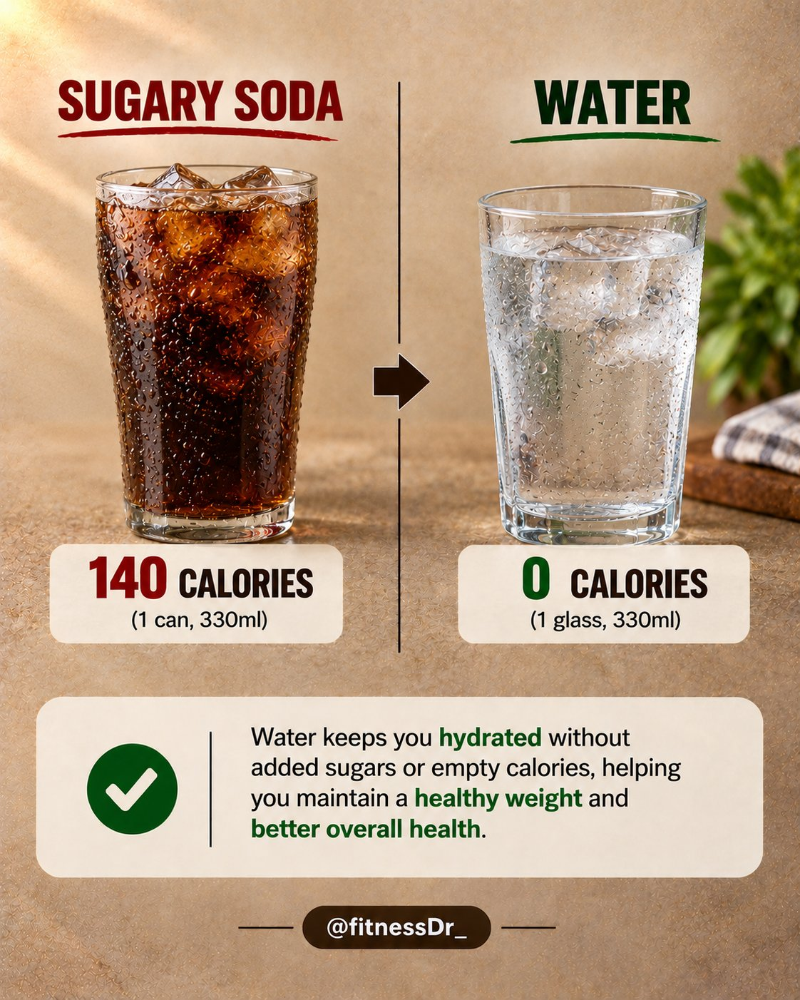

🔗 [View original post](https://x.com/FitnessDr_/status/2096626311670218949)

---

### 🕐 15:47 UTC · @Unlockyourlife_

> 4. Cookies —&gt; Nuts

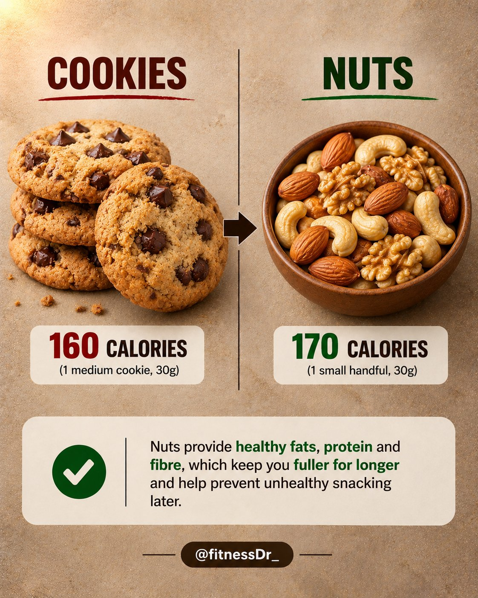

🔗 [View original post](https://x.com/FitnessDr_/status/2096626304137175339)

---

### 🕐 15:47 UTC · @Unlockyourlife_

> 3. Processed sausage —&gt; Grilled chicken breast

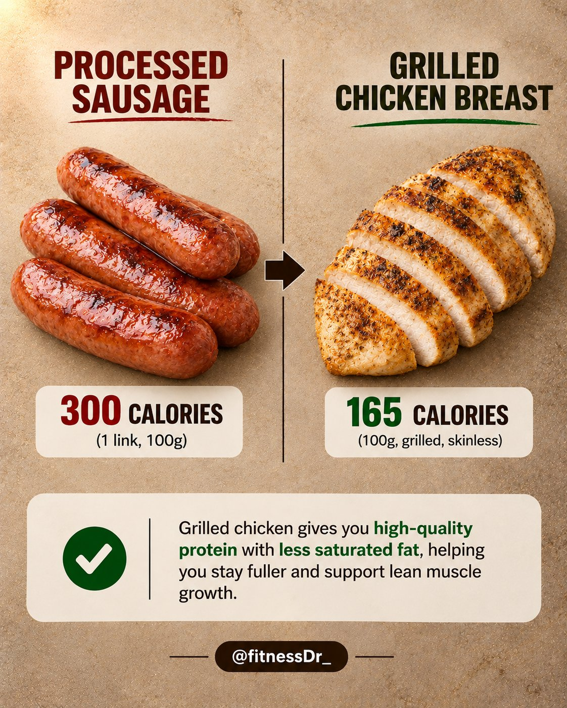

🔗 [View original post](https://x.com/FitnessDr_/status/2096626295027204309)

---

### 🕐 15:47 UTC · @Unlockyourlife_

> 2. French fries —&gt; Backed sweet potato

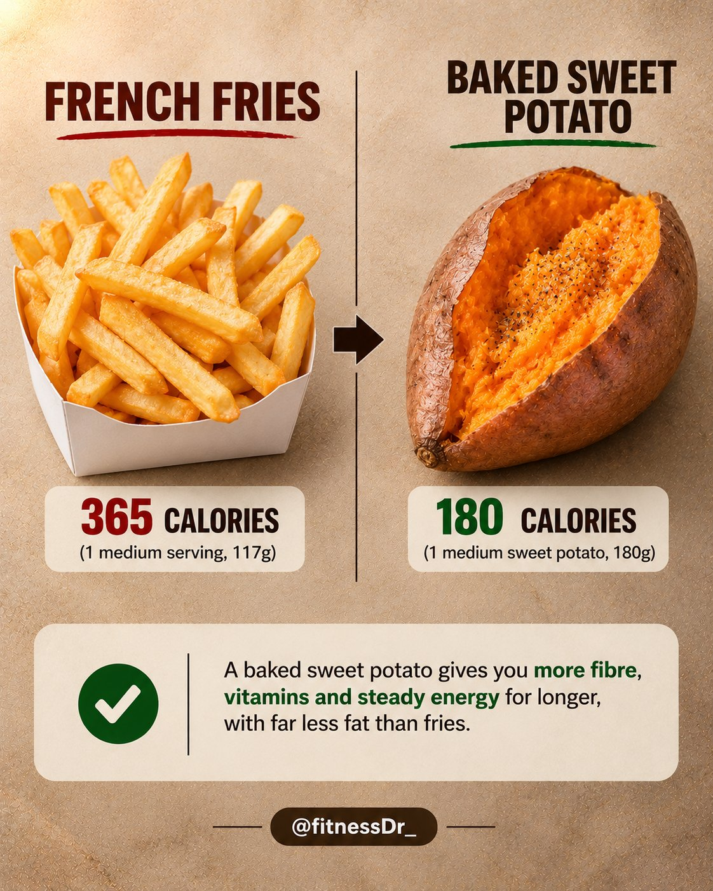

🔗 [View original post](https://x.com/FitnessDr_/status/2096626284738629820)

---

### 🕐 15:47 UTC · @Unlockyourlife_

> 5 Simple Food Swaps For A Healthier Diet. 1. Donut —&gt; Oatmeal

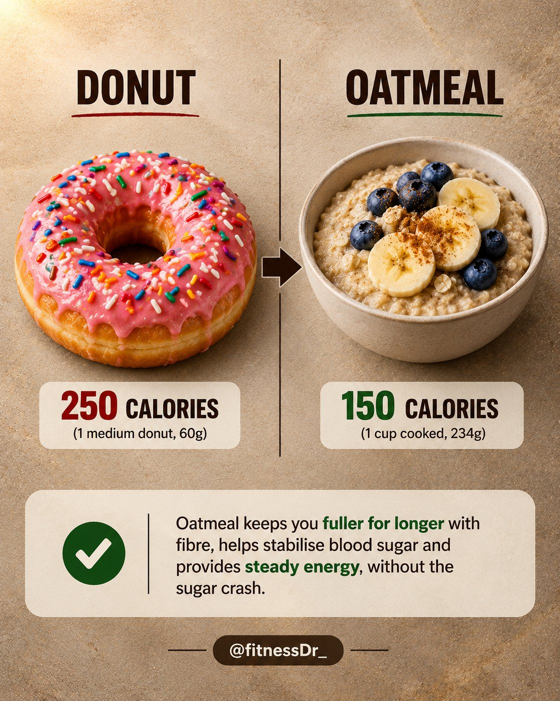

🔗 [View original post](https://x.com/FitnessDr_/status/2096626275695636497)

---

### 🕐 13:24 UTC · @Unlockyourlife_

> The beauty of science! Media

🔗 [View original post](https://x.com/sciencepathx/status/2096590389616443459)

---

### 🕐 13:07 UTC · @Unlockyourlife_

> How to Repair a Hole in Drywall ! Media

🔗 [View original post](https://x.com/Smart_Tipsx/status/2096586195979403666)

---

### 🕐 13:06 UTC · @Unlockyourlife_

> Brushing your teeth isn&apos;t just about having fresh breath or a clean-looking smile. Regular brushing, along with cleaning between your teeth and getting dental checkups, helps remove plaque before it can cause bigger problems. A few minutes of care each day can make a huge difference to your oral health in the long run. 🪥

🔗 [View original post](https://x.com/_fitnesshub/status/2096585954626515115)

---

### 🕐 13:06 UTC · @Unlockyourlife_

> 5.😬 YOU COULD EVENTUALLY LOSE TEETH Severe, untreated gum disease can damage the tissues and bone that support your teeth. As this damage progresses, teeth can become loose and, in advanced cases, may eventually fall out or need to be removed.

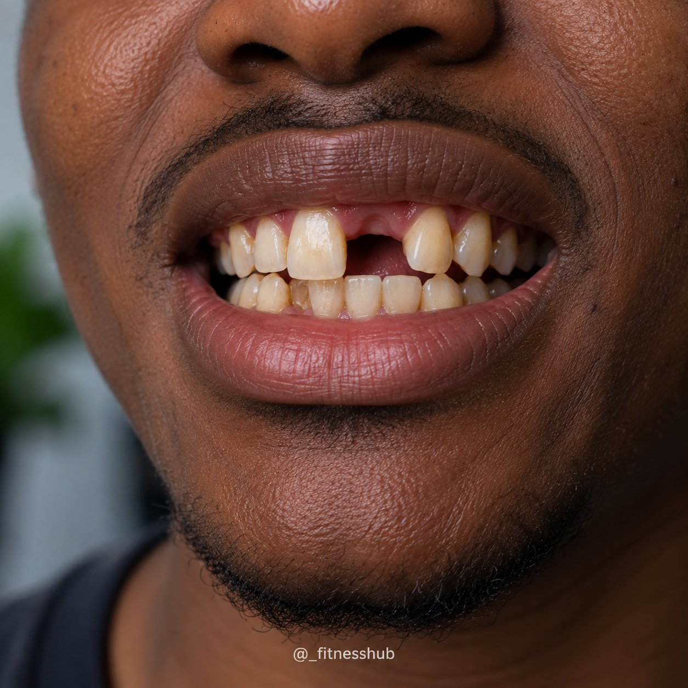

🔗 [View original post](https://x.com/_fitnesshub/status/2096585949652062393)

---

### 🕐 13:06 UTC · @Unlockyourlife_

> 4.🦷 YOUR TEETH CAN BECOME MORE SENSITIVE As tooth decay or gum problems progress, parts of your teeth can become damaged or exposed. This can make everyday things like hot drinks, cold water, sweets or acidic foods trigger sharp or uncomfortable sensations.

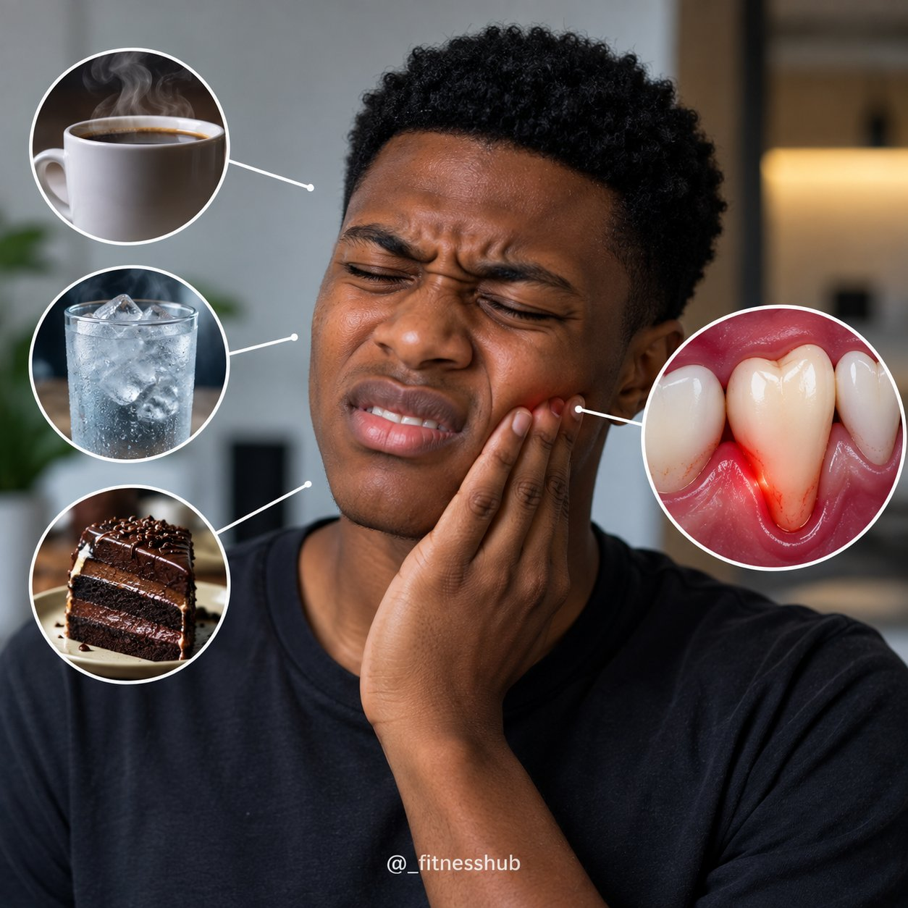

🔗 [View original post](https://x.com/_fitnesshub/status/2096585940986626195)

---

### 🕐 13:06 UTC · @Unlockyourlife_

> 3.🩸 YOUR GUMS MAY START BLEEDING Bacteria and plaque around the gumline can irritate your gums and cause inflammation. Your gums may become red, swollen or tender, and you may notice them bleeding when you brush or floss.

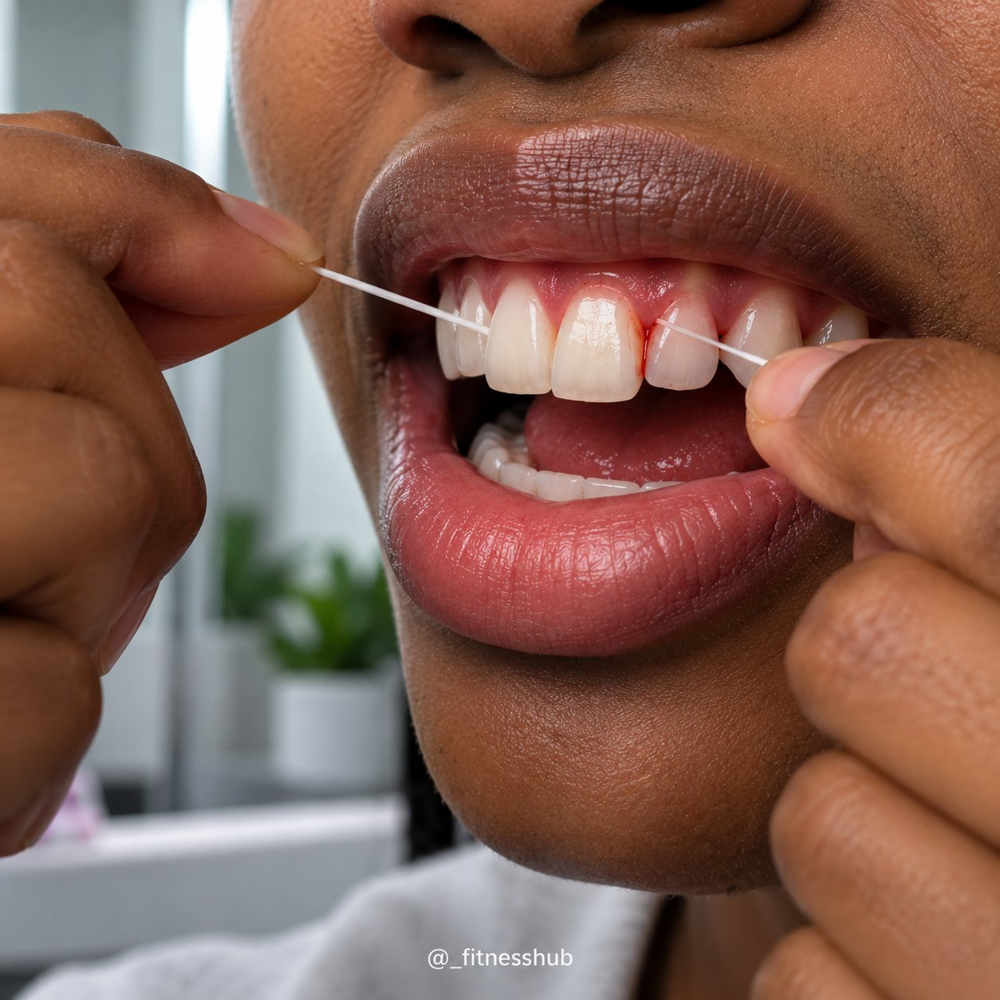

🔗 [View original post](https://x.com/_fitnesshub/status/2096585932551962642)

---

### 🕐 13:06 UTC · @Unlockyourlife_

> 2.🪥 TARTAR STARTS TO FORM When plaque stays on your teeth for too long, it can harden into tartar. Tartar is much harder and cannot simply be brushed away at home, so professional dental cleaning is often needed to remove it and prevent further buildup.

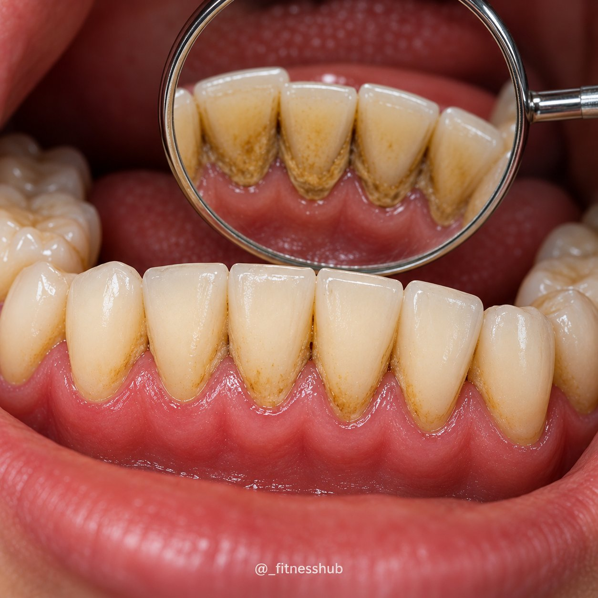

🔗 [View original post](https://x.com/_fitnesshub/status/2096585924494712874)

---

### 🕐 13:06 UTC · @Unlockyourlife_

> 1.🦷 YOUR TEETH CAN BECOME DISCOLORED Plaque and food particles can gradually build up on your teeth and trap stains from things like coffee, tea and certain foods. Over time, your teeth may become noticeably yellow or develop darker deposits that make your smile look less clean.

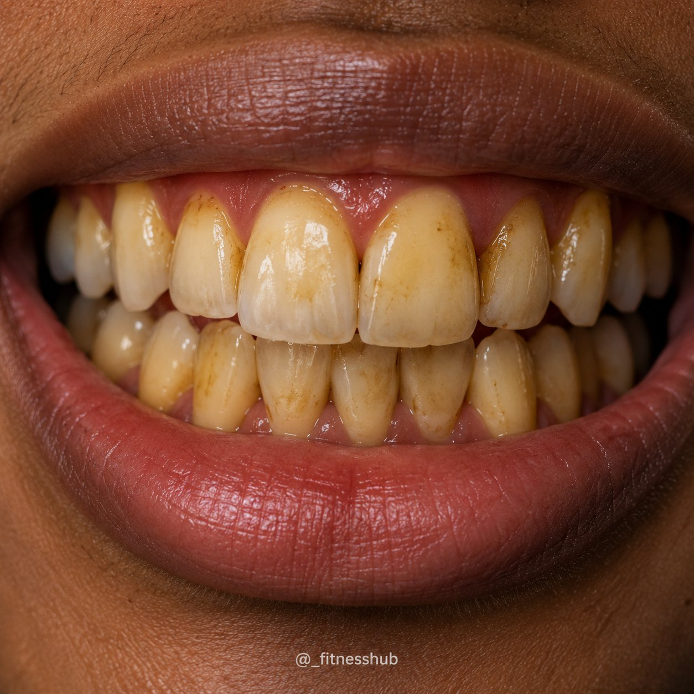

🔗 [View original post](https://x.com/_fitnesshub/status/2096585914059252219)

---

### 🕐 13:06 UTC · @Unlockyourlife_

> 🧵 WHAT HAPPENS WHEN YOU DON&apos;T BRUSH YOUR TEETH: Not brushing your teeth once or twice isn&apos;t usually a big deal, but making it a habit can allow bacteria, plaque and food particles to build up. Over time, this can affect your teeth, gums and overall oral health in ways you may not notice at first.

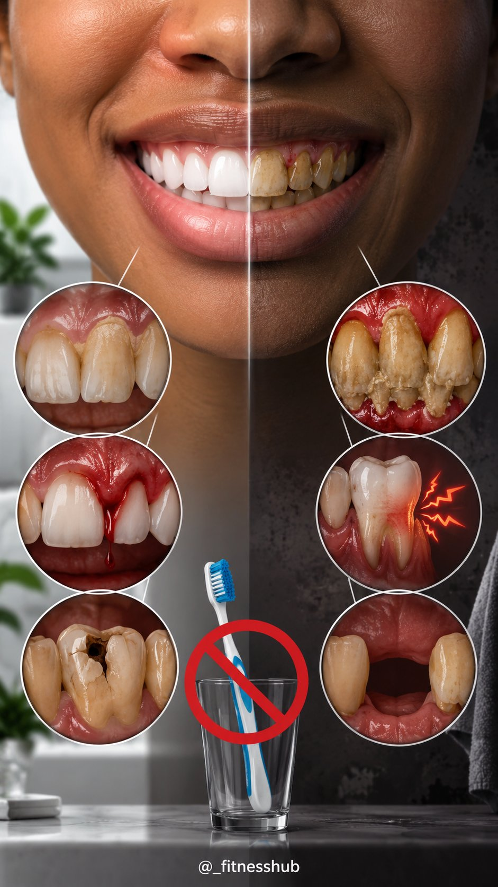

🔗 [View original post](https://x.com/_fitnesshub/status/2096585905981026628)

---

### 🕐 13:04 UTC · @Unlockyourlife_

> DIY 2-in-1 storage table for versatile use! Media

🔗 [View original post](https://x.com/samx_reels/status/2096585442380407034)

---

### 🕐 12:58 UTC · @Unlockyourlife_

> The Process of Making a Wooden Food Bowl 🥣 Media

🔗 [View original post](https://x.com/_Brainboxx/status/2096583828970082446)

---

### 🕐 11:21 UTC · @Unlockyourlife_

> Morning yoga flow in bed. Media

🔗 [View original post](https://x.com/_alphafit/status/2096559294263046551)

---

### 🕐 10:05 UTC · @Unlockyourlife_

> Eating healthy but struggling to gain weight? This might help.

🔗 [View original post](https://x.com/_fitnesshub/status/2096540321559552443)

---

### 🕐 09:48 UTC · @Unlockyourlife_

> The Hidden Danger Lurking In Dirty Water.

🔗 [View original post](https://x.com/FitnessDr_/status/2096535906953871808)

---

### 🕐 09:06 UTC · @Unlockyourlife_

> Plane Emergency Landing Media

🔗 [View original post](https://x.com/_learnskills/status/2096525430098464789)

---

### 🕐 07:33 UTC · @Unlockyourlife_

> A few principles can save you years of unnecessary trouble: 🔷 Don&apos;t make decisions while furious. 🔷 Don&apos;t spend money to impress strangers. 🔷 Don&apos;t chase people who repeatedly choose distance. 🔷 Don&apos;t confuse busyness with progress. 🔷 Don&apos;t sacrifice health for temporary success. 🔷 Don&apos;t ignore patterns because of promises. 🔷 Don&apos;t stay where respect has disappeared. 🔷 Don&apos;t compare your timeline constantly. 🔷 Don&apos;t neglect people who genuinely care about you. 🔷 Don&apos;t postpone the life you keep saying you&apos;ll start.

🔗 [View original post](https://x.com/Masculinjournal/status/2096501980235497621)

---

### 🕐 07:27 UTC · @Unlockyourlife_

> Street Corn Chicken Bowls Media

🔗 [View original post](https://x.com/Elitedelicacy/status/2096500625655607544)

---

### 🕐 07:03 UTC · @Unlockyourlife_

> What Happens To Your Body When You Stop Drinking Alcohol?

🔗 [View original post](https://x.com/BioLifex/status/2096494578543022117)

---

### 🕐 07:02 UTC · @Unlockyourlife_

> You don’t need to do all 5 exercises every day. Your muscles need time to recover and grow. Train consistently, recover properly, eat well, and focus on getting stronger over time. Consistency + recovery = real progress. 💯

🔗 [View original post](https://x.com/_fitnesshub/status/2096494325341249540)

---

### 🕐 07:02 UTC · @Unlockyourlife_

> 5. SHOULDER PRESS 🏋️‍♂️ The shoulder press targets your shoulders while also involving your triceps and upper chest. It&apos;s a solid movement for developing upper-body strength and stronger shoulders.

🔗 [View original post](https://x.com/_fitnesshub/status/2096494319683145887)

---

### 🕐 07:02 UTC · @Unlockyourlife_

> 4. PULL-UPS / LAT PULLDOWNS 💪 Want a stronger, wider-looking back? Pull-ups and lat pulldowns target your lats and also work your biceps and upper back. If you can&apos;t do pull-ups yet, start with lat pulldowns and gradually build your strength.

🔗 [View original post](https://x.com/_fitnesshub/status/2096494311848153441)

---

### 🕐 07:02 UTC · @Unlockyourlife_

> 3. DEADLIFTS 🔥 Deadlifts train your posterior chain — including your hamstrings, glutes and back. They’re excellent for developing overall strength, but proper technique is extremely important.

🔗 [View original post](https://x.com/_fitnesshub/status/2096494304524980319)

---

### 🕐 07:02 UTC · @Unlockyourlife_

> 2. BENCH PRESS 🏋️ The bench press primarily targets your chest, but your shoulders and triceps also help. It’s a great compound movement for developing upper-body pushing strength and building your chest.

🔗 [View original post](https://x.com/_fitnesshub/status/2096494296404803604)

---

### 🕐 07:02 UTC · @Unlockyourlife_

> 1. SQUATS 🦵 Squats work your quads, glutes and hamstrings while also challenging your core. They’re one of the best exercises for building lower-body strength and improving overall athletic ability.

🔗 [View original post](https://x.com/_fitnesshub/status/2096494288603316412)

---

### 🕐 07:02 UTC · @Unlockyourlife_

> 5 OF THE BEST EXERCISES TO DO AT THE GYM 💪 If you’re trying to get stronger, build muscle, improve your fitness and transform your body, these exercises deserve a spot in your routine. You don&apos;t need 20 different exercises. Start with the basics and do them consistently. 🧵👇

🔗 [View original post](https://x.com/_fitnesshub/status/2096494281632453087)

---
