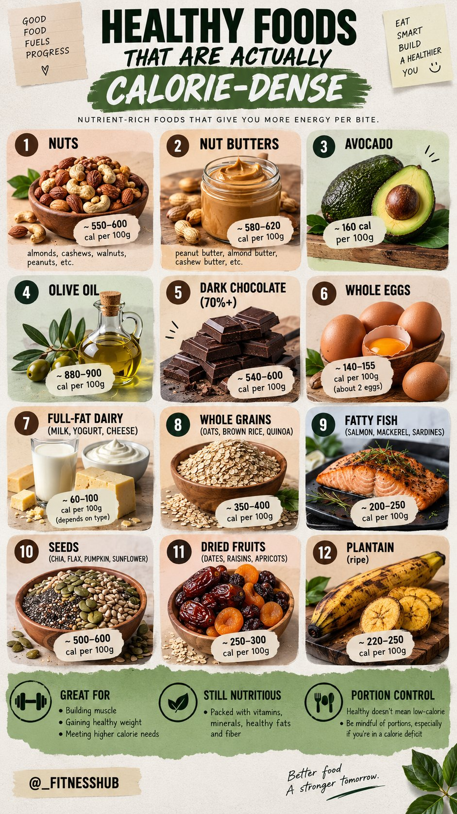
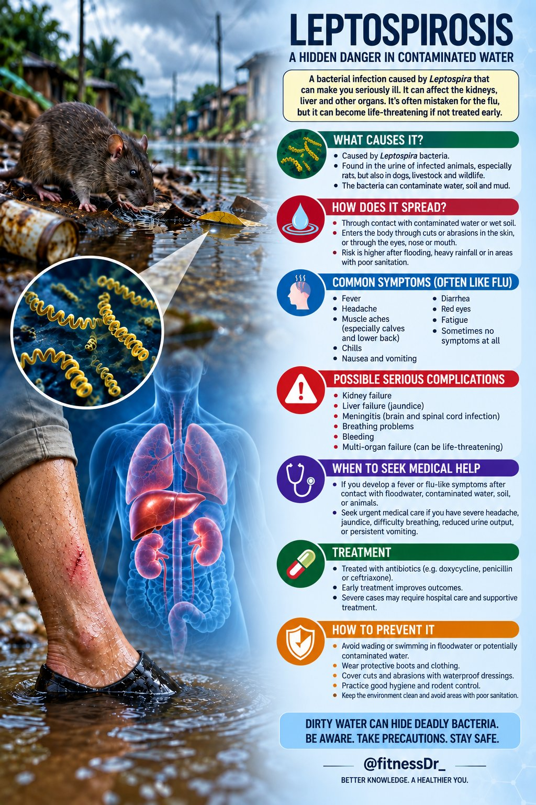
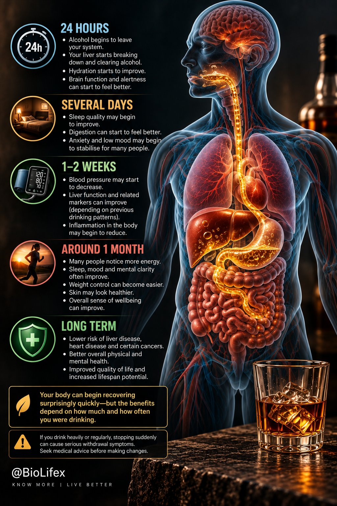
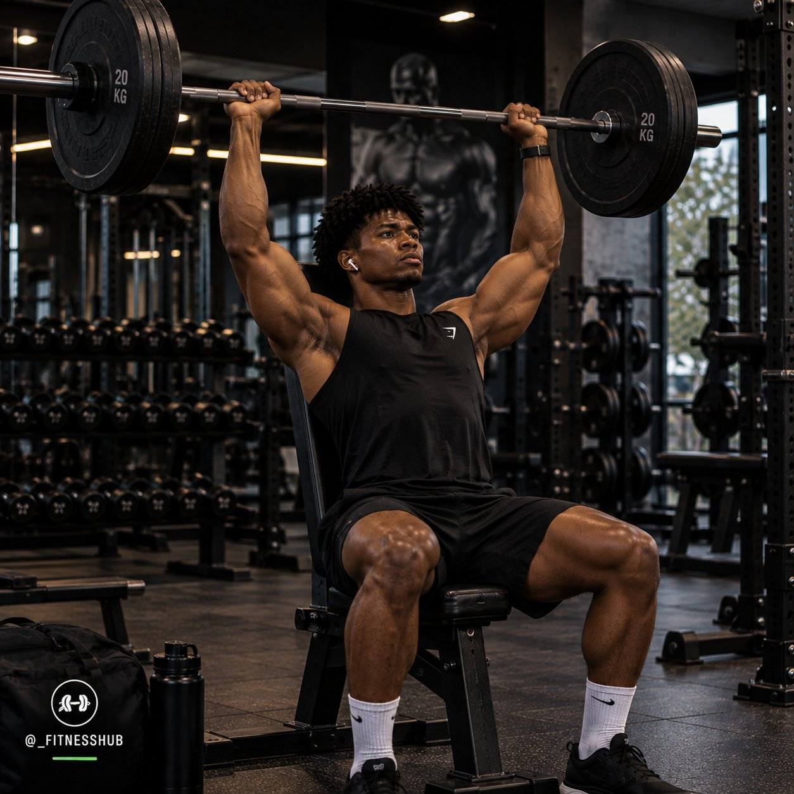
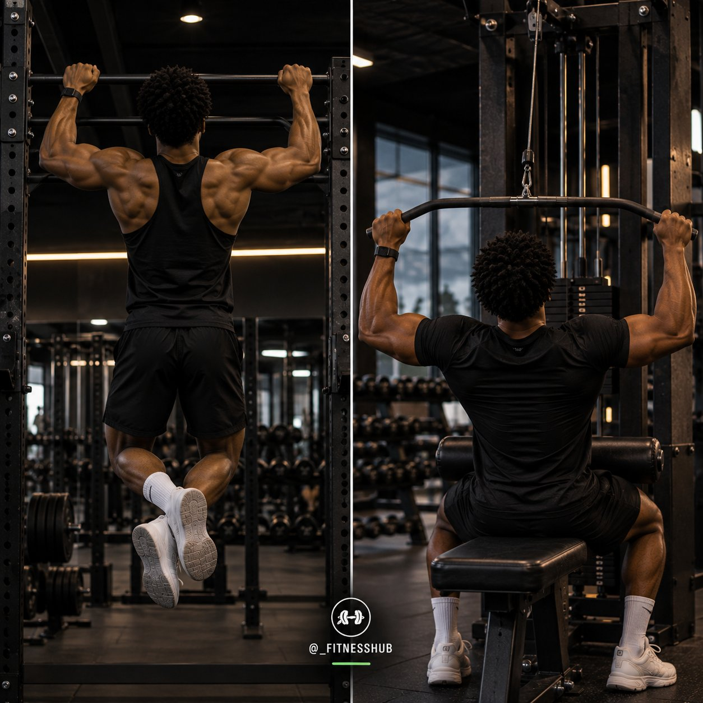
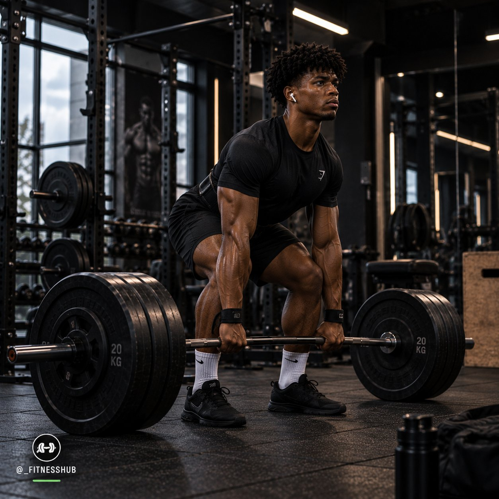
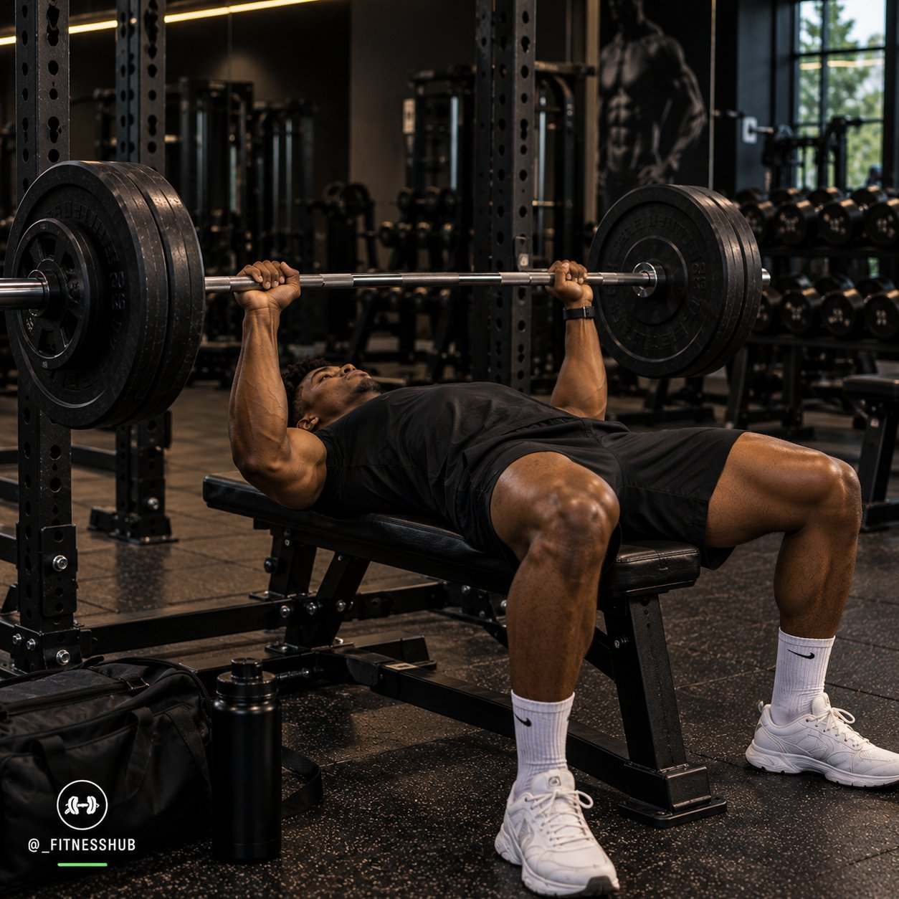
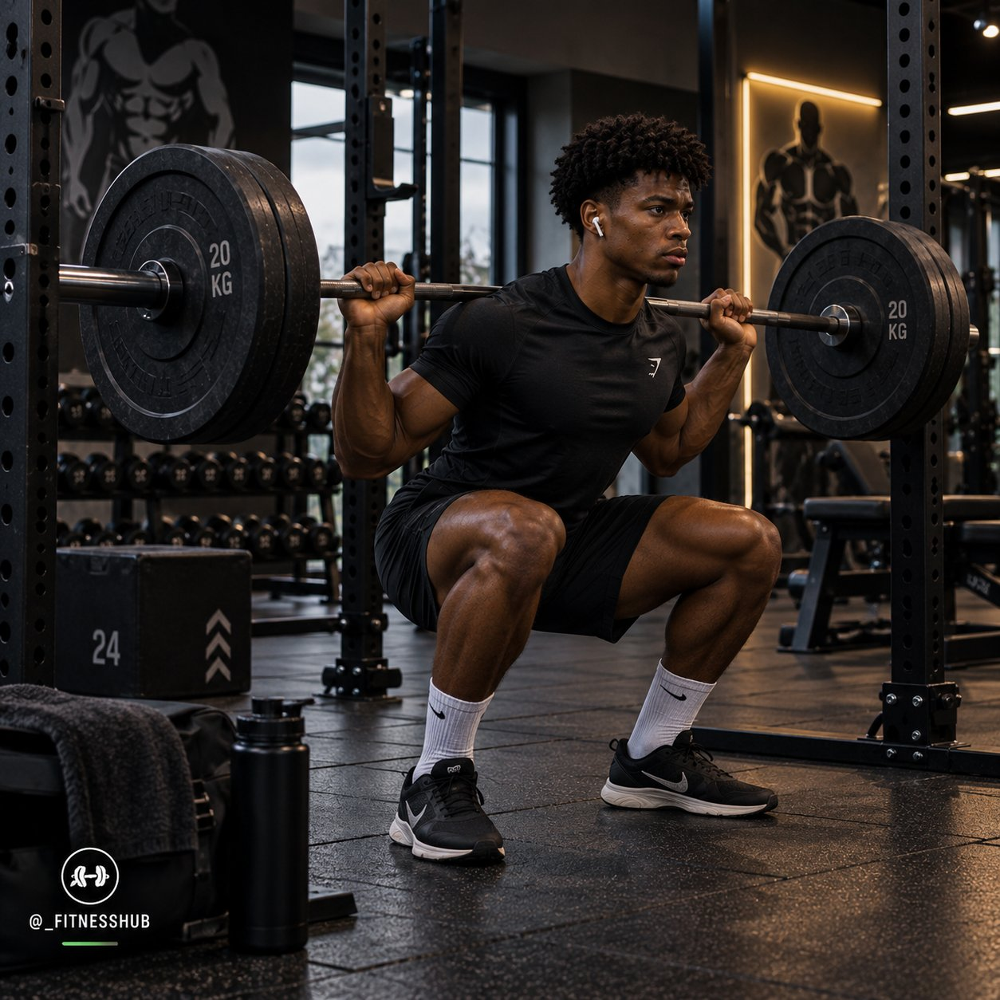
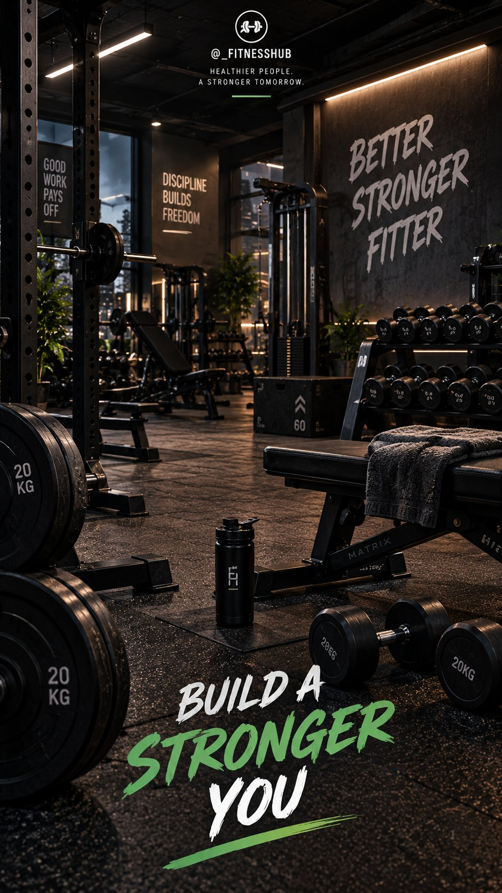

# 🐦 @Unlockyourlife_

## 📅 September 06, 2026

> 14 post(s) archived.

---

### 🕐 11:21 UTC · @Unlockyourlife_

> Morning yoga flow in bed. Media

🔗 [View original post](https://x.com/_alphafit/status/2096559294263046551)

---

### 🕐 10:05 UTC · @Unlockyourlife_

> Eating healthy but struggling to gain weight? This might help.

🔗 [View original post](https://x.com/_fitnesshub/status/2096540321559552443)

---

### 🕐 09:48 UTC · @Unlockyourlife_

> The Hidden Danger Lurking In Dirty Water.

🔗 [View original post](https://x.com/FitnessDr_/status/2096535906953871808)

---

### 🕐 09:06 UTC · @Unlockyourlife_

> Plane Emergency Landing Media

🔗 [View original post](https://x.com/_learnskills/status/2096525430098464789)

---

### 🕐 07:33 UTC · @Unlockyourlife_

> A few principles can save you years of unnecessary trouble: 🔷 Don&apos;t make decisions while furious. 🔷 Don&apos;t spend money to impress strangers. 🔷 Don&apos;t chase people who repeatedly choose distance. 🔷 Don&apos;t confuse busyness with progress. 🔷 Don&apos;t sacrifice health for temporary success. 🔷 Don&apos;t ignore patterns because of promises. 🔷 Don&apos;t stay where respect has disappeared. 🔷 Don&apos;t compare your timeline constantly. 🔷 Don&apos;t neglect people who genuinely care about you. 🔷 Don&apos;t postpone the life you keep saying you&apos;ll start.

🔗 [View original post](https://x.com/Masculinjournal/status/2096501980235497621)

---

### 🕐 07:27 UTC · @Unlockyourlife_

> Street Corn Chicken Bowls Media

🔗 [View original post](https://x.com/Elitedelicacy/status/2096500625655607544)

---

### 🕐 07:03 UTC · @Unlockyourlife_

> What Happens To Your Body When You Stop Drinking Alcohol?

🔗 [View original post](https://x.com/BioLifex/status/2096494578543022117)

---

### 🕐 07:02 UTC · @Unlockyourlife_

> You don’t need to do all 5 exercises every day. Your muscles need time to recover and grow. Train consistently, recover properly, eat well, and focus on getting stronger over time. Consistency + recovery = real progress. 💯

🔗 [View original post](https://x.com/_fitnesshub/status/2096494325341249540)

---

### 🕐 07:02 UTC · @Unlockyourlife_

> 5. SHOULDER PRESS 🏋️‍♂️ The shoulder press targets your shoulders while also involving your triceps and upper chest. It&apos;s a solid movement for developing upper-body strength and stronger shoulders.

🔗 [View original post](https://x.com/_fitnesshub/status/2096494319683145887)

---

### 🕐 07:02 UTC · @Unlockyourlife_

> 4. PULL-UPS / LAT PULLDOWNS 💪 Want a stronger, wider-looking back? Pull-ups and lat pulldowns target your lats and also work your biceps and upper back. If you can&apos;t do pull-ups yet, start with lat pulldowns and gradually build your strength.

🔗 [View original post](https://x.com/_fitnesshub/status/2096494311848153441)

---

### 🕐 07:02 UTC · @Unlockyourlife_

> 3. DEADLIFTS 🔥 Deadlifts train your posterior chain — including your hamstrings, glutes and back. They’re excellent for developing overall strength, but proper technique is extremely important.

🔗 [View original post](https://x.com/_fitnesshub/status/2096494304524980319)

---

### 🕐 07:02 UTC · @Unlockyourlife_

> 2. BENCH PRESS 🏋️ The bench press primarily targets your chest, but your shoulders and triceps also help. It’s a great compound movement for developing upper-body pushing strength and building your chest.

🔗 [View original post](https://x.com/_fitnesshub/status/2096494296404803604)

---

### 🕐 07:02 UTC · @Unlockyourlife_

> 1. SQUATS 🦵 Squats work your quads, glutes and hamstrings while also challenging your core. They’re one of the best exercises for building lower-body strength and improving overall athletic ability.

🔗 [View original post](https://x.com/_fitnesshub/status/2096494288603316412)

---

### 🕐 07:02 UTC · @Unlockyourlife_

> 5 OF THE BEST EXERCISES TO DO AT THE GYM 💪 If you’re trying to get stronger, build muscle, improve your fitness and transform your body, these exercises deserve a spot in your routine. You don&apos;t need 20 different exercises. Start with the basics and do them consistently. 🧵👇

🔗 [View original post](https://x.com/_fitnesshub/status/2096494281632453087)

---
