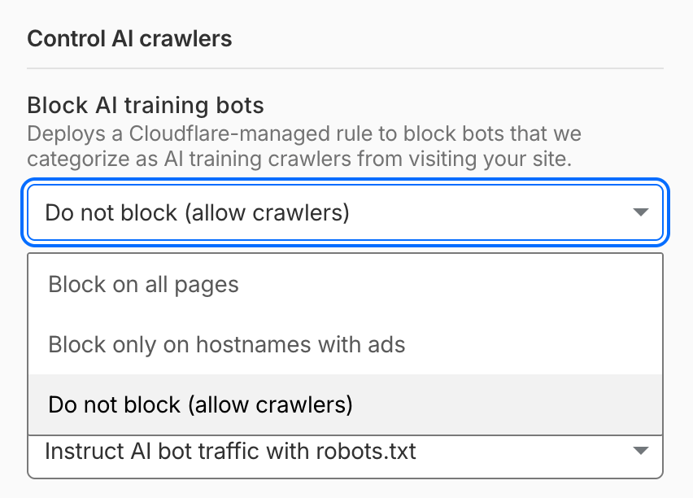
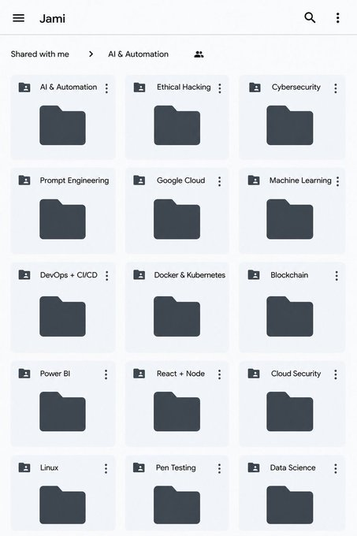
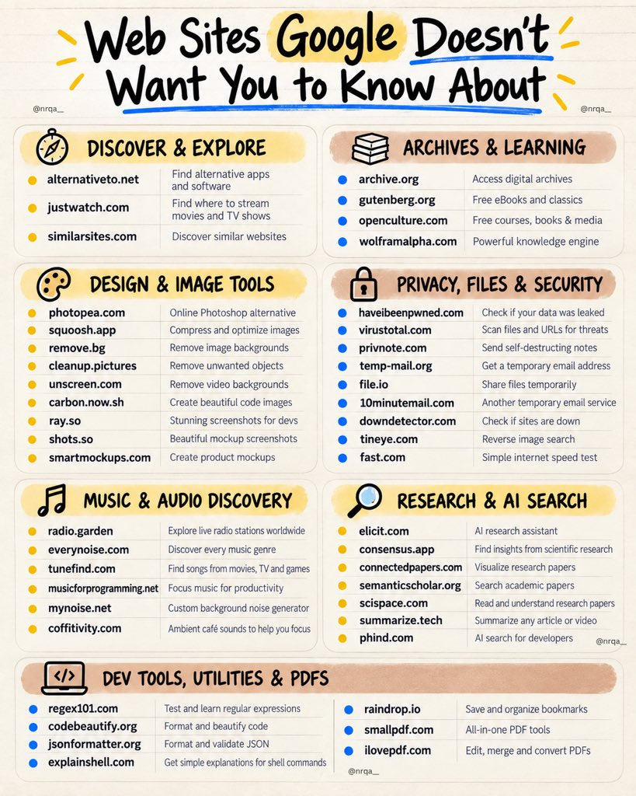
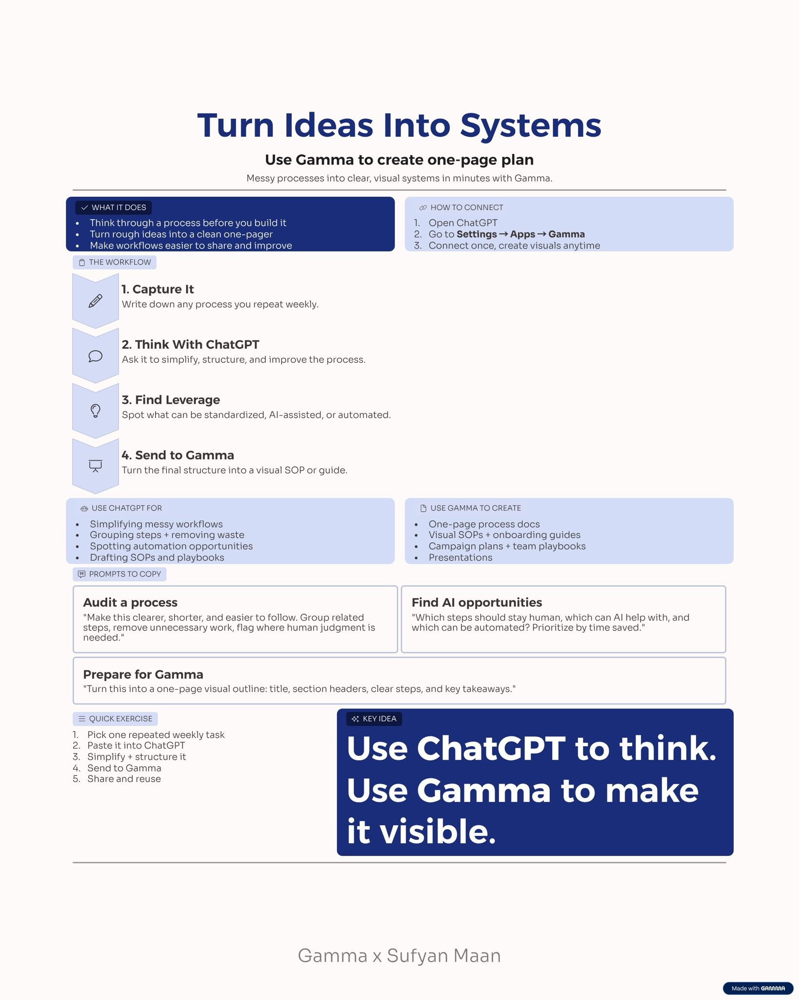

# 🐦 @Wise1Philosophy

## 📅 September 06, 2026

> 54 post(s) archived.

---

### 🕐 14:01 UTC · @Wise1Philosophy

> Your body will forgive you for: -Skipping the gym -Eating pizza -Sleeping poorly on the weekend -Losing motivation Your body WILL NOT forgive you for:

🔗 [View original post](https://x.com/LevelUpPrime/status/2096599648366641439)

---

### 🕐 14:00 UTC · @Wise1Philosophy

> wow.. AI agents can do animation for you now I used just GPT Image 2.0 and Seedance 2.0 to generate this perfect animation video. Step-by-step tutorial with prompts: 👇 Media

🔗 [View original post](https://x.com/HeyAbhishek/status/2096599351498064120)

---

### 🕐 14:00 UTC · @Wise1Philosophy

> Brad Gerstner is an investor in OpenAI, Anthropic and Google. On the All-In podcast, he shared the 8 rules he uses to price a company nobody can forecast: 1) He asked how a firm earning $13 billion promises $1.4 trillion Media

🔗 [View original post](https://x.com/AiEvolutio58513/status/2096599319868797358)

---

### 🕐 13:52 UTC · @Wise1Philosophy

> THE OLDER YOU GET, THE MORE YOU NEED TO: 1. Not be fat

🔗 [View original post](https://x.com/josh_uglyasf/status/2096597314601439239)

---

### 🕐 13:50 UTC · @Wise1Philosophy

> HABITS I STOLE FROM WEALTHY PEOPLE 1. The One Phone Rule

🔗 [View original post](https://x.com/BeBetterMan_/status/2096596890876100627)

---

### 🕐 13:47 UTC · @Wise1Philosophy

> Heart Attack = Blood sugar Heart Attack = Insulin resistance Heart Attack = No.1 killer worldwide. 5 simple rules to protect your heart: 1. Don&apos;t go pee at 3 AM Media

🔗 [View original post](https://x.com/BeBetter_Athlet/status/2096596244852572606)

---

### 🕐 13:45 UTC · @Wise1Philosophy

> follow this account to learn enterprise AI transformation: Implementing AI transformation is like upgrading an airplane’s engines mid-flight. You cannot land the plane to make this change because your customers are already on board, delivery schedules are locked, and no client will pay you to sit idle for six months during a complete reb…

🔗 [View original post](https://x.com/alex_prompter/status/2096595683134275615)

---

### 🕐 13:40 UTC · @Wise1Philosophy

> Your body is flooded with cortisol and you do not even realise it. These are the 9 signs that confirm it: 1. Waking between 2 and 4am Media

🔗 [View original post](https://x.com/DPro_Coach/status/2096594444997066983)

---

### 🕐 13:30 UTC · @Wise1Philosophy

🔗 [View original post](https://x.com/Mindsthatbuild/status/2096591838010298475)

---

### 🕐 13:21 UTC · @Wise1Philosophy

> Stop telling Claude, &quot;do this.&quot; Stop telling Claude, &quot;write code.&quot; Stop telling Claude, &quot;fix this error.&quot; You&apos;re actually treating a senior AI like a junior intern. Here are 8 prompts you can copy and paste directly:

🔗 [View original post](https://x.com/iam_chonchol/status/2096589625943027841)

---

### 🕐 13:18 UTC · @Wise1Philosophy

> Just a heads up: Here is one of the more important AI search updates of 2026. If you want to continue showing up in ChatGPT, Claude, Google&apos;s AI family, etc - pay attention. A lot of site owners are going to misunderstand what is happening and play this wrong. Cloudflare is giving websites more control over AI bot traffic, which is good and appreciated in theory. That said, this also creates a new problem for businesses that still need to be discovered by Google, ChatGPT, Claude, Perplexity, Gemini, Grok and the rest of the AI search ecosystem. Let’s go through it. By the way, you can see whether your business is appearing across Google AI, ChatGPT, Claude, Perplexity and Grok here. It’s free: https://rightcited.com/ Cloudflare recently announced new AI traffic controls for website owners. The big change is that they are splitting AI traffic into three buckets: Search, Agent and Training. Search means a crawler is collecting or indexing your content so it can answer questions about it later. That is usually the traffic most businesses want to allow, because that is how customers find you. Agent means automated behavior acting on behalf of a person in real time. Think of an AI assistant, chatbot or browser agent visiting a page because a human asked it to get something done. Training means a crawler is taking your content to train or fine-tune a model. That is the one a lot of website owners are increasingly uncomfortable with, for obvious reasons. For years, the deal was pretty simple in that search engines crawled your site and you got traffic back. Obviously, that deal has since gotten much messier. AI systems can crawl content, summarize it, reuse it, answer questions with it and sometimes send very little back to the original website. So Cloudflare is trying to give site owners more control. The issue is that blocking AI bots isn&apos;t really as black and white as it sounds. A SaaS company probably wants AI search systems to understand its product, pricing, use cases, comparisons, documentation and customer proof. That does not mean the same SaaS company wants every training crawler absorbing its best content forever. An e-commerce company probably wants AI search systems to understand its product pages, category pages, pricing, availability, shipping, returns and reviews. That does not mean it wants every agent, scraper or training crawler hitting the site with no upside. A local business probably wants to be found everywhere customers are searching. That does not mean it should allow every automated visitor just because it calls itself AI. That is the tradeoff and this is where I think a lot of companies are going to mess this up. They will hear “block AI bots” and treat it like an obvious win, or they will hear “AI search visibility” and assume everything should stay open. Both don&apos;t really tell the full story. What needs to be addressed is which bots help customers find you, which bots help customers take action and which bots are just extracting value from your site. Cloudflare is making that question much more explicit. Starting September 15, Cloudflare says it will update default settings around these categories. Search remains allowed by default. Training and Agent traffic will be blocked by default on pages that display ads for new domains onboarding to Cloudflare. Existing customers can review the settings and opt out of the new defaults if they want to keep things as they are. The most important part, though, may be how Cloudflare handles multi-purpose crawlers. Cloudflare says some crawlers combine Search with Training. And when a crawler has multiple purposes, Cloudflare wants it treated according to all of those behaviors. The most restrictive rule can win. So if a site owner blocks Training, a crawler that combines Search and Training may get blocked too. That is where this becomes a real search visibility issue, because if your settings block the wrong crawler, you may also be making your business harder to find. If you don&apos;t know how to make sure you&apos;re checking the right boxes on this, let SEO Stuff (http://seo-stuff.com) help. That matters because a lot of businesses are already invisible in AI Search. And now some of those same businesses may accidentally block the systems that help them get discovered. Keep in mind, that does not mean every AI bot deserves access - a lot of them do not. But the strategy should definitely be more thoughtful than turning everything off. Allow the bots that create discovery. Be careful with the bots that only extract. Watch agent traffic differently from search indexing. Understand whether your content is being used for reference, summaries, reproduction or training. And make sure the pages that matter commercially can still be found. If you don&apos;t know how to do this, SEO Stuff (http://seo-stuff.com) can help. The businesses winning in Search and AI Search right now are winning from specific commercial pages that help customers make decisions. Best X for Y when Z if 123. Alternatives to X if Y and Z is 123. X vs Y for Z and 123. Pricing. Use cases. Industry pages. Implementation guides. Comparison pages. Product documentation. Case studies. Customer proof. Those are the pages that need to be accessible to the right systems. A company can have the best product page in the world, but if search and AI systems cannot crawl it, understand it and verify it across the web, it may not show up when buyers ask for recommendations. This is where SEO Stuff steps in. The done-for-you package combines 10 AI-search-optimized pieces of content with three DR50+ authority placements: https://seo-stuff.com/gold-plan-package The content helps your business cover the questions customers ask before buying, including problems, use cases, comparisons, pricing, alternatives, industries, objections, case studies, product details and implementation. The authority placements help your business show up across trusted sources that search and AI systems use to understand categories. And again, if you&apos;re curious about whether your business is appearing across Google AI, ChatGPT, Claude, Perplexity and Grok, you can check here. It’s free: https://rightcited.com/ A brand followed the advice in this article and generated more than $50,000 from ChatGPT, Google and Perplexity-driven traffic.

🔗 [View original post](https://x.com/alexgroberman/status/2096588906586402906)

---

### 🕐 13:01 UTC · @Wise1Philosophy

🔗 [View original post](https://x.com/Life__Mastery/status/2096584610129875327)

---

### 🕐 12:59 UTC · @Wise1Philosophy

> NVIDIA CEO Jensen Huang: “I really discourage 1-on-1s” He has 60 direct reports. Patrick Collison points out that nobody would call that best practice, and Jensen explains why he does it anyway: “I don’t do 1-on-1s, and almost everything I say, I say to everybody all the time. I don’t really believe there’s any information that I operate on that only one or two people should hear about… I believe that when you give everybody equal access to information, that empowers people. And so that’s number one… Number two, if the CEO’s direct staff is 60 people, the number of layers you’ve removed in a company is probably something like seven.” Patrick pushes back for the other side. Isn&apos;t the 1-on-1 where coaching happens, where careers get discussed, where you tell someone the thing they keep getting wrong? His answer is the part worth sitting with: “I give you feedback right there in front of everybody. In fact, this is a really big deal. First of all, feedback is learning. For what reason are you the only person who should learn this?… We should all learn from that opportunity… Half the time I’m not right, but for me to reason through it in front of everybody helps everybody learn how to reason through it. The problem I have with 1-on-1s and taking feedback aside is you deprive a whole bunch of people that same learning. Learning from other people’s mistakes is the best way to learn.” Interested in AI? Follow @AiEvolutio58513 and never fall behind. I track ChatGPT, Claude, and every tool quietly changing how we work and create, then hand you the tested signals. Media

🔗 [View original post](https://x.com/AiEvolutio58513/status/2096584024533966973)

---

### 🕐 12:49 UTC · @Wise1Philosophy

> All Paid Courses (Free for First 4500 People) 𝗣𝗮𝗶𝗱 𝗖𝗼𝘂𝗿𝘀𝗲 𝗙𝗥𝗘𝗘 (PART - 1) 1. Artificial Intelligence 2. Machine Learning 3. Prompt Engineering 4. Claude,Chatgpt,Grok 5. Data Analytics 6. AWS Certified 7. Data Science 8. BIG DATA 9. Python 10. Ethical Hacking (72 Hours only ) Like + RT + comment &apos; Drive &apos; Must Follow me so I can DM you.

🔗 [View original post](https://x.com/heyalexmoore/status/2096581599894860173)

---

### 🕐 12:30 UTC · @Wise1Philosophy

🔗 [View original post](https://x.com/Wise1Philosophy/status/2096576740986409335)

---

### 🕐 11:54 UTC · @Wise1Philosophy

> A Costco employee worked the warehouse floor for 4 years. He watched the same mistakes every day. Members buying Tide at $28 while Kirkland detergent made in the same factory, same cleaning formula sat 3 feet away at $16. Members walking past .97 clearance tags on items they&apos;d pay full price for next month. Members paying $65/year for Gold Star memberships when their spending qualified them for Executive the tier that pays for its own upgrade through 2% cashback. Members checking out without flipping through the monthly coupon book that would have saved $15–$30 on items already in their cart. He couldn&apos;t say anything. Costco employees aren&apos;t trained to upsell, cross-sell, or correct shopping habits. The culture is &quot;let the member shop.&quot; The employee who says &quot;the Kirkland version is the same product for $12 less&quot; is overstepping. The member who doesn&apos;t know loses $12. Multiply across 50 products per year. Add the missed cashback. Add the ignored clearance. Add the pharmacy they walk past. Add the travel desk they&apos;ve never approached. $600/year in value left on the warehouse floor by the average member, on the average shopping pattern, using the average autopilot habits he watched repeat across thousands of carts for 4 years. After he left Costco, he told his friends and family everything he wished he could have said on the floor. Here&apos;s the full Costco playbook from someone who watched members leave money on the table every single day 🧵

🔗 [View original post](https://x.com/jackcoder0/status/2096567732624150609)

---

### 🕐 11:30 UTC · @Wise1Philosophy

> Web Sites Google Doesn&apos;t Want You to Know About ↳ https://alternativeto.net ↳ https://justwatch.com ↳ https://archive.org ↳ https://gutenberg.org ↳ https://openculture.com ↳ https://wolframalpha.com ↳ https://photopea.com ↳ https://squoosh.app ↳ https://remove.bg ↳ https://cleanup.pictures ↳ https://unscreen.com ↳ https://carbon.now.sh ↳ https://ray.so ↳ https://shots.so ↳ https://smartmockups.com ↳ https://haveibeenpwned.com ↳ https://virustotal.com ↳ https://privnote.com ↳ https://temp-mail.org ↳ https://file.io ↳ https://10minutemail.com ↳ https://similarsites.com ↳ https://radio.garden ↳ https://everynoise.com ↳ https://tunefind.com ↳ https://musicforprogramming.net ↳ https://mynoise.net ↳ https://coffitivity.com ↳ https://elicit.com ↳ https://consensus.app ↳ https://connectedpapers.com ↳ https://semanticscholar.org ↳ https://scispace.com ↳ https://summarize.tech ↳ https://phind.com ↳ https://regex101.com ↳ https://codebeautify.org ↳ https://jsonformatter.org ↳ https://explainshell.com ↳ https://raindrop.io ↳ https://downdetector.com ↳ https://tineye.com ↳ https://fast.com ↳ https://smallpdf.com ↳ https://ilovepdf.com 2024: one prompt box, one output, start over every time 2026: a canvas where the whole process stays connected that&apos;s @pippitofficial&apos;s Creative Agent Canvas. instead of jumping between tools, you build your own workflow in one place → chat and canvas working together, ideas to e…

🔗 [View original post](https://x.com/nrqa__/status/2096561640888209582)

---

### 🕐 11:30 UTC · @Wise1Philosophy

🔗 [View original post](https://x.com/Daily__wisdom_/status/2096561622068101363)

---

### 🕐 11:15 UTC · @Wise1Philosophy

> 🚨 BREAKING: Google just launched free AI courses. No sign-up fees or prior skills required. Here are 10 courses you don&apos;t want to miss:

🔗 [View original post](https://x.com/AndrewBolis/status/2096557784024379895)

---

### 🕐 11:01 UTC · @Wise1Philosophy

🔗 [View original post](https://x.com/apex_mentality_/status/2096554391893414207)

---

### 🕐 11:00 UTC · @Wise1Philosophy

> Brian Chesky says the advice that nearly DESTROYED Airbnb is taught at every business school. &quot;Hire great people and empower them to do their job.&quot; He believed it. Guess what happened when he implemented it? Teams spawned teams. Managers created managers. Soon he had a hundred little divisions running in a hundred directions, drowning in meetings about meetings. The CEO got separated from the product itself. He says great leadership is presence, not absence. You start in the details, build trust, then let go. You do not hand off the thing and hope. — Brian Chesky (.@bchesky), CEO of Airbnb Interested in AI? Follow @AiEvolutio58513 and never fall behind. I track ChatGPT, Claude, and every tool quietly changing how we work and create, then hand you the tested signals. Media

🔗 [View original post](https://x.com/AiEvolutio58513/status/2096554115119886671)

---

### 🕐 10:44 UTC · @Wise1Philosophy

> https://x.com/i/article/2096542582159634433

🔗 [View original post](https://x.com/charliejhills/status/2096550164278485292)

---

### 🕐 10:30 UTC · @Wise1Philosophy

🔗 [View original post](https://x.com/yeti_mind/status/2096546482170089483)

---

### 🕐 10:09 UTC · @Wise1Philosophy

> TAKING MAGNESIUM RIGHT WILL TURN YOU INTO A 13% BODY FAT BEAST: (99% ARE MAKING THESE 3 MISTAKE):

🔗 [View original post](https://x.com/NutritionCorp/status/2096541240783462655)

---

### 🕐 09:58 UTC · @Wise1Philosophy

> Dementia is blood flow. Dementia is cholesterol. Dementia is preventable close to half the time. 8 simple rules to protect your brain: 1. Floss your teeth

🔗 [View original post](https://x.com/_Gut_Laboratory/status/2096538502775349560)

---

### 🕐 09:46 UTC · @Wise1Philosophy

> A heart surgeon told me something that shocked me: “There are 3 types of people who don&apos;t get heart attacks.” 1. Don&apos;t go to the toilet at 3 AM

🔗 [View original post](https://x.com/CoachWillStone/status/2096535603458543718)

---

### 🕐 09:30 UTC · @Wise1Philosophy

🔗 [View original post](https://x.com/Ant_Philosophy/status/2096531433594540082)

---

### 🕐 09:17 UTC · @Wise1Philosophy

> holy f*ck, what did I just read: Side Quests is my weekly field log from the trenches, covering, products, prototypes, launches, growth experiments, weird ideas, and whatever I’m currently trying to figure out. Subscribe for free now: https://sidequests.pascio.com/subscribe https://x.com/i/article/20965235139810…

🔗 [View original post](https://x.com/xgrowthpascal/status/2096528210653520217)

---

### 🕐 09:16 UTC · @Wise1Philosophy

> This guy literally burned $9k on ads, yet ended up building a $1m solo business. And now he just shares everything he knows for free: Side Quests is my weekly field log from the trenches, covering, products, prototypes, launches, growth experiments, weird ideas, and whatever I’m currently trying to figure out. Subscribe for free now: https://sidequests.pascio.com/subscribe https://x.com/i/article/20965235139810…

🔗 [View original post](https://x.com/creatorpascal/status/2096527958223573422)

---

### 🕐 08:30 UTC · @Wise1Philosophy

🔗 [View original post](https://x.com/Mindsthatbuild/status/2096516277086876133)

---

### 🕐 08:00 UTC · @Wise1Philosophy

🔗 [View original post](https://x.com/Wise1Philosophy/status/2096508917018657129)

---

### 🕐 07:53 UTC · @Wise1Philosophy

> Heart attack = blood sugar. Heart attack = insulin resistance. Heart attack = No. 1 cause of death on Earth. Here is the simple fix to protect your heart: 1. Do not go pee at 3am Media

🔗 [View original post](https://x.com/TinaaDeJong/status/2096506958555894145)

---

### 🕐 07:47 UTC · @Wise1Philosophy

> Someone who lost 19 kilos wrote out the rules that got them there. Most of them are free. Here are the ones that survive scrutiny: 1. Walk on an incline instead of running

🔗 [View original post](https://x.com/Sophiaz6xo/status/2096505435251753377)

---

### 🕐 07:40 UTC · @Wise1Philosophy

> If you want to avoid clots, strokes and heart attacks, especially past 40, here are the 8 things worth paying attention to: 1. Waking at 3 AM with a pounding heart

🔗 [View original post](https://x.com/RasmusNorbergg/status/2096503668388602261)

---

### 🕐 07:30 UTC · @Wise1Philosophy

🔗 [View original post](https://x.com/Daily__wisdom_/status/2096501181476388923)

---

### 🕐 07:29 UTC · @Wise1Philosophy

> A heart surgeon shocked me when he said: &quot;You age because your body stops making CoQ10. Without it, your energy crashes, your heart works harder, and your skin ages faster.&quot; Here&apos;s the 5-step protocol to rebuild it naturally: 1. Never take your first meal fat-free

🔗 [View original post](https://x.com/RafaelNasriX/status/2096500900315775452)

---

### 🕐 07:26 UTC · @Wise1Philosophy

> A heart doctor once admitted there are 3 types of people who never get heart attacks. 1. The ones who don&apos;t go pee at 3am Media

🔗 [View original post](https://x.com/MarkoSilva291/status/2096500163338797111)

---

### 🕐 07:20 UTC · @Wise1Philosophy

> ELON MUSK JUST SAID YOU HAVE 10 YEARS LEFT TO MAKE MONEY SELLING YOUR WORK. After that, AI handles the tasks. Paying someone by the hour stops making sense. The 200-year system of trading time for money is over. Most people are ignoring this. They&apos;re still building careers around selling hours. Meanwhile, the biggest wealth transfer in history is starting. The question isn&apos;t whether this happens. It&apos;s whether you&apos;re positioning yourself now or getting left behind. Media

🔗 [View original post](https://x.com/kumud_deepali/status/2096498742396649978)

---

### 🕐 07:08 UTC · @Wise1Philosophy

> Muscle at 25 is dense. Muscle at 55 is unhealthy muscle with fat marbled through it like a ribeye. It is called myosteatosis, and for many people it is already happening. Here is what it is and how to fix it: 1. Myosteatosis

🔗 [View original post](https://x.com/MagnusLindbrg/status/2096495619376591193)

---

### 🕐 07:00 UTC · @Wise1Philosophy

🔗 [View original post](https://x.com/apex_mentality_/status/2096493758791430527)

---

### 🕐 06:57 UTC · @Wise1Philosophy

> 4 supplements I&apos;m getting my father to take, six months after his scare: 1. Vitamin D3 with K2. You should take it, your friends should take it, your parents should take it. One softgel with a meal, never D3 alone.

🔗 [View original post](https://x.com/CoachLucHerrera/status/2096492848103424298)

---

### 🕐 06:56 UTC · @Wise1Philosophy

> A Harvard researcher has spent decades taking aging apart inside his lab. He argues aging is a disease, not an inevitability. Here are 8 &quot;normal&quot; habits that are quietly speeding up how fast you age: 1. Eating all day long Media

🔗 [View original post](https://x.com/mind_and_beauty/status/2096492620092682268)

---

### 🕐 06:50 UTC · @Wise1Philosophy

> There is no food that removes fat from one part of your body. There are foods that change the conditions that put it there, which is a different and more useful question: 1. Fibrous vegetables, in quantity

🔗 [View original post](https://x.com/HeyKimChong/status/2096491093017919780)

---

### 🕐 06:40 UTC · @Wise1Philosophy

> If you can&apos;t focus, it&apos;s cortisol. If you can&apos;t sleep, it&apos;s cortisol. If you can&apos;t lose weight, it&apos;s cortisol. Here is how to work on all three at once: 1. No food 3 hours before bed Media

🔗 [View original post](https://x.com/CoachJulianNiko/status/2096488587625955702)

---

### 🕐 06:38 UTC · @Wise1Philosophy

> Alzheimer&apos;s brains hold up to 20x more plastic than healthy ones. A researcher named 6 things aging your brain that you think are protecting it. The worst one is something you probably use every day: 1. Chewing gum Media

🔗 [View original post](https://x.com/JasperKasparov/status/2096488094195421598)

---

### 🕐 06:31 UTC · @Wise1Philosophy

> A Harvard study followed people for roughly forty years to find out what actually predicts who is still well at eighty. It was not cholesterol, weight or income: 1. It was their relationships Media

🔗 [View original post](https://x.com/IranaJasmin/status/2096486331463643235)

---

### 🕐 06:30 UTC · @Wise1Philosophy

🔗 [View original post](https://x.com/yeti_mind/status/2096486097354109306)

---

### 🕐 06:20 UTC · @Wise1Philosophy

> Visceral fat is the kind that sits around your organs rather than under your skin, and it is the kind that matters. Seven things that actually shift it: 1. Stop the constant insulin spikes Media

🔗 [View original post](https://x.com/HeyEleanorr/status/2096483562866516276)

---

### 🕐 06:08 UTC · @Wise1Philosophy

> Your resting heart rate tells the whole story. 95+ bpm, the heart is strained just to keep you alive. 90 bpm, sedentary and stressed. 80 bpm, the modern average. 1. What the numbers mean

🔗 [View original post](https://x.com/ClaraBrooksjz/status/2096480516052783378)

---

### 🕐 06:03 UTC · @Wise1Philosophy

> Most people don&apos;t have an information problem. They have a clarity problem. Too many half-done thoughts sitting inside ChatGPT or Claude. I&apos;ve been testing a simple workflow that turns all of that mess into something useful. ChatGPT + Gamma. Here&apos;s exactly how I use it: Step 1: Dump everything into ChatGPT. Rough notes. Random ideas. Open questions. Things I&apos;m still deciding on. No structure. No editing. Just get it out. Step 2: Ask this prompt: &quot;Organize this into the 3–5 most important themes. Tell me what matters, what can be ignored, what decisions need to be made, and what the next steps should be.&quot; That one prompt takes you from information → clarity. Step 3: Connect Gamma. ChatGPT → Settings → Apps → Gamma Then turn the final thinking into a visual one-pager. Now instead of 20 scattered notes, I have 1 clear document showing: → The themes that actually matter → The decisions I need to make → The next steps, in order Pick 1 project that&apos;s been sitting in your head. Dump everything about it into ChatGPT. Run the prompt above. Send the result to Gamma and turn it into a one-page visual. ♻️ Repost to share with your network. Thanks! Gamma Partner

🔗 [View original post](https://x.com/sufyanmaan/status/2096479432567615847)

---

### 🕐 06:00 UTC · @Wise1Philosophy

🔗 [View original post](https://x.com/Life__Mastery/status/2096478599117156710)

---

### 🕐 06:00 UTC · @Wise1Philosophy

> The 4 supplements I&apos;m getting my aging parents onto: 1. Creatine Media

🔗 [View original post](https://x.com/yourcamilavega/status/2096478536781730196)

---

### 🕐 01:30 UTC · @Wise1Philosophy

🔗 [View original post](https://x.com/Ant_Philosophy/status/2096410583209816421)

---

### 🕐 00:45 UTC · @Wise1Philosophy

> Recurrence was a fringe position in June 2025. Sapient shipped HRM anyway. Then open-sourced HRM-Text in May before looped latent layers were part of any frontier conversation. Committing publicly to an architecture a year before the field agrees with you is the hard part. And shipping it with the training code is the rare part. Excited to see the conversation around OpenAI’s Astra bringing recurrent architectures into the frontier spotlight. At Sapient, recurrence has been central to our vision from day one. We introduced HRM in June 2025 and open-sourced HRM-Text this May. It’s encouraging to see a dir…

🔗 [View original post](https://x.com/rezkhere/status/2096399231351492993)

---
