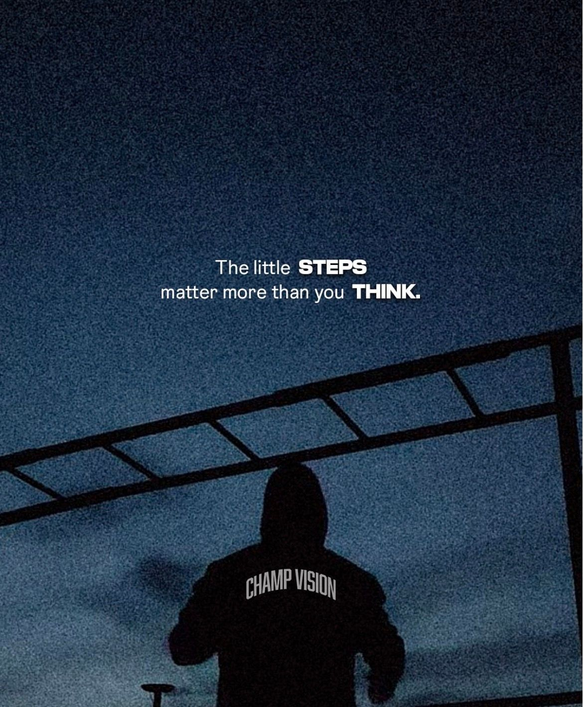
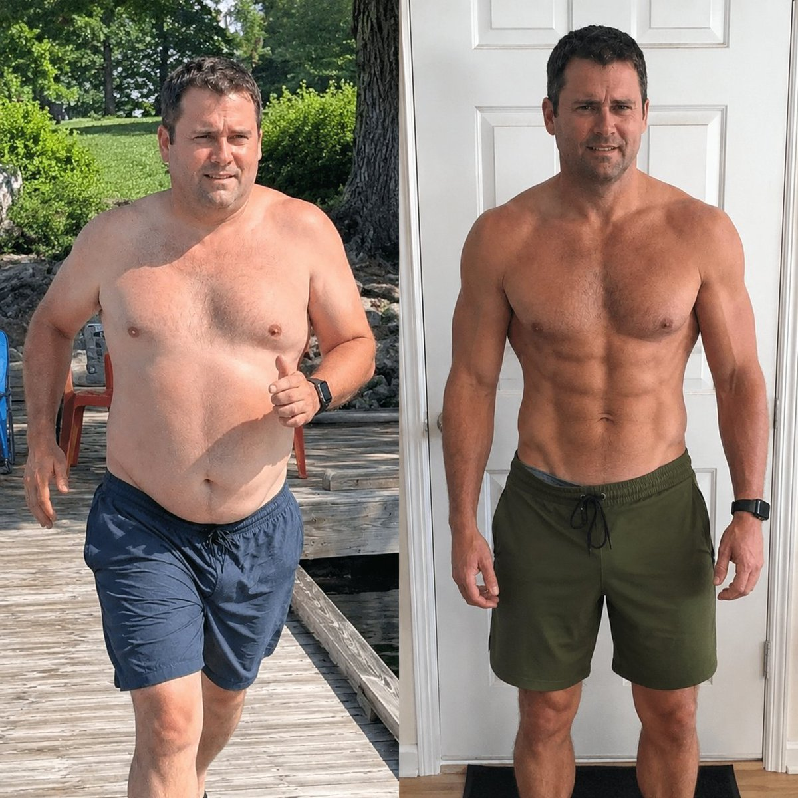
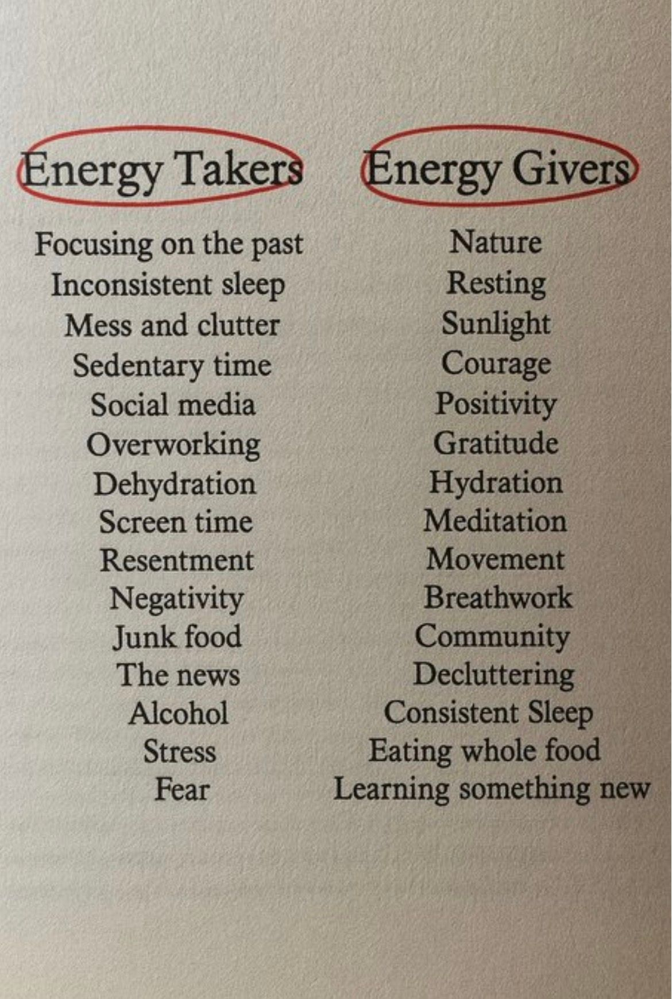
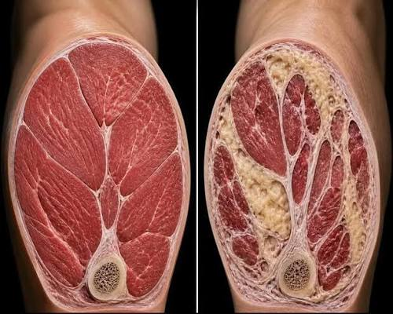
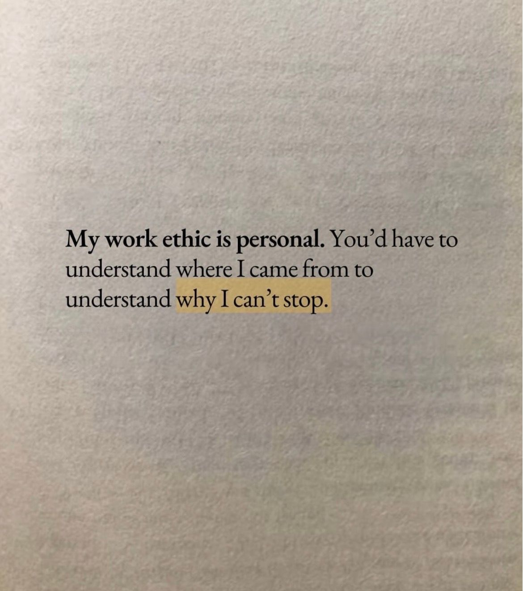

# 🐦 @Wise1Philosophy

## 📅 September 06, 2026

> 29 post(s) archived.

---

### 🕐 11:00 UTC · @Wise1Philosophy

> Brian Chesky says the advice that nearly DESTROYED Airbnb is taught at every business school. &quot;Hire great people and empower them to do their job.&quot; He believed it. Guess what happened when he implemented it? Teams spawned teams. Managers created managers. Soon he had a hundred little divisions running in a hundred directions, drowning in meetings about meetings. The CEO got separated from the product itself. He says great leadership is presence, not absence. You start in the details, build trust, then let go. You do not hand off the thing and hope. — Brian Chesky (.@bchesky), CEO of Airbnb Interested in AI? Follow @AiEvolutio58513 and never fall behind. I track ChatGPT, Claude, and every tool quietly changing how we work and create, then hand you the tested signals. Media

🔗 [View original post](https://x.com/AiEvolutio58513/status/2096554115119886671)

---

### 🕐 10:09 UTC · @Wise1Philosophy

> TAKING MAGNESIUM RIGHT WILL TURN YOU INTO A 13% BODY FAT BEAST: (99% ARE MAKING THESE 3 MISTAKE):

🔗 [View original post](https://x.com/NutritionCorp/status/2096541240783462655)

---

### 🕐 09:58 UTC · @Wise1Philosophy

> Dementia is blood flow. Dementia is cholesterol. Dementia is preventable close to half the time. 8 simple rules to protect your brain: 1. Floss your teeth

🔗 [View original post](https://x.com/_Gut_Laboratory/status/2096538502775349560)

---

### 🕐 09:46 UTC · @Wise1Philosophy

> A heart surgeon told me something that shocked me: “There are 3 types of people who don&apos;t get heart attacks.” 1. Don&apos;t go to the toilet at 3 AM

🔗 [View original post](https://x.com/CoachWillStone/status/2096535603458543718)

---

### 🕐 09:30 UTC · @Wise1Philosophy

🔗 [View original post](https://x.com/Ant_Philosophy/status/2096531433594540082)

---

### 🕐 08:30 UTC · @Wise1Philosophy

🔗 [View original post](https://x.com/Mindsthatbuild/status/2096516277086876133)

---

### 🕐 08:00 UTC · @Wise1Philosophy

🔗 [View original post](https://x.com/Wise1Philosophy/status/2096508917018657129)

---

### 🕐 07:53 UTC · @Wise1Philosophy

> Heart attack = blood sugar. Heart attack = insulin resistance. Heart attack = No. 1 cause of death on Earth. Here is the simple fix to protect your heart: 1. Do not go pee at 3am Media

🔗 [View original post](https://x.com/TinaaDeJong/status/2096506958555894145)

---

### 🕐 07:47 UTC · @Wise1Philosophy

> Someone who lost 19 kilos wrote out the rules that got them there. Most of them are free. Here are the ones that survive scrutiny: 1. Walk on an incline instead of running

🔗 [View original post](https://x.com/Sophiaz6xo/status/2096505435251753377)

---

### 🕐 07:40 UTC · @Wise1Philosophy

> If you want to avoid clots, strokes and heart attacks, especially past 40, here are the 8 things worth paying attention to: 1. Waking at 3 AM with a pounding heart

🔗 [View original post](https://x.com/RasmusNorbergg/status/2096503668388602261)

---

### 🕐 07:30 UTC · @Wise1Philosophy

🔗 [View original post](https://x.com/Daily__wisdom_/status/2096501181476388923)

---

### 🕐 07:29 UTC · @Wise1Philosophy

> A heart surgeon shocked me when he said: &quot;You age because your body stops making CoQ10. Without it, your energy crashes, your heart works harder, and your skin ages faster.&quot; Here&apos;s the 5-step protocol to rebuild it naturally: 1. Never take your first meal fat-free

🔗 [View original post](https://x.com/RafaelNasriX/status/2096500900315775452)

---

### 🕐 07:26 UTC · @Wise1Philosophy

> A heart doctor once admitted there are 3 types of people who never get heart attacks. 1. The ones who don&apos;t go pee at 3am Media

🔗 [View original post](https://x.com/MarkoSilva291/status/2096500163338797111)

---

### 🕐 07:20 UTC · @Wise1Philosophy

> ELON MUSK JUST SAID YOU HAVE 10 YEARS LEFT TO MAKE MONEY SELLING YOUR WORK. After that, AI handles the tasks. Paying someone by the hour stops making sense. The 200-year system of trading time for money is over. Most people are ignoring this. They&apos;re still building careers around selling hours. Meanwhile, the biggest wealth transfer in history is starting. The question isn&apos;t whether this happens. It&apos;s whether you&apos;re positioning yourself now or getting left behind. Media

🔗 [View original post](https://x.com/kumud_deepali/status/2096498742396649978)

---

### 🕐 07:08 UTC · @Wise1Philosophy

> Muscle at 25 is dense. Muscle at 55 is unhealthy muscle with fat marbled through it like a ribeye. It is called myosteatosis, and for many people it is already happening. Here is what it is and how to fix it: 1. Myosteatosis

🔗 [View original post](https://x.com/MagnusLindbrg/status/2096495619376591193)

---

### 🕐 07:00 UTC · @Wise1Philosophy

🔗 [View original post](https://x.com/apex_mentality_/status/2096493758791430527)

---

### 🕐 06:57 UTC · @Wise1Philosophy

> 4 supplements I&apos;m getting my father to take, six months after his scare: 1. Vitamin D3 with K2. You should take it, your friends should take it, your parents should take it. One softgel with a meal, never D3 alone.

🔗 [View original post](https://x.com/CoachLucHerrera/status/2096492848103424298)

---

### 🕐 06:56 UTC · @Wise1Philosophy

> A Harvard researcher has spent decades taking aging apart inside his lab. He argues aging is a disease, not an inevitability. Here are 8 &quot;normal&quot; habits that are quietly speeding up how fast you age: 1. Eating all day long Media

🔗 [View original post](https://x.com/mind_and_beauty/status/2096492620092682268)

---

### 🕐 06:50 UTC · @Wise1Philosophy

> There is no food that removes fat from one part of your body. There are foods that change the conditions that put it there, which is a different and more useful question: 1. Fibrous vegetables, in quantity

🔗 [View original post](https://x.com/HeyKimChong/status/2096491093017919780)

---

### 🕐 06:40 UTC · @Wise1Philosophy

> If you can&apos;t focus, it&apos;s cortisol. If you can&apos;t sleep, it&apos;s cortisol. If you can&apos;t lose weight, it&apos;s cortisol. Here is how to work on all three at once: 1. No food 3 hours before bed Media

🔗 [View original post](https://x.com/CoachJulianNiko/status/2096488587625955702)

---

### 🕐 06:38 UTC · @Wise1Philosophy

> Alzheimer&apos;s brains hold up to 20x more plastic than healthy ones. A researcher named 6 things aging your brain that you think are protecting it. The worst one is something you probably use every day: 1. Chewing gum Media

🔗 [View original post](https://x.com/JasperKasparov/status/2096488094195421598)

---

### 🕐 06:31 UTC · @Wise1Philosophy

> A Harvard study followed people for roughly forty years to find out what actually predicts who is still well at eighty. It was not cholesterol, weight or income: 1. It was their relationships Media

🔗 [View original post](https://x.com/IranaJasmin/status/2096486331463643235)

---

### 🕐 06:30 UTC · @Wise1Philosophy

🔗 [View original post](https://x.com/yeti_mind/status/2096486097354109306)

---

### 🕐 06:20 UTC · @Wise1Philosophy

> Visceral fat is the kind that sits around your organs rather than under your skin, and it is the kind that matters. Seven things that actually shift it: 1. Stop the constant insulin spikes Media

🔗 [View original post](https://x.com/HeyEleanorr/status/2096483562866516276)

---

### 🕐 06:08 UTC · @Wise1Philosophy

> Your resting heart rate tells the whole story. 95+ bpm, the heart is strained just to keep you alive. 90 bpm, sedentary and stressed. 80 bpm, the modern average. 1. What the numbers mean

🔗 [View original post](https://x.com/ClaraBrooksjz/status/2096480516052783378)

---

### 🕐 06:00 UTC · @Wise1Philosophy

🔗 [View original post](https://x.com/Life__Mastery/status/2096478599117156710)

---

### 🕐 06:00 UTC · @Wise1Philosophy

> The 4 supplements I&apos;m getting my aging parents onto: 1. Creatine Media

🔗 [View original post](https://x.com/yourcamilavega/status/2096478536781730196)

---

### 🕐 01:30 UTC · @Wise1Philosophy

🔗 [View original post](https://x.com/Ant_Philosophy/status/2096410583209816421)

---

### 🕐 00:45 UTC · @Wise1Philosophy

> Recurrence was a fringe position in June 2025. Sapient shipped HRM anyway. Then open-sourced HRM-Text in May before looped latent layers were part of any frontier conversation. Committing publicly to an architecture a year before the field agrees with you is the hard part. And shipping it with the training code is the rare part. Excited to see the conversation around OpenAI’s Astra bringing recurrent architectures into the frontier spotlight. At Sapient, recurrence has been central to our vision from day one. We introduced HRM in June 2025 and open-sourced HRM-Text this May. It’s encouraging to see a dir…

🔗 [View original post](https://x.com/rezkhere/status/2096399231351492993)

---
