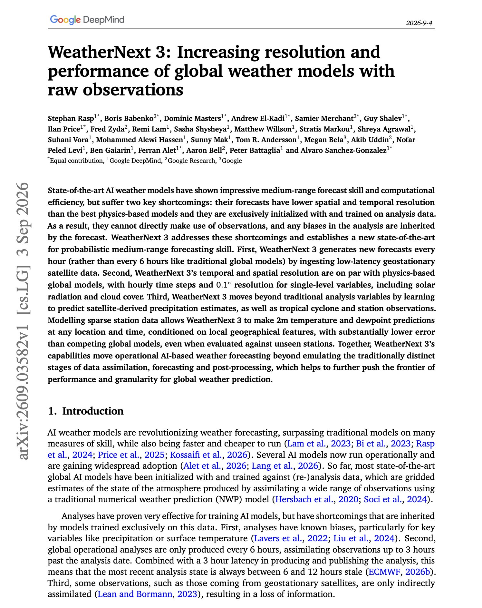
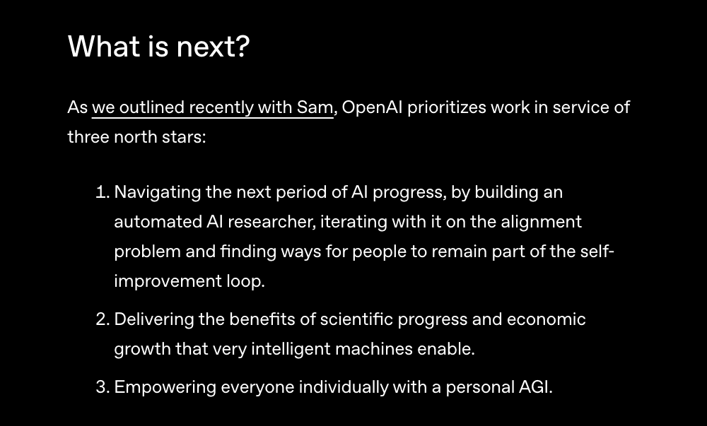

# 🐦 @dair_ai

## 📅 September 06, 2026

> 4 post(s) archived.

---

### 🕐 18:10 UTC · @dair_ai

> Try prompting GPT-6 Astra to self-analyze. It generated this beautiful animated self-portrait. It&apos;s like a window into its &quot;mind&quot; and how it works. Media

🔗 [View original post](https://x.com/omarsar0/status/2096662297707954398)

---

### 🕐 17:00 UTC · @dair_ai

> Banger paper from Google DeepMind. Every AI weather model so far has been trained and initialized on analysis data, which is itself the output of another model. That means the forecast inherits whatever biases the analysis carries, and it cannot use a new satellite observation directly. WeatherNext 3 changes what the model is trained on. It ingests low-latency geostationary satellite data and refreshes its forecast every hour instead of every six. Resolution now matches the best physics-based global models at 0.1 degree with hourly steps, including solar radiation and cloud cover. It also learns targets that live in observation space rather than analysis space. Satellite-derived precipitation, tropical cyclone tracks, and station observations are all predicted directly. Because it models sparse station data conditioned on local geography, it gives 2m temperature and dewpoint at any location and time, with substantially lower error than competing global models. The result is a new state of the art for probabilistic medium-range forecast skill. Why does it matter? The convenient training label in many domains is itself a model output, and inheriting its bias is the price. Moving supervision to raw observations is the general lesson here, and weather is where it can be measured cleanly. Paper: https://arxiv.org/abs/2609.03582 Chat with Paper: https://academy.dair.ai/papers/weathernext-3-increasing-resolution-and-performance-of-global-weather-models-wit-2609.03582

🔗 [View original post](https://x.com/dair_ai/status/2096644646780973297)

---

### 🕐 16:47 UTC · @dair_ai

> OpenAI just published its North Stars. All eyes are on recursive self-improvement (RSI), including self-improving research agents and personal AGI.

🔗 [View original post](https://x.com/omarsar0/status/2096641382110707850)

---

### 🕐 15:13 UTC · @dair_ai

> https://x.com/i/article/2096617303903191042

🔗 [View original post](https://x.com/dair_ai/status/2096617880515211328)

---
