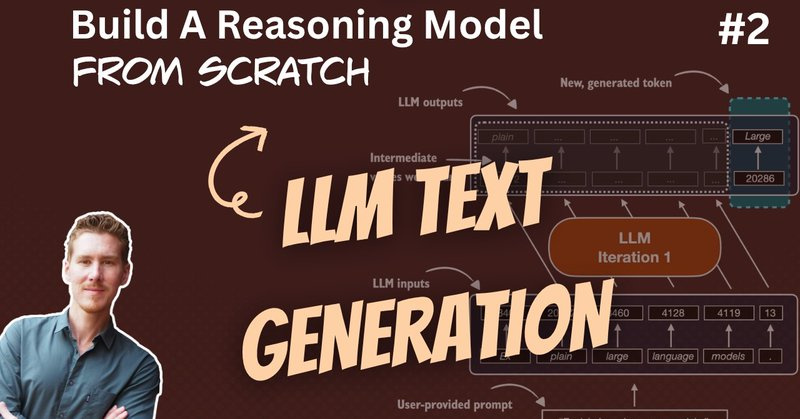

# 🐦 @rasbt

## 📅 September 06, 2026

> 2 post(s) archived.

---

### 🕐 13:48 UTC · @rasbt

> And here&apos;s the YouTube version: https://youtu.be/BJua0yjO5dk

🔗 [View original post](https://x.com/rasbt/status/2096596377845346381)

---

### 🕐 13:48 UTC · @rasbt

> Reasoning from scratch round 2: In this video, I cover the text generation process in LLMs and KV caching (to prepare the base model before adding reasoning techniques in the upcoming ones). 00:00 Introduction and reasoning model demo 01:55 How to work through the book 05:00 Chapter 2 overview 08:25 Checking PyTorch and hardware support 10:26 Apple silicon and MPS caveats 15:00 Cloud GPU options 16:08 Tokens and tokenization 18:20 Qwen3 and the Reasoning From Scratch package 23:05 Encoding and decoding text 26:24 Downloading weights and selecting a device 31:01 Loading the pretrained Qwen3 model 34:32 How LLMs generate text 36:47 Input tensors and batch dimensions 41:48 Running the model in inference mode 44:11 Logits and next-token predictions 49:21 Greedy decoding with argmax 52:28 Building a streaming text generator 01:01:28 Generating text and handling end-of-sequence tokens 01:06:00 Benchmarking text generation 01:14:34 How KV caching works 01:17:22 Adding KV caching and measuring the speedup 01:24:31 Model compilation with torch.compile 01:30:33 Combining compilation with KV caching 01:32:53 Comparing CPU and GPU performance 01:35:32 Recap and next steps Media

🔗 [View original post](https://x.com/rasbt/status/2096596372661113294)

---
