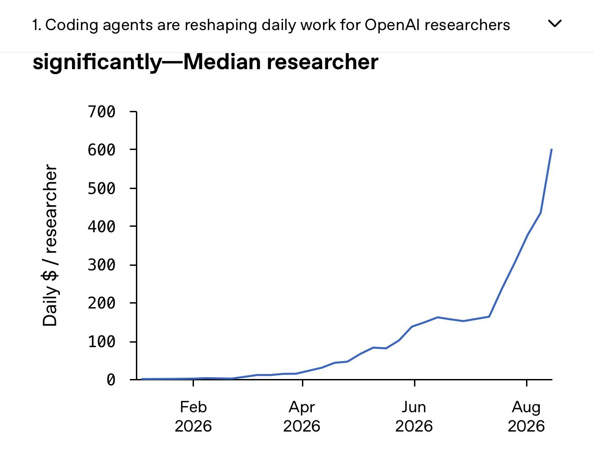

# 🐦 @simonw

## 📅 September 06, 2026

> 2 post(s) archived.

---

### 🕐 17:10 UTC · @simonw

> Interesting details in here about how OpenAI researchers are using coding agents I&apos;d love to know what caused the huge uptick in token spend in mid-July, was that when Astra became available to employees? Today we&apos;re releasing data on models accelerating research at OpenAI. Recursive self-improvement could be the most important contributor to AI capabilities over the next few years, but by default it will only be seen inside a few frontier AI labs. Being transparent is more urgent…

🔗 [View original post](https://x.com/simonw/status/2096647325049626918)

---

### 🕐 01:02 UTC · @simonw

> Me: show me a pelican riding a bicycle Astra: Media

🔗 [View original post](https://x.com/gabrielchua/status/2096403701862961161)

---
