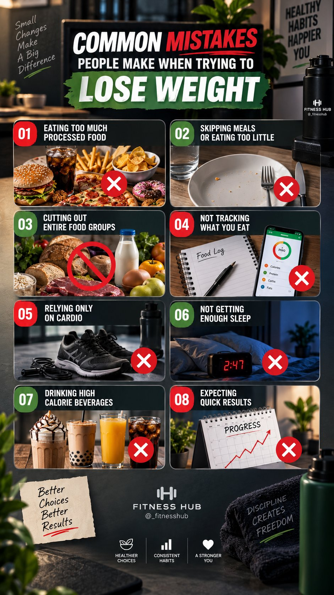
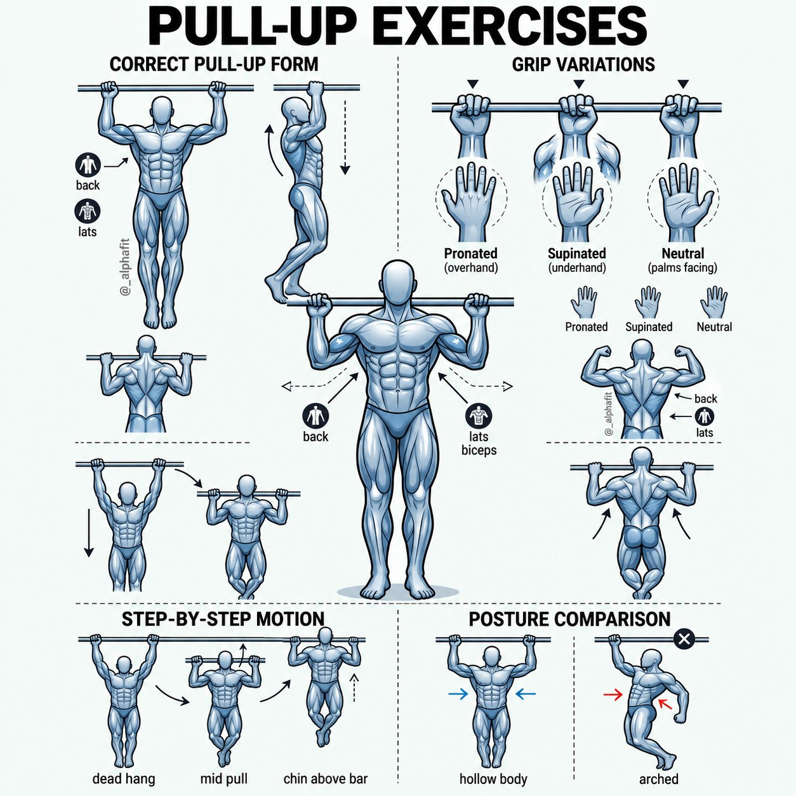
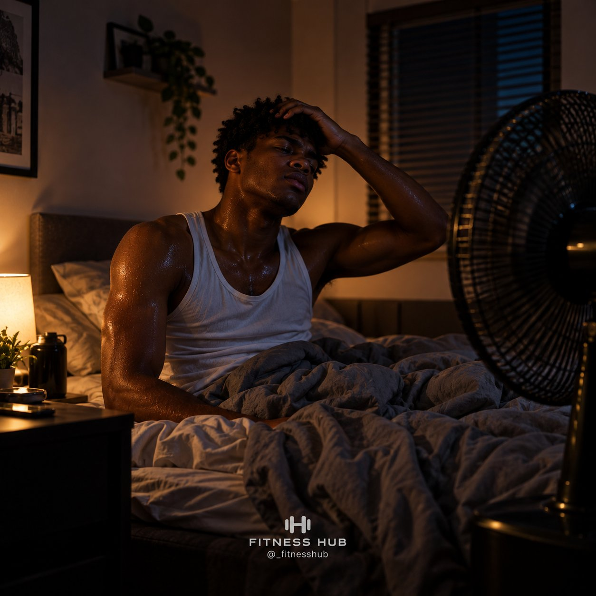
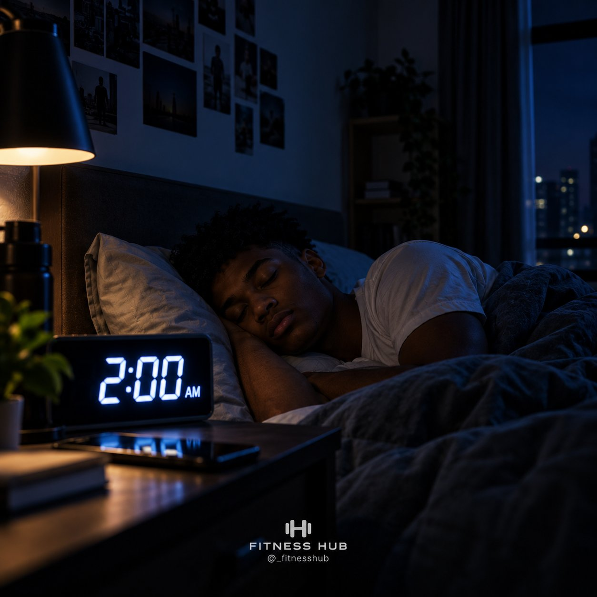
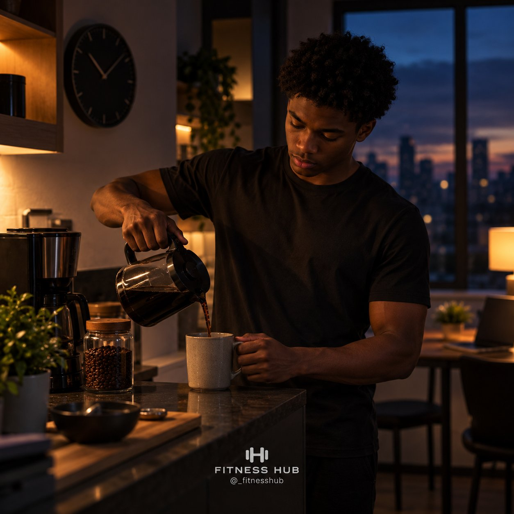
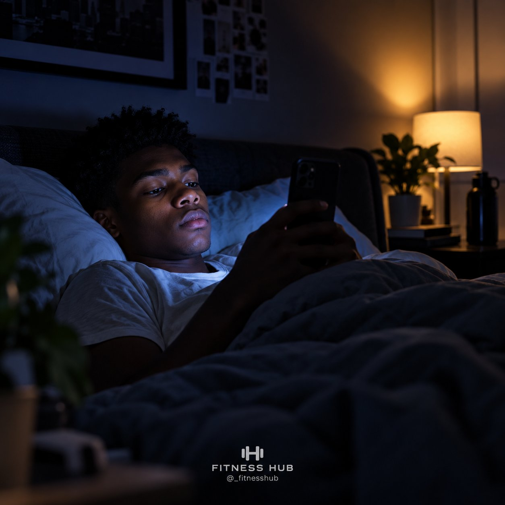
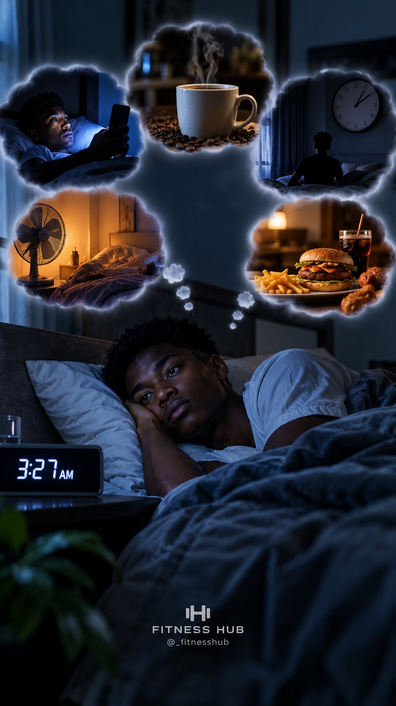

# 🐦 @Unlockyourlife_

## 📅 September 07, 2026

> 21 post(s) archived.

---

### 🕐 12:14 UTC · @Unlockyourlife_

> A simple plumbing repair trick that few people know! Media

🔗 [View original post](https://x.com/Smart_Tipsx/status/2096935096146182160)

---

### 🕐 12:10 UTC · @Unlockyourlife_

> Wood carving that turned out to be so beautiful 🪵 Media

🔗 [View original post](https://x.com/samx_reels/status/2096934249752391924)

---

### 🕐 12:04 UTC · @Unlockyourlife_

> Amazing Car Tips You will love! Media

🔗 [View original post](https://x.com/_Brainboxx/status/2096932551881294218)

---

### 🕐 11:02 UTC · @Unlockyourlife_

> Weight loss mistakes nobody warns you about. 🧵

🔗 [View original post](https://x.com/_fitnesshub/status/2096917109892620539)

---

### 🕐 10:53 UTC · @Unlockyourlife_

> What&apos;s your best Gravy.

🔗 [View original post](https://x.com/Elitedelicacy/status/2096914873498108273)

---

### 🕐 10:52 UTC · @Unlockyourlife_

> Colors Of Mucus.

🔗 [View original post](https://x.com/BioLifex/status/2096914612243321049)

---

### 🕐 10:52 UTC · @Unlockyourlife_

> Pull-Up Exercises.

🔗 [View original post](https://x.com/_alphafit/status/2096914419821244432)

---

### 🕐 09:17 UTC · @Unlockyourlife_

> Here&apos;s what to do if your brake fail while driving Media

🔗 [View original post](https://x.com/_learnskills/status/2096890485058969843)

---

### 🕐 08:26 UTC · @Unlockyourlife_

> Do this every morning for better health: • Hydrate before anything else • Get some natural light early • Move your body, however you can • Eat something with real nutrition • Ease into the day before screens • Take a moment to breathe or think clearly • Set an intention for the day • Avoid rushing straight into stress • Stretch out any stiffness • Check in with how you&apos;re feeling • Plan your top priority for the day Small habits shape how your whole day goes.

🔗 [View original post](https://x.com/FitnessDr_/status/2096877814746075617)

---

### 🕐 08:15 UTC · @Unlockyourlife_

> You don&apos;t need more motivation. You need fewer negotiations with yourself. 🔵 Decide priorities the night before. 🔵 Make important habits obvious. 🔵 Remove easy distractions. 🔵 Start smaller than your ego wants. 🔵 Use routines for repetitive tasks. 🔵 Track what actually matters. 🔵 Expect imperfect days. 🔵 Never miss twice if you can help it. 🔵 Make your environment support your goals. 🔵 Keep going after motivation disappears.

🔗 [View original post](https://x.com/Masculinjournal/status/2096874999684456642)

---

### 🕐 08:01 UTC · @Unlockyourlife_

> GOOD SLEEP ISN’T JUST ABOUT SPENDING MORE HOURS IN BED. Your habits, environment and routine can all determine how easily you fall asleep and how well your body actually recovers during the night. Fix the small things consistently, and your sleep can improve more than you expect. 😴

🔗 [View original post](https://x.com/_fitnesshub/status/2096871515148992586)

---

### 🕐 08:01 UTC · @Unlockyourlife_

> 5. EATING HEAVY MEALS RIGHT BEFORE BED 🍔 A huge meal right before sleeping can leave your digestive system working overtime. It may cause discomfort, bloating or heartburn and make it harder to get comfortable. Try giving yourself some time between your last heavy meal and bedtime.

🔗 [View original post](https://x.com/_fitnesshub/status/2096871511181201715)

---

### 🕐 08:01 UTC · @Unlockyourlife_

> 4. YOUR ROOM IS TOO HOT 🥵 Your body naturally lowers its temperature as you prepare for sleep. A hot, stuffy room can make it harder to fall asleep and can cause you to wake up more throughout the night. Keep your bedroom cool, comfortable and well-ventilated.

🔗 [View original post](https://x.com/_fitnesshub/status/2096871504730366279)

---

### 🕐 08:01 UTC · @Unlockyourlife_

> 3. SLEEPING AT COMPLETELY RANDOM TIMES ⏰ Going to bed at 10 PM one night, 2 AM the next and 11 PM after that can throw off your body clock. Your body works best when your sleep and wake times are relatively consistent. A regular sleep schedule can make falling asleep and waking up easier.

🔗 [View original post](https://x.com/_fitnesshub/status/2096871499466510669)

---

### 🕐 08:01 UTC · @Unlockyourlife_

> 2. CAFFEINE TOO LATE IN THE DAY ☕ That afternoon or evening coffee might feel harmless, but caffeine can stay in your system for hours. Even if you manage to fall asleep, late caffeine can reduce your sleep quality and make your sleep less restful. If you’re sensitive to caffeine, avoid it later in the day.

🔗 [View original post](https://x.com/_fitnesshub/status/2096871493086953588)

---

### 🕐 08:01 UTC · @Unlockyourlife_

> 1. USING YOUR PHONE RIGHT BEFORE BED 📱 Scrolling through TikTok, X, Instagram or watching videos keeps your brain stimulated when it should be winding down. The light from your screen can also interfere with your body’s natural sleep signals, making it harder to fall asleep. Try putting your phone away 30–60 minutes before bed.

🔗 [View original post](https://x.com/_fitnesshub/status/2096871487756026203)

---

### 🕐 08:01 UTC · @Unlockyourlife_

> 🧵 5 THINGS SECRETLY RUINING YOUR SLEEP You might be getting into bed for 7–8 hours every night, but still waking up tired. Sometimes, the problem isn’t how long you sleep — it’s what you’re doing before and during those hours. Here are 5 things that could be quietly messing with your sleep:

🔗 [View original post](https://x.com/_fitnesshub/status/2096871482949320855)

---

### 🕐 06:48 UTC · @Unlockyourlife_

> From Weeds to Powerful Charcoal! Media

🔗 [View original post](https://x.com/sciencepathx/status/2096853098182427044)

---

### 🕐 06:44 UTC · @Unlockyourlife_

> Turn charcoal into a powerful fire starter 🔥 Media

🔗 [View original post](https://x.com/Smart_Tipsx/status/2096851983026049396)

---

### 🕐 06:40 UTC · @Unlockyourlife_

> Amazing Tile Design you would love to try! Media

🔗 [View original post](https://x.com/samx_reels/status/2096851127249609024)

---

### 🕐 06:34 UTC · @Unlockyourlife_

> Before your next ride, check out these handy bike tricks! 🚲🛠️ Media

🔗 [View original post](https://x.com/_Brainboxx/status/2096849494671241344)

---
