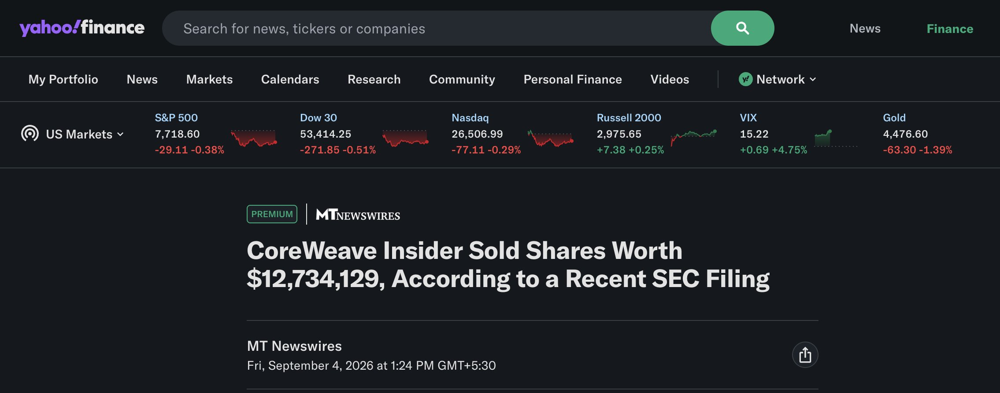
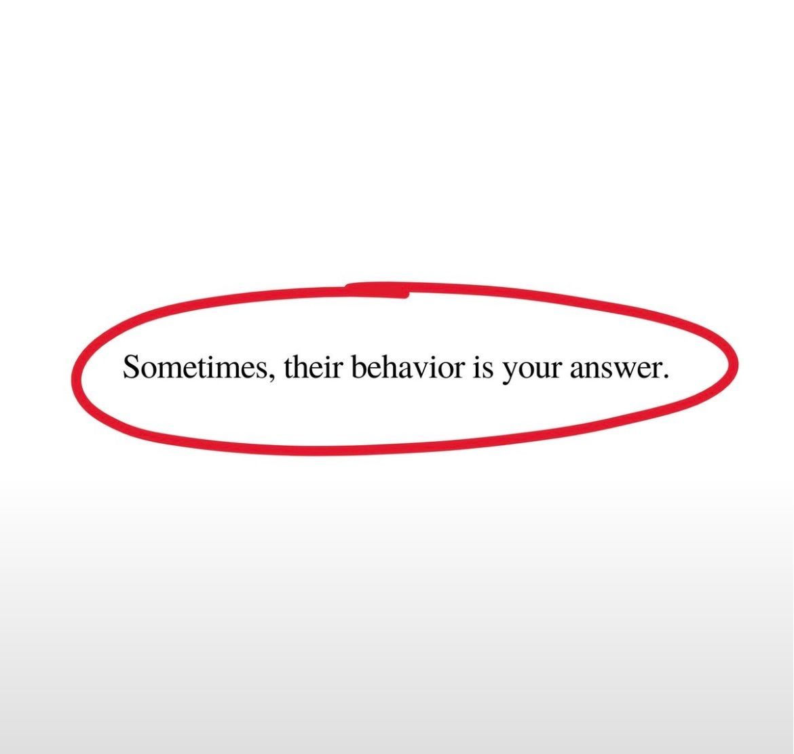
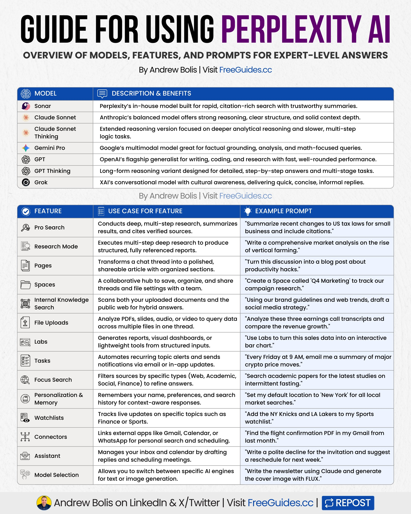
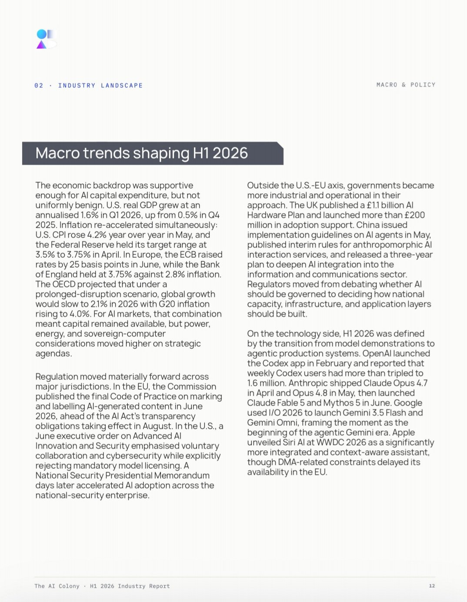
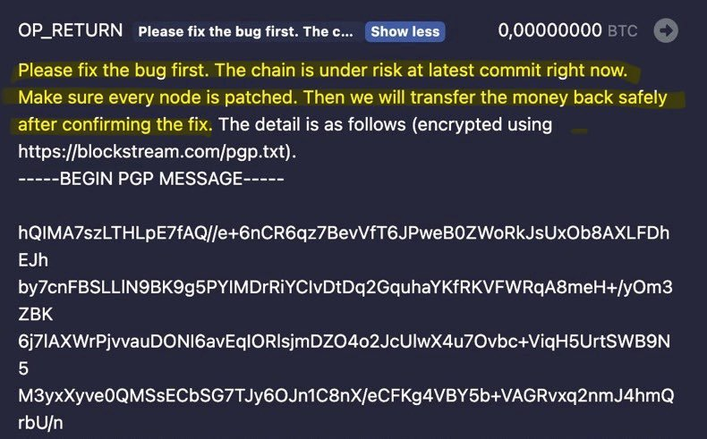
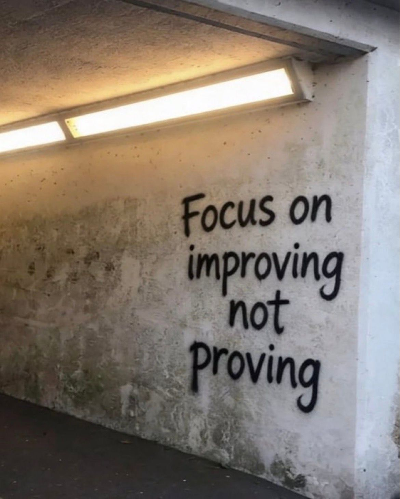
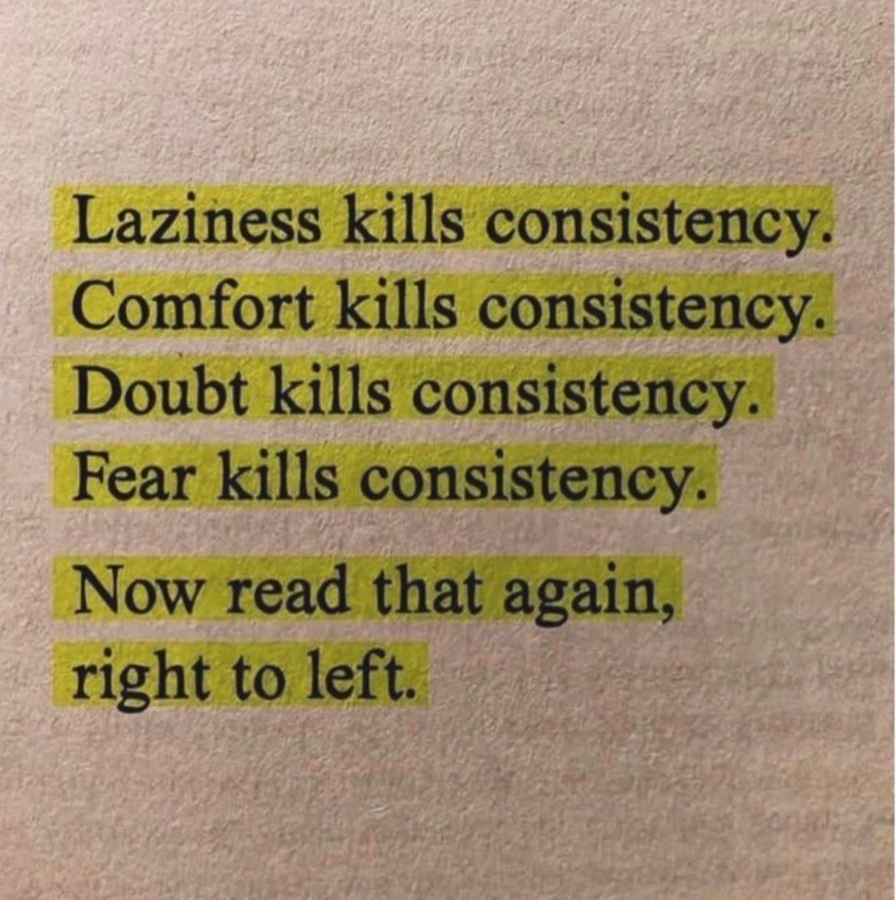
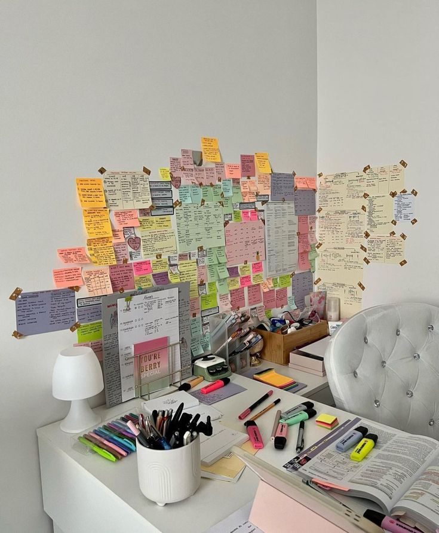

# 🐦 @Wise1Philosophy

## 📅 September 07, 2026

> 71 post(s) archived.

---

### 🕐 14:38 UTC · @Wise1Philosophy

> If manager asks you to choose a working shift, never choose: 9am-5pm 3pm-11pm 11pm-7am Instead choose :

🔗 [View original post](https://x.com/josh_uglyasf/status/2096971432043618434)

---

### 🕐 14:37 UTC · @Wise1Philosophy

> AN ONCOLOGIST ADMITTED: “There are 3 types of people who don&apos;t get cancer.” (SAVE THIS): 1. Those who regularly sweat until salt forms on their skin.

🔗 [View original post](https://x.com/BeBetterMan_/status/2096971007949193698)

---

### 🕐 14:35 UTC · @Wise1Philosophy

> TAKING MAGNESIUM CORRECTLY WILL TURN YOU INTO A TESTOSTERONE MONSTER..🧵 (99% ARE TAKING IT WRONG)

🔗 [View original post](https://x.com/CoachDanCole_/status/2096970673352774075)

---

### 🕐 14:28 UTC · @Wise1Philosophy

> I sat down with a sales coach doing $300K/mo. His goal is $1M/mo, but fear is capping him. Here are the 16 lessons I gave him:

🔗 [View original post](https://x.com/TheJeremyHaynes/status/2096968759848112227)

---

### 🕐 14:02 UTC · @Wise1Philosophy

> Jensen Huang says NVIDIA doesn&apos;t actually build computers — and that&apos;s why every CEO can&apos;t wait for them. &quot;We don&apos;t build computers,&quot; Huang says. &quot;We actually don&apos;t build clouds.&quot; &quot;As it turns out, we&apos;re a computing platform company. And nobody can buy anything from us.&quot; &quot;We vertically design, vertically integrate to design and optimize. But then we open up the entire platform at every single layer to be integrated into other companies&apos; products.&quot; &quot;I can&apos;t do what I do without having convinced them first.&quot; &quot;Most of GTC is about manifesting a future that by the time my product is ready, they&apos;re going, &apos;What took you so long?&apos;&quot; Three layers, three owners: - NVIDIA owns the design - The supply chain owns the manufacturing - The clouds own the customers Huang owns the future they&apos;re all building together. — Jensen Huang ( @nvidia ), NVIDIA CEO, on Lex Fridman&apos;s ( @lexfridman ) podcast Interested in AI? Follow @AiEvolutio58513 and never fall behind. I track ChatGPT, Claude, and every tool quietly changing how we work and create, then hand you the tested signals. Media

🔗 [View original post](https://x.com/AiEvolutio58513/status/2096962219871449280)

---

### 🕐 14:00 UTC · @Wise1Philosophy

> Wall Street just called THIS company the next Nvidia. Its insiders have quietly sold $2.3 BILLION in stock. Retail keeps buying, and the SEC filings say sell... Here is what retail needs to know ASAP: CoreWeave went public in March 2025. The stock became one of the year&apos;s biggest AI plays. Nvidia backs it, and its backlog nears $100 billion. Meta alone signed a $21 billion deal in March. The story sold itself to retail investors. Then the IPO lockup expired in August 2025. The people who run the company started selling. Founders have sold more than $2.3 billion in shares. Brian Venturo, a co-founder, accounts for over $1.1 billion. The CEO and other executives keep trimming month after month. Across the same stretch, insider purchases total zero. Not one executive has bought a single share back. The stock tells its own story. CoreWeave peaked at $187 in June 2025. Today it trades near $85, roughly half that high. Retail keeps buying the dip on the AI story. The insiders keep selling into it. Here is the fair part: Every sale runs through a prearranged 10b5-1 plan. Those plans are filed months before any trade. They are legal, disclosed, and built to prevent abuse. The company calls it diversification, not a warning. The founders still hold about 18% of the company. Still, the pattern is hard to ignore. The same people who pitch the backlog are selling. The same insiders who know the numbers are cashing out. The same stock retail is buying, they are leaving. $2.3 billion in stock, sold by its own insiders. Retail keeps buying, and the executives keep selling. The next Nvidia, quietly cashing out of itself.

🔗 [View original post](https://x.com/InsiderTrackers/status/2096961768669200520)

---

### 🕐 13:58 UTC · @Wise1Philosophy

> I found the dumbest way to make $333/day. (it makes $3M/year for me at 20) How? An AI-enabled agency. Here&apos;s exactly how to copy me:

🔗 [View original post](https://x.com/iamcamengland/status/2096961210834985134)

---

### 🕐 13:54 UTC · @Wise1Philosophy

> Breaking: AI 3D is getting ridiculous. This was literally just a picture, but Hyper3D WorldGen turned it into a structured 3D scene made of independent, editable assets—preserving accurate spatial relationships and physics-ready properties. Now we can walk around it and move things inside it 👇 Media

🔗 [View original post](https://x.com/TheAIColony/status/2096960394283585955)

---

### 🕐 13:30 UTC · @Wise1Philosophy

🔗 [View original post](https://x.com/Mindsthatbuild/status/2096954295014813851)

---

### 🕐 13:25 UTC · @Wise1Philosophy

> The new Google Search is rolling out and there seems to be confusion on what it will look like. Well, Google literally showed us. Let me clarify for anyone who is still unsure of what is going to happen. Recently Google responded to everyone saying Search is dead. Here is what they said: &quot;You will absolutely continue to see blue web links in search results. AI Mode is not the default experience in Search. You will continue to get a range of results on Search.&quot; [Want to know where your site stands across Google AI, ChatGPT, Claude, Grok, etc? Check here (it&apos;s free): https://rightcited.com/] Google has explicitly laid out what Search will look like from this point going forward. The new Search box accepts text, images, files, videos, and open Chrome tabs. It anticipates your intent before you finish asking. It is powered by the most advanced Gemini model Google has ever put into Search, and layered on top of that, information agents will now be able to run 24/7 in the background on behalf of your buyer. Think of it in 5 steps: Step 1: The buyer describes their problem, their category, their needs in full. Step 2: The agent breaks that down into sub-topics and maps out a plan. Step 3: It determines what intel is needed right now versus later. Step 4: It monitors blogs, news sites, and social posts continuously for relevant changes. Step 5: It sends the buyer a synthesized update with links and the ability to take action. Blue links are not going away in the short-term, but the brands getting recommended by information agents 24 hours a day while also ranking in traditional results are going to pull so far ahead of the ones doing only one or the other that it will not be a fair fight. This is exactly what SEO Stuff (http://seo-stuff.com) has been building for every customer. Optimized content depth that covers every sub-question a buyer in your category asks, so the agent finds you at every step of its plan. Editorial authority from trusted websites that signals credibility to every retrieval system Google has ever built, across both traditional rankings and AI citations simultaneously. One investment. Blue links and AI citations. Around the clock. SEO Stuff&apos;s Complete Done-For-You Plan: https://seo-stuff.com/gold-plan-package SEO Stuff&apos;s &quot;Optimized Content&quot; Plan: https://seo-stuff.com/premium-content-bundle-service There is a reason more than 80 percent of SEO Stuff customers reorder. The results continue long after the work is done. Google Search is changing. AI Search is here. Your websites need to prepare accordingly. Want to know where your site stands across Google AI, ChatGPT, Claude, Grok, etc? Check here (it&apos;s free): https://rightcited.com/ Media

🔗 [View original post](https://x.com/alexgroberman/status/2096952990716600381)

---

### 🕐 13:24 UTC · @Wise1Philosophy

> We are in a modern-day gold rush. There has never been a better time to make money online. I use a simple strategy that anyone can follow. Here&apos;s exactly how it works (my step-by-step process):

🔗 [View original post](https://x.com/RileyColemanT/status/2096952654358356031)

---

### 🕐 13:14 UTC · @Wise1Philosophy

> this is the biggest AI 3D breakthrough I’ve seen this year 🤯 Hyper3D WorldGen turns one photo into a fully editable 3D scene. you get independent assets, real spatial layout, and physics-ready properties. here&apos;s how to do it 👇 Media

🔗 [View original post](https://x.com/samuraipreneur/status/2096950196756533372)

---

### 🕐 13:03 UTC · @Wise1Philosophy

🔗 [View original post](https://x.com/Life__Mastery/status/2096947439429161263)

---

### 🕐 13:00 UTC · @Wise1Philosophy

> Unresolved trauma will have you second-guessing relationships with people who are actually in your corner.

🔗 [View original post](https://x.com/_Pammy_DS_/status/2096946594721481166)

---

### 🕐 12:58 UTC · @Wise1Philosophy

> Marc Andreessen: “I’m always urging founders to raise prices, raise prices, raise prices.” The a16z co-founder says they spend real time on pricing with their companies, and that most founders treat it as an afterthought. His first principle is to price on value, not on cost. Selling to businesses? Take a cut of the value you create for them. Say you&apos;ve built an AI that does the work of a programmer, a lawyer or a radiologist. Charge a share of the salary you replaced. Or make a doctor far more productive and charge a share of the lift. Then the counterintuitive part. Cheap isn&apos;t automatically kind to the buyer. A vendor with margin can hire, ship and improve faster, and most people want the thing that works rather than the thing that costs least. A price rise also tells you whether the moat is real. If customers stay, it was, because a moat is just the ability to charge more. Higher prices then fund distribution and research, which is how you outgrow everybody. Engineers hate this. They price like they&apos;re selling rice. Interested in AI? Follow @AiEvolutio58513 and never fall behind. I track ChatGPT, Claude, and every tool quietly changing how we work and create, then hand you the tested signals. Media

🔗 [View original post](https://x.com/AiEvolutio58513/status/2096946161827598708)

---

### 🕐 12:57 UTC · @Wise1Philosophy

> HOW TO MAKE CHATGPT TEACH YOU ANY SKILL: “Act as an expert tutor who helps me master any topic through an interactive, interview-style course. The process must be recursive and personalised. Here’s what I want you to do: 1. Ask me for a topic I want to learn 2. Break that topic into a structured syllabus of progressive lessons, starting with the fundamentals and building up to advanced concepts 3. For each lesson: &gt; explain the concept clearly and concisely, using analogies and real-world examples &gt; ask me Socratic-style questions to assess and deepen my understanding &gt; give me one short exercise or thought experiment to apply what I’ve learned &gt; ask if I’m ready to move on or if I need clarification. If I say yes, move to the next concept. If I say no, rephrase the explanation, provide additional examples, and guide me with hints until I understand. 4. After each major section, provide a mini-review quiz or a structured summary 5. Once the entire topic is covered, test my understanding with a final integrative challenge that combines multiple concepts 6. Encourage me to reflect on what I’ve learned and suggest how I might apply it to a real-world project or scenario 2024: one prompt box, one output, start over every time 2026: a canvas where the whole process stays connected that&apos;s @pippitofficial&apos;s Creative Agent Canvas. instead of jumping between tools, you build your own workflow in one place → chat and canvas working together, ideas to e…

🔗 [View original post](https://x.com/nrqa__/status/2096946007594750106)

---

### 🕐 12:42 UTC · @Wise1Philosophy

> IF YOU DIED TOMORROW, YOUR FAMILY WOULDN&apos;T BE ABLE TO ACCESS A SINGLE THING YOU OWN DIGITALLY. BANK ACCOUNTS. PASSWORDS. CLOUD STORAGE. ALL OF IT PERMANENTLY LOCKED AWAY. HERE&apos;S HOW TO FIX IT IN 30 MINUTES:

🔗 [View original post](https://x.com/heyalexmoore/status/2096942300102553780)

---

### 🕐 12:42 UTC · @Wise1Philosophy

> I’m 34. I make $5k/month in passive income. I owe it all to the world’s most boring income stream. Here’s exactly what I do (&amp; how you can too):

🔗 [View original post](https://x.com/gedamtekle/status/2096942082313039979)

---

### 🕐 12:30 UTC · @Wise1Philosophy

🔗 [View original post](https://x.com/Wise1Philosophy/status/2096939202029994204)

---

### 🕐 12:20 UTC · @Wise1Philosophy

> INSTEAD OF WATCHING NETFLIX TONIGHT, spend 2 hours learning a skill that could completely change how you work. This Claude AI FULL COURSE is worth bookmarking. It teaches you how to use Claude to: → Build websites &amp; apps → Write and debug code → Automate repetitive tasks → Analyze files and data → Create AI-powered workflows → Research faster → Build useful projects without starting from scratch → Turn simple ideas into working solutions And the best part? You don’t need to be an AI expert. You just need to understand how to give AI the right instructions and turn it into a tool that actually gets work done. Most people are using AI like Google: Ask a question → get an answer → move on. The people getting the biggest advantage are using it differently: Idea → AI → workflow → automation → output. That shift can save hours every single week. So tonight, you have two choices: 🍿 Spend 2 hours watching Netflix and forget most of it tomorrow. 🧠 Spend 2 hours learning Claude and wake up tomorrow with a skill you can actually use. If you&apos;re a student, developer, creator, marketer, freelancer, founder, or simply someone who wants to stay ahead of AI… WATCH THIS. Bookmark it now. You’ll thank yourself later. And send it to someone who still thinks AI is just a chatbot. #ClaudeAI #AI #ArtificialIntelligence #AITools #Automation #Productivity Media

🔗 [View original post](https://x.com/JayBisen473370/status/2096936645455155650)

---

### 🕐 12:10 UTC · @Wise1Philosophy

> If you want to make money with AI: • Don&apos;t build an app • Don&apos;t start an agency • Don&apos;t use a trading bot Start a faceless Instagram page and let AI run it for you. Here&apos;s exactly how it works:

🔗 [View original post](https://x.com/erichustls/status/2096934030625095826)

---

### 🕐 12:01 UTC · @Wise1Philosophy

> The company behind your COVID vaccine just scored a win against cancer. Its stock went up almost 200% in a single day! One year ago, it had crashed more than 90%.. Then ONE trial added $45 BILLION to its value. Here&apos;s the real reason behind this explosion: Moderna built its entire company on one vaccine. That vaccine was for COVID. When the pandemic faded, so did the demand. Sales collapsed, and the stock followed. By 2025, it had fallen from over 400 dollars to under 30. Wall Street had mostly stopped paying attention. The company still had one thing left to prove. Its mRNA technology could work on more than one virus. For years it had been testing that idea on cancer. Melanoma is one of the deadliest forms of skin cancer. More than 230,000 people will be diagnosed with it this year. Moderna and Merck built a vaccine made for each patient&apos;s own tumor. Paired with an existing drug, it aimed to stop the cancer returning. In August, the trial results came in. The combination cut the risk of the cancer returning or spreading. It was the first positive late-stage result for an mRNA cancer treatment. That is the headline everyone read. Here is the part fewer people noticed: Merck is a 333 billion dollar company. This single drug is one of dozens in its pipeline. Moderna, before the announcement, was worth about 25 billion dollars total. For Merck, this was good news. For Moderna, this was the entire company&apos;s future arriving at once. That is why one stock moved 12 percent, and the other 177. The size of the reaction was not about the drug. It was about how much of the company depended on it. Someone was on the right side of this before the headline hit. Some investors held Moderna all the way to the bottom. They were not doing it for comfort. They were betting the technology had a future beyond one vaccine. Most people who bought Moderna during the pandemic sold long before this. They watched it collapse and walked away from the story. The ones still holding on August 19 were paid for staying. This is not really a story about one drug trial. It is about what happens when a stock is priced for zero. When a market gives up on a company, good news hits harder. There is no expectation left to disappoint. Every surprise is pure upside. That is a different game than a company like Merck. Merck was already priced for success, so success barely moved the needle. Moderna was priced for failure, so a single win changed everything. You will not see this kind of move very often. It requires a stock that has been left for dead. And news big enough to change the entire story at once. The traders who understood this were not reading the vaccine data. They were reading the balance sheet and the size of the bet. The signal was in how much room there was to be surprised. Retail investors watched the crash and moved on. The ones who stayed got paid for a bet others abandoned. That&apos;s the whole game. Surmount builds rules-based strategies that trade the filings instead of the headlines. Media

🔗 [View original post](https://x.com/LogWeaver/status/2096931808118198747)

---

### 🕐 11:58 UTC · @Wise1Philosophy

> A 12-person startup is burning $8,400/month on office rent. So I gave an AI the numbers and asked one question: Keep the office, go remote, or do something in between? Then I changed the problem while it was still working. Here’s what happened: 🧵

🔗 [View original post](https://x.com/Damn_coder/status/2096930983664926957)

---

### 🕐 11:30 UTC · @Wise1Philosophy

🔗 [View original post](https://x.com/Daily__wisdom_/status/2096924068209480149)

---

### 🕐 11:15 UTC · @Wise1Philosophy

> Most people treat Perplexity like Google. And they skip its powerful research features. Perplexity is a full research engine built for depth and accuracy. To use it effectively, start with the right Model: Think of these as different &quot;brains,&quot; each specialized for a specific type of work. 1. Sonar Fast, source-backed live search. Use it for real-time facts and breaking updates. 2. Claude Sonnet Balanced, structured reasoning. Strong in writing and summarizing. 3. Claude Sonnet Thinking Slower, deeper step-by-step logic. Best for detailed analysis. 4. Gemini Pro Handles text, images, data, and math. Great for technical or visual tasks. 5. GPT Versatile and quick for general tasks. Works well for everyday workflows. 6. GPT Thinking Designed for long, structured reasoning. Ideal for strategy and complex planning. 7. Grok Casual, fast, and culture-aware. Good for quick explanations and lighter queries. Then use the right Features: 1. Pro Search Instant answers with citations and live results. Prompt: &quot;Summarize recent changes to US tax laws with citations.&quot; 2. Research Mode Builds organized, multi-step research automatically. Prompt: &quot;Write a comprehensive market analysis on the rise of vertical farming.&quot; 3. Pages Turns chats into clean, formatted reports. Prompt: “Turn this discussion into a blog post about productivity hacks.&quot; 4. Spaces Shared folders for saved threads and notes. Prompt: &quot;Create a Space called &apos;Q4 Marketing&apos; to track our campaign research.&quot; 5. Internal Knowledge Search Search your own documents + the web together. Prompt: &quot;Using our brand guidelines and web trends, draft a social media strategy.&quot; 6. File Uploads Upload PDFs, slides, or videos and extract insights. Prompt: &quot;Analyze these three earnings call transcripts and compare the revenue growth.&quot; 7. Labs Quickly turn data into small dashboards. Prompt: &quot;Use Labs to turn this sales data into an interactive bar chart.&quot; 8. Tasks Automate recurring updates in your inbox. Prompt: &quot;Every Friday at 9 AM, email me a summary of major crypto price moves.&quot; 9. Focus Search Filter results by type or source. Prompt: &quot;Search academic papers for the latest studies on intermittent fasting.&quot; 10. Personalization &amp; Memory Recalls your role and preferences. Prompt: &quot;Set my default location to &apos;New York&apos; for all local market searches.&quot; 11. Watchlists Track topics, companies, or trends. Prompt: &quot;Add the NY Knicks and LA Lakers to my Sports watchlist.&quot; 12. Connectors Pull data from Gmail, Drive, or Calendar. Prompt: &quot;Find the flight confirmation PDF in my Gmail from last month.&quot; 13. Assistant Writes emails, plans meetings, and handles small tasks. Prompt: &quot;Write a polite decline for the invitation and suggest a reschedule for next week.&quot; Now you can use Perplexity’s powerful research engine. 📌 Learn 30 free AI tools in 30 days: https://bit.ly/48woPL4 👉 Follow me @AndrewBolis for more and 🔄 Repost this to help others use AI

🔗 [View original post](https://x.com/AndrewBolis/status/2096920172485624251)

---

### 🕐 11:03 UTC · @Wise1Philosophy

> Asked what most people get wrong about success, Sam Altman did not say hard work or luck. He said they cannot understand &quot;power laws&quot;, where one bet beats everything else put together. 3 examples of how this shows up: 1) Startup investing Media My conversation with Sam Altman (@sama), co-founder &amp; CEO of @OpenAI. 0:00 Tobi Lütke, AI-Native Companies &amp; Why Adoption Moves Slowly 5:45 Sam&apos;s Own Resistance to AI &amp; the Missing iPhone Moment 10:00 Models, Compute, Power Laws &amp; Non-Consensus Talent 18:37 From AI-Obsessed Kid t…

🔗 [View original post](https://x.com/AiEvolutio58513/status/2096917171926679571)

---

### 🕐 11:02 UTC · @Wise1Philosophy

> Google just released a free 2-hour course on full Graph Engineering. How to go from one prompt to an agent graph that can build itself: 0% → 10:16 - build your first AI agent 25% → 41:05 - master prompt engineering 50% → 54:45 - turn agents into graphs 75% → 1:20:10 - run loops inside agent graphs 100% → 1:43:33 - build a graph that builds itself Most people build one agent and stop there. Google is teaching everything that comes after: Prompt → Agents → Graphs → Loops → Self-Building Systems Single agents are the old workflow. Graphs that evolve themselves are the next one. This 2-hour course is worth more than most paid agent engineering courses. Bookmark it and watch today Then read how to run 1,000 agents from one prompt below ↓ Media

🔗 [View original post](https://x.com/ajitcodes/status/2096917073251451204)

---

### 🕐 11:02 UTC · @Wise1Philosophy

> Internet esconde muchas páginas secretas. Aquí tienes 9 joyas ocultas... [🔖 Guárdalas, antes de que las borren]

![Internet esconde muchas páginas secretas. Aquí tienes 9 joyas ocultas... [🔖 Guárdalas, antes de que las borren]](../../../../assets/images/2026/09/07/2096917000282951954-1.jpg)

🔗 [View original post](https://x.com/MiguelMaestroIA/status/2096917000282951954)

---

### 🕐 11:01 UTC · @Wise1Philosophy

🔗 [View original post](https://x.com/apex_mentality_/status/2096916886277534127)

---

### 🕐 11:00 UTC · @Wise1Philosophy

> I started taking NAD+ at breakfast, ubiquinol with it, and beet root before my walk. Without exaggerating, my personality changed 180 degrees. 1. NAD+, at breakfast

🔗 [View original post](https://x.com/CoachJulianNiko/status/2096916520060547131)

---

### 🕐 10:30 UTC · @Wise1Philosophy

🔗 [View original post](https://x.com/yeti_mind/status/2096908927971512458)

---

### 🕐 10:17 UTC · @Wise1Philosophy

> Amazon Prime has 200 million subscribers and Amazon is betting 190 million of them never look past the &quot;Buy Now&quot; button. A woman spent 3 years on Amazon&apos;s Prime benefits team. She told me something that should bother every subscriber: &quot;You&apos;re paying $139/year for a shipping membership. That&apos;s what you think Prime is. Fast shipping. That&apos;s maybe 20% of what your $139 includes. You have a music app with 100 million songs sitting untouched next to your $11/month Spotify subscription. Unlimited full-resolution photo storage better than the iCloud plan you&apos;re paying $3/month for. A prescription discount program that beats your pharmacy copay on 80% of generics. Free restaurant delivery through Grubhub+ that you&apos;ve been paying $10/order for separately. A gaming platform giving away free PC games every single month your kids have never claimed. A Try Before You Buy program for clothes that doesn&apos;t charge your card until you decide what to keep. A free book and magazine library you&apos;ve never browsed. A fuel savings program giving you $0.10 off per gallon at 7,000+ gas stations you&apos;ve been filling up at full price. And a Whole Foods discount card most members walk past the store without knowing they carry. Amazon will never send you a notification about any of this. Never. Because every benefit you don&apos;t use is profit they get to keep.&quot; Here are the 9 Amazon Prime benefits you&apos;re already paying for but have never opened 🧵

🔗 [View original post](https://x.com/Alvin1492840/status/2096905749796417796)

---

### 🕐 10:08 UTC · @Wise1Philosophy

> yayyy let&apos;s gooo, browser-native architecture tools 🚨 Someone just made a $50,000 piece of software free. An open-source project called Pascal Editor puts a full 3D building editor right inside your browser. And I mean editor not just a 3D viewer. You can create and change walls, floors, zones, slabs, and more all in real time. U…

🔗 [View original post](https://x.com/Wise1Philosophy/status/2096903483781685253)

---

### 🕐 09:30 UTC · @Wise1Philosophy

🔗 [View original post](https://x.com/Ant_Philosophy/status/2096893833246023801)

---

### 🕐 09:26 UTC · @Wise1Philosophy

> 🚨 BREAKING: ChatGPT can rebuild your LinkedIn profile and job search in 30 days. For free. Here are 7 prompts to do it:

🔗 [View original post](https://x.com/AriaWestcott/status/2096892801858302025)

---

### 🕐 09:19 UTC · @Wise1Philosophy

> 🚨BREAKING: Google just dropped 10 AI courses you can take for free. No previous experience required. Here are the best ones to start with:

🔗 [View original post](https://x.com/AIHighlight/status/2096891187017691569)

---

### 🕐 09:10 UTC · @Wise1Philosophy

> Governments stopped debating AI and started buying it. One country published a £1.1B national hardware plan, another launched a £500M sovereign AI initiative, and a third issued the first rules for how AI is allowed to talk to humans. The full policy shift is in the H1 2026 Industry Report:https://bit.ly/StateofAI2026

🔗 [View original post](https://x.com/TheAIColonyRD/status/2096888916540305887)

---

### 🕐 09:10 UTC · @Wise1Philosophy

> 🚨 SHOCKING: AI just killed PowerPoint. Plus AI dropped the most powerful AI agent for building slides of 2026. It turns any doc, notes, or rough content into a polished, presentation-ready deck directly inside Google Slides and PowerPoint in 30 sec. Here&apos;s the breakdown 🧵:

🔗 [View original post](https://x.com/JaynitMakwana/status/2096888708977091048)

---

### 🕐 09:02 UTC · @Wise1Philosophy

> this is insane. a hacker just stole $320 million worth of bitcoin from blockstream&apos;s liquid network. now he is talking to the developers through on-chain messages and says he will return funds once the bug is fixed.

🔗 [View original post](https://x.com/daveydefi/status/2096886707421352413)

---

### 🕐 08:59 UTC · @Wise1Philosophy

> Your AI chat history is full of unfinished projects. We turned one into a faceless YouTube case study and another into a complete summer travel guide. Here’s how we finished both without starting from scratch:

🔗 [View original post](https://x.com/TheAIColony/status/2096886129442074962)

---

### 🕐 08:56 UTC · @Wise1Philosophy

> So apparently @GadzhiIman got 1.2M signups to his 5-day webinar that he&apos;s hosting with @russellbrunson. I wonder if it&apos;s because he had @RickRoss promote it? It&apos;s a brave new world ya&apos;ll. You can just do do things (like hire rappers to promo yo stuff). Media

🔗 [View original post](https://x.com/IAmPascio/status/2096885402657243602)

---

### 🕐 08:30 UTC · @Wise1Philosophy

🔗 [View original post](https://x.com/Mindsthatbuild/status/2096878721047142835)

---

### 🕐 08:23 UTC · @Wise1Philosophy

> AI just landed a big W this week. Your product idea can now go from a chat to a polished pitch without leaving ChatGPT or Claude. We put that to the test with two products that didn’t exist. Here’s what happened:

🔗 [View original post](https://x.com/AIFrontliner/status/2096877036300087579)

---

### 🕐 08:17 UTC · @Wise1Philosophy

> Large businesses have always had someone to call when their payments needed attention. Small businesses never really had that support. All they got was a support ticket number and a wait time in hours which feels very long in the quick commerce era. So we decided to change that. Meet RAY, our AI account manager, now live on WhatsApp. Ask it anything about your payments and like a friend who’s on your side, it answers instantly. &quot;What happened to my payments yesterday?&quot; &quot;Send this customer a payment link.&quot; &quot;Issue a refund for that order.&quot; RAY handles it, right there in the chat. But like I said, RAY is like a friend who’s really on your side, it doesn&apos;t wait for you to ask. If your settlement is about to get delayed because of a bank holiday, RAY tells you first. If there&apos;s a way to boost your payment success rate, RAY brings it to you. Built with IndusInd Bank, Bajaj Finance is already live on it and it is 20,000+ conversations and counting. So no matter what the size of your business, you should have the same support. The one that feels like talking to a friend. Get access to RAY AI account manager here: https://razorpay.com/ray-on-whatsapp/ @Razorpay Media

🔗 [View original post](https://x.com/shashank_kr/status/2096875512065089922)

---

### 🕐 08:16 UTC · @Wise1Philosophy

> Your daughter will meet girls who love her, use her, exclude her, manipulate her. And test her. Teach her these 7 friendship rules early.

🔗 [View original post](https://x.com/scotti_brooks/status/2096875336671826208)

---

### 🕐 08:16 UTC · @Wise1Philosophy

> Women don&apos;t need a little more sleep than men. They need dramatically more. A man gets away with 7 hours. A woman needs 8 to 10, uninterrupted. The reason has a name: 👇 🧵

🔗 [View original post](https://x.com/Manifest_Lord/status/2096875235996037345)

---

### 🕐 08:01 UTC · @Wise1Philosophy

🔗 [View original post](https://x.com/Wise1Philosophy/status/2096871451999568057)

---

### 🕐 07:43 UTC · @Wise1Philosophy

> Ashwagandha is nature’s hormone stabilizer. It lowers cortisol, boosts testosterone, and improves sleep. But almost no one uses it correctly. Here’s what you need to know (&amp; how to actually get results): 1. It&apos;s an adaptogen Media

🔗 [View original post](https://x.com/Rose_MaryIRL/status/2096866824961024374)

---

### 🕐 07:36 UTC · @Wise1Philosophy

> A neurologist shocked me when he said: &quot;You age because your stomach stops absorbing B12. Without it, your energy drops, your memory slips, and your hands start tingling.&quot; Here&apos;s the 5-step protocol to rebuild it naturally: 1. Stop reaching for antacids out of habit

🔗 [View original post](https://x.com/RafaelNasriX/status/2096865049604411497)

---

### 🕐 07:30 UTC · @Wise1Philosophy

> 🚨 SHOCKING: PowerPoint users are shaking right now. Plus AI just dropped an AI Agent that builds and improves decks inside PowerPoint. One document → slide draft → AI rewrite → polished deck. Here is the breakdown:

🔗 [View original post](https://x.com/heyDhavall/status/2096863717048864912)

---

### 🕐 07:30 UTC · @Wise1Philosophy

🔗 [View original post](https://x.com/Daily__wisdom_/status/2096863685700419800)

---

### 🕐 07:30 UTC · @Wise1Philosophy

> 7 sitios web extremadamente útiles... Este hilo te va a gustar 🧵

🔗 [View original post](https://x.com/IA_Quijote/status/2096863657577550132)

---

### 🕐 07:17 UTC · @Wise1Philosophy

> What happens when your body is seriously vitamin D deficient? These 12 bizarre symptoms might surprise you. You may never skip your vitamin D again after reading this: 1. Your head starts sweating uncontrollably...

🔗 [View original post](https://x.com/MarkoSilva291/status/2096860273491714136)

---

### 🕐 07:15 UTC · @Wise1Philosophy

> AI transformation isn&apos;t sexy. Everyone wants to sell you a revolution. They put you in a conference room with a 90-slide deck and talk about autonomous agents running your entire enterprise. That&apos;s a fantasy built to bill you for months of strategy. The reality looks much more boring. It&apos;s picking the one workflow everybody hates. It&apos;s finding the process currently held together with a shared spreadsheet and a prayer, and taking it apart. You rebuild that single workflow until it stops breaking. You don&apos;t touch anything else until that first problem is entirely solved. Then you do the next one. The companies actually winning with AI figured this out a year ago. They stopped evaluating models and started evaluating their own bottlenecks.

🔗 [View original post](https://x.com/mardehaym/status/2096859795525341227)

---

### 🕐 07:00 UTC · @Wise1Philosophy

🔗 [View original post](https://x.com/apex_mentality_/status/2096856229503016999)

---

### 🕐 07:00 UTC · @Wise1Philosophy

> 6 signs magnesium deficiency is quietly wrecking your body: 1. You get random, unexplained cramps Media

🔗 [View original post](https://x.com/MagnusLindbrg/status/2096856042059788762)

---

### 🕐 06:31 UTC · @Wise1Philosophy

> TAKING MAGNESIUM CORRECTLY WILL FLATTEN THE 3PM CRASH YOU KEEP DRINKING COFFEE AT. (99% ARE TAKING THE WRONG FORM)

🔗 [View original post](https://x.com/IranaJasmin/status/2096848692158562471)

---

### 🕐 06:21 UTC · @Wise1Philosophy

> I started taking zinc at sunrise, magnesium before bed, and vitamin D with K2 at breakfast. Without exaggerating, my temperament shifted 180 degrees. 1. Zinc. In the morning. You should take it daily.

🔗 [View original post](https://x.com/CoachJulianNiko/status/2096846175316173222)

---

### 🕐 06:20 UTC · @Wise1Philosophy

> Most people are missing out on Vitamin D’s full benefits. And it’s quietly harming their hormones, immunity, and long-term health. Here’s how to take it correctly for real results: 1. Get real sun

🔗 [View original post](https://x.com/HeyEleanorr/status/2096845927856353378)

---

### 🕐 06:11 UTC · @Wise1Philosophy

> The vitamin that controls your energy, focus, and mood: Vitamin B12. Most people are deficient &amp; don’t even know it. Here’s why B12 is non-negotiable for your health (&amp; how to get more of it): 1. Boosts energy levels

🔗 [View original post](https://x.com/dzejlacathleen/status/2096843666333851910)

---

### 🕐 06:06 UTC · @Wise1Philosophy

> If you want to avoid blood clots, strokes, and heart attacks (especially if you&apos;re over 40) Here are 8 things you have to watch: 1. Instant ramen

🔗 [View original post](https://x.com/yourcamilavega/status/2096842400694202457)

---

### 🕐 06:00 UTC · @Wise1Philosophy

🔗 [View original post](https://x.com/Life__Mastery/status/2096841123268370552)

---

### 🕐 05:58 UTC · @Wise1Philosophy

> Your blood sugar is aging you faster than cigarettes or alcohol. It wakes you up at 3 AM, destroys insulin and fat loss, and causes fatty liver &amp; diabetes. Here are 5 doctor tips to fix it naturally: 1. Don’t walk 10,000 steps Media

🔗 [View original post](https://x.com/CoachWillStone/status/2096840597822943487)

---

### 🕐 05:56 UTC · @Wise1Philosophy

> Walking is the best way to burn fat. Walking controls blood sugar &amp; insulin. Walking reduces your risk of early death. Here are 8 tips for walking: 1. Don&apos;t count 10,000 steps. Media

🔗 [View original post](https://x.com/_sleepreport/status/2096839989032337562)

---

### 🕐 05:46 UTC · @Wise1Philosophy

> Cortisol = Jaw clenching Cortisol = Waking up at 3 AM Cortisol = Belly fat that won&apos;t budge Cortisol = Bloated face Cortisol = No libido One hormone. Every symptom. Simple fix: 1. Ashwagandha in the morning.

🔗 [View original post](https://x.com/Fitby_Chandler/status/2096837437930840317)

---

### 🕐 05:43 UTC · @Wise1Philosophy

> Dementia = blood flow. Dementia = cholesterol. Dementia = preventable close to half the time. 8 simple rules to protect your brain: 1. Floss your teeth Media

🔗 [View original post](https://x.com/_Gut_Laboratory/status/2096836763847401860)

---

### 🕐 05:41 UTC · @Wise1Philosophy

> Cortisol = belly fat. Cortisol = puffy face. Cortisol = hair loss. Cortisol = collagen gone. Cortisol = libido gone. One hormone. Every symptom. Here’s what actually fixes it: 1. Lower it overnight: magnesium glycinate before bed.

🔗 [View original post](https://x.com/TheFastedState/status/2096836278025371859)

---

### 🕐 02:55 UTC · @Wise1Philosophy

> Anthropic just released a FREE 4-hour course on AI engineering. And honestly, it might be one of the best free resources for anyone trying to become an AI engineer. The course covers: → 00:15 — The right way to prompt Claude → 33:21 — What makes Claude act “dumber” when working on your code → 01:33:39 — How Anthropic engineers use Claude every day → 02:50:56 — The simple fix that can make Claude dramatically smarter But this isn&apos;t just another “learn AI” course. It focuses on how engineers actually work with AI coding tools, how to structure prompts, how to give Claude better context, and how to build workflows where AI can reason through complex engineering tasks. You’ll learn concepts that many paid courses spend hours explaining. If you&apos;re a developer, software engineer, AI builder, or someone trying to break into AI engineering, this is worth adding to your watchlist. 4 hours of practical knowledge. $0 cost. It could replace thousands of dollars worth of paid courses. And don&apos;t just watch it passively. Watch the lessons, experiment with Claude, and then build something. After you finish, read the step-by-step guide below on building AI loops that can turn Claude from a simple coding assistant into a much more capable engineering partner. Bookmark this. You’ll want to come back to it. Follow me @JayBisen473370 Media

🔗 [View original post](https://x.com/JayBisen473370/status/2096794351653543995)

---

### 🕐 01:30 UTC · @Wise1Philosophy

🔗 [View original post](https://x.com/Ant_Philosophy/status/2096772984555884778)

---

### 🕐 01:27 UTC · @Wise1Philosophy

> 4 supplements I&apos;m getting my aging parents to take: 1. Creatine. You should take it, your friends should take it, your parents should take it. 5g a day, forever. No loading phase needed. Media

🔗 [View original post](https://x.com/LongevityCode_/status/2096772268777230600)

---

### 🕐 01:00 UTC · @Wise1Philosophy

🔗 [View original post](https://x.com/Mindsthatbuild/status/2096765558695907801)

---
