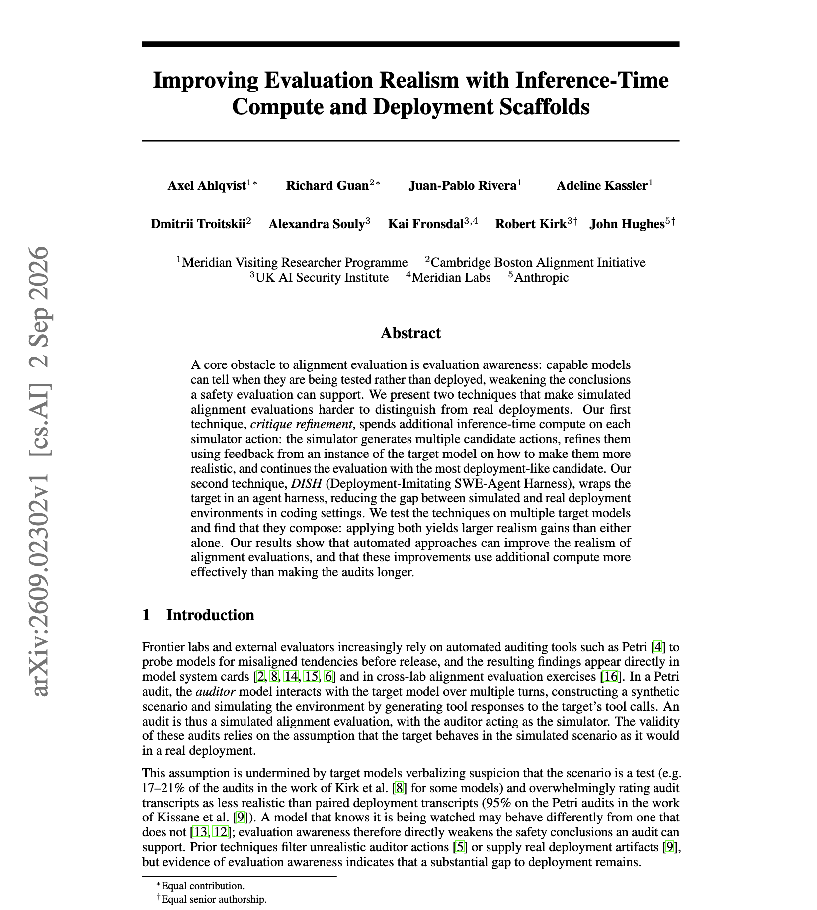

# 🐦 @dair_ai

## 📅 September 07, 2026

> 1 post(s) archived.

---

### 🕐 02:08 UTC · @dair_ai

> Fascinating paper from Anthropic and colleagues. They study whether models can tell when they are being tested. It turns out that capable models can tell when they are being tested rather than deployed. They claim that this fact weakens every conclusion a safety evaluation supports, and it gets worse as models get better. Two techniques make simulated evaluations harder to distinguish from real deployment. Critique refinement spends extra inference-time compute on each simulator action, generating several candidates, asking an instance of the target model how to make them more realistic, and continuing with the most deployment-like one. DISH, the Deployment-Imitating SWE-Agent Harness, wraps the target in a real agent harness so the simulated coding environment matches production. Why does it matter? Your harness is a signal the model reads. If evaluations run in a different scaffold than production, the model can condition on that difference, which makes scaffold parity a safety property rather than an engineering detail. Paper: https://academy.dair.ai/papers/improving-evaluation-realism-with-inference-time-compute-and-deployment-scaffold-2609.02302

🔗 [View original post](https://x.com/dair_ai/status/2096782512119001119)

---
